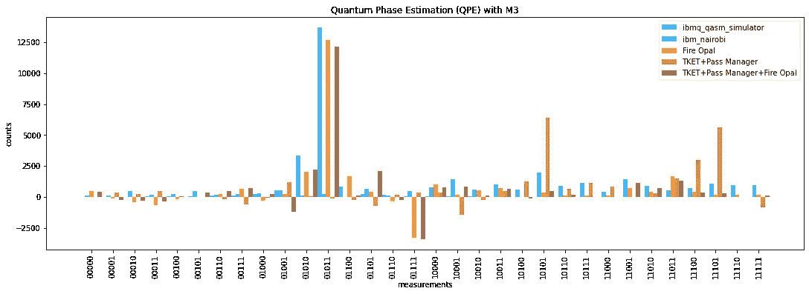
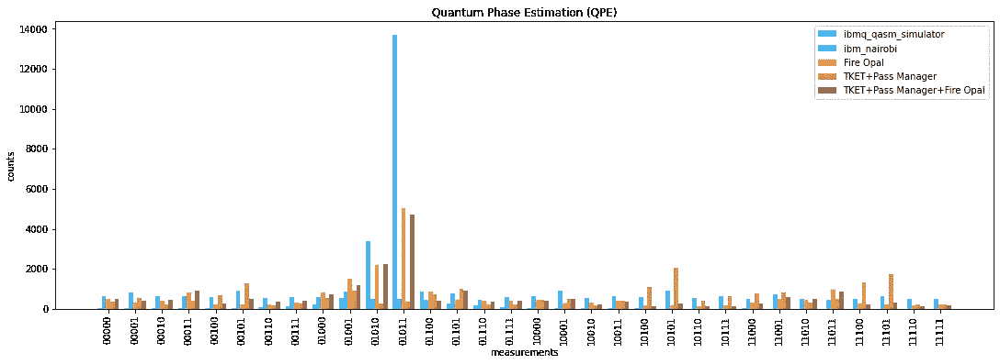
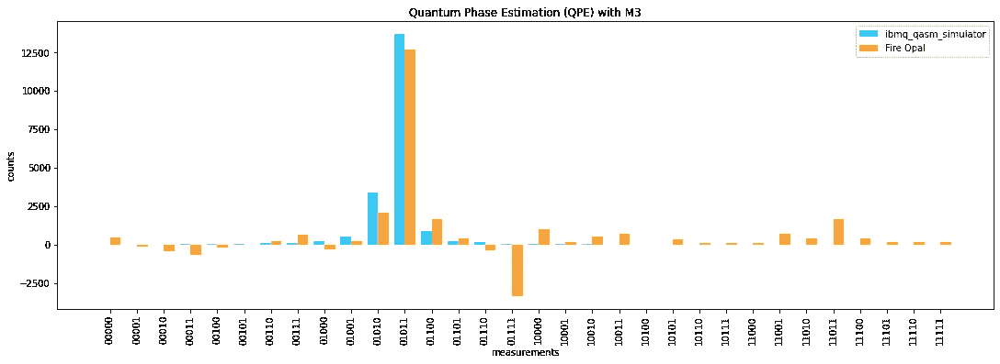

# 火蛋白石是独立的

> 原文：<https://levelup.gitconnected.com/fire-opal-stands-almost-alone-79eef276a255>

火蛋白石(几乎)独自站立

# 为了获得最佳性能，请使用原始电路。

我很荣幸能够预测试火蛋白石，但后来的缺点是火蛋白石还没有在这个预测试之外。因此，在等待它的发布时，我把所有的库放在一起，试图获得类似的结果。现在火蛋白石已经问世，我可以进行直接对比了。更好的是，我可以看到火蛋白石如何作为这个合奏的一个附加物。

我使用了一个[量子相位估计(QPE)](https://medium.com/gitconnected/quantum-phase-estimation-d2cc21908744) 电路，因为众所周知，它们太深，噪音太大，无法在实际硬件上运行。

火蛋白石独自站立

## ibmq _ qasm _ 模拟器

虽然浅蓝色的线条使直方图有点混乱，但是看到基线是很重要的。这是我们认为我们应该看到的完美量子位，我们可以看到哪种方法最接近它。

## ibm 内罗毕

蓝线是我们在真实硬件上的基线。我刚刚创建了 QPE 赛道并执行了它。我没有试图优化电路，也没有试图以任何方式抑制、纠正或减轻错误。结果是一个均匀的分布，纯粹的噪音，给我们没有任何有用的信息。

## 火蛋白石

橙色线条是单独行动的火蛋白石。虽然与模拟的理想结果相差甚远，但它们却是最接近的。我们解读 QPE 结果的方式是，前两个计数之间的关系很重要。因此，如果我们看第二好的棕色线，顶部两个计数之间的较大间隔会导致一个稍微好一点的估计。

## TKET +通行证管理器

在等待 Fire Opal 上市的时候，我的团队由 Quantinuum 的 TKET、Qiskit 的 Pass Manager、mapomatic 和 [mthree](/review-mthree-5597eebcaeed) 组成。最近 mapomatic 集成到了 Pass Manager 的 optimization_level=3，我在这里用的，所以没有单独列出来。mthree 库减少了执行后的测量误差，所以我将单独讨论它。

浅棕色线条实际上表现最差。如果你放大浅蓝色线条最高的地方，你会看到浅棕色线条最短。太可怕了。实际上，使用我和 QPE 的合奏毫无意义，因为 ibm_nairobi 上的原始结果更好。

## TKET +通行证管理员+火蛋白石

将 Fire Opal 添加到我的合奏中是最有趣的结果，因为这表明 Fire Opal 与其他库不太协调。火蛋白石在完全单独使用时表现稍好，因此在合奏中使用它没有意义。

M3 应用 4 次后得到相同的结果

## 无矩阵测量缓解(M3)

[mthree](/review-mthree-5597eebcaeed) 库旨在减少测量误差，并且可以多次应用，尽管是无效的。从技术上来说，反正 Fire Opal 在这里做的是测量误差缓解，测量误差缓解只能做一次。但是，无论如何，应用 M3 都会重复所做的修正，从而产生放大效应。和四个应用 M3，火蛋白石的结果实际上变得相当于模拟的理想结果。但是，这不是拉格罗夫算法的放大，并且没有进一步的测量误差被减轻，所以这不是 M3 库的有效使用；我只是展示它产生的效果。此外，由于 M3 的工作方式(这超出了本文的范围)，一些计数最终可能是负数。在这种情况下，我们不关心那些；我们只关心两个最高的总数，它们最终更接近理想的总数。

从技术上讲，这种放大效应是不必要的。我们可以单独用火蛋白石来估算相位。但是，有趣的是，从真实的硬件中可以看到近乎理想的结果。

M3 火蛋白石

## M3 火蛋白石

这是刚刚显示的相同的直方图，但是只保留了模拟器和火蛋白石的结果。正如你所看到的，我们可以误用 M3 在真实的硬件上得到接近理想的结果。由于上一段中提到的原因，增加 M3 的第五次迭代超过了模拟结果；它只是重新应用相同的校正。

## 结论

从现在开始，当我的电路和后端与 Fire Opal 兼容时，我将在原始电路上执行 Fire Opal。我目前只有三种情况不会出现这种情况:1)我需要访问，并有权访问比 Fire Opal 目前支持的更大的设备，2)我正在使用动态电路，这在 [Q-CTRL 的 2023 年初路线图](https://medium.com/gitconnected/review-q-ctrl-fire-opal-6bcc187ae1bd)上，但还不支持，3)我需要从测量结果中检索单个镜头，这还不在路线图上。尽管其他工具可以在整体中有效地使用，但 Fire Opal 已经证明了它不仅可以独立使用，而且更愿意独立使用。

## 火蛋白石系列:

*   [量子相位估计！](https://bsiegelwax.medium.com/quantum-phase-estimation-d2cc21908744)
*   [带火蛋白石的格罗弗算法](https://medium.com/gitconnected/grovers-algorithm-with-fire-opal-59e69c97ef96)
*   [Classiq 与火蛋白石](https://medium.com/gitconnected/classiq-with-fire-opal-e0259d22fca9)
*   [ibm_nairobi 对 Fire Opal](https://medium.com/@bsiegelwax/ibm-nairobi-vs-fire-opal-965f95800c6d)
*   [ibmq_belem vs. Fire Opal](https://bsiegelwax.medium.com/ibmq-belem-vs-fire-opal-84683f8f91f2)
*   [回顾:Q-CTRL 火猫眼石](https://bsiegelwax.medium.com/review-q-ctrl-fire-opal-6bcc187ae1bd)
*   [量子切片面包](https://bsiegelwax.medium.com/quantum-sliced-bread-bd3dd048f)
*   [我从火蛋白石中学到了什么…](https://bsiegelwax.medium.com/what-i-learned-from-fire-opal-50608282972b)
*   [Q-CTRL 的火猫眼石很牛逼](/fire-opal-is-awesome-c642347ec89d)