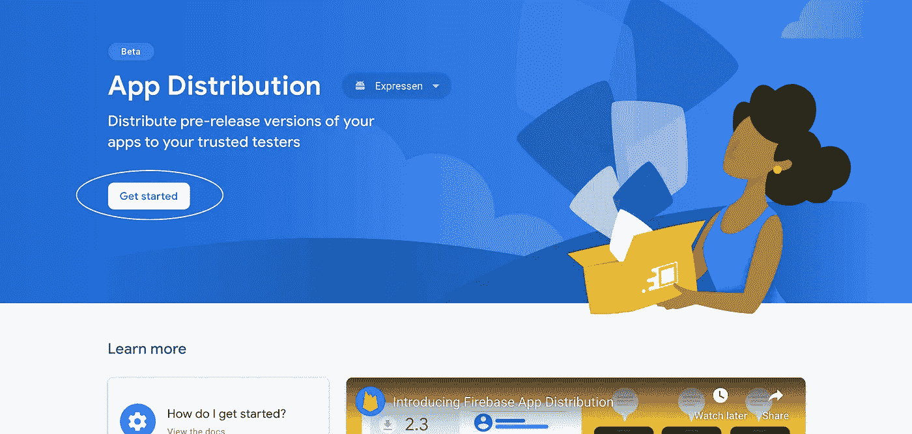
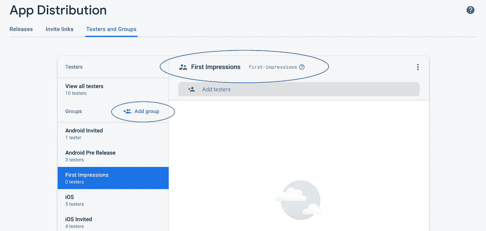
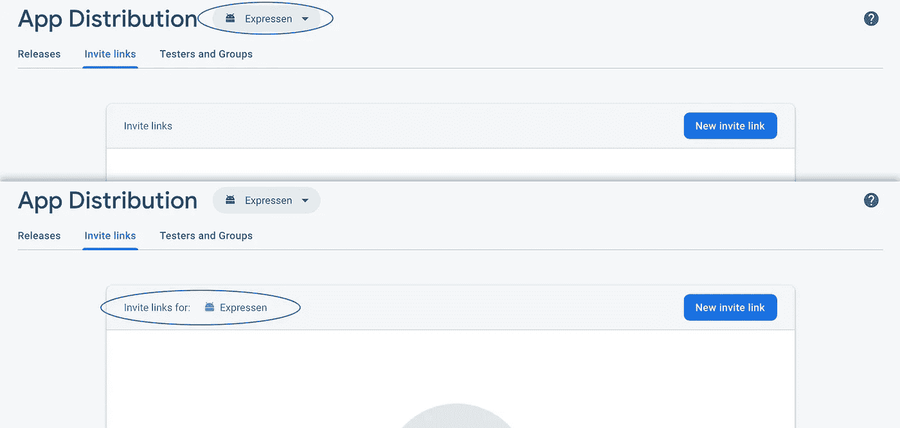
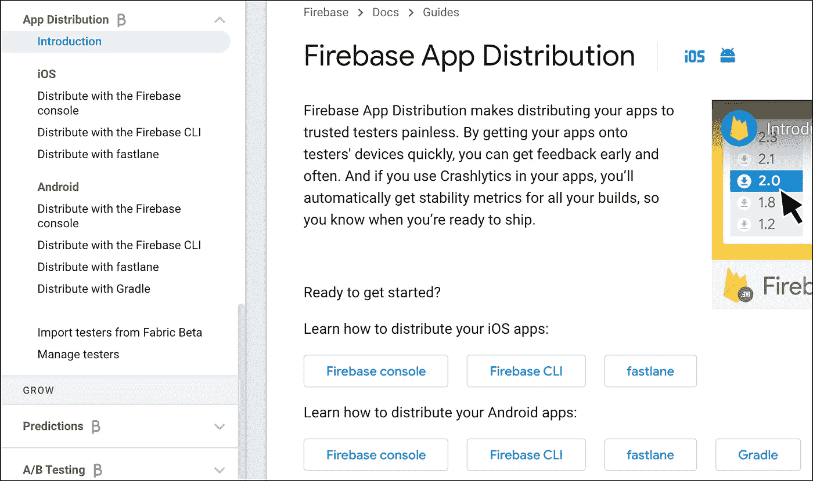
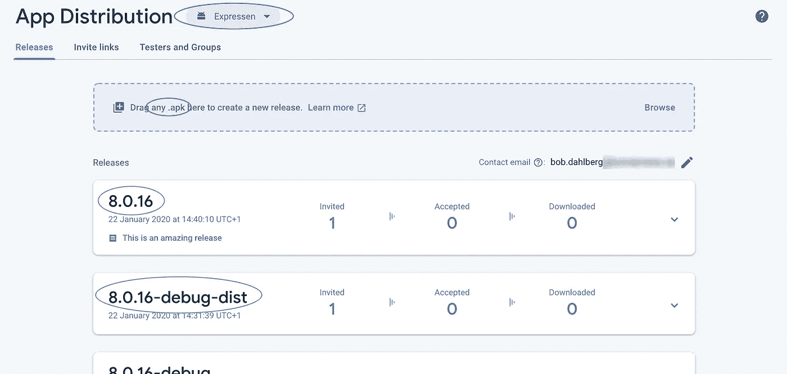

# Firebase Android 应用程序分发

> 原文：<https://levelup.gitconnected.com/firebase-app-distribution-d7d5c75a73c5>

## 第一印象

[Marcin Jozwiak](https://unsplash.com/@marcinjozwiak?utm_source=unsplash&utm_medium=referral&utm_content=creditCopyText) 在 [Unsplash](https://unsplash.com/s/photos/distribution?utm_source=unsplash&utm_medium=referral&utm_content=creditCopyText) 上拍摄的照片

我从事 Android 开发已经很久了，以至于我早期的应用程序发行版都是将想要安装它的设备作为根，然后通过命令行手动插入电缆来安装它。不是最好的体验，也不是你想要的范围。你如何向加入测试程序的人解释，他们必须为他们的设备找到根？因此，扔掉他们所有的制造商的保证，甚至可能砖他们的手机。

然后出现了其他应用商店，你可以在那里分发应用。如果你的用户在他们的设置中勾选了“信任不安全的来源”,你甚至可以创建 dropbox 链接。直到今天，我仍然记得在 dropbox 共享链接上，你必须改变查询才能直接从 0 到 1 开始下载。否则，它无法在大多数设备上运行，你最终会进入一个不允许你下载的网页。

最后，在 2014 年，Crashlytics 推出了测试版(后来的 Fabric Beta)，这使得分发我们的应用程序和管理我们的测试人员变得简单。它能在 Android 和 iOS 上运行可能是真正的卖点。但是所有的好事都必须结束，由于 Crashlytics(和 Fabric)被谷歌收购，他们认为将功能转移到 Firebase 品牌下更合适，因此出现了 Firebase 应用程序分发。

Firebase 应用程序分发仍处于测试阶段，但我认为它足够稳定。事实上，它背后的团队成员来自从事 Fabric Beta 的团队，这让我确信无疑。给我的线索是，它仍然在制作中，是最小的功能集和一些隐藏的限制。

为了让您体验一下易用性，让我们开始吧。看完这篇文章后，你应该对通过 Firebase 发布你的应用感到舒服了，并且有什么限制需要考虑。你必须首先将你的应用程序连接到 Firebase 平台。如果你还在使用 Crashlytics，现在是时候迁移了，因为它将在三月底关闭。

# 开始

单击主菜单中的应用程序分发。您将看到一个欢迎屏幕和一个关于如何开始的视频。单击“开始”按钮，您将进入主面板，它将由三个选项卡组成； ***发布*** ， ***邀请链接****&***测试员和组*** 。*

## *测试人员和小组*

*让我们从“*测试人员和组*”开始在这里，您可以通过键入电子邮件地址来创建一个测试者；用户将收到一封电子邮件，询问他们是否想加入。*

*让我们也创建一个组。只需点击“添加组”按钮。但是请注意，你*不能*更改组名，也不能更改 ID。所以要小心，因为这是如何从浪子和类似的 API 中引用它们的。*

**

*现在，我们可以将用户添加到组中，也可以删除他们。我们还可以轻松地删除组和用户。所以不要害怕测试，测试，再测试。但是一旦你完成了测试，我会说尝试设置你的结构并坚持下去是好的。否则，您可能会以一堆命名不当的组而告终。或者更糟糕的是，手动处理测试人员从您想要删除的一个组到一个新组的移动。*

## *邀请链接*

*邀请链接是获取你的测试者的一个简单方法，你创建一个共享链接，用户可以输入他们的邮件地址来注册。还有一个选项可以选择来自特定链接的注册是否应该在特定的组中结束。遗憾的是，您只能指定**一个**组。*

*还有一个简洁的功能来指定电子邮件必须属于哪个域才能注册。同样的限制，只有一个。这对我来说很乏味，因为我们的组织有 10-15 个域，我不想创建 15 个邀请链接。*

*再说一遍，一旦创建了邀请链接，就不能更改。我并不介意邀请链接来来去去，你可能会想要旋转它们，这样旧的就不会被传播。但是，如果能够更新，比如说，链接应该提供给哪个组的用户，那就太好了。*

*如果您有许多测试用户注册并把他们添加到一个组中，这可能会成为一个真正的问题，因为每个组都有一个隐藏的限制，即每组 200 个用户。如果你达到了这个限制，下一个未记录的限制可能也会是一个问题，那就是你的整个项目只能有 500 个用户。这些限制不是一成不变的，但你自己无法改变它们。但是如果你有超过 500 名的测试人员，你可能对奢侈的问题没有意见，你可以随时联系 Firebase 看看他们能做什么。*

*关于邀请链接的最后一件事是，您需要指定在您的项目中注册的应用程序中，链接应该邀请哪个应用程序进行测试。它藏在顶部。我已经错过好几次了…*

*在撰写本文期间，Firebase 已经更新了邀请链接的 UI，以包括邀请链接是为哪个应用程序创建的信息，因此他们肯定会听取反馈。看起来他们更新也很快。*

**

## *放*

**

*如果你对拖放业务感兴趣，发布一个应用程序也很简单，只需将你的 apk 文件拖放到 web 控制台即可。但是不要担心，如果你和我一样喜欢更自动化的上传方式，也可以支持浪子、Gradle 和 Firebase CLI。我自己只试过浪子，它很容易安装，文档也很简单。所以现在，每次我们将一个拉请求合并到我们的 alpha 分支中，我们的构建服务器都会将它推送到 Firebase。*

*使用 web 控制台时，必须再次注意在顶部半隐藏的下拉框中选择了哪个应用程序，因为这只会影响该应用程序。不过这里有个转折，你可以把 ***任何*** apk 拖进 ***任何*** app。这意味着，如果你有不同的口味，或者一个 beta 版和一个 alpha 版，你可以随心所欲地混合搭配 apk。放置 apk 的区域字面意思是“拖动任何”。apk 在这里创建一个新版本。”*

**

*这有好有坏。好的一面是一些规则集不会强迫你；你可以测试一下。但是坏的一面是，您可能会让您的测试人员面临不一致的情况，因为他们是从您的 APK 中获取应用程序名称和版本的。因此，他们可能会注册“牛逼的应用程序测试版”，然后几个星期后只看到应用程序“牛逼的应用程序功能-袋鼠。”这可能不是世界末日，但测试人员很容易迷失，所以我们不要给他们任何理由。*

## *结论*

*总而言之，Firebase 应用程序分发很好，很简单，甚至可能太简单了。但是有一个测试环境是很好的，在这个环境中您可以直接开始，而不用关心例行程序的运行。当你一切就绪。在邀请你真正的测试人员之前做一些打磨，给他们一个很好的体验。*