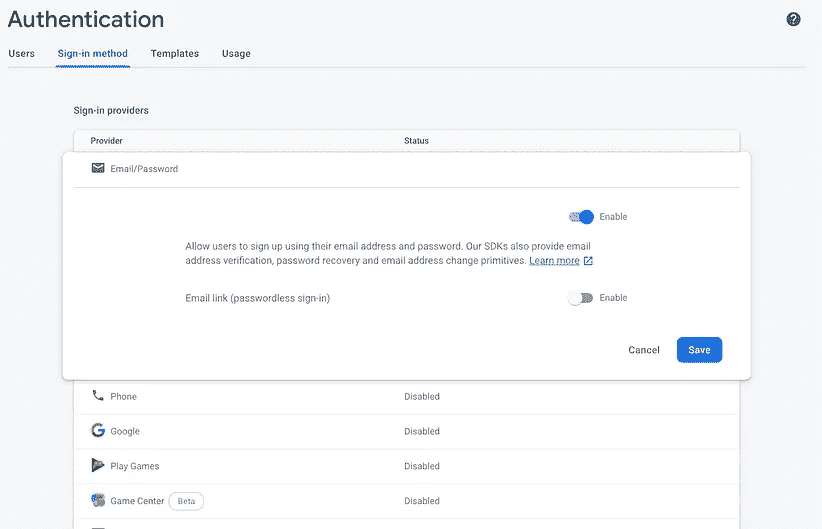

# 使用 Vuex 在 Vue.js 中进行 Firebase 授权管理

> 原文：<https://levelup.gitconnected.com/firebase-auth-management-in-vue-js-with-vuex-9c4a5d9cedc>

## VUE。JS/VUEX/FIREBASE 指南

## 关于在 Vue.js 中实现 Firebase auth 模块的全面指南

# **前言**

今天是 2020 年 4 月 27 日，写我的第三篇文章有一些延迟。科罗娜已经风靡全球。全世界有**3012224**个病例，并且还在继续。**207860 人**死亡……不幸的是还在统计中。

*来源:*[*https://www.worldometers.info/coronavirus/*](https://www.worldometers.info/coronavirus/)

这对人类来说是一个可怕的时代。我们都必须做出巨大的改变，但我认为我们会成功的，我们总是成功的。当我们这样做的时候，我们仍然需要前端开发人员，所以没有进一步的原因，我想深入这篇文章。

> **附言:**我和家人最近病得很重，所以我不得不放弃三月份的文章。


# 介绍

在过去的几个月里，我大部分时间都在学习 Firebase。没听说过 Firebase？[点击这里查看](https://firebase.google.com/)！我不会详细介绍 Firebase 作为一个平台，这对于一篇文章来说太多了。相反，我们将深入研究 [Firebase Auth](https://firebase.google.com/docs/auth) 。

接下来是 Firebase，我们要用 Vue.js 和 Vuex。没听说过这些吗？你可以在这里阅读更多关于 Vue.js [的内容，在这里](https://vuejs.org/)阅读更多关于 Veux [的内容。](https://vuex.vuejs.org/guide/)

在开始之前，请继续阅读文档。因为我们大多数人现在都被隔离了，所以你会有很多空闲时间。对于本指南来说，至少理解这些库的核心基础知识是很重要的。

# 目录

*   **项目设置** *设置 Vue.js
    设置 Firebase
    安装 Firebase 依赖项
    固定项目脚手架*
*   **构建我们的组件** *导航组件
    登录组件
    注册组件*
*   **用 Firebase 做东西** *这个。env 文件
    Firebase 插件
    运行一些代码进行测试*
*   **用 Veux Store** *管理 Firebase 授权状态修复 Store 脚手架
    突变、动作、getter
    注册
    登录
    隐藏按钮和表单
    注销
    用 Firebase 检查授权状态*
*   **概要** *指南即将推出*

# 项目设置

我们将要做的项目并不那么好。只是一些简单的组件。我们将制作一个*注册*组件和一个*登录*组件。我们将通过一个简单的导航菜单根据选择的路线加载这些。这些组件将通过 Veux 使用和共享数据。Veux 将是我们进入 Firebase 的入口，做授权的事情。

为了便于使用和原型化我们的布局，我们将使用[布尔玛](https://bulma.io/documentation/overview/start/)，请参考安装和使用文档。我选择暂时只用 CDN。因为我们的应用程序将依赖互联网连接到 Firebase。

## Setup Vue.js

让我们使用以下命令创建我们的 Vue 项目:

```
vue create authentication
```

我把我的应用程序称为认证，你可以叫你的任何适合你的。

我将采用以下设置。另外，快速说明一下，我在这里使用的是 Vue CLI 4.1.2。

```
? **Check the features needed for your project:** ◉ Babel
◯ TypeScript
◯ Progressive Web App (PWA) Support
◉ Router
◉ Vuex
◉ CSS Pre-processors
◉ Linter / Formatter
◯ Unit Testing
◯ E2E Testing
```

我为我的 CSS 预处理器和格式化程序选择 dart-sass，我总是选择更漂亮的。

## 设置 Firebase

现在我们来看看 [Firebase 控制台](https://console.firebase.google.com/)来创建我们的 Firebase 项目。

*   首次登录或创建您的 Google 帐户。
*   然后点击创建项目按钮。
*   这将带您进入安装向导。
*   相应地命名您的项目，然后按“继续”。


*   在这一步，不要忘记关闭这个设置，否则你会得到所有不必要的东西。然后明显按下‘创建项目’。


*   一个加载器将运行并告诉你项目何时完成。

*   一旦这样做了，继续注册你的项目到 Firebase。


*   再次相应地命名您的项目，您不必设置 Firebase 主机，这可能是另一篇文章。但不是这个。按下“注册应用程序”按钮，继续下一步。


*   您将看到最后一页的配置信息，现在复制并粘贴到记事本或您的项目中。不要担心，您总是可以在以后的项目设置中找到这些信息。完成后，按“继续到控制台”。


## 安装 Firebase 依赖项

现在让我们回到我们的 Vue 项目，在您最喜欢的编辑器中打开它。

打开一个终端窗口并运行`yarn add firebase -D`来安装我们的 Firebase 依赖项。在写这篇教程的时候，我安装了这个包的 7.13.1 版本。

您可以继续运行`yarn serve`来启动您的项目，并让我们参与进来。

首先添加布尔玛和字体 awesome CND，打开位于`./public/index.html`的`index.html`并粘贴以下代码到 HTML 的`head`部分。

```
<link rel="stylesheet" href="https://cdn.jsdelivr.net/npm/bulma@0.8.0/css/bulma.min.css" /><script defer src="https://use.fontawesome.com/releases/v5.3.1/js/all.js" />
```

## *固定工程*脚手架

在这之后，让我们从项目中移除一些垃圾脚手架文件和代码。我们还将向项目中添加一些文件。

添加以下文件，暂时将它们留空:

```
./src/components/Navbar.vue
./src/components/Login.vue
./src/components/Register.vue
```

删除以下文件:

```
./src/components/HelloWorld.vue
./src/views/About.vue
./src/views/Home.vue
```

在此编辑位于`./router/index.js`的路由器文件。

这是我的路由器文件现在的样子。

# 构建我们的组件

在我做任何大的 JavaScript 逻辑之前，我总是喜欢从结构化我的网页开始。这样我会对我的工作面有一个很好的了解，并且消除了大部分的不便。

此外，这样我可以“模仿”我的应用程序，并通过我们的设计师来验证我是否符合他们的草图和想法。如果因为我们的设计师改变了他们对应用程序行为方式的想法，而不得不改变功能逻辑，那将是对时间的极大浪费。

## 导航组件

为了能够更改登录和注册视图，我们需要添加某种导航。我们已经在前面的部分中确定了导航路线。我们还创建了一个名为`Navbar.vue`的文件，现在让我们打开这个文件。

这是我的组件的样子。这里有很多布尔玛代码，使得整个组件看起来很花哨。

让我们继续将这个组件添加到我们的`App.vue`文件中。

首先导入文件

```
import Navbar from "./components/Navbar";
```

然后将其添加到我们的组件对象中

```
export default {
  components: { Navbar }
};
```

然后将它添加到我们的 HTML 中

```
<navbar />
```

这就是你的`App.vue`文件应该看起来的样子。

这是你应该得到的结果。


导航条组件

## 登录组件

让我们添加我们的登录组件。

该组件现在所做的是获取`email`和`password`数据属性，并使用 v-model 指令将它们绑定到各自的输入字段。每当用户在这些字段中键入内容时，它们的值都会发生变化。

一旦用户完成，他点击登录，一个`console.log()`消息触发。我们将很快在其中建立更多的逻辑。首先，让我们添加一些基本的表单验证。

我们有一个非常简单的验证函数。它只是验证一些语句，并根据结果将一个字符串消息推送到我们在这个组件的数据对象中定义的`validationErrors`。随意添加更多的检查。我在最后的代码中做了，你们马上就会看到。

```
validate() {
  this.resetError();if (!this.email) {
    this.validationErrors.push("<strong>E-mail</strong> cannot be empty");
  }
  if (!this.password) {
    this.validationErrors.push("<strong>Password</strong> cannot be empty");
  } if (this.validationErrors.length <= 0) {
    this.signIn();
  }
}
```

当然，我们还需要一种重置错误的方法。我们只需点击错误对话框中的关闭按钮，然后重新提交即可。

```
resetError() {
  this.validationErrors = [];
}
```

错误会显示在一个 div 中，如下所示。

```
<div
  v-if="validationErrors.length"
  class="notification is-danger is-light"
>
  <button [@click](http://twitter.com/click)="resetError()" class="delete"></button>
  <div class="content">
    Please resolve the following error(s) before proceeding.
    <ul style="margin-top:0.3em; margin-left: 1em">
      <li
         v-for="(error, index) in validationErrors"
         :key="`error-${index}`"
      >
         {{ error }}
      </li>
    </ul>
  </div>
</div>
```

这一步的最终代码应该如下所示。

我们的项目现在是这样的。


左:没有错误的登录表单，右:有错误的登录表单

## 寄存器组件

这个组件与`Login.vue`相比只有一些变化，通常我会让这个代码更枯燥，但是我们现在生活在一个疯狂的时代。在这种情况下，我将生活在边缘，不会给一个该死的。对于本教程来说，这是不必要的。

不管怎样，我们继续吧。将`Login.vue`的内容复制到`Register.vue`中并保存文件。现在两个页面看起来完全相同，所以我们要对注册组件做一些修改。

接下来显然要改变所有的标签，我们还将添加另一个字段，并向该字段添加一个`v-model='passwordRepeat'`。

```
<div *class*="field">
  <label *class*="label">Repeat password</label>
  <div *class*="control">
    <input
      *v-model*="passwordRepeat"
      *class*="input"
      *type*="password"
      *autocomplete*="new-password" 
      *placeholder*="Password"
    />
  </div>
</div>
```

不要忘记将`passwordRepeat`添加到数据对象中。

```
data() {
  return {
    email: null,
    password: null,
 **passwordRepeat: null,**    validationErrors: []
  };
}
```

让我们也为我们的新字段添加验证。

```
if(!(this.password === this.passwordRepeat)) {
  this.validationErrors
      .push("<strong>Passwords</strong> did not match");
}
```

注册组件现在看起来像这样。

这是一些很好的测量截图。


左:没有错误的登记表，右:有错误的登记表

# 用 Firebase 让事情运转起来

现在，我们的应用程序结构大部分已经完成，我们可以专注于一些逻辑，使事情实际工作。我们将把我们的 Firebase 项目连接到我们的 Vue 应用程序。为此，我们需要几样东西。

*   编写`.env`文件来适应我们的环境变量。
*   创建一个 Firebase 插件文件，让我们的 Firebase 配置尽可能的简洁。
*   写一些代码，将我们实际连接到我们的 Firebase 项目。

## *这个。环境文件*

对于我们中从未使用过`.env`文件的人来说，请放心，这并不困难。简而言之，env 文件确保我们可以为不同的环境加载环境变量。

举例。

我们可以有一个包含以下内容的`.env.staging`文件:

```
VUE_APP_VERSION=2.0.4.SNAPSHOT-12345
```

和一个包含以下内容的`.env.development`文件:

```
VUE_APP_VERSION=2.0.4
```

然后，我们可以在 Vue 应用程序中使用这些变量来显示当前的构建版本。例如，如果我们要为 staging 构建,`.env.staging`将用于我们的环境变量。

> 我们甚至可以使用像 Jenkins 这样的应用程序来自动增加版本号，并以编程方式设置这些变量。但这是另一篇文章。有关 [Vue.js 和 env 文件的更多信息，请参考本指南](https://cli.vuejs.org/guide/mode-and-env.html#modes)。

现在，我们将只创建一个名为`.env`的根文件来容纳我们的默认值。因为我们只会建造一种类型的建筑，所以没有必要把它变得更难。

继续在项目文件夹的根目录下创建一个`.env`文件。这是一个空的属性列表，为了方便起见，我们将使用它。

```
VUE_APP_API_KEY=
VUE_APP_AUTH_DOMAIN=
VUE_APP_DATABASE_URL=
VUE_APP_PROJECT_ID=
VUE_APP_STORAGE_BUCKET=
VUE_APP_MESSAGING_SENDER_ID=
VUE_APP_APP_ID=
```

以这种方式粘贴您的连接数据。

```
VUE_APP_API_KEY=IzaSyDul54H8UKLR0B0UkVF3D0LR0B3xa9Tsa-1
VUE_APP_AUTH_DOMAIN=a-custom-project-ff12s.firebaseapp.com
VUE_APP_DATABASE_URL=https://a-custom-project-ff12s.firebaseapp.com
VUE_APP_PROJECT_ID=a-custom-project-ff12s
VUE_APP_STORAGE_BUCKET=a-custom-project-ff12s.appspot.com
VUE_APP_MESSAGING_SENDER_ID=053241422322
VUE_APP_APP_ID=053241422322:web:f611122521130c574ebb11
```

别担心，这只是我编造的一些虚假内容😉。

## Firebase 插件

现在我们需要创建一个 Firebase 插件。继续创建以下文件:

```
./src/plugins/firebase.js
```

如果您没有插件文件夹，只需创建它。

打开刚刚创建的文件，向其中添加以下内容。

我们实际上是从之前安装的依赖项中导入 firebase。然后我们导入 auth 模块。在我们用环境变量创建一个配置对象后，我们初始化 Firebase 应用程序。我们在插件文件中这样做的原因显然是为了干燥我们的代码，同时也是为了提高可读性。

我们将只在我们的`main.js`文件中导入这些文件一次。因为`firebase`是一个全局名称空间，我们只初始化一个项目。要使用多项目设置，请参考[本文档](https://firebase.google.com/docs/web/setup#multiple-projects)。

**注意:**这里我们只导入了 auth 模块，因为这是我们进行身份验证所需的模块。有关所有 Firebase 模块的更详细列表，请参考本文档。

**注意:**您必须重新运行`yarn serve`，否则 Webpack 将不会包含已定义的`.env`文件。

## 运行一些代码进行测试

让我们打开`main.js`文件，导入我们的 firebase 插件。在导入之后添加这段代码。

```
...
import "@/plugins/firebase";
...
```

这将确保我们的 firebase 应用程序在我们开始初始化 Vue 之前就已连接并初始化。

转到我们的`Register.vue`组件并更新它。首先从库中导入 firebase。不要从我们的插件中导入 firebase，这将无法正常工作。我们希望 firebase 返回我们在插件中创建的实例。这可以通过导入 firebase 来实现，如下所示:

```
import firebase from "firebase/app";
```

导入之后，让我们更新我们的`signUp()`方法。

继续在浏览器中尝试。

现在……如果你像一个好学徒那样跟随。我们忘记了一些事情，因为您可能已经分析了错误消息。我们仍然需要在 Firebase 项目中启用 auth 模块。

要做到这一点，回到你的 [Firebase 控制台](https://console.firebase.google.com/)导航到你的项目，在左侧菜单点击认证。然后按“设置登录方式”按钮。之后，选择“电子邮件/密码”并启用它。按“保存”就完成了。



> 您可能已经注意到，Firebase 支持多种身份验证方法。只需查看文档，了解更多关于实现它们的信息。现在，我们将保持电子邮件/密码认证。

如果我们转到我们的应用程序页面并测试代码，您应该会在控制台中看到一条带有 auth 响应的“成功”消息。由于我们将在下一节中把所有东西放在 Veux 中，所以我们现在还不会费心去修复登录功能。

这是我们的`Register.vue`文件的当前状态。

# 使用 Veux 存储管理 Firebase 身份验证状态

现在，我们已经编写了大部分的 HTML 结构和样式，添加了一个 Firebase 项目，启用了 Auth 模块并对其进行了测试。这让我们想到了 Veux，因为之前这不是关于 Vuex 本身的技术指南。在 Medium 上有许多关于这个主题的优秀文章。

## 修理商店脚手架

如果您一直坚持到现在，那么您也已经从一开始就为项目安装了 Veux。这样做会在项目中添加一个默认生成的文件。我喜欢改变默认设置。所以我们将来不会遇到可读性问题。使用单个存储文件几乎是不可行的。

在涉足商场之前，我们应该停下来思考一下我们的商场结构。在开始编写任何代码之前，思考一下总是一个好主意。

***状态*** 这就是我们状态对象的样子:

```
{
  user: null,
  error: null
}
```

在这种情况下，我们的状态对象非常简单。我们知道 Firebase 的`createUserWithEmailAndPassword()`和`signInWithEmailAndPassword()` 方法返回一个承诺，一旦解析，返回一个用户对象。所以我们的状态至少需要一个用户属性。此外，Firebase Auth 模块可以给出错误消息。我们希望能够展示这些。我们不会跟踪任何消息，也不会显示堆栈跟踪，因此只需一个错误属性就足够了。

在导入之后，继续定义一个`initialState`常量。之后，继续将其分配给 Vuex 状态。

```
const initialState = () => {
  return { user: null, error: null };
};export default new Vuex.Store({
  state: initialState(),
  mutations: {},
  actions: {},
  modules: {}
})
```

> 我在 store 对象之外的一个常量中定义我的初始状态有一个很好的原因，例如，当我们想清除状态时，我们可以引用这个状态。此外，你可能想知道为什么我们定义一个函数而不是一个对象。这与 Javascript 中变量之间的赋值方式有关。在 JavaScript 中，对象和数组是通过引用来分配的。你可以在这里阅读更多关于这种现象的信息。

## 突变、动作、Getters

我喜欢把这些文件分成小块。在我看来，这提高了可读性，但你可以自由地找到自己的方式。我可以理解你的团队在组织文件夹结构方面做出了不同的选择，这没有错。

现在，继续创建以下文件。

我们的商店索引文件现在看起来像这样:

漂亮又干净。

## 注册

由于对 firebase 的调用是异步调用，我们必须将它们写在 Vuex 动作中。我们将首先从将`signUp()`方法转移到存储动作开始。打开`./store/actions.js`文件，将下面的方法添加到 actions 对象中。

```
signUpAction({ *commit* }, *payload*) {
  firebase
    .auth()
    .createUserWithEmailAndPassword(payload.email, payload.password)
    .then(*response* => {
      *// @TODO mutate user state.* })
    .catch(*error* => {
      *// @TODO mutate error state.* });
}
```

这里我们调用`firebase.createUserWithEmailAndPassword()`这个方法返回一个承诺。一旦问题解决，我们必须设置用户状态，否则我们必须捕获错误。

别忘了导入 firebase 应用程序。

```
import firebase from 'firebase/app';
```

在我们可以变异用户和错误状态之前，我们需要为它们编写一个变异方法。打开`./store/mutations.js`并在突变对象中编写以下突变。

```
setUser(*state*, *payload*) {
  state.user = payload;
} 
```

和

```
setError(*state*, *payload*) {
  state.error = payload;
}
```

现在，我们可以使用这些突变，通过从 Firebase 接收的正确信息来改变状态。回到动作文件并更新`signUpActions()`方法。

我们文件的最终结果是:

我们唯一要做的就是打开`Register.vue`组件，将我们的动作添加到`signUp()`方法中。

首先，我们从删除 firebase 导入开始。我们将不需要它，因为我们通过 Vuex 使用 firebase。之后，我们使用`mapActions`助手将 Vuex 动作添加到组件中。更多信息请参考本文件。然后，我们只需将组件的电子邮件和密码数据属性传递给我们刚刚编写和连接的动作。

这是更新后的`Register.vue`文件:

## **签到**

接下来我们有我们的`signIn()`方法。它看起来非常类似于`signUp()`方法。`signInWithEmailAndPassword()`方法也返回一个承诺，所以我们将像以前一样处理它。

```
signInAction({ *commit* }, *payload*) {
  return firebase
    .auth()
    .signInWithEmailAndPassword(payload.email, payload.password)
    .then(*response* => {
      commit("setUser", response.user);
    })
    .catch(*error* => {
      commit("setError", error.message);
    });
}
```

让我们继续在我们的`Login.vue`文件中添加登录逻辑。它应该是这样的:

为了验证我们已经登录，我们应该在屏幕上显示一些消息。现在，我们将只打印出我们的`App.vue`文件中的用户电子邮件。

我在`./store/getters.js`文件中为用户添加了一个 getter，以便从存储中获取用户信息和 auth 状态。当我们这样做的时候，让我们也为我们将在后面构建的错误消息添加一个 getter。

之后，我在`App.vue`文件中添加了一条简单的消息。首次从 Vuex 进口`mapGetters`。

```
import {mapGetters} from 'vuex';
```

然后在 computed 属性中添加 getters。

```
computed: {
  ...mapGetters(['getUser', 'isUserAuth'])
}
```

然后在您的`App.vue`文件中添加以下 HTML。

```
<section *v-if*="isUserAuth" *class*="section">
  <div *class*="columns">
    <div *class*="column is-half is-offset-one-quarter">
      Welcome {{ getUser.email }}
    </div>
  </div>
</section>
```

您的代码最终应该看起来有点像这样。

最终结果如下图所示。


成功登录消息。

## 隐藏按钮和表单

现在我们知道我们实际上已经登录了，我们需要编写代码来隐藏登录/注册功能。

我们可以简单地通过给组件和按钮添加一个`v-if="isUserAuth"`条件来实现。就像我们处理登录信息一样

对于`Register.vue`和`Login.vue`文件，我们将简单地添加`isUserAuth` getter 并在第一个 div 中写入条件。在本例中，这将是`columns` div。

```
<div class="columns" **v-if="!isUserAuth"**>
```

别忘了加上感叹号，我们要否定这里的条件。我们希望在“not-isUserAuth()”上显示我们的表单。希望这有意义。

对于`Navbar.vue`组件，我使用了一个`<template>`包装器标签，因为我们希望有条件地显示登录和注册按钮，同时隐藏注销按钮。

```
<template v-if="!isUserAuth">
  <router-link v-for="item of navItems" :key="item.name" :to="item.to" class="button is-primary">
    <span class="icon">
      <i :class="`fas fa-${item.icon}`"></i>
    </span>
    <strong>{{ item.name }}</strong>
  </router-link>
</template>
```

然后我添加了注销按钮的 HTML。

```
<template v-if="isUserAuth">
  <button class="button is-primary">
    <span class="icon">
      <i class="fas fa-sign-out-alt"></i>
    </span>
    <strong>Logout</strong>
  </button>
</template>
```

对于这个新按钮，我们添加了一个事件处理程序来实际注销我们。我们将在下一节中编写逻辑。目前，这很好。

```
signOut() {
  //@TODO: Write signout functionality later
  alert("signout button");
}
```

这里是所有更新代码的要点。

Login.vue

注册. vue

导航条. vue

## 注销

这个功能非常简单。我们只需从 firebase 中调用`signOut()`方法，就可以清除 Firebase 中的会话。一旦这是成功的，我们必须做一些代码清理工作。

让我们先添加注销操作。

```
signOutAction({commit}) {
  firebase
    .auth()
    .signOut()
    .then(() => {
      commit("setUser", null);
    })
    .catch(error => {
      commit("setError", error.message);
    });
}
```

相当直接。我们称之为`firebase.signOut()`这返回了一个我们可以随意处理的承诺。

对于我们的注销按钮，我们只需要将存储操作添加到点击处理程序中，我们就完成了。

```
signOut() {
  this.signOutAction();
}
```

以下是完整的文件:

## 使用 Firebase 检查身份验证状态

在许多用例中，我们可能需要检查提供者的身份验证状态。我们实际上在实现`isUserAuth` getter 时使用了它的某种形式。现在，这个 getter 只引用状态对象来查看用户是否“登录”。一旦我们刷新我们的页面，用户是“注销”，但 firebase 认为它仍然是“登录”。

正如 Firebase 本身在本文档[中所述](https://firebase.google.com/docs/auth/web/manage-users#get_the_currently_signed-in_user)他们推荐的检查 auth 状态的方法是使用由`onAuthStateChanged()`方法返回的可观察值。我们将订阅这个可观察对象，并在这个订阅中设置我们的用户状态。

> **注意:**该方法仅在用户登录或注销时触发，因此不会在您实现令牌到期功能时触发。更多信息见本 API 文档。

让我们编写`authAction`,在这里我们将检查 Firebase Authstate 并订阅可观察值。每次身份验证状态改变时，我们都会更新全局状态。

```
authAction({commit}) {
  firebase.auth().onAuthStateChanged(user => {
    if (user) {
      commit("setUser", user);
    } else {
      commit("setUser", null);
    }
  });
}
```

在此之后，我们将不再需要注册和注册承诺的`.then()`条款。因为我们是在授权状态改变时设置用户。这样，我们删除了一些多余的代码。所以我们在删除之后，我们将把`authAction`添加到`App.vue`中。

```
methods: {
  ...mapActions(["authAction"])
}
```

现在，当应用程序被装载时，我们必须调用这个操作。

```
mounted() {
  this.authAction();
}
```

这些是完成的文件:

就是这样。你完了。现在你知道了。如何正确使用 Firebase Auth 模块？

# 摘要

这是一个很长的指南，我希望你至少学到了一些东西，或者在制作这个的过程中获得了乐趣。我还想在应用程序中添加更多东西，但这超出了本指南的范围。

如果你喜欢我的内容，请在媒体上关注我。如果您有任何改进，请在下面的文章中留下您的评论。

## 指南来了

*   *自定义用户卡组件*
*   *加载状态实现到 Vuex*
*   Firebase 实时数据库？
*   *Firebase 云 Firestore？*

谁知道呢，有那么多东西需要学习和发现。我们会看到时间带给我们什么。

