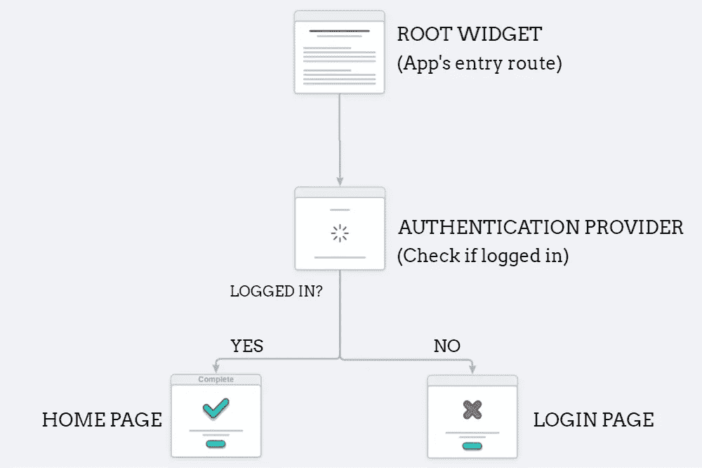

# Firebase 认证和在 Flutter 中保持用户登录提供商。

> 原文：<https://levelup.gitconnected.com/firebase-authentication-and-keeping-users-logged-in-with-provider-in-flutter-f1c66cdb1bc7>


现在，将 firebase 身份验证整合到 flutter 应用程序中可以立即完成，但是传统的方式无论如何都不是用户友好的。我们只是不能期望我们的用户是键盘战士，让他们容忍每次登录我们的应用程序。

> 因此，让我们通过使用 [Provider](https://pub.dev/packages/provider) 包管理状态来保持用户登录，直到用户点击“退出”按钮，从而解决用户体验混乱的问题。

我们将与提供者一起管理应用程序的状态，并根据用户是否“登录”来编排执行流程。



**本文应用的架构。**

1.  在你的机器上创建一个 flutter 项目。(我跳过这部分解释步骤，因为我不想让你的眼皮厌倦阅读:)
2.  为 Flutter 创建一个 firebase 项目。如果你已经做了，那么我建议你跳到文章的情节。新手可以查看[这个网页](https://firebase.google.com/docs/flutter/setup)来将 Firebase 集成到你的 flutter 应用中。

# 什么是 Provider，为什么值得使用？

> 在底线上，我们将要监视一个值(在本例中，登录与否)并采取必要的行动。所以通常我们会监听一个值，观察它的变化来操作我们的应用程序的工作流程。这就是提供者发挥作用的地方，当您阅读本文时，有些人可能已经弄清楚到底是什么在幕后驱动这个提供者。提供者只是让您公开/创建/监听/处置值的 [*InheritedWidget*](https://api.flutter.dev/flutter/widgets/InheritedWidget-class.html) 和[*change notifier*](https://api.flutter.dev/flutter/foundation/ChangeNotifier-class.html)的化身。于是解密了[官方文件](https://pub.dev/packages/provider)。

现在让我们深入研究一下待办事项。

在您的 Flutter 项目中打开 pubspec.yaml 文件，并添加以下包。([提供者](https://pub.dev/packages/provider)， [firebase_auth](https://pub.dev/packages/firebase_auth) ， [firebase_core](https://pub.dev/packages/firebase_core) )

我们将通过首先完成我们的提供商来启动这个应用程序。在 lib 目录中创建 authentication.dart 文件。

1.  导入依赖项。
2.  用一个 **firebaseAuth** 实例创建一个 **AuthenticationProvider** 类。

```
import 'package:firebase_auth/firebase_auth.dart';class AuthenticationProvider{final FirebaseAuth firebaseAuth;
// FirebaseAuth instance AuthenticationProvider(this.firebaseAuth);
//Constructor to initialize the Firebase Auth instance.}
```

我们将使用一个流来持续监听身份验证状态(登录或未登录)。

```
Stream<User> get authStateChanges => firebaseAuth.idTokenChanges();
```

让我们快速添加注册、登录和注销方法。

我们现在已经完成了身份验证提供者的设置。现在让我们将这个提供者放入我们的 main.dart 文件中。

1.  在 main.dart 文件中，导入以下依赖项。

```
import 'package:flutter/material.dart';
import 'package:firebase_core/firebase_core.dart';
import 'package:provider/provider.dart';
import 'package:firebase_auth/firebase_auth.dart';
```

2.我们即将使我们的**主**方法**异步**以使我们的 Firebase 认证完全无误，并给它几纳秒的时间来准备。

```
Future<void> main() async {WidgetsFlutterBinding.ensureInitialized();await Firebase.initializeApp();runApp(MyApp()); //MyApp is our root widget.}
```

> 使用提供程序时需要考虑的几点
> 
> 提供者的作用域是严格的，这意味着如果没有在正确的地方定义它们，那么它们就是错误的。始终确保在根小部件(更准确地说，在小部件树的顶部)中初始化您的提供者，以便它们在嵌套的小部件树和嵌套的导航路径中保持可访问性。
> 
> 如果您遇到不希望在根小部件中初始化提供者的情况，请记住，任何试图访问您在某个其他路由中定义的提供者的行为都会使该提供者无法被它在小部件树中的祖先小部件/根小部件访问。因此，该提供者只能被其子/后代小部件访问。

3.创建我们的根小部件(MyApp)。由于提供者需要位于窗口小部件树的顶端，我们将使 **MaterialApp** 窗口小部件成为 **MultiProvider** 窗口小部件的子部件，以在 **build** 方法中初始化我们的提供者。

3.a .使用 Provider()初始化 AuthenticationProvider

3.b .使用 StreamProvider()从 AuthenticationProvider 中的 **authState** 方法读取值。

4.现在让我们添加另一个类 **Authenticate** 来决定应用程序必须基于 **authState 采取哪条路线。**

完成 **main.dart** 文件。

是时候建立我们的**主页**和**登录页面**路线了。(确保将它们导入到 **main.dart** 文件中)。

## 登录 _ 页面. dart

## **home_page.dart**


就这样结束了！

通过这种方式，我们与提供者一起管理状态，以保持用户登录。希望这篇文章足够吸引人。仍然被困在某个地方？请随意查看 [GitHub 库。](https://github.com/RaajeevChandran/Firebase-Authentication-in-Flutter-with-Provider)