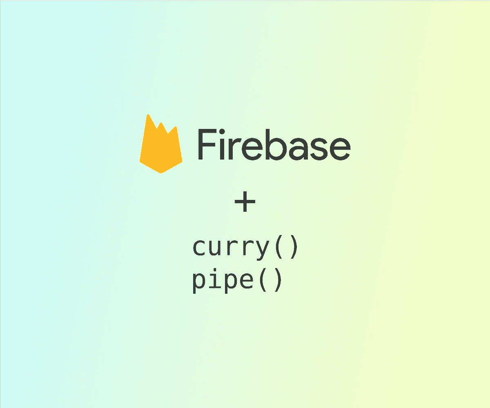

# firebase JS v9——用新的 API 拥抱 pipe()和 curry()

> 原文：<https://levelup.gitconnected.com/firebase-js-v9-embrace-pipe-and-curry-with-the-new-api-d480b0d0f67a>

Firebase 用 v9 版本改变了他们的 Javascript API。以前的方法是链式的，这使得它们更具可读性:

现在，Firebase 9 采用了一种更加模块化、面向函数式编程的方法:

最后，我们来比较一下:

这带来了一些好处:

*   对 Firebase 团队来说，测试功能更容易
*   促进树的摇动(减少包的大小——编译时丢弃不用的模块/函数)

然而，当 API 用户(开发者)尝试一些更现实的东西时，事情就变得混乱了(人们已经[抱怨](https://www.reddit.com/r/Firebase/comments/vy9dfv/the_v9_js_sdk_is_a_horrendous_developer_experience/)):

从代码读者的角度来看，操作现在是向后的。任何有一点编程经验的人都不应该编写这样的代码。解决这个问题的好办法是使用变量:

然而，避免过度使用变量是一个好主意，因为它会引入更多的错误可能性。可能有一个更好的方法来使用新的 API:尝试用*处理*新的函数，并用*管道处理*它们。如果您是函数式编程的新手，我建议您阅读其他文章来理解这两个概念是如何工作的。

为了简化它:

*   pipe()返回一个我们可以调用的函数。任何参数都将传递给列表中的第一项，我们将得到最后一项的结果。
*   curry()返回提供的相同函数，我们可以部分完成该函数以便稍后执行(当提供了所有参数时)。从 *ref* 到 [docs](https://firebase.google.com/docs/reference/js/database.md#ref) :如果我们`const refC = curry(ref)`，我们可以调用`const refDb = refC(database)`以及后来的`refDb('users')`。

Firebase 的 API 通常将上下文(引用、数据库)作为第一个参数，将特定于函数的信息(路径、有效载荷)作为第二个参数( [data-last](https://dev.to/richytong/practical-functional-programming-in-javascript-data-last-1gjo) )。所以我们从右边的*开始。例如，在`ref()` 中，首先提供路径，然后当我们有了数据库时再获取引用。*

ramda 是一个很棒的 FP 库，但是它没有提供一个直接的方法来进行反向 currying。所以我们用洛达什的 [*curryRight*](https://lodash.com/docs/4.17.15#curryRight) 。如果你用的是 ESM，安装`lodash-es`吧。

最初我们得到:

后一种选择满足了 FP 避免变量的原则，但是可读性较差(尤其是调用您刚刚创建的函数)。第一个选项可读性更强，并且可以将操作导出到单独的文件中，以便重用。

至少我们应该将 curried API 导出到一个单独的文件中:

现在我们不必区分 *ref* 和 *refC* 。

你在两个选项之间的选择取决于你的情况。我不得不重构一个现有的 Vue.js 应用程序，第二种方法更简单，因为每个 Vue 组件都直接使用 Firebase，没有任何服务功能(例如，`/services/users/getUser`)。一个真实的例子:

这里我的目标不是纯函数，所以插入外部变量(表单状态、用户 ID)是微不足道的。

另一方面，当创建一个*新的*应用程序时，你应该将动作外化到服务文件中。

好多了。如果您决定使用另一种数据库技术，这个函数很容易替换。虽然需要把我们的第一个逻辑元素(`usersRef`)移到底部会带来一些混乱。

不幸的是，general currying 并不支持打字稿。当你使用这个函数时，解释器不能理解输出的内容。在这种情况下，您可以完全放弃 lodash，手动执行这些功能:

最后，让我们做一个简单的比较:

希望这对你有用。我还没有完成对我的应用程序的重构，所以没有时间来解决这个问题。从中取之所需，应用自己的喜好，得到适合自己的风格。

对于 Docker 用户，我已经为两个 API 版本创建了一个[演示](https://github.com/marius321967/firebase-9-fp-playground)(里面有说明)。

注意#1:新的 Firebase v9 SDK 提供了一个 [*compat*](https://firebase.google.com/docs/web/modular-upgrade#about_the_compat_libraries) API，它允许方法链接并减少了重构的需要——这超出了本文的范围。

注意#2:本文使用实时数据库。其他模块未测试。

# 分级编码

感谢您成为我们社区的一员！在你离开之前:

*   👏为故事鼓掌，跟着作者走👉
*   📰查看[升级编码出版物](https://levelup.gitconnected.com/?utm_source=pub&utm_medium=post)中的更多内容
*   🔔关注我们:[Twitter](https://twitter.com/gitconnected)|[LinkedIn](https://www.linkedin.com/company/gitconnected)|[时事通讯](https://newsletter.levelup.dev)

🚀👉 [**加入升级人才集体，找到一份神奇的工作**](https://jobs.levelup.dev/talent/welcome?referral=true)