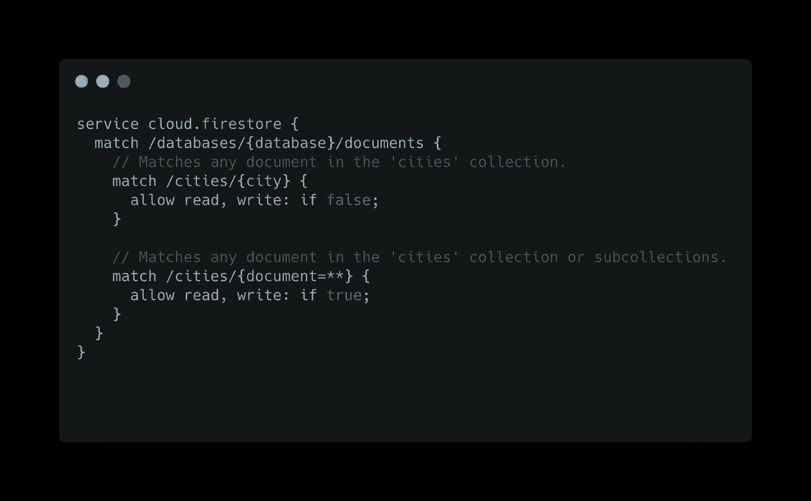

# Firebase 安全规则:入门所需了解的一切

> 原文：<https://levelup.gitconnected.com/firebase-security-rules-everything-you-need-to-know-to-get-started-c6218bce5e69>

想象一个场景，一个恶意用户能够读取或编辑你的数据库中他不应该读取或编辑的部分😬像私人数据的其他用户，信用卡的细节，接触，甚至是能够删除的数据！

因为，有人忘记保护数据库了！😶‍🌫️

如果我们知道 Firebase 安全规则可以防止这一点。🥲
让我们确保现在已经包括了这一点。👮‍♂️

# 目录:

1.  **什么是 Firebase 安全规则？**
2.  **安全规则语言**
3.  **设置安全规则**
4.  **结构&语法**
5.  **请求&资源**
6.  **功能**
7.  **助手方法**
8.  **写得更好&安全规则**
9.  **测试/验证规则**
10.  **部署**

## 1.什么是 Firebase 安全规则？

Firebase 安全规则位于您的数据和用户之间。他们决定谁被允许访问你存储在 RTDB、Firestore 和 Storage 的数据。对你的数据进行的每个 CRUD 操作的每个请求都要经过他们，他们最终决定该请求是否应该通过。

## 2.安全规则语言:

定义规则的方式取决于您使用的 Firebase 产品。根据官方文件:

*   **实时数据库(RTDB):** 安全规则在 JSON 结构中使用了类似 JavaScript 的语法。
*   **云 Firestore 和存储:**对于这两者，安全规则使用基于[通用表达式语言(CEL)](https://github.com/google/cel-spec) 的语言，该语言构建在 CEL 之上，具有支持有条件授权访问的`match`和`allow`语句。

就本文而言，我们将关注如何为云 Firestore 和存储编写规则。对于所有的产品来说，它们如何工作的一般概念是相同的，唯一改变的是你编写它们的结构和语法。

## 3.设置安全规则:

安全规则位于您的应用程序之外。您可以通过 Firebase 控制台或 Firebase CLI 直接设置它们。

*   **使用 Firebase 控制台:**
    在你的 Firebase 控制台中，打开 **Firebase 数据库**标签，在上面你可以选择**规则**标签。您可以从这里编写和发布规则。

*   [**使用 Firebase CLI**](https://firebase.google.com/docs/rules/manage-deploy#use_the)**:**
    如果您通过 [Firebase CLI 在本地使用 Firestore 和存储初始化 Firebase 项目，那么您将创建两个规则文件，一个用于 Firestore，另一个用于存储规则。你也可以在这里写规则。](https://firebase.google.com/docs/rules/manage-deploy#use_the)

作为一名优秀的开发人员😊，确保从一个地方更新您的规则，否则您可能会发现自己在规则的冲突更新中。

## 4.结构和语法:

Firestore 和存储的安全规则使用以下结构和语法:

*   **名称:**要为其定义规则的服务的名称(cloud.firestore 或 firebase.storage)
*   **路径:**文件在数据库中的路径或文件夹/文件在存储器中的路径。
*   **方法:**您允许运行的方法。标准方法有`get`、`list`、`create`、`update`、`delete`。
    我们还有`read`和`write`，其中**读作**是`get, list`的别名，**写成`create, update, delete`的**。

[来源](https://firebase.google.com/docs/rules/rules-language#rule_constructs)

*   **条件:**根据条件的结果，请求被允许或拒绝。它应该会返回一个`boolean`。

## **匹配:**

每个`match`块声明一个与之相关的路径模式。每当有请求进来，每个`match`块路径都与所需操作的路径相匹配(`request.path`)。

路径匹配可以是完整的或部分的:

*   **部分匹配:**仅匹配路径的前缀。
*   **完全匹配:**当请求路径与`match`块的路径完全匹配。

当**完成**匹配时，评估块内的规则。当**部分**匹配时，测试嵌套的`match`块，看是否有任何嵌套的`path`将**完成**匹配。

在下面的例子中，给定`request.path == /example/hello/nested/path`,下面的声明指出它们是部分匹配还是完全匹配，以及作用域内任何可见变量的值。([示例 src](https://firebase.google.com/docs/rules/rules-language#rule_constructs) )

*   **单通配符:**这个`variable`表示该文档在相应集合中的文档 Id。它包含在一个大括号中，声明为:`{variable}`。
*   **递归-通配符:**这个表示路径处和路径下的路径段，声明为:`{variable=**}`。

> 除非完全匹配，否则不会评估规则。

## **允许:**

这是你的实际规则。`allow`语句可以为多个方法授予权限。并且`match`块可以有一个或多个`allow`语句。

## 5.请求和资源:

*   [**请求**](https://firebase.google.com/docs/reference/rules/rules.firestore.Request) **:** 包含 Firebase 认证生成的认证(`request.auth`)信息。除此之外，它还可能包括用户试图在文档上写入或更新的**传入数据** ( `request.resource.data`)。
    你可以在这里查看它保存的其他值[。](https://firebase.google.com/docs/reference/rules/rules.firestore.Request)
*   [**资源**](https://firebase.google.com/docs/reference/rules/rules.firestore.Resource) **:** 它代表您试图写入的**现有文档**，文档数据通过`resource.data`访问。

在下面的例子中，在允许更新用户帖子的请求之前，我们首先检查 auth 中的`userId`是否与`post`文档中的`userId`相同。

> 请求.资源！= resource 前者代表传入数据，后者代表文档中的现有数据。

## 6.功能:

一旦你开始写规则，你的规则很容易变得不可读，因为你的条件在增长，并且在所有地方重复。也有可能您会忘记更新在多个地方使用的特定条件。对开发者来说并不罕见！😶为了克服这一点，…..

**功能！**规则支持编写可用于提高代码可读性和重复数据删除的函数。

在下面的例子中，我们在两个不同的名为`isSignedIn`和`isOwner`的函数中提取了检查用户是否经过身份验证以及他是否是文档所有者的条件。

如果需要，这使得在任何其他地方重用这些条件变得很容易。

## 7.助手方法:

当您为 Firestore 编写安全规则时，您也可以访问这个助手方法。

*   **存在:**检查提供的路径下是否存在文档，返回`boolean`。
    下面，我们仅在用户文档不存在的情况下创建用户文档。

*   **get :** 返回提供路径的文档。如果不存在，则返回`null`。
    下面，我们通过获取用户文档并检查`role`来检查请求更新帖子的人是否是管理员。

*   **existsAfter :** 检查给定路径下是否存在文档，假设当前请求成功。相当于`getAfter(path) != null`。
*   **getAfter :** 在提供的路径返回创建的文档，假设当前请求成功。

如果您想要验证属于[批写或事务](https://firebase.google.com/docs/firestore/manage-data/transactions)的文档，那么 **existsAfter** 和 **getAfter** 会很有用。

> 请记住，任何时候您的规则包括读取，就像上面的规则一样，您将为 Cloud Firestore 中的读取操作付费。

## 8.编写更好更安全的规则:

*   **重叠匹配:** 正如我们讨论过的，每当有请求进来时，所有的匹配块都会被检查。如果有多个匹配，则最终结果基于来自每个匹配块的结果的或。

这里，所有访问`cities`集合的请求都将被允许，因为即使第一个匹配块拒绝它，但第二个总是真的。

> 确保你没有这样的重叠匹配。

*   **覆盖 allow 语句:**
    如果我们有多个 allow 语句用于同一个动作，并且如果其中任何一个语句授予访问权限，那么该请求将被允许。

即使`create`动作被拒绝，但是包含`create`的`write`被允许。这就是请求被允许的原因。

> 小心这种覆盖性的 allow 语句。

*   **使用函数:**尽可能在单独的函数中提取你的条件。这不仅有助于提高可读性，还能减少代码重复。
    除此之外，你将会在你的规则中大量使用`request.resource`和`resource`，很容易将二者混淆。为了避免这种情况，使用两个返回它们的独立函数。

**9。测试/验证规则:**

所以你学会了如何写规则！非常酷！😎
现在，让我们测试一下，确保它们能按预期工作！

您可以通过 Firebase 模拟器或 Firebase 控制台中的 Rules Playground 来测试它们。

*   **Firebase 模拟器:**如果你计划使用模拟器，那么[按照本指南](https://firebase.google.com/docs/rules/emulator-setup)设置模拟器。当您运行模拟器时，您在 **firestore.rules** 和 **storage.rules** 中设置的规则(如果存在)将被加载。然后，一旦你配置你的应用程序使用模拟器，你就可以开始测试它们了。
*   **规则游乐场:**如果想快速测试规则而不需要设置模拟器的麻烦，可以使用[****规则游乐场****](https://firebase.google.com/docs/rules/simulator) ****。****

****

## **10.部署:**

*   ****使用 Firebase CLI :** 要通过 CLI 部署规则，请使用以下命令。**

****

*   **使用 Firebase 控制台:正如您编辑规则一样，您可以从那里发布。**

****

**那个！对刚开始的人来说太多了！但是，看看谁刚刚学到了大量的好东西，现在已经准备好像高级开发人员一样保护数据了！😎**

**还有一些关于数据验证的内容没有在这里介绍，这将使您能够更精细地控制从数据库中添加和删除的内容。我们将在接下来的文章中深入探讨这个问题。**

**在那之前，祝你有美好的一天！感谢你阅读这篇文章！🙏**

**👏喜欢这篇文章！会欣赏鼓掌:)
🚀更多这样的文章来了，我们探索应用开发中的 flutter 和其他有趣的东西。
👋如果你喜欢阅读和学习我写的东西，请继续关注即将到来的文章。
💬让我知道你喜欢什么，你想在接下来的文章中读到什么。**

**浏览书库中的其他文章💙**

** [## 如何在 Flutter 中创建 SoundCloud 波形？

### 使用颤振音频波形包！

medium.com](https://medium.com/@TakRutvik/how-to-create-a-soundcloud-waveform-in-flutter-6bec232fb4d0)  [## 颤振设计挑战:Spotify 专辑滚动互动

### 细长条的甜蜜用法！

medium.com](https://medium.com/@TakRutvik/flutter-design-challenge-spotify-album-scroll-interaction-df6845debd1f)**