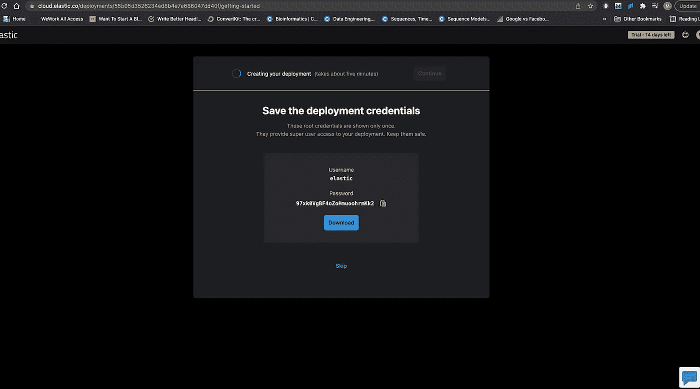
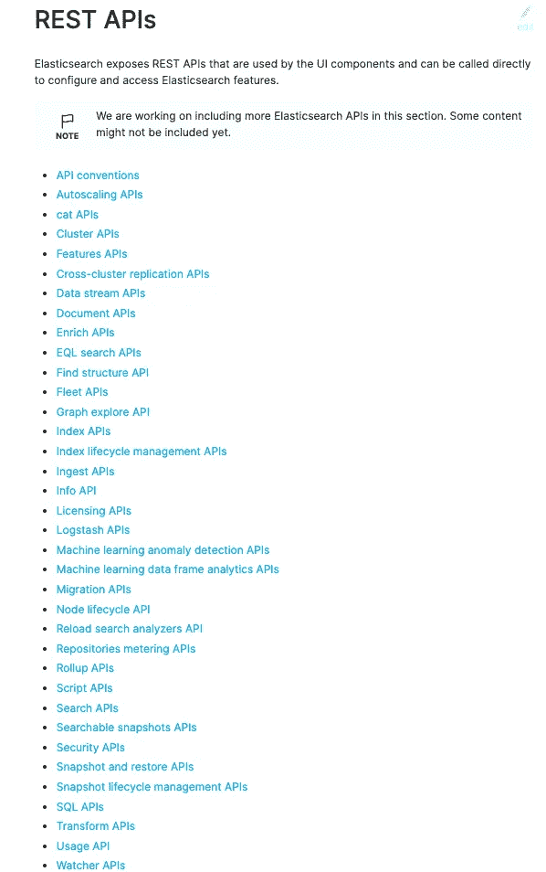
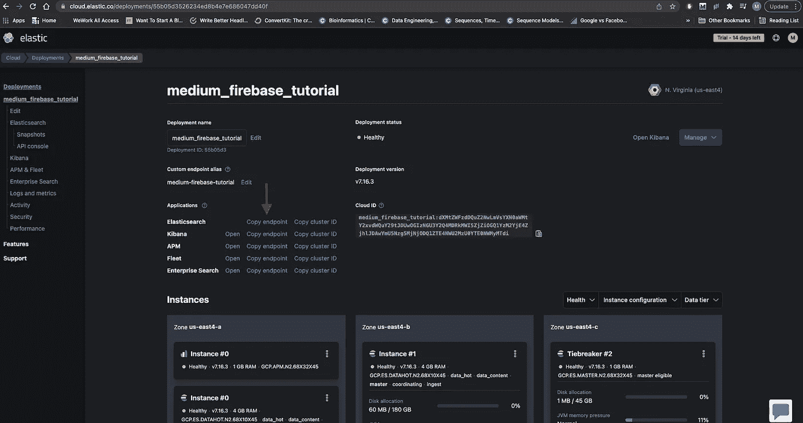

# Firestore 弹性搜索全文搜索第 1 部分:设置

> 原文：<https://levelup.gitconnected.com/firestore-full-text-search-with-elastic-search-part-1-setup-6c9d12098a1b>

## 使用 firebase、复杂查询、过滤等功能设置 Elasticsearch！


马库斯·温克勒在 [Unsplash](https://unsplash.com?utm_source=medium&utm_medium=referral) 上的照片

Elasticsearch 很神奇，Firebase 很神奇，为什么不把两者放在一起？如果你不熟悉 Elasticsearch，它是一个分布式的、基于 REST 的搜索引擎，使用 [Lucene](https://lucene.apache.org/core/#:~:text=Apache%20Lucene%E2%84%A2%20is%20a,spell%20correction%20or%20query%20suggestions.) 库来提供强大的搜索功能。我是 ARM 的一名软件工程师，我正在构建的平台的主要功能之一是搜索。虽然我在工作中使用 Azure search，但 Elasticsearch 的功能数量和易用性给我留下了深刻的印象。我已经在一个跨平台的移动应用程序上使用了带有 firebase 的 Elasticsearch，我在过去的 8 个月里一直在做这个应用程序，我肯定会推荐它。

你可以在那里找到所有与搜索相关的功能，例如:

1.  建议
2.  自动完成
3.  分析学
4.  过滤
5.  整理
6.  还有更多...

这将是一个关于如何使用 Firebase 和 Elasticsearch 的教程。在教程的第一部分，我们将设置 3 个监听器云函数。这些云功能的目的是将 Firestore 与 Elasticsearch 的索引完全同步。第一个函数负责同步写事件，第二个函数负责删除事件，最后一个函数负责更新事件。

注意:在本教程中，我们将使用 Typescript

在第二部分，我们将编写另一个云函数，在 Elasticsearch 的 API 上构建一个覆盖层，以允许各种不同的搜索查询。事不宜迟，我们开始吧！

## 设置弹性搜索

你需要做的第一件事就是去 [Elasticsearch](https://www.elastic.co/) 创建一个账户。创建帐户后，只需登录并点击“开始免费试用”。然后，Elasticsearch 会提示您命名您的第一个 Elasticsearch 服务，单击“下一步”后，您应该会看到一个显示您的服务凭据的窗口，如下所示:



来源:作者

把它们复制到一个安全的地方，因为它们以后会非常重要。

## 同步 Firestore 和 Elasticsearch

在我们开始之前，让我们快速概述一下 [Firebase 的数据库触发器](https://firebase.google.com/docs/functions/database-events)。顾名思义，这些触发器监听 firestore 并在某个动作发生时发出一个事件。这非常类似于[发布-订阅模式](https://en.wikipedia.org/wiki/Publish%E2%80%93subscribe_pattern)。我们将在这里使用的 3 个监听器是:

*   `[onCreate()](https://firebase.google.com/docs/reference/functions/providers_database.refbuilder#on-create)`，在实时数据库中创建新数据时触发。
*   `[onUpdate()](https://firebase.google.com/docs/reference/functions/providers_database.refbuilder#on-update)`，实时数据库数据更新时触发。
*   `[onDelete()](https://firebase.google.com/docs/reference/functions/providers_database.refbuilder#on-delete)`，从实时数据库中删除数据时触发。

来源: [Firebase 文档](https://firebase.google.com/docs/functions/database-events)

注意:虽然我知道有一个[扩展](https://firebase.google.com/products/extensions/elastic-firestore-elastic-app-search)执行非常相似的功能，但我发现自己实现这些东西总是更好，这样您可以更好地理解它们，并对它们有更多的控制。例如，当我在我构建的移动应用程序中使用它时，在某些情况下我不想同步整个文档。具体的功能，因为这将是唯一可用的，如果你真的自己编码。

1.  **同步写入**

Elasticsearch 有各种各样的 API，这使得开始使用有点困难:



来源:[弹性搜索](https://www.elastic.co/guide/en/elasticsearch/reference/current/rest-apis.html)

我们将使用的第一个 API 是[索引 API](https://www.elastic.co/guide/en/elasticsearch/reference/current/docs-index_.html) 。这是因为我们将利用这个端点，它允许我们将文档添加到搜索索引中。

```
PUT /<target>/_create/<_id>
```

在 Elasticsearch 服务下，您可以添加许多不同的索引(称为“目标”)。在这种情况下，您不需要手动创建索引，因为如果它不存在，将我们的第一个文档放在那里会自动为我们创建一个。

我们需要从 Elasticsearch 获得的下一个东西是认证。Elasticsearch 的端点使用基本认证，这意味着我们需要用户名和密码。我们需要将它们编码成 base64 字符串。要获得这些，请前往 Elasticsearch 控制台[这里](https://cloud.elastic.co/deployments)，并选择您的部署。点击您的部署后，点击 Elasticsearch 部分的“复制端点”:



来源:作者

还记得我们之前抢到的用户名和密码吗？我们现在要使用它们。注意，建议你把它们上传到 Firebase 环境变量(functions config)中，但是在本教程中，我们只是把它们作为字符串使用。

因为我们需要向 Elasticsearch 发送 HTTP 请求，所以我们将使用 Axios。这里我们要做的是，在指定集合中创建的每个文档上，我们要将快照数据添加到 Elasticsearch 索引中。这可以通过以下方式完成:

来源:作者

就是这样！现在，您只需将它部署到 firebase 环境中，如果您向 firestore 集合中添加任何文档，它都会自动同步到您的索引中。请注意，我们在索引中创建的文档与 firestore 快照具有相同的 id。

## 2.同步更新和删除

既然我们已经设置好了一切，剩下的就很简单了。首先，为了同步更新，我们将使用[更新 API](https://www.elastic.co/guide/en/elasticsearch/reference/current/docs-update.html) ，更具体地说，这个端点:

```
POST /<index>/_update/<_id>
```

请注意，我们在这里使用的是 POST 请求，而对于 writes，我们使用的是 PUT 请求。这次我们将使用“on update”firestore 触发器。

来源:作者

请注意，这里我们捕获的是“change.after ”,这是文档更新后的数据，我们只是将它发布到 Elasticsearch。

最后，我们现在还可以执行删除操作。这将对端点使用删除 API:

```
DELETE /<index>/_doc/<_id>
```

我们还将发送一个“删除”请求(显然),如下所示:

来源:作者

## 结论

就是这样！如果你部署了这 3 个功能，你的 firestore 应该与你的 Elasticsearch 服务同步。如果您遇到任何不幸的错误，您可以查看云函数错误日志(希望您不要这样做)。在本教程的下一部分，我将介绍索引的搜索和过滤。欢迎在评论中留下任何问题。