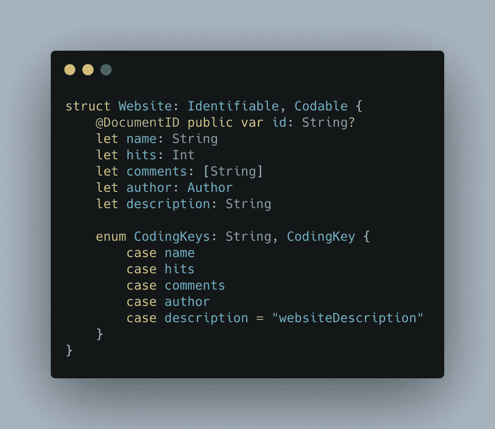

# Firestore 对象到 Swift 结构，以及复杂类型、枚举和数组

> 原文：<https://levelup.gitconnected.com/firestore-to-swift-models-with-complex-types-enums-and-arrays-282893affb15>

可编码结构

在我们用 Swift 编写并使用 SwiftUI 的应用程序中，我们需要一种方法将我们的数据从 Google Firestore 读入应用程序，然后将一些数据写回 Firestore。

最初，我遵循 Firestore 文档中的指南,尽管它涉及到大量将字典键/值映射到我所需要的类型。写数据也差不多。对于我的 Swift 类中的每个属性，我必须指定相应 Firestore 字段的名称，然后为该字段分配适当的值。我知道一定有更好的方法。

幸运的是，Firestore 文档认识到了这个问题，并提供了一种方法来[将您的文档放入一个 Swift 类](https://firebase.google.com/docs/firestore/query-data/get-data#custom_objects)，并允许您像使用任何其他数据一样使用它。这是通过使用 Pod `FirebaseFirestoreSwift`实现的，它向`document.data()`调用添加了一个扩展方法，因此您可以指定数据以什么类型进入。在`document.setData()`方法上也有一个[类似的方法](https://firebase.google.com/docs/firestore/manage-data/add-data#custom_objects)用于将你的 Swift 对象转换回 Firestore 对象。

然而，我不确定在数据类型不是简单的字符串到字符串或数字到整数映射的情况下，这将如何工作。具体来说，有五种情况我不确定(按照从最简单到最复杂的顺序):

1.  数组/列表
2.  复杂/自定义对象
3.  字段名不匹配的地方
4.  枚举
5.  其他数据转换

# 我如何将我的 Swift 对象转换为 Firestore，反之亦然？

最基本的例子是当你的对象只有简单的数据类型时。

一个简单的 Firestore 对象，带有一个字符串和一个数字

相应的 Swift 结构可能如下所示

带有一个字符串和一个整数的简单 Swift 结构

要让 Firestore 对象进入 Swift，您需要使用`.data(as: <type>)`方法。在下面的场景中，我正在获取 Firestore 集合`websites`中的所有文档，并将它们放入名为`self.websites`的属性中

将 Firestore 数据引入 Swift

需要注意一些事情:

*   第 12 行是我调用`document.data(as: <type>)`方法的地方。我把我想转换成的文件类型传到这里。
*   在第 11 行，我正在使用一个`flatMap`。这就像一个映射，它将数组中的每个对象转换成另一个对象。在本例中，我将每个文档(本质上是一个键/值对的字典)转换为我的网站结构。除非，如果结果返回 nil(这种情况发生在无法将其转换为指定的结构时),它将从数组中移除该结果。
    一个等效的方法是首先在`documents`上应用一个过滤器来移除任何不能被转换成网站结构的项目。因为 Firestore 本身并不要求集合中的每个文档看起来都一样，所以有些文档可能无法转换为您指定的结构。

还有一种相反的方法，其工作方式基本相同，只是将数据保存到 Firestore。注意，我在这里只设置了一个文档。

我们看过的所有代码都还不能工作。我们遗漏了一个小成分。

我们需要让 Swift 知道如何将文档(此时只是一个字典)转换成我们想要的结构。对于这个简单的例子，这真的很容易。我们只需要对我们的结构做三件事。

网站结构，现在可编码和识别

1.  使我们的结构符合`Identifiable`。这要求它有一个 id 属性，我们将添加…
2.  添加一个 id 属性并用`@DocumentID`进行注释。Firestore 将在这里存储文档本身的 id。这是必需的，对于将正确的文档保存回 Firestore 非常有用。
3.  使我们的结构符合`Codable`。这是 Swift 与我们的 struct 和 Firestore 相互转换的关键步骤。

## 可编码的

Codable 是 awesome 协议(由两个协议组成:Decodable 和 Encodable ),它增加了两个关键功能:

1.  init()方法，它允许我们从 Firestore 返回的字典中创建结构。这是解码器。
2.  一种允许我们将结构转换回 Firestore 所期望的字典格式的方法。这是编码器。

这些方法分别来自可解码和可编码协议。如果你有一个结构，你只需要从 Firestore 中检索，但从来没有保存回 Firestore，你可以简单地遵循可解码的协议。

幸运的是，Codable 非常聪明，如果您有一个像我们这样的结构，其中只有简单的类型，如 String、Int 或 Bool，这就是您需要做的所有事情。我们的代码现在可以工作了。

# 1.如果我的对象有一个数组呢？

幸运的是，数组和标准类型一样受支持。请参见下面的第 5 行。

带有字符串数组的 Swift 结构

这将把 Firestore 中的字符串数组直接转换成 Swift 中的字符串数组。不需要额外的代码。

# 2.如果我的对象有自定义数据类型怎么办？

一个常见的场景是支持您自己编写的自定义数据类型。例如，我的网站可以有一个作者，这是它自己的数据类型。让我们看看这在 Firestore 中是如何表现的。

幸运的是，在 Swift 中实现这一点也很简单。我们只需要定义另一个结构，包含我们在自定义数据类型中需要的字段。**重要的是**，这个**也**需要符合编码。事实上，只要每个结构都符合 Codable，您就可以任意深度地嵌套自定义对象。让我们来看看实际情况:

如你所见，我在我们的`Website`结构中使用了自定义的`Author`类型。你会注意到`Author`不需要符合`Identifiable`，因为我们只跟踪一个作者，并且作者不是 Firestore 文档——它只是我们网站中的一个字段。

您也可以像创建字符串数组一样创建自定义对象数组。

# 3.如果我的 Firestore 对象与我的 Swift struct 相比具有不同的字段名称，该怎么办？

这是一种相当常见的情况，尤其是在更新 Firestore 数据库很困难的情况下，因为它已经包含数据，正在被您无法更新的其他客户端使用，或者只是因为您没有更新 Firestore 的权限。

在第一种情况下，我会尽量保持字段名不变，即使只是为了你自己的理智。如果在你的 Firestore 中，你把某个东西称为“作者”,但在你的 Swift 代码中，你把相同的数据称为“人”,你可能会感到困惑。

但是，如果您无法使它们保持同步，幸运的是，Codable 协议允许您告诉 Swift，对于某个特定的属性，Firebase 的字典中的键将被称为其他的东西。这是通过定义一个名为`CodingKeys`的枚举来实现的。

对于我们的网站示例，在 Firestore 中，我们可能有一个名为`websiteDescription`的字段，但在 Swift 中，我们希望属性被称为`description`，因为我们知道它将描述网站。

我们的网站结构，其中 Swift 中的域名与 Firestore 不匹配

这里你可以看到我正在定义名为`CodingKeys`的枚举。它符合协议`String`,因为我们的 Firestore 中的键/字段名都是字符串。如果由于某种原因，我们的字段名称是 Firestore 中的数字，我们将遵守`Int`协议。重要的是，我们还符合`CodingKey`协议，该协议让 Swift 知道这个枚举将在这个可编码结构中使用，以定义字段的名称。

因此，在`CodingKeys`枚举中，我们需要为我们使用的每个字段创建一个案例。不幸的是，我们不能只定义一个名称不匹配的字段，我们需要定义每一个字段。

当我们到了不匹配的地方，我们需要做的就是给名字不匹配的地方一个字符串值。正如您在代码示例中看到的，我们希望 Swift 属性被称为`description`，但在 Firestore 中它被称为`websiteDescription`。所以，我已经把 case `description`的字符串值设置为`websiteDescription`，就这样！完成了。

# 4.如果我的对象有枚举怎么办？

啊，艾努斯。这是我害怕的类型，也是我最初在 Firestore 方法中做自己的映射而不是依赖 Codable 的原因。但是，我实际上发现这并不太复杂。

让我们回到网站的例子。我想要一个名为`typeOfWebsite`的枚举，值为`blog`、`app`和`forum`。Firestore 实际上[支持相当多不同的数据类型](https://firebase.google.com/docs/firestore/manage-data/data-types#data_types)，但是它们都不是枚举，所以我将不得不把它们作为字符串存储在 Firestore 中。

我想做的是在解码 Firestore 对象时将我的字符串转换为 enum，这样我就可以在我的 Swift 应用程序中使用 typesafe enum，而不必依赖神奇的字符串。但是，当我在 Firestore 中对要保存的对象进行编码时，我需要它返回到一个字符串，这样它才能被保存。

所以自然地，正如我前面说过的，你的结构中的任何类型也需要是可编码的。因此，我需要使我的枚举符合 Codable。

如果你的枚举使用`String`或`Int`作为它的原始值，它实际上可以符合 Codable 而不需要额外的工作。这里有一个例子:

因为这些例子使用 Int 和 String 原始值，所以 Swift 能够编码和解码这些值。对于 Int 示例，Firestore 会在文档中为 blog 保存数字 0，为 app 保存数字 1，为 forum 保存数字 2。对于字符串示例，它实际上为博客保存了`blog`，为应用程序保存了`app`，为论坛保存了`forum`。对于 90%的情况，这将工作得很好。

然而，我有一个稍微复杂一点的例子，Firestore 中的 enum 值与我的 enum 的原始值不完全匹配。所以，我需要做的是实现我自己的编码器和解码器。

请记住，您可以对任何数据类型这样做——不一定需要在枚举上。如果您需要对数据进行某种转换，而我已经描述过的特性并不支持这种转换，那么这是一种可行的方法。

所以，我的确切问题是一个第三方 API 把枚举值放入我的 Firestore，它与我的枚举名称不完全匹配。回到我们网站的例子，尽管`blog`是我在 Swift 中定义的 enum 值，但是这个第三方 API 把它作为`Blog`放入。尽管这只是一个字母的大小写变化，但这破坏了编码和解码，所以我们需要编写自己的方法。

这里有相当多的东西需要解开。

1.  首先，我在 enum 内部创建了两个方法，在字符串表示之间进行相互转换。
2.  我创建了一个符合`Codable`的`WebsiteType`扩展。这是不必要的，您可以将这个扩展中的所有代码移动到 enum 中——我只是认为它很好地将 enum 与可编码实现分离开来。
3.  如前所述，Codable 实际上是两个协议，`Encodable`和`Decodable`。它们中的每一个都有一个方法，你可以用你自己的方法覆盖它，就像我在这里做的那样。所以…
4.  在**第 40 行**我们有 init 方法。这个**创建**给定值的 WebsiteType 枚举。因此，在**第 41 行和第 42 行**上，我们获取值，作为一个字符串，然后在**第 43 行**上，我们获取该字符串，并将其传递给一个静态函数(因为 enum 尚未初始化，因为我们现在正在进行初始化)，这给了我们与字符串值相对应的 enum。这是可解码的部分。
5.  在第**行** **46** 上，我们有一个将枚举转换回字符串的函数。在第**行第 48** 行，我们使用`self.description`方法获取枚举的字符串表示，然后我们对它进行编码。注意**第 47 行**我们正在使用`singleValueContainer()`。这确保了当我们对枚举进行编码时，它输出一个值，比如`app`。
    我在网上看过的很多其他教程都把这个作为`container(keyedBy: CodingKey.self)`，然后他们像`container.encode(self.description, keyBy: .rawValue)`一样把这个值编码。这是可行的，但是输出了一个对象中的枚举，比如:`{rawValue: "app"}`。

就是这样！

# 5.如果我需要做一些其他类型的数据转换呢？

好问题。实际上，你已经拥有了继续做这件事所需的所有工具。与我为`WebsiteType` enum 创建自定义编码器和解码器的方式相同，您实际上可以为任何符合 Codable 的*对象创建自己的编码和解码函数。*

一些你可以做的事情的例子:

*   仅获取数组的第一个值
*   移除不需要的额外属性(在任一方向上)
*   更改字符串值的大小写
*   将 int 转换成 Floats
*   更改日期时区

因为可以自己写函数，机会是无限的。

希望这篇文章对你的快速旅程有用。在我们的应用中，我们基本上使用 Firestore 和 Firebase 功能作为我们的逻辑层，尽管有原生的 Android 和 iOS 应用，但这真的感觉像一个跨平台的应用，因为它们共享相同的数据 API。

一旦您的数据类型符合 Codable，读取和保存数据就是一件轻而易举的事情，我建议您不要做任何手动映射。现在，您需要做的就是读入对象，更新一个值，然后再次保存它。这可能会占用大约 3 行代码，如果您必须使用 API 或通过 ORM，这将花费更多的时间。Codable 也可以用于 JSON 解码/编码，因此本故事中的经验并不局限于 Firestore 中的用法。