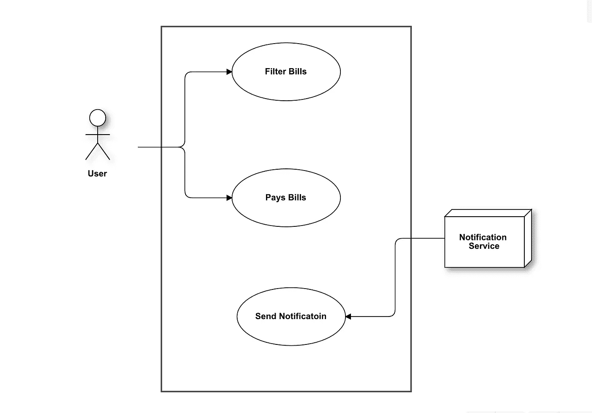

# 面向对象设计的前 5 步

> 原文：<https://levelup.gitconnected.com/first-5-steps-of-object-oriented-design-232ad3a95429>

实际例子

由 [ThisisEngineering RAEng](https://unsplash.com/@thisisengineering?utm_source=unsplash&utm_medium=referral&utm_content=creditCopyText) 在 [Unsplash](https://unsplash.com/s/photos/design-coding?utm_source=unsplash&utm_medium=referral&utm_content=creditCopyText) 拍摄的照片

作为一名软件开发人员，我们的主要日常任务是为现实生活中的问题设计解决方案，并将其转化为代码。

所以理解正确的问题并正确设计是软件生命周期中非常重要的一部分。

我们不能直接进入代码。我们必须首先考虑手头的问题。我们必须识别可能的场景和陷阱，并试图提前解决它们，因为我们都知道在完成编码后更改某些功能或设计的代价有多高。

放弃一个概念设计比重写整个软件要安全和划算得多。

但是如何正确地做到这一点呢？我们不是第一个走这条路的人。有成熟的方法和流程可以做到这一点。

今天我们将讨论以面向对象的方式设计任何系统的第一步。

## 眼前的问题

让我们假设我们正在设计一个**账单支付**模块，用户在这里支付他们每月的电费。

让我们开始吧…..

## 第一步:需求分析:

流程的第一步是正确理解系统或功能的需求。我们可以通过问一个简单的问题来识别这些东西。

> 系统必须做什么？

对于我们的账单支付模块，要求可以是…

*   系统必须能够验证用户的身份
*   系统必须显示该用户的所有账单
*   该系统必须能够处理用户付款
*   系统必须通知用户支付成功或失败

所以理解我们想从系统中得到什么是设计的第一部分。

## 步骤 2:定义用例

在我们确信我们正确理解了系统的需求之后，现在我们可以继续讨论我们系统的用例了。为了识别用例，我们必须问

> 什么？…..谁啊。…..怎么会？

我们必须从每个用例中确定 3 个部分

*   能做什么(标题)
*   谁做的(演员)
*   做这件事的过程(情景)

对于我们的账单模块，一些示例用例可以是…

*   用户可以从用户界面查看和过滤账单
*   用户可以通过信用卡付款
*   用户可以看到付款状态

识别这些用例对于前进非常重要。

## 第三步:确定演员

在定义了我们的用例之后，我们现在可以识别系统的参与者了

问问题

> 谁可以使用我们的系统？

参与者可以是一个人，甚至是另一个系统

对于我们的账单模块系统，我们可能有几个参与者

`General Users`那些用系统付账的人

那些控制系统的人

`Notification Service`我们必须通知用户状态。

`Accounting Service`我们可能需要会计的帮助

定义这些参与者可以帮助我们更好地识别应用程序的场景。

## 步骤 4:确定场景

下一步是确定目标系统的场景。你得问

> 在你的系统中事情是如何发生的？

尽量关注用户的意图。想象一个正常的动作流程。想想什么会出错。答案应该是积极的声音和最小的。这里不要添加任何技术术语

一个示例场景可以是…

> 用户支付账单，系统验证这是一个有效的请求，然后确认支付并通知用户

考虑场景时要避免的事情

`1\. Too Much Details`用户输入金额，然后通过 HTTP 将其发送到后端，然后等待响应。

`2\. Too Complex Scenerios`用户试图登录，但他的电脑突然关机！

请记住，我们的目标不是编写 sudo 代码，也不要在您的场景中添加任何与用户界面相关的词语，如`button` `screen` `press`等。

## 步骤 5:用例图

下一步可以是设计用例图。有许多流行的工具可以用来设计这些图表。

一个好的图表是我们之前讨论的所有事情的活文档。

关于绘制这些图表的一些约定…

*   `Person`简笔画
*   `Non Person`箱子
*   `Action`箭头动作

用例图示例

## 好吧。那么你应该在多大程度上专注于设计呢？

记住一件事。你不应该只关注这些图表和流程。因为归根结底，每个人都想要一个好的软件。

所以试着在设计和实现之间找到平衡点。你必须平衡这两者来设计好的软件。我们有一个很好的词来形容这个…

> YAGNI:你不会需要它的

这意味着不要过多考虑你的软件或系统的每一个细节。因为如果你手中没有一个最低限度的可行产品，那是不可能的。试着把更多的注意力放在获得绝对的基本权利上。

但是尽管如此，设计是非常重要的，这样我们就可以接受将在开发的后期阶段出现的变化。因此，我们必须尽可能地保持我们的系统的灵活性，而正确的设计是做到这一点的方法。

今天到此为止。编码快乐！:D

**通过** [**LinkedIn**](https://www.linkedin.com/in/56faisal/) **或我的** [**个人网站**](https://www.mohammadfaisal.dev/) **与我取得联系。**