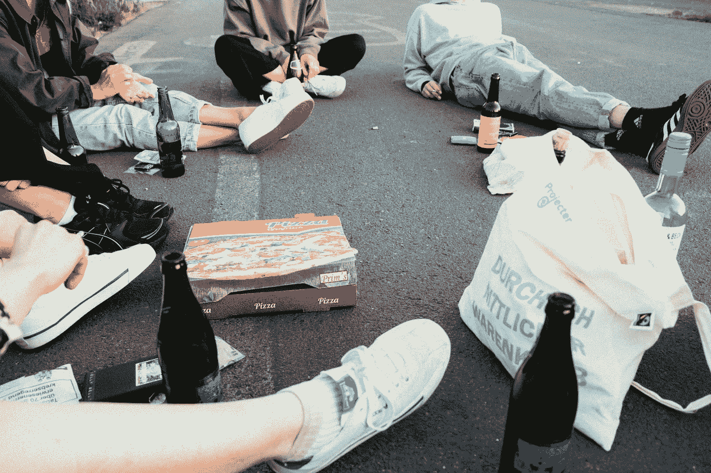
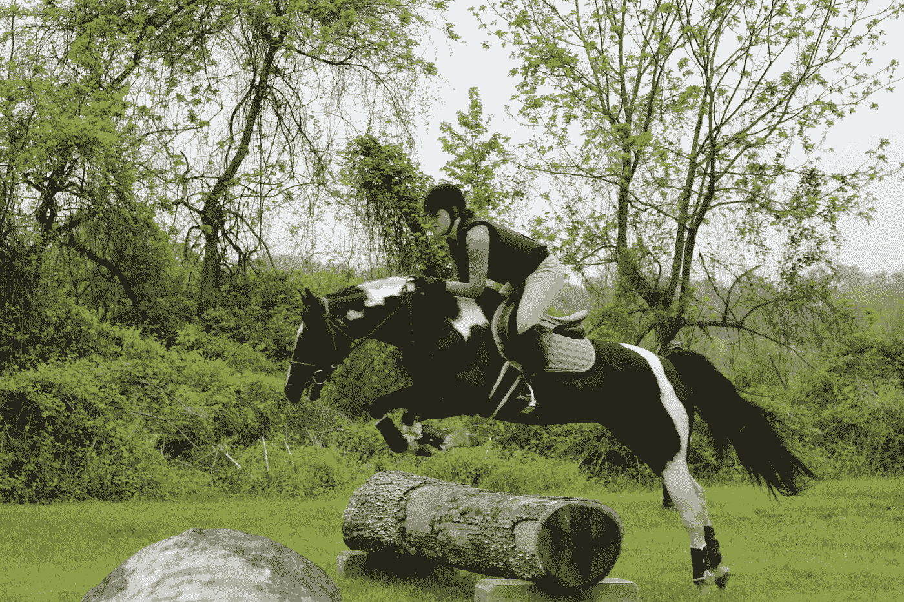

# 我公司的第一次黑客马拉松。

> 原文：<https://levelup.gitconnected.com/first-hackathon-in-my-company-e41036cfe2ba>

在压力下编程并向我的管理层展示！

约翰·施诺布里奇在 [Unsplash](https://unsplash.com/s/photos/work-team?utm_source=unsplash&utm_medium=referral&utm_content=creditCopyText) 上的照片

## 黑客马拉松的背景

对于我的公司想要开发的下一个产品，R&D 决定举办两次迷你黑客马拉松。在第一个例子中，我们研究了一些技术，并提出了一个不错的选项列表。在第二场比赛中，也就是今天，4 个团队中的每一个都得到了一个产品，并被要求创建一个概念的工作证明。

## 黑客马拉松是什么样的

在第一次黑客马拉松中，我们被随机分组，所以我可以和我完全不认识的人一起工作。

黑客马拉松与我的公司处理的领域相同——视频和网络解决方案，所以在这个领域有一个强大的背景是很好的。

这是一种新的体验，因为我自己没有勇气去参加黑客马拉松，而且是在正常工作时间和上班时间。

## 不是什么

由于新冠肺炎，这不是一个面对面的聚会，但柠檬水是凉爽和甜蜜的——我可以在我的家庭办公室放松，我可以静音一切，静静地专注于一些代码，或者跳回来，使用屏幕共享轻松地看到其他人的代码。

它没有任何比萨饼，不眠之夜，随机混合，或任何发生在非公司非 covid 黑客马拉松的事情，所以我仍然有期待。

由[托拜厄斯·图利乌斯](https://unsplash.com/@tobiastu?utm_source=unsplash&utm_medium=referral&utm_content=creditCopyText)在 [Unsplash](https://unsplash.com/s/photos/pizza-people?utm_source=unsplash&utm_medium=referral&utm_content=creditCopyText) 拍摄的照片

## 一开始我不知所措

我们要探索的第三方解决方案是在我们开始前 5 分钟宣布的。当我加入团队聊天时，每个人似乎都在奔向解决方案，建立我们需要的设置，打开端口，配置东西。我坐在那里，完全不熟悉这个产品，却觉得它像一根真正的木头一样有用。

我觉得每个人都知道这么多，这既是鼓舞人心的，也是令人生畏的，于是我把麦克风静音，尽量不让自己看起来像内心一样麻木。

## 但是我跳回到马背上

我花了一小会儿时间洗脸。即使离线 30 秒钟也能很好地放松，让我们的注意力回到正轨。

当我回来时，一个队友向我要了我的公共 IP 和密钥，这样他就可以授予我权限。这提醒了我，我处在一个分享成功的友好环境中，我应该乐于和精明的同事一起工作。

我坚持自己的决心，对某个配置进行越来越多的挖掘，直到我意识到我比任何人都了解它，所以我开始接受第三方利用率的挑战。

当我感觉到我正在给球队带来价值的时候，我的感觉变得更好了。我意识到我从来不介意别人知道更多；我担心我不会帮助和贡献我的一部分。

塔亚·缔安娜在 [Unsplash](https://unsplash.com/s/photos/horse-jump?utm_source=unsplash&utm_medium=referral&utm_content=creditCopyText) 上的照片

## 这个挑战不是我所喜欢的

大约 2 个小时后，设置完成，主要任务是一个网站的前端和后端。我对任何 web 东西都不熟悉，另一个开发者跳到了编写 REST 后端和 JS 前端。

我非常相信不断学习和跟上新技术。尽管如此，我刚刚完成了对一台不熟悉的服务器的几个小时的调整和调试，在接下来的黑客马拉松中花一个小时研究前端对我来说有点太多了。

## 但我肯定能帮上忙

我让自己坐在后座，让别人开车。但这并不意味着无所事事，我问我的团队我能帮上什么忙，并做了一些与我的工作领域相关的副业。

当没有什么特别的事情要做时，我让其他人分享屏幕，告诉我一点正在发生的事情。虽然在这一小时里我没有掌握 JavaScript，但我对一些主题和技术有了第一印象。

一个 c++开发者朋友在另一个团队也有同样的障碍，于是她主动把所有的架构和组件都写下来做成幻灯片。她的团队在截止日期前 40 分钟没有工作演示，所以她为他们提供了一个安全网——如果事情出错，他们总是可以展示设计，所以他们不会空手而归。

## 这都是关于演示的

拥有一个好的后端架构比不上一个好的 GUI 和演示，这可能是我看到的黑客马拉松的唯一缺点。

我们没有及时准备好整个概念验证，所以我建议我们展示产品本身的演示页面，内置在他们的网站上，以展示该解决方案可以提供的高级功能和可能性。
我们的两部分演示进行得非常顺利。

## 结论

我们的黑客马拉松中的 4 个团队都有很好的工作演示，因为我们实际上没有竞争，所以我们喜欢每个人做的伟大工作。
我克服了一些障碍，帮助了我的团队，以后肯定会去参加更多的黑客马拉松，不过是为了面向后端的任务。

塔亚·缔安娜在 [Unsplash](https://unsplash.com/s/photos/horse-jump?utm_source=unsplash&utm_medium=referral&utm_content=creditCopyText) 上的照片