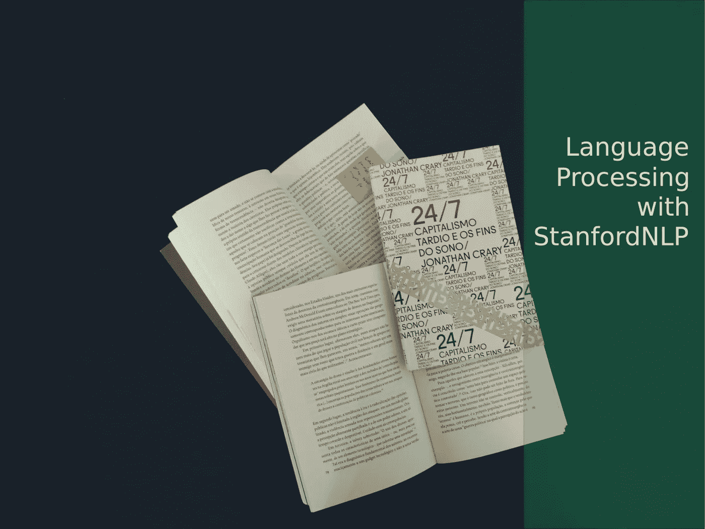
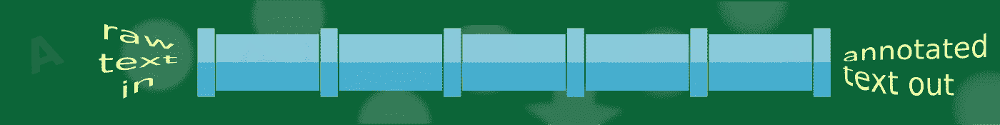

# Stanford NLP——一个可以处理 53 种人类语言的 Python 库

> 原文：<https://levelup.gitconnected.com/first-look-at-stanfordnlp-2b7d43190957>



由 mauricio Santos 在 [Unsplash](https://unsplash.com?utm_source=medium&utm_medium=referral) 上拍摄的照片

# 介绍

StanfordNLP 是一个 Python 库，它解决了许多常见的自然语言处理问题。数据科学家和 Python 开发人员很容易理解这种用法。这个库是由斯坦福大学的自然语言处理小组开发的。

# 语言

StanfordNLP 配备了针对 [53 种人类语言](https://stanfordnlp.github.io/stanfordnlp/installation_download.html#human-languages-supported-by-stanfordnlp)的预训练深度学习模型，并使用 [PyTorch](https://pytorch.org/) 作为其机器学习基础设施

每种语言都有一个[树库](https://en.wikipedia.org/wiki/Treebank)，这是一个庞大的文本数据集，已经针对语法结构和/或语义内容进行了可靠的注释。对于某些语言，这个库提供了不止一个树库。

如果您必须拥有自己的带注释的语料库(这并不经常发生！)你可以基于你的语料库训练一个新的模型。


解析句子！

# 范围

该库有助于以下任务:

*   取一个给定的文本，将其拆分成句子和单词(标记化)。标记化会将一个文本(“土拨鼠吸引注意力的日子”)转换成一个由七个单词组成的序列(“the”、“day”、“of”、“The”、“土拨鼠”、“吸引”、“注意力”)。
*   给一个给定的单词分配一个基本形式(词汇化)。一个引理器会把“*吸引*”、“*吸引*”、“*吸引*”与同一个引理联系起来(例如，“*吸引*”)。
*   在一个句子中，将单词与词性(POS)相关联。所以“*日*”是名词而“*吸引*是动词。
*   单词有形态特征，如单数或现在时。图书馆也会在这方面有所帮助。
*   它也能产生句子的句法结构
*   最后，它可以与众所周知的范围更广的斯坦福 CoreNLP 整合。

在这篇文章中，我们将玩标记化，词性和形态特征。



斯坦福 NLP 管道

# 管道

在这篇由# Each language requires more that 1GB of disk space
# It takes time... have a coffee!stanfordnlp.download('en')
stanfordnlp.download('es')
stanfordnlp.download('fr')

系统会询问您将下载的语言包存储在哪里。建议的默认值可用于本练习。下载完成后，您可以检查每种语言都有一个相应的文件夹，其中保存了许多将在我们将要介绍的各种 NLP 任务中使用的 **PyTorch** 模型。

# 词性标注及其有用的原因

词性标注是在更复杂的自然语言处理活动中使用的基本任务。想想文本分类、情感分析或信息索引和检索。建立文本的基本句法结构为进一步的文本处理奠定了基础。

# 解析和标记句子

我们用法语取下面这个句子:

> 这种说法很像是在说一个人对六方的看法(勒内·笛卡尔，关于方法的说法)

不过不用担心，我们会短很多的！让我们分析笛卡尔的句子，以评估每个单词在句子中的作用。记号赋予者和词性标注者进场。

```
import stanfordnlp# English is the default language, so you
# just invoke stanfordnlp.Pipeline()
# For Spanish you would call 
# stanfordnlp.Pipeline(lang="es", treebank="es_ancora")# This sets up a neural pipeline in French
nlp = stanfordnlp.Pipeline(lang="fr", treebank="fr_gsd")# a document is made of sentences
doc = nlp("Si ce discours semble trop long pour être lu en une fois, on le pourra distinguer en six parties")# we pick our first and only sentence
only_sentence = doc.sentences[0]

# a sentence is made of words. 
# Each word is tagged with a part of speech (POS)
# Good pythonic guys prefer list comprehensions over for loops!print(" ". join(["{} ({})".format(word.text, word.upos) for word in only_sentence.words]))
```

在一些信息性的信息之后，我们得到单词列表，每个单词都被附加到其相应的词性上:

```
Si (SCONJ) ce (DET) discours (NOUN) semble (VERB) trop (ADV) long (ADJ) pour (ADP) être (AUX) lu (VERB) en (ADP) une (DET) fois (NOUN) , (PUNCT) on (PRON) le (PRON) pourra (VERB) distinguer (VERB) en (ADP) six (NUM) parties (NOUN)
```

它告诉我们这样的事实:six 是一个数字限定词，parties 是一个名词。请注意，虽然**路**被确定为动词，但**tre**被标记为助动词。

StanfordNLP 利用了 [t](https://universaldependencies.org/u/pos/) he [通用词类](https://universaldependencies.org/u/pos/)集合，其优点是适用于多种语言。但是，只要树库支持，特定于语言的词性也会被属性 **pos** 使用和展示。其他 NLP 库，如 [spacy](https://spacy.io/) 也使用通用和特定语言的词性集合。


乔姆斯基的笑话

# 处理多义词

现在我们将试着对图书馆开一个无害的玩笑。我们想知道这个英语句子的词性:

> 你在书摊上袖手旁观时，我在看书

不仅*书*和*摊*在同一句话里带着两种不同的意思。它们也充当动词和名词。对这句话运行类似的代码块，我们得到:

```
I (PRON) book (VERB) the (DET) book (NOUN) while (SCONJ) you (PRON) stand (VERB) by (ADP) the (DET) stand (NOUN)
```

我用这个简单的例子来引起读者的注意，说明词性标注不仅仅是在字典中查找单词，而是单词周围的句法结构决定了词性。这是库里的学习模型展示他们的部分能力的地方。

# 形态特征

除了通用和特定语言形式的 POS 之外，库中的 Word 类还带有属性 **feats** 中单词的形态特征(注意文档中可能有一个小错误，该属性被称为 ufeats)。

我们运行下面的代码

```
en_nlp = stanfordnlp.Pipeline()doc = en_nlp("My taylor is drunk") 
only_sentence = doc.sentences[0]
print(" ". join(["{} ({} - {})".format(word.text, word.upos, word.feats) for word in only_sentence.words]))
```

然后得到

```
My (PRON - Number=Sing|Person=1|Poss=Yes|PronType=Prs)
taylor (NOUN - Number=Sing) 
is (AUX - Mood=Ind|Number=Sing|Person=3|Tense=Pres|VerbForm=Fin) drunk (ADJ - Degree=Pos)
```

其中每个单词由其特征来表征，主要是但不仅仅是名词和动词。要解读以上内容，你可以查阅索引。例如，Degree=Pos 表示[正，第一级表示](https://universaldependencies.org/u/feat/Degree.html#Pos)。注意*醉*是识别形容词，不是动词。

# 关闭

我想今天就够了。我们喜欢这个图书馆，使用起来也很舒服。当文档不够时，您可以随时查看源代码来完善您的理解。展望未来，我们打算完成对 StanfordNLP 提供的其余功能的理解。

[](https://levelup.gitconnected.com)[](https://gitconnected.com/learn/python) [## 学习 Python -最佳 Python 教程(2019) | gitconnected

### 50 大 Python 教程-免费学习 Python。课程由开发人员提交并投票，使您能够…

gitconnected.com](https://gitconnected.com/learn/python)