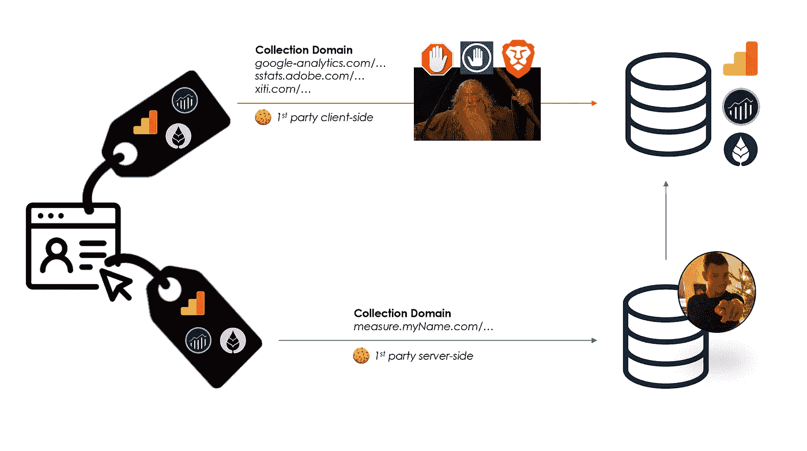
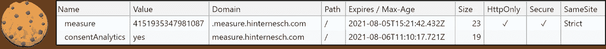
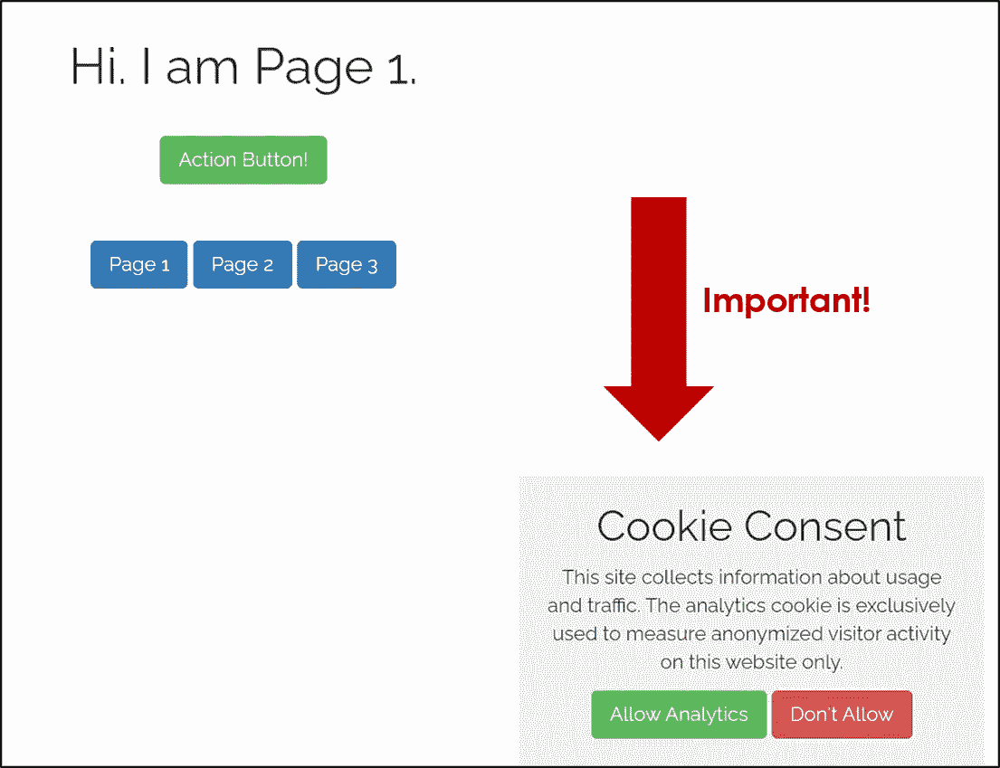
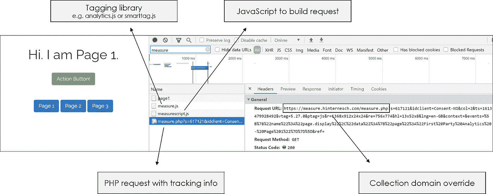

# 面向所有人的第一方数据和服务器端分析:混合模式

> 原文：<https://levelup.gitconnected.com/first-party-data-and-server-side-analytics-for-everyone-the-hybrid-model-a4e293641c9b>

在这篇文章中，我将说明如何在服务器端移动大量的分析实现，从而显著提高数据准确性和数据控制:

*   使用您现有的客户端标记设置
*   不需要使用服务器端的 Google Tag Manager，也不需要使用任何 Google 服务器
*   通过简单的实现

人们可以称之为混合模式，结合了两个世界的优点。
客户端数据采集。
服务器端数据准备和调度。



**面向所有人的第一方数据收集—只需最少的实施工作。**这里的目标既不是创建您自己的数据管道和处理，也不是纯粹依赖服务器端的日志数据。目标是:
→在客户端收集数据(使用任何客户端分析 JS 库)
→在您自己的服务器上收集、准备和清理数据(我使用的是 PHP 文件)
→将其转发给互联网上的 Google Analytics/Adobe Analytics/或选择的供应商

服务器端实现和标签管理以难以部署而闻名。虽然这无疑给流程增加了额外的步骤，但是服务器上的工作可以被简化到最基本的部分。虽然 GTM 服务器端是一个大规模简化配置的伟大产品，但我想展示第一方服务器端分析也可以以一种非常容易理解的方式实现。这将有助于更好地理解它实际上是如何工作的，阐明利弊，并消除那些没有太多服务器端实现接触点的人对未知事物的恐惧。

```
**In Short**[What You Gain](#1dc7) 
→ Data accuracy, first party server-side cookies, full data control
[What You Lose](#0c48) 
→ Reliable geolocation, vendor-side bot detection, cookie ID on first event
[What You Need](#7c8e) 
→ Access to web hosting server, basic server-side programming
[What You Must Consider](#0afb) 
→ Privacy compliance, consent management
[What It Looks Like in Practise](#f166) 
*→* [*https://measure.hinternesch.com/*](https://measure.hinternesch.com/)
```

# 你得到了什么

## 数据准确性

广告/跟踪拦截器或浏览器隐私工具不会阻止跟踪请求。给点背景知识，阻止工具和安全浏览器会阻止分析请求有几个原因:

*   调用托管跟踪库的 CDN，如谷歌的 *analytics.js* 或互联网的 *smarttag.js* →解决方案:不要使用 CDN。相反，将库作为本地 JS 文件托管在服务器上。你甚至不必使用供应商库。您还可以编写自己的脚本来捕获和传输选定的客户端数据。
*   调用客户端标签管理系统
    →解决方案:不要使用 TMS。在本地 JS 文件中编写实现代码。
*   呼叫已知的分析供应商收集域
    →解决方案:不要直接请求供应商端点。取而代之的是，向*https://myDomain.com/measure*申请你自己的文件

当然，你仍然必须获得同意(参见 [*你必须考虑什么*](#0afb) )。像这样的配置不会非法绕过广告拦截器并侵犯用户隐私，这一点怎么强调都不为过。然而，我确实相信，许多合法的分析正在被任意丢失。在征得同意的情况下对网站使用情况进行负责任的测量不应受到影响，原因很简单，因为用户希望阻止侵犯隐私的第三方广告跟踪解决方案，这是可以理解的。**立法、公众理解和隐私工具如 ITP、cookie 同意弹出窗口和广告拦截器缺乏细微差别**。这就是像这样的设置可以通过重新获得当前因错误原因丢失的数据来帮助提高数据准确性的地方。

## 来自您自己域的服务器端第一方 Cookies

没有第三方饼干。没有客户端 JavaScript cookies(同意管理除外)。只需一个安全的第一方服务器端 *measure-cookie* ，带有匿名 ID，您可以独立设置、管理和控制。



## 完全数据控制

在将数据发送给供应商之前，清理并准备好服务器端的数据。这包括管理 IP 地址、ID 哈希和用户代理，以及在需要时防止指纹识别。对于哪些信息发送到哪里以及用于什么目的，始终对用户透明。

# 你失去了什么

## 可靠的地理定位和 IPs

最终的供应商请求将来自你的服务器的 IP。在下面的[示例中，我实现了一个变通方法来展示在许多情况下 IP 仍然可以被转发，但是这里有一些注意事项需要考虑。](#f166)

## 供应商端 Bot 检测

当服务器发送最终请求时，它默认拥有服务器的用户代理和 IP，这两者通常是供应商用来检测僵尸程序的主要标识符。这里有几个备选解决方案:

*   客户端方法:[Google reCAPTCHAv3](https://developers.google.com/recaptcha/docs/v3)(Simo Ahava[在此](https://www.simoahava.com/analytics/improve-google-analytics-bot-detection-with-recaptcha/))或[其他客户端库](https://github.com/LouisKlimek/HeadlessDetectJS)应该能够过滤掉大量内容，而不需要用户输入
*   服务器端的方法:你可以[用潜在可疑用户代理的自定义列表创建自己的逻辑](https://checkingcreditcard.com/bot-detection-with-php)(很难编译和管理)，使用类似 [Cloudflare Bot Fight Mode](https://developers.cloudflare.com/bots/bot-fight-mode) 的服务，甚至使用官方的 [IAB 列表](https://www.iab.com/guidelines/iab-abc-international-spiders-bots-list/)进行 Bot 分类(费用昂贵)。请注意，如果用户代理和 IP 被成功转发(参见下面的[示例)，在某些情况下，您仍然可以依赖供应商端的 bot 检测，在大多数情况下，这最终只不过是与 IAB 列表进行比较。](#f166)

## 第一个事件没有 Cookie-ID

这主要是由于 PHP cookie 逻辑和请求的顺序。需要第一个页面视图来请求 PHP 脚本处理 cookie，以防它还不存在。但是，在大多数情况下，这种影响将被这样一个事实所消除，即无论如何，您都不应该在第一个事件中删除或使用 cookie 值预同意。

# 你需要什么

访问您的内容托管服务器和域文件夹(包含跟踪逻辑的脚本需要粘贴在这里)以及服务器端脚本和 cookie 管理的一些基本知识。

# 你必须考虑的是

## 合规和同意管理

跟踪信息的发送现在是秘密进行的，即在您的服务器上进行，对用户是不可见的。因此，对于您收集的数据的最终用途，获得同意甚至更为重要。



对于[示例站点](#f166)，我编写了自己的同意管理脚本。内容托管服务器正在发布和读取带有匿名 ID 的*度量* cookie。**然而，**我只是在用户同意的情况下，将此 ID 转发给供应商，作为访客识别的一种方式。根据用户的选择，我将放置一个*同意* cookie:

*   如果同意=是→在我的服务器端脚本中使用*度量* cookie ID。
*   如果同意=否→不要使用*度量* cookie ID。 [AT Internet 有一个*不同意*模式](https://developers.atinternet-solutions.com/javascript-en/advanced-features-javascript-en/privacy-javascript-en/#activating-the-no-consent-mode_15)，在没有同意的情况下，排除整个跟踪事件和所有相关信息。谷歌的隐私沙箱也会有类似的选项。此选项也是我的所有请求的默认选项，仅在获得同意后才会在服务器上被覆盖。

# 它实际上是什么样子

我的示例站点有三个页面和一个要跟踪的按钮:[***https://measure.hinternesch.com***](https://measure.hinternesch.com/)

## 客户端逻辑



*   您可以使用任何类型的定制 JavaScript 或供应商库来获取客户端信息并创建跟踪请求。这是与*全功能*服务器端实现的区别。数据仍在客户端收集。这里最大的好处是我们仍然能够在浏览器中捕获客户端信息和用户交互，比如按钮点击。
*   更改请求 URL 的默认集合域和路径。
    GA 默认:`https://www.google-analytics.com/g/collect`
    ATI 默认:`https://logs.xiti.com/hit.xiti`
    我用自己服务器上某个文件的地址替换了:
    `https://measure.hinternesch.com/measure.php`
*   我不是从供应商收集服务器请求一个像素，而是从我自己的服务器请求一个 PHP 文件。请注意，跟踪请求的所有信息仍将被传输:
    -)查询字符串中的客户端信息，由我的标记库组装
    -)请求报头中的用户代理、IP、cookie 信息

## 服务器端逻辑

*   我的服务器上的 PHP 文件从不在客户端呈现，它有两个目的:
    1)它是跟踪信息的载体——就像像素是
    一样 2)它处理数据准备并分派给供应商收集端点
*   注意，这个 PHP 文件的内容和它做的事情并不适用于每一个实现。这在很大程度上取决于您准备数据的方式、您管理合规性的方式以及您希望将哪些数据转发到哪个端点。作为参考，下面是我的服务器端 PHP 脚本的注释示例:

*   Et voilà:跟踪请求和访问者标识 cookie 永远不会被阻止。既没有广告拦截器，也没有任何浏览器跟踪预防，如勇敢的隐私盾牌。它们甚至没有被像 Omnibug 这样的神奇工具发现。

简而言之，我们刚刚将很大一部分测量活动转移到了服务器端，因此在数据准确性、合规性和数据准备的可能性方面做出了重大改进——只需做两件事:更改 hit 的收集地址和向我们的服务器添加单个文件。

*—如果你对流程有疑问，需要帮助实现，发现代码中的错误，或者如果你只是想讨论分析:请随时联系*[](https://hinternesch.com/?at_medium=affiliate&at_campaign=Medium&at_creation=TheHybridModel&at_format=link)****。****——**