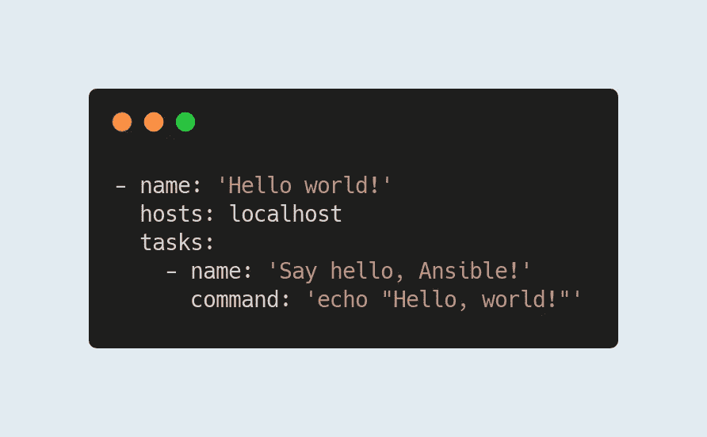
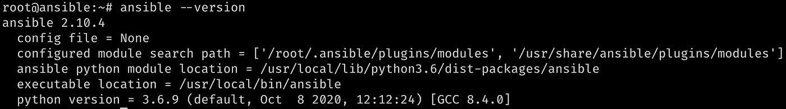
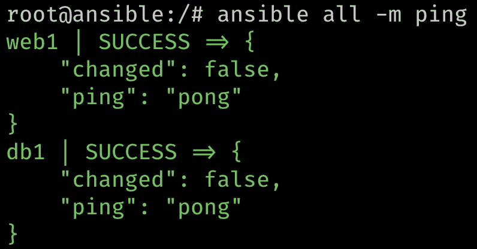
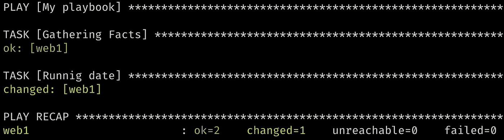
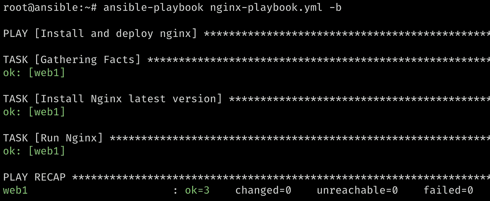
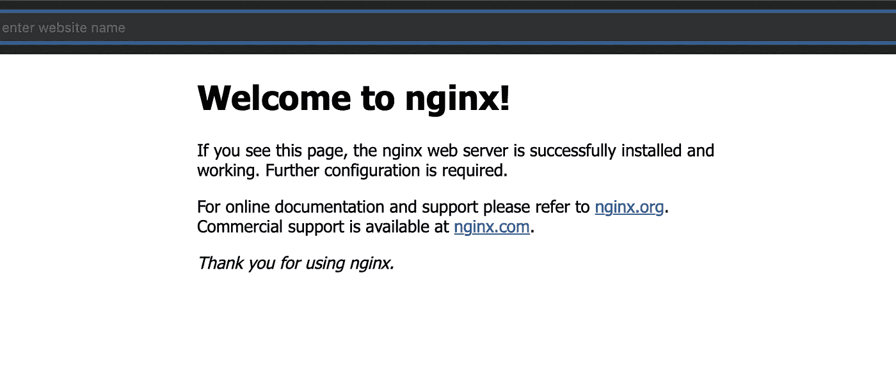

# 使用 Ansible 的第一步。

> 原文：<https://levelup.gitconnected.com/first-steps-with-ansible-685250ed65b5>



[Ansible](https://www.ansible.com/) 是由 [Red Hat](https://www.redhat.com/) 发布的最新工具之一，也是开发人员和 DevOps 工程师自动化新服务器中几乎所有事情的最佳选择之一。它是免费和开源的，相信我，配置远程服务器从未如此简单。

在本教程中，我打算向您展示如何安装和开始使用这个强大的工具。

# 安装 Ansible

首先，您将需要一个 Ansible 控制器主机来管理您的所有节点。这个主机可能是你的本地主机，不要担心，Ansible 将会工作，不管你使用哪个操作系统。我用的是 Ubuntu，但是其他操作系统的安装步骤都差不多。

让我们使用`apt`安装 Ansible。

```
$ sudo apt install ansible
```

安装完成后，运行

```
$ ansible --version
```

如果软件包安装成功，您应该会看到类似这样的内容。



可翻译版本输出

# 可变节点

现在你的遥控器工作了，很简单，对吧？

让我们设置您的节点，用您喜欢的编辑器打开/etc/ansible/hosts 文件，您应该会看到这个模板

```
# This is the default ansible 'hosts' file.
#
# It should live in /etc/ansible/hosts
#
#   - Comments begin with the '#' character
#   - Blank lines are ignored
#   - Groups of hosts are delimited by [header] elements
#   - You can enter hostnames or ip addresses
#   - A hostname/ip can be a member of multiple groups
# Ex 1: Ungrouped hosts, specify before any group headers.
#green.example.com
#blue.example.com
#192.168.100.1
#192.168.100.10# Ex 2: A collection of hosts belonging to the 'webservers' group#[webservers]
#alpha.example.org
#beta.example.org
#192.168.1.100
#192.168.1.110# If you have multiple hosts following a pattern you can specify
# them like this:#www[001:006].example.com# Ex 3: A collection of database servers in the 'dbservers' group
#[dbservers]
#
#db01.intranet.mydomain.net
#db02.intranet.mydomain.net
#10.25.1.56
#10.25.1.57# Here's another example of host ranges, this time there are no
# leading 0s:#db-[99:101]-node.example.com
```

您可以在文件底部添加您的主机，或者删除所有内容并用您的主机替换它。唯一的规则是遵循下面的语法。

```
# Linux host
# host_alias ansible_host=<host_ip_or_url> ansible_connection=ssh ansible_user=<host_user> ansible_ssh_pass=<ssh_password_for_user># Windows host
# host_alias ansible_host=<host_ip_or_url> ansible_connection=winrm ansible_user=<host_user> ansible_password=<password_for_user># I am adding two servers, both of them are Linux serversweb1 ansible_host=my.webserver.com ansible_connection=ssh ansible_user=root ansible_ssh_pass=Passw0rddb1 ansible_host=my.databaseserver.com ansible_connection=ssh ansible_user=root ansible_ssh_server=Passw0rd
```

现在，为您的服务器添加一些组。组允许您在多台主机上同时运行命令和脚本。

```
[web_nodes]
web1 ansible_host=my.webserver.com ansible_connection=ssh ansible_user=root ansible_ssh_pass=Passw0rd[db_nodes]
db1 ansible_host=my.databaseserver.com ansible_connection=ssh ansible_user=root ansible_ssh_server=Passw0rd
```

保存您的更改并关闭文件。

Ansible 依赖于 sshpass 包，运行以下命令安装它

```
$ sudo apt install sshpass
```

剩下的唯一一步是通过 ssh 连接到您的主机；这是为了将您的主机的指纹添加到~/。ssh/已知主机文件。

```
$ ssh root@my.webserver.com
$ ssh root@my.databaseserver.com
```

现在，通过运行以下命令来尝试您的主机:

```
$ # Ansible has an 'all' group which contains all your defined hosts
$ ansible all -m ping
```

如果一切顺利，您将看到类似的输出



可变 Ping 输出

# 运行行动手册

您的主机已经可以通过 Ansible 使用了。请在您的主目录中创建一个新文件夹。

```
$ mdkir ~/ansible-tutorial
$ cd ~/ansible-tutorial
```

Ansible 的脚本只是 YAML 文件。如果你以前和 YAML 合作过，这一步会很简单。

打开一个新的 playbook.yml 文件，并添加以下行

```
- name: My playbook
  hosts: web1
  tasks:
  - name: Runnig date
    command: date
```

*   “名称”是行动手册的别名
*   “主机”定义运行行动手册的主机，可以是一个组
*   “任务”是保存要使用的动作或模块的数组

保存您的更改并关闭文件，现在使用

```
$ ansible-playbook playbook.yml
```

您应该会看到类似如下的输出



可翻译剧本输出

# 一个简单、真实的例子

到目前为止，你学到了一些新东西

*   安装和配置一个可行的控制器
*   添加新剧本
*   在您的主机上运行它

现在是时候学习如何在现实生活中使用 Ansible 了。

对于这个例子，您将安装并运行一个 Nginx 服务器。

让我们创建一个新的剧本

```
$ vim nginx-playbook.yml
```

要开始编写这个剧本，添加一个名字和运行 Nginx 的主机(记住标识)

```
- name: 'Install and deploy nginx'
  hosts: web1
```

现在，添加任务，在这种情况下，您需要定义两个操作。

1.  安装最新的 Nginx 版本
2.  启动 Nginx 服务器

```
tasks:
  - name: 'Install Nginx latest version'
    apt:
      name: nginx
      state: latest
```

该任务在目标主机上查找 Nginx。如果 Ansible 找到 Nginx 的最新版本，安装就不会发生。

```
- name: 'Run Nginx'
    service:
      name: nginx
      state: started
```

这个任务检查 Nginx 服务器是否已经在运行。如果不是，则跳过该步骤。

完整的 nginx-playbook.yml 应该是这样的

```
- name: 'Install and deploy nginx'
  hosts: web1
  tasks:
    - name: 'Install Nginx latest version'
      apt:
        name: nginx
        state: latest
    - name: 'Run Nginx'
      service:
        name: nginx
        state: started
```

保存您的更改，现在，尝试一下吧！由于我们正在您的主机中安装一个包，您需要在 playbook 命令中添加'-b '标志。

```
$ ansible-playbook nginx-playbook.yml -b 
$ # -b or --become grants root privileges to ansible user.
```



Nginx 剧本输出

最后让我们检查一下浏览器！



Nginx 主页

# 结论

Ansible 是一个伟大的盟友；它使得在你所有的服务器上安装和部署东西变得容易。当然，这只是一个介绍性的教程，但是这个工具有一个模块可以处理你需要自动化的所有事情。你可以在这里找到所有随时可用的[。](https://docs.ansible.com/ansible/2.8/modules/list_of_all_modules.html)

在我以后的帖子中，我会尝试向您展示更多高级用法！

感谢阅读。非常感谢您的每一个反馈、评论或分享！