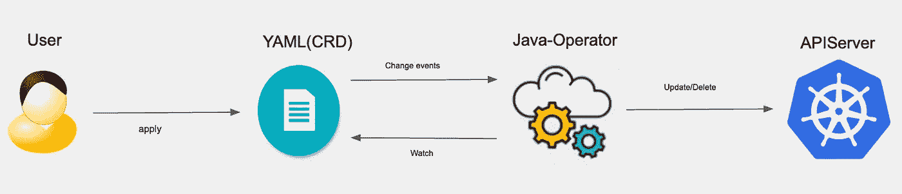
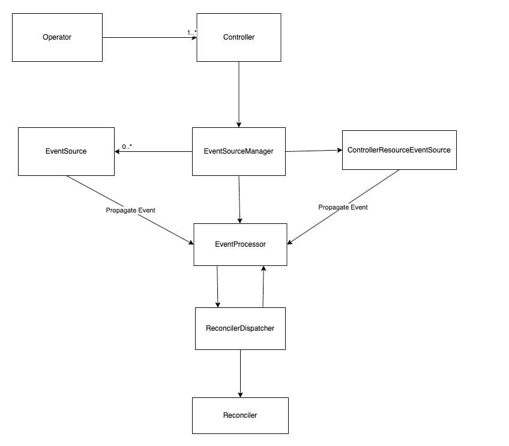
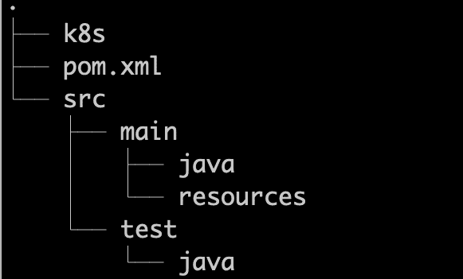

# 先试试 Java Operator SDK

> 原文：<https://levelup.gitconnected.com/first-try-on-java-operator-sdk-5a07f30771de>

## java-operator-sdk 上的演示，并与 Kubebuilder 进行比较



按作者

我一直致力于 Kubernetes 操作符的开发，以促进集群管理。当开发一个操作符时，我们通常关注两点

*   **定义一个 CRD** 来管理需要的信息`spec`，以及需要返回给用户的状态信息`status`。
*   **定义一个自定义控制器**，它是操作员的核心，可以在集群中自动运行，监视资源，执行`create`、`edit`等操作，并响应删除。

> 不需要编程。用户可以为 CRD 控制器选择任何语言。
> 
> —来自[https://kubernetes . io/docs/concepts/extend-kubernetes/API-extension/custom-resources/# chopping-a-method-for-adding-custom-resources](https://kubernetes.io/docs/concepts/extend-kubernetes/api-extension/custom-resources/#choosing-a-method-for-adding-custom-resources)

我在上一篇文章[开发操作符](https://medium.com/swlh/kubernetes-operator-for-beginners-what-why-how-21b23f0cb9b1#writing-operator)方面工作得很好，有自己的长处，这将在下面的演示中展示。读完这篇文章后，我希望你能了解如何用 Java 开发一个操作符，如何用 Java 操作符实现测试，以及 Java 与 Go Kubebuilder 的不同体验。

# 开发一个 Java 运算符

## Java 运算符 SDK

> 无论您是想构建自己运行的应用程序，还是想从 Java 代码中提供基础设施，Kubernetes 操作符都是不错的选择。JAVA-OPERATOR-SDK 基于 Kubernetes 客户端，将使 JAVA 开发者更容易接受这种新的自动化方式。

我们的 Java operator 将基于 [Java Operator SDK](https://javaoperatorsdk.io/docs/getting-started) (JOSDK)框架，该框架有一个成熟的客户端库(fabric8)与 Kubernetes API 服务器进行交互。这是一个关键部分，因为运营商非常依赖 API 与集群进行交互。



–来自[架构和内部构件(javaoperatorsdk.io)](https://javaoperatorsdk.io/docs/architecture-and-internals)

JOSDK 依赖于 Kubernetes 事件的观察和分发机制，有四个主要特性是在框架的引擎盖下完成的。

*   包装 fabric8 并对其进行配置，以侦听指定定制资源上的更改。
*   提供一个接口来实现特定资源类型的协调循环。
*   以高效的方式安排变更事件的执行，并使用过滤器过滤掉不需要的事件。
*   重试失败的协调。

从图中我们可以看到，资源控制器是由框架实现的，**用户只需要实现业务逻辑相关的协调器**。

## 演示

为了更好的比较，我将重现用 Kubebuilder 构建的`[UserIdentityV1](https://github.com/slaise/operator-test/blob/master/kubebuilder-test/api/v1/useridentity_types.go)`。

**构造代码**

一般我们需要 maven 来构造一个 Java 项目，生成类似`src/main/java, src/test`等文件结构。并且依赖项将由用户添加，因为 JOSDK 没有为快速生成提供 maven 架构。

我从[样本操作符](https://github.com/java-operator-sdk/java-operator-sdk/tree/main/sample-operators)中复制了一个“干净”的帧以节省我的精力。



而`pom`文件如下图，是我解开所有心结后的最终版本。例如，我添加了几个 fabric8 依赖项，这在文档中没有给出。如果您不熟悉 fabric8 开发，搜索它们需要时间。

**定义 CRD**

我已经通读了`java-operator-sdk`的[入门](https://javaoperatorsdk.io/docs/getting-started)文档，但是没有找到脚手架工具。所以我参考 sample-controller 中的例子一步一步地添加代码。

*   分别定义`spec`和`status`。所需的`Role`信息在`spec`中声明，运行状态和错误信息在`status`中返回。
*   定义 CRD，扩展`CustomResource`，实现`Namespaced`接口。

请注意以下几点。

*   `fabric8`提供了一组元数据相关的注释。
*   验证可以添加到带有`jsonProperty`和`javax.validation.constraints`库的字段中，最终反映在 CRD 定义中，比如`@NotNull`使得字段在 CRD 中被标记为`required`
*   `Namespaced`将 CRD 标记为`namespace scope`或`cluster scope`。

对于一些 Kubernetes 的本土资源，可以参考 fabric8 提供的这张[备忘单](https://github.com/fabric8io/kubernetes-client/blob/master/doc/CHEATSHEET.md)。

**生成 CRD YAML**

为了解决这个难题，在我没有找到用 Java 生成 CRD·YAML 的工具后，我花了大量时间阅读文档，以避免自己编写 YAML。


来自 Unsplash，[@ rocinate _ 11](https://unsplash.com/photos/eQ2Z9ay9Wws)

幸运的是，我成功地在 Java 中找到了[生成 CRD](https://github.com/fabric8io/kubernetes-client/blob/master/doc/CRD-generator.md)，在`kubernetes-client/java`中找到了[反之亦然](http://java/generate-model-from-third-party-resources.md%20at%20master%20%C2%B7%20kubernetes-client/java%20(github.com))。

*   将以下依赖项添加到 pom。

```
<dependency>
    <groupId>io.fabric8</groupId>
    <artifactId>crd-generator-apt</artifactId>
    <scope>provided</scope>
</dependency>
```

*   运行`mvn compile`。
*   将`target/class/META-INF/fabric8/`下的`<plural>.<group>-<CRD spec version>.yml`文件复制到`k8s/`中。

**定义调解器**

到了这一段就放心了，轻松多了。

*   实现`Reconciler`接口的协调器方法。每次更新资源都会触发协调器的执行。这里我需要更新资源，生成相应的`ClusterRoleBinding`并用`fabric8`客户端保存，最后更新资源状态。

*   实现`Cleaner`接口来处理删除。

除了上面的两个基本功能，框架还提供了一些 API 和注释来帮助提高效率。

*   实现`ErrorStatusHandler`接口来处理错误状态，比如设置集群错误的解析，根据场景返回易于理解的错误消息。
*   通过`MaxReconciliationInterval`界面控制对账间隔，避免过于频繁的调用。该注释需要加载到类中。
*   使用`GradualRetry`控制失败时的最大尝试次数，避免由于配置错误导致的 APIServer 过载。
*   用`ObservedGenerationAware`接口设置`ObservedGeneration`字段，这是对 Kubernetes 资源进行乐观锁定的有效控制方法。
*   使用`RateLimited`注释控制更新频率，例如`RateLimited(maxReconciliations = 2, within = 3, unit = TimeUnit.SECONDS)`限制调解器在 3 秒内最多更新两次。
*   实现录取 webhook。

更多功能请参考[官方文档](https://javaoperatorsdk.io/docs/features)及源代码。

**定义主方法**

现在到了最后一步，初始化协调器并定义 Java main 方法。

# 测试 Java 操作符

## **单元测试**

端到端测试需要 5 个步骤。

*   初始化一个`KubernetesClient`
*   执行一个`AbstractOperatorExtension`，并注册协调
*   加载一个`Role`到本地 Kubernetes
*   创建一个新的`UserIdentity`，然后由客户端提交
*   过一会儿验证

## 部署测试

分 6 步将操作员部署到一个种类集群。

*   创建一个类簇并切换 kubecontext
*   用`kubectl apply -f k8s/useridentities.identity.company.org-v1.yml`向集群提交本地 CRD
*   用 maven 生成操作符图像。这里的`jib-maven-plugin`用于在运行`mvn install`或`mvn jib:dockerBuilder`时将图像推送到 docker
*   手动创建`Deployment`并提交
*   创建`test-ns`名称空间，并将`k8s/roles-test.yml`提交给集群创建`Role`
*   提交一个`UserIdentity.yaml`来查看集群中创建的`ClusterRolebinding`

# Java 操作符 VS Kubebuilder 操作符

## 语言

JOSDK<= Kubebuilder

The JOSDK enjoys the whole Java ecosystem, which has been established by many Internet companies due to Java’s 20-year prevalence. There is a complete set of processes, from maven parent, the test frameworks, to the integration of CI/CD, etc., and far richer third-party libraries. But, JOSDK relies mostly on fabric8, and cannot work well if the Kubernetes APIs are not encapsulated in fabric8.

On the other hand, Kubebuilder is the first-class in the Kubernetes ecosystem, which is mainly built in Go. And it can quickly integrate various Kubernetes packages like 【 , enabling the concentration on function development.

## Tools

JOSDK ** < Kubebuilder *****

JOSDK is weaker in this aspect. No code-generator was found, but only a [Java-operator-plugin](https://github.com/operator-framework/java-operator-plugins)，基于 [operator-sdk](https://github.com/operator-framework/operator-sdk) 的工具。虽然我们可以按照[教程](https://github.com/operator-framework/java-operator-plugins/blob/main/docs/tutorial.md)快速启动一个项目来开发一个操作符，但是操作符只关注`quarkus`，而不是我想要的原始 Java 操作符。

Kubebuilder 比 JOSDK 成熟得多，尽管 JOSDK 也提供了一些 maven 插件和 fabric8 生成器。从下表可以直接看出来。

## CRD 定义

JOSDK*** < Kubebuilder *****
JOSDK 在自动化方面做的很差。虽然提供了类似`CustomResource`的接口，但是创建 CRD 对应的 Java 类仍然需要手动创建`spec`和`status`，即使没有特殊字段。由于缺少生成注释的工具，需要为`APIGroup`和`Version`添加注释。唯一的好处是一些注释很方便。

相反，Kubebuilder 在生成 CRD 时需要较少的编码，因为代码生成和默认字段完全受 Kubernetes 原生包的支持。

## **支持的功能**

JOSDK **** <= Kubebuilder *****

As to the functions supported, their biggest difference lies in what they actually implement: JOSDK implements the reconciler, and the controller is built into the framework and distributes requests according to events.

While, Kubebuilder implements the controller, which runs automatically at intervals.

Besides, their support for the following operations should also be noted.

*   **资源更新**。它们基本上是相同的，框架做得最多。而 **JOSDK 跳过** `**Get**`。
*   Kubernetes 本地资源的**读写**。区别在于 fabric8 API 和 Kubernetes 原生 API，尤其是控制器运行时 API。Java 需要更多的代码来创建和更新对象，比如 getters 和 setters。
*   **删除**。JOSDK 用独立的`Cleaner`接口更优雅，而 Kubebuilder 用`DeletionTimeStamp`和`Finializer`处理。
*   **调和控制**。JOSDK 有一个优秀的带有注释的设计；而 Kubebuilder 在控制器中处理它，比如使用`ratelimit`。
*   **依赖关系管理**。maven 的设计使得 JOSDK 所依赖的库很分散，从 operator-framework 到 fabric8，再到 testing，所需的许多 API 在文档中都找不到。而 Kubebuilder 的依赖性更少，一旦代码生成，基本上不需要额外的包。
*   **错误处理**。JOSDK 有一个集中的异常处理，这使得协调逻辑更容易编写和测试。而 Kubebuilder 依赖于 Go 的错误处理，我们需要在调和过程中一步一步的处理。
*   **网钩**。JOSDK 没有足够的权限支持 webhooks。我们需要用拦截器实现 webhook 功能，除了一些 CRD 字段的验证。阅读此[问题单](https://github.com/java-operator-sdk/java-operator-sdk/issues/370)了解更多信息。

## 测试支持

JOSDK ***** > Kubebuilder

JOSDK 为您提供了非常好的测试体验:模拟单元测试和 E2E 测试都得到完美支持；不需要使用容器或 Kubernetes 本地集群；IDE 完美支持断点调试。况且 Java 更擅长远程调试。

相比较而言，Kubebuilder 的测试支持较差，更依赖于其他 Go 包如`ginkgo`。而且在调试和模仿方面也不如 Java。

## 文件

JOSDK * < Kubebuilder ****

JOSDK documentation lacks the information for developing an operator step by step. Instead, I have to search in Google to find what I need, especially the integration with other tools like 【 and 【 .

Kubebuilder has a super nice [步步 doc](https://kubebuilder.io/) ，这几乎涵盖了方方面面。

# 结论

JOSDK 的应用并不是那么广泛，主要是在 Java 社区内部的一些工具的操作员版本，比如 Tomcat、Spark、Flink 等。

我个人会坚持使用 Kubebuilder，不仅仅是因为来自 Kubernetes 社区的一流支持，还有代码和配置生成的有效性。但我也会密切关注 JOSDK，看它如何演变。我相信一个完整的基于 Kubernetes-Java 的生态系统正在形成。

感谢阅读！

# 参考

[https://javaoperatorsdk.io/docs/features](https://javaoperatorsdk.io/docs/features)

[https://github . com/fabric 8 io/kubernetes-client/blob/master/doc/CRD-generator . MD](https://github.com/fabric8io/kubernetes-client/blob/master/doc/CRD-generator.md)

[https://github . com/fabric 8 io/kubernetes-client/blob/master/doc/CRD-generator . MD](https://github.com/fabric8io/kubernetes-client/blob/master/doc/CRD-generator.md)

[Java/generate-model-from-third-party-resources . MD at master kubernetes-client/Java(github.com)](https://github.com/kubernetes-client/java/blob/master/docs/generate-model-from-third-party-resources.md)

[https://developers . red hat . com/articles/2022/02/15/write-kubernetes-Java-Java-operator-SDK](https://developers.redhat.com/articles/2022/02/15/write-kubernetes-java-java-operator-sdk)

[https://github . com/operator-framework/Java-operator-plugins/blob/main/docs/tutorial . MD](https://github.com/operator-framework/java-operator-plugins/blob/main/docs/tutorial.md)