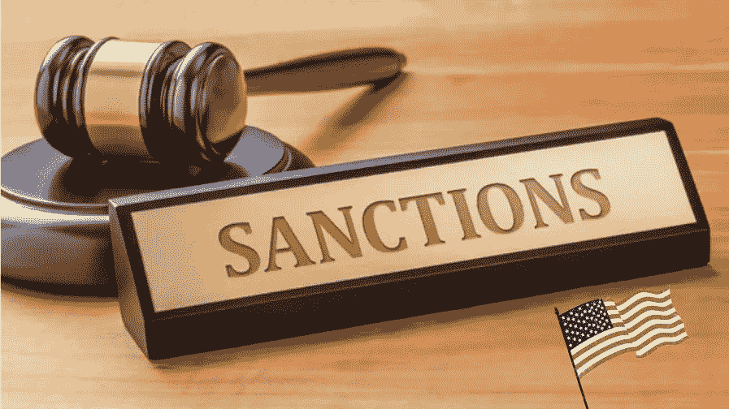

# 美国首例利用加密货币规避制裁的判决

> 原文：<https://levelup.gitconnected.com/first-verdict-in-the-us-over-the-use-of-cryptocurrencies-to-circumvent-sanctions-f69958f22439>

华盛顿一家法院维持了美国司法部(u . s . Department of Justice)起诉一家支付公司创始人向受制裁国家的人转移数字资产的裁决。

执法人员怀疑一名未透露姓名的美国人发送了价值超过 1000 万美元的比特币，以规避经济制裁。这是美国当局首次就加密货币提出此类指控。

DC 华盛顿州的美国治安法官齐亚·m·法鲁基发表声明解释了这一决定。诉讼称，被告注册了一家支付公司，作为向受制裁国家转移资金的幌子。

法官 Farooqi 声称，被告使用总部位于美国的加密货币交易所买卖比特币，该交易所的资金来自美国银行账户的法定货币。然后，被告从他在交易平台上的办公室将数字货币发送到外国加密交易所。之后，他将加密货币钱包的私钥转移给受制裁国家的用户。

Farooqi 在他的声明中表达了对当局是否能够追踪加密货币非法交易的担忧:

> “虚拟货币是被追踪的。然而，和杰森·沃赫斯(13 号星期五英雄)一样，虚拟货币匿名的神话并没有消亡。”

法官在裁决中提到了财政部(OFAC)外国资产控制办公室最近的建议，该办公室于 5 月份首次对加密货币混合器 Blender.io 实施制裁，原因是它与朝鲜黑客有联系。

📰 ***订阅*** [***斐波那契***](https://medium.com/@unclefibonacci) ***保持最新***