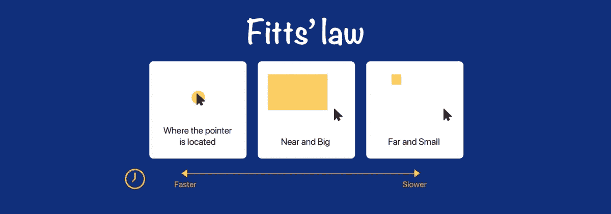

# 费茨定律:网页设计的另一面

> 原文：<https://levelup.gitconnected.com/fitts-law-another-aspect-in-web-design-a042d7194ad9>

心理学家 Paul Fitts(1912-1965)于 1954 年发表了他的“人体力学和目标运动”理论，该理论指出，一个人将指针(例如，鼠标光标)移动到目标区域所需的时间是到目标的距离除以目标大小的函数。因此，距离越长，目标越小，花费的时间就越长。

最简单地说，费茨定律认为，物体越大，离我们越近，我们就越容易够到它。

费茨定律广泛应用于用户体验(UX)和用户界面(UI)设计。这条定律影响了交互按钮变大的惯例，因为小按钮更难点击。同样，用户的注意力区域和任务相关按钮之间的距离应该尽可能的短。

能够跟踪用户使用网站的方式非常有帮助。了解这一点可以让你调整设计，让用户采取你希望他们采取的行动。一旦你的用户访问了你的页面，你就能清楚地看到他们会做什么，这给了你领先一步的优势。

让我们试着用一个简单的例子来理解一切:

假设你正坐在你的房间里，在你的房间里选择任何三件物品。它们可以是:

*   你的电脑屏幕
*   坐在树上的鸟，从你的窗口可以看到
*   放在学习桌上笔筒里的铅笔

现在用手指指出这些项目。你能明确指出哪一个？你一定已经注意到很少的项目是多么的明显(在我们的例子中是电脑屏幕)，而对于一些项目，你必须告诉其他人你实际上指的是什么(在我们的例子中是铅笔)。

对于上面列出的项目，我们可能会注意到以下内容，给它们从 1(非常难)到 5(非常容易)的星级，以表明指向它们有多容易。

*   你的电脑屏幕*****
*   鸟儿坐在树上，从你的窗户可以看到***
*   放在学习桌上笔筒里的铅笔*

费茨定律背后的数学公式，是 **T(时间)= a + b log2 (2 D(距离)/ W(宽度)**。让我们仔细看看:

*   时间是用户完成其运动所需的时间。
*   a + b:这些稍微复杂一点。它们是“回归系数”，这意味着我们通过观察物体的斜率来找到它们。
*   如你所料，距离是用户起点和终点(目标)之间的距离。
*   Width 是目标对象的宽度。

现在让我们把这些讨论放在网页设计和网页工程的背景下。

菲茨定律的理想应用是让我们知道用户的光标在页面上的位置。这就是“**主像素**”——用户在页面上执行所有操作的起点。如果我们能为用户确定这个“主像素”，那么我们就可以调整我们的设计*来适应*用户——例如，我们可以为我们期望用户采取的行动创建最短的路径。

不幸的是，虽然你的浏览器和应用程序可以利用 prime pixel，但网站*不能*利用这个数据。即使你*知道*像素，它也会随着用户每次移动鼠标而改变。

然而，也有一些好消息。当用户到达一个站点时，你不能确定主要像素，但是当用户采取行动时，你可以确定可能的主要像素。因此，举例来说，如果用户点击“登录”，为用户显示的框应该尽可能靠近“登录”选项，“提交”按钮也应该尽可能靠近文本框。

## 将费茨定律应用于用户界面/UX 设计:

图形用户界面中的命令按钮和任何其他交互式元素必须在大小上区别于其他非交互式元素。虽然这看起来很明显，但是用户界面设计经常忽略了按钮越大，用点击设备点击就越容易。

## 结论:

你一定在想“越大越好”，对吗？实际上，不是:这是一个关于可用性的*定律*。虽然“太小了，我看不到它”显然不是很好，而“比它大”更好…当增加选项的大小时，它只会变得更有用*一点点*。这是网页设计师应该考虑的事情；否则，他们所有的网页都必须由一个巨大的按钮组成，供用户按下。

最后但同样重要的是，你应该和你的实际用户一起测试你的设计，看看他们是否有你希望的效果。

学到了新东西？评论和反馈总能让作者开心。编码快乐！