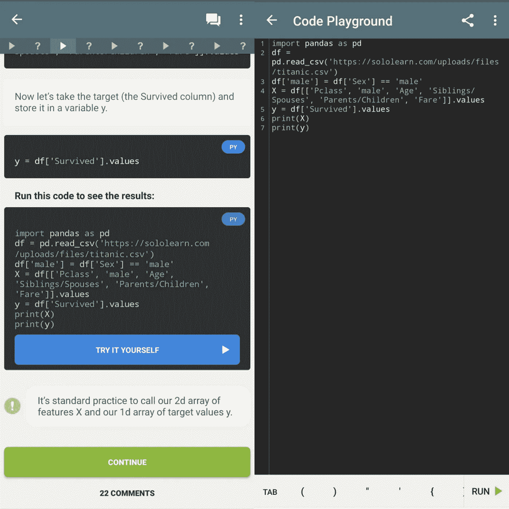

# 如果你想在 2021 年成为数据科学家，需要学习五门数据科学课程

> 原文：<https://levelup.gitconnected.com/five-data-science-courses-to-study-if-you-want-to-be-data-scientist-in-2021-b81cbfe60623>

## 无论在哪里都要学习。不用投资就能研究它们。

[活动发起人](https://unsplash.com/@campaign_creators?utm_source=unsplash&utm_medium=referral&utm_content=creditCopyText)在 [Unsplash](https://unsplash.com/s/photos/data-science-course?utm_source=unsplash&utm_medium=referral&utm_content=creditCopyText) 上的照片

> 免责声明:本文不包含附属链接。我与本文中提到的任何服务或网站没有业务关系。0 美元就可以学习以下课程。

2012 年，哈佛商学院将数据科学称为 21 世纪最性感的工作。八年过去了，对数据科学家工作的狂热似乎不会很快停止。每天，我们都会发现数据科学正在通过一种新的应用程序发展。数据科学可以在任何地方应用，从社会科学和商业分析到通过人工智能理解动物的行为。

每天都有成千上万的年轻人开始他们成为下一个数据科学家的第一步。为了实现他们的梦想，有抱负的数据科学家需要一个能够满足所有这三种需求的平台。

1.  向有志之士传授数据科学技能
2.  通过测验和实验室工作测试新获得的技能
3.  提供一个能体现他们成绩的证书。

> 当我们在欧洲和美国时，更容易收集成千上万可选的必要资源，但来自南亚和非洲许多发展中国家的人们仍然很难找到可以满足他们需求的良好资源。一美元在尼泊尔相当于 120 卢比，在尼日利亚相当于 380 尼格拉，在印度尼西亚相当于 15000 英镑。即使那些有足够钱的学生也被剥夺了高质量的教学材料，因为不容易获得当地货币对美元的转换设施。作为一名尼泊尔居民，我理解这些学生面临的问题。

无论你是谁，无论你来自哪里，都可以以不到 150 美元的价格开始学习数据科学的旅程。在我解释这些课程之前，让我列出您开始成为一名有竞争力的数据科学所需的技能。这些列表是基本但非详尽的列表，不包括您学习数据科学所需的核心工具。

1.  编程/数据科学语言:- C++，R，Python，SQL
2.  数学技能:-线性代数，微积分，最优化
3.  统计技能:-统计，概率，分布，回归

大多数人坚持认为，他们只需要 R 或 Python 中的一个就可以成为一名优秀的数据科学家，但是请注意，直到你对这两者都了如指掌，你永远不知道和谁在一起最舒服。所以，我建议你两个课程都学。我列出了五门性价比最高、最物有所值的课程，为你的学习打下基础。

# 自学数据科学家课程(费用:0 美元)

Solo learn 是一款在线移动应用，在 Google play 商店中的应用下载量超过 1000 万次。我建议您参加以下数据科学家和编程课程，开始您的数据科学之旅。

1.  C++
2.  Python 3
3.  结构化查询语言
4.  使用 Python 的数据科学
5.  机器学习

SoloLearn 课程的每个组成部分都被简化为更小的部分，以帮助您理解基础知识。在每一小节之后，都有小测验来测试你的知识。这些测验很简单。这门课程进度较慢，但非常适合初学者。如果你理解测验有任何困难，看看评论部分来理解用户的解释。机器学习大纲包括了大部分流行的算法。我发现那些 C++和机器学习的课程很有帮助。

截图:solo 课程布局

自学课程是免费。在每个编码部分，都有一个“自己尝试”的选项您可以根据自己的需要更改/操作/保存代码。免费内容的唯一限制是，你必须在开始下一关之前完成所有前面的材料。所以，慢慢来，从 solo learn 学习基础数据科学。也可以通过他们的[网站](https://www.sololearn.com/)查看，如果是并排练的话比较合适。

python 的更多资料:- [Python 文档](https://docs.python.org/3/)

# 用于机器学习的数学，伦敦帝国理工学院的 Coursera(售价 40 美元)

伦敦帝国理工学院有[三门课程](https://www.coursera.org/specializations/mathematics-machine-learning)，作为你机器学习之旅的基础。这些课程是

1.  机器学习的数学:线性代数
2.  机器学习的数学:多变量微积分
3.  机器学习的数学:PCA

我最近完成了这些课程，它让我惊讶地知道了它们的内容。我认为它们是网上解释得最清楚的基础课程之一，也是最划算的。从解释基的线性代数变化，特征值到梯度下降，反向传播，教师已经做了大量的工作产生了一系列精彩的内容。他们使用 python 作为他们的实验室作品，这是一个很大的优势。他们的练习和测验是值得解决的问题。如果你没有数学背景，这是你学习初期需要学习的课程。

你可以通过旁听来温习你的理论，但是你可能需要付费来访问他们的实验室工作。如果你付费的话，你可以在一个月内完成所有的三门课程(注册一个专业),这将使你的课程费用减少到 40 澳元。如果你不能(或无力)支付内容费用，Coursera 可以选择“申请经济援助”。从你申请经济资助的那天起，你可能需要等 15 天，但即使是这样，你也可以在 50 天内轻松完成一门课程。要完成一门课程，我建议您遵循以下步骤。

1.  审核课程并提交奖学金申请(一次一份奖学金申请)。
2.  不要等 15 天才学习内容。在拿到奖学金申请结果之前的十五天内，学习完成所有的视频和练习测验。在你得到经济资助决定后的一两天内完成所有的分级测验。
3.  为了避免负面的决定，只有在你完成之前的课程后才申请下一个奖学金。

# 约翰·霍普金斯大学的 Coursera 数据科学专业(费用 40 美元)

一旦你掌握了数学技巧，让我们开始研究统计学。约翰·霍普斯金的数据科学专业是 Coursera 最古老的课程之一。但是这门课仍然吸引我的原因是它提供的统计学知识。尽管 IBM 的九门专业课程，IBM 数据科学专业证书与 Watson Studio 和 SQL 聚焦课程等功能竞争，但我更喜欢 JHU 课程，因为它的实验室在 R 上，这是一个额外的好处。JHU 提供的十道菜系列如下

1.  数据科学家的工具箱
2.  r 编程
3.  获取和清理数据
4.  探索性数据分析
5.  可重复的研究
6.  统计推断
7.  回归模型
8.  实用机器学习
9.  开发数据产品
10.  数据科学顶点

你在这个专业所学的课程更侧重于统计学内容。即使它有 10 门课程，如果你全职学习它，将总成本限制在 40 美元以内，你也可以在一个月内完成它的专业化。如果你申请经济资助，在审核剩下的课程时，申请唯一重要的课程。但是，我强烈建议你付费学习，因为付费学习的学生比只旁听的学生更有可能按时完成课程。

其他资源:-

[机器学习速成班谷歌](https://developers.google.com/machine-learning/crash-course/)(Python 语言)

# Kaggle 机器学习课程(免费)

Kaggle 最出名的是数据科学竞赛，它有机器学习所需的热门课程。我之所以把它放在第 4 位，是因为这对许多用户来说可能很难。一旦你完成了上述课程，你就可以开始 Kaggle 课程了。Kaggle 的所有[课程](https://www.kaggle.com/learn/overview)都是免费的，它们为你提供了宝贵的体验。除了 Python，Pandas 和 SQL，数据可视化和机器学习内容，你还可以学习像深度学习和自然语言处理这样的高级内容。

## 康奈尔 CS4780，智能系统的机器学习，YouTube(免费)

让我们深入理论。Kilian Weinberger 的这门课程是一门理论课程，涵盖了机器学习算法背后的数学基础。由于这是一门真正的大学课程，你可能会发现它比早期的课程更难，但它也会给你提供关于每一种机器学习理论的迫切需要的想法。还有一个条款是收集本课程的认证证书，但费用很高，我建议您查看 [YouTube 资料](https://www.youtube.com/playlist?list=PLl8OlHZGYOQ7bkVbuRthEsaLr7bONzbXS)。

以上五个材料将足以给你一个基础，到你精通它们的时候，你将有一个更广阔的未来之路的路线图。

我还列出了一些有帮助的课程作为额外资源。

## 面向所有人的 Python/Python 3，密歇根大学(花费 0 到 40 美元)

现在，您已经从上述所有资源中获得了中级 python 知识。如果您仍然想进一步学习 Python 作为面向对象编程，您可能有兴趣参加这两门课程中的一门(取决于您的兴趣),将您的知识提升到另一个层次。我说过，专精可以在一个月内完成，花费不超过 40 美元。

## 何塞·波尔蒂利亚的训练营

何塞·波尔蒂利亚是[机器学习](https://medium.com/u/b32aa0132f1b#syllabus)，主要是因为他们在 Octave 和 Matlab 上组织其实验室工作。Freecodecamp.org 在他们的 YouTube 频道上有很多视频。我甚至没有提到高级机器学习和深度学习课程，因为我这篇文章的目的是为了接触初学者。

*也可以通过*[*LinkedIn*](https://www.linkedin.com/in/surajghimire03)*，*[*insta gram*](https://www.instagram.com/thesurajblog/)*，或者*[*Twitter*](https://twitter.com/TheSurajBlog)*联系我。*