# 从 CodeBot 全栈应用程序生成器获得最佳结果的五个领域建模技巧

> 原文：<https://levelup.gitconnected.com/five-modeling-tips-codebot-sysml-domain-model-code-generator-bd5bbe5009c2>


照片: [Julentto 摄影](https://unsplash.com/@julensan09)(被我无情地剪掉)

[来自 Parallel Agile](https://parallelagile.net/) 的 CodeBot 是一款多功能产品。给它一个领域模型(以一个简单的 UML 类图的形式)，它将生成一个完整的、工作的软件栈…从各种语言的客户端库，到一个安全的 REST API 服务器，与后端数据库的选择一起工作，以及*(已经在早期访问中可用)*[生成的 React.js](https://reactjs.org/) web 应用程序。

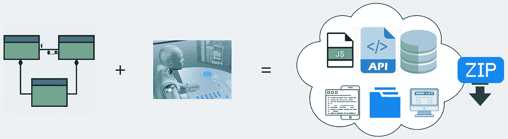

CodeBot 设计用于小型和大型敏捷项目。您从一个初始的“自由形式”领域模型开始…生成一个概念证明，更改一些细节，再次生成它，一遍又一遍，逐渐增加细节——规则和细节——直到您有一个完整的、良好指定的工作系统。

对于最初的几次迭代，模型会有大量的模糊性和“交叉线”；因此，CodeBot 采取“没有错误答案”的方法，将尽最大努力生成*一些*东西，而不管扔给它的是什么。但是很快你会想要确定细节…在这一点上，它确实有助于精确地意识到你的模型中的细节如何影响生成的内容。

因此，在本文中，我们将通过一些简单的技巧从这个多功能的“架构生成器”中获得最佳结果。

> CodeBot 新手？要获得快速设置指南，请查看这个 [CodeBot 101](https://www.youtube.com/watch?v=TgKsGmwH2K0) 视频。

# 1.对属性名使用自然语言

当 CodeBot 解析 UML 模型时，它将所有的名称规范化，并将它们转换成最适合它所生成的每个输出目标的“case”。我说的箱子是指骆驼箱、帕斯卡箱、蛇箱、烤肉串箱等等。

比如这个…

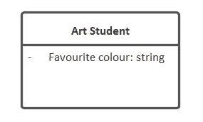

…根据输出目标，转换为以下所有内容:

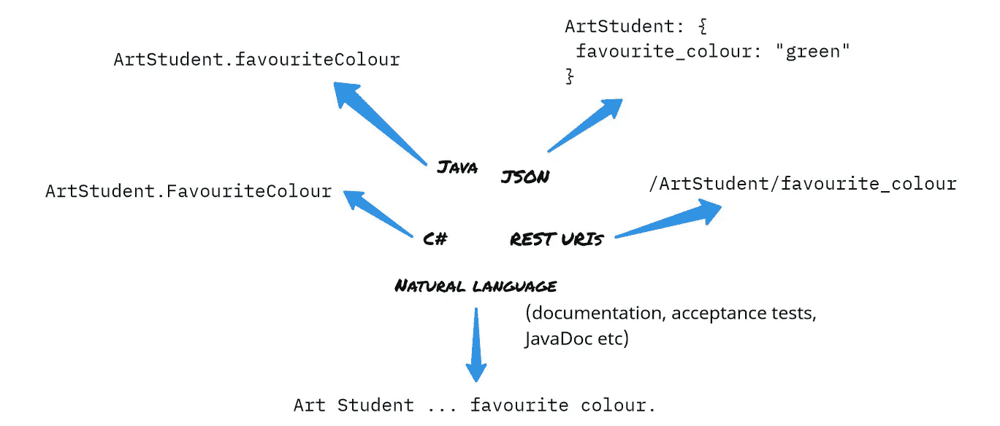

> CodeBot 还将尽力保持每个名称在每种输出语言中的有效性；因此，您可能偶尔会看到轻微的重命名，例如，为了避免像`*public*`这样的 Java 保留字，一个属性将在 Java 代码中生成为`*public_*`。在其他地方，它仍然被称为`*public*`，它可以很好地连接在一起工作。

您可以将模型中的元素命名为 *Art_Student* 和*favorite colour*，CodeBot 仍将正确应用每个命名方案……但是 *Art Student* 和*favorite colour*更易于阅读，并将使模型更像一个人类可读的业务规范。

总而言之:

> 在您的领域模型中使用自然语言命名

# 2.请注意，实体 id 是自动创建的

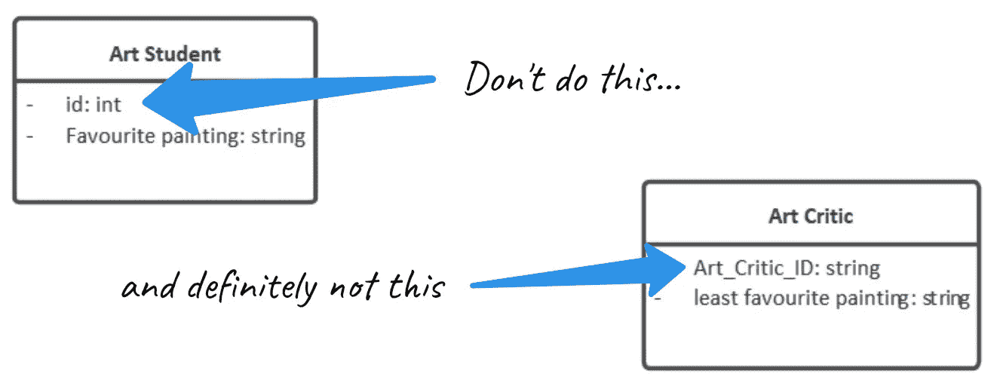

我们经常看到 ID 或“主键”属性被添加到一个类中。但是，仔细想想，IDs 确实是一个设计级的机制，并不真正属于一个业务级的文档；所以最好根本不要指定一个。

最重要的是，CodeBot 会自动生成`id`属性，所以一切都会处理好。

事实上，如果你创建了一个名为`Art_Critic_ID`的属性，CodeBot 仍然会生成自己的`id`属性，因为它不知道`Art_Critic_ID`应该是主键。

简而言之:

> 不要在域类中添加 ID 属性

额外的好处是，当域类通过关系箭头链接时，生成的代码指向外键的`id`属性，因为它可以依赖于它总是在那里。

# 3.仅使用箭头*指定类关系*

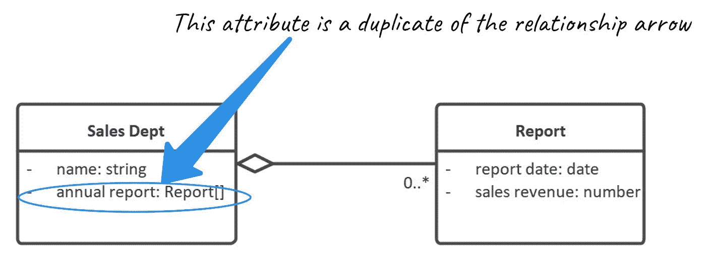

两次指定同一个东西会产生两个“东西”

与“如何可靠地识别 ID 属性”类似的一个问题是如何识别引用其他域类的属性。

简单的答案是:画一个关系箭头。很形象，很精准，可以直接解读为“那个班和这个有关系”:`Sales Dept has zero or many Reports`。

正如您在上面的图表中看到的，尝试将关系指定为属性是很常见的；但这是最好避免的。它可以用很多不同的方式来定义——比如 `annual report: Reports`、`list`、`array<Report>`等等——所以有很多模糊的地方。

因此，CodeBot 没有试图解释所有可能的命名，而是只查看关系箭头:

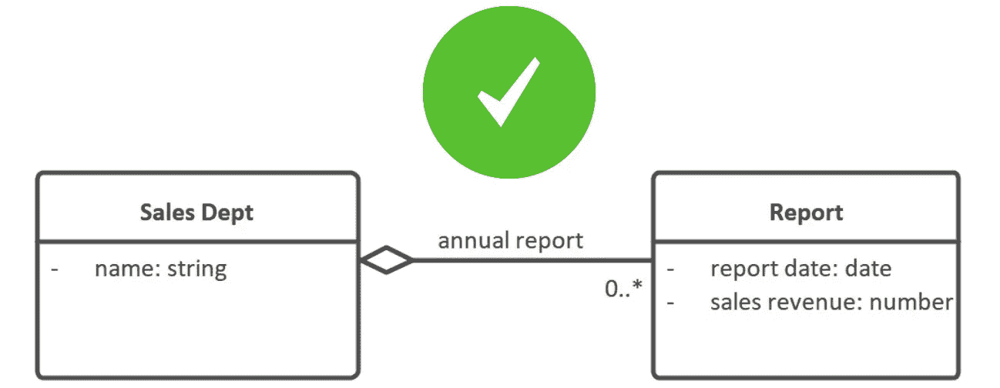

这是一个更可靠的方法，也更直观。

在上面的例子中，关系字段将被称为`annual report`，因为这是箭头上的标签。但是，如果没有标签，那么这个字段将以目标类的名字命名，在本例中为 `report`。

> 每个细节只需指定一次，并使用图表箭头显示关系

# 4.多样性很重要

如果您已经花时间在类图中定义了多样性，那么 CodeBot 使用这些信息只是出于礼貌！

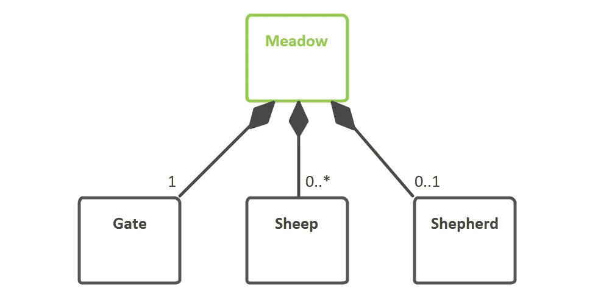

一片草地必须有一个门，可以有一群羊(对不起，是一群)，也可以有一个牧羊人。

多样性对生成的内容有直接影响。例如，在 Java 客户端代码中，您会看到以下内容:

```
public class Meadow {
    private final Gate gate;
    private final List<Sheep> sheep;
    private final Optional<Shepherd> shepherd;
}
```

> 如果不指定多重性，默认值为 0..*(零到多)。

也可以使用其他值范围，例如`1..4`。这在大多数情况下被解释为“一对多”，但是也可以用于数据验证。

如果您对细节感兴趣，下面将详细介绍哪些关系类型和多重值对代码和数据库模式有什么影响:

[](https://medium.com/parallel-agile-blog/lets-get-specific-about-what-parallel-agile-codebot-generates-6a36556dda5d) [## 让我们具体了解一下并行敏捷 CodeBot 会生成什么

### 您可能已经知道，CodeBot 生成数据库模式、数据库访问函数和 REST API 来访问…

medium.com](https://medium.com/parallel-agile-blog/lets-get-specific-about-what-parallel-agile-codebot-generates-6a36556dda5d) 

在模型的其他方面，CodeBot 会非常严格地接受您指定的内容。**关系箭头的方向关系重大**；以及这种关系是直接的(单向)还是双向的。如果是双向的，实际上会生成两个关系(A 类指向 B 类，B 类也指向 A 类)。

但不要因此而放慢你的脚步！事实上…

> 当你在做原型的时候，所有这些细节都不太重要…但是在适当的时候它们会开始变得重要

事实上，CodeBot 的优势在于它允许快速拼凑概念验证系统，而不必过早考虑更好的细节。在项目生命周期的早期阶段，多样性和关系方向并不重要。

然而，当你的项目变得“严肃”并且你正在确定细节时，CodeBot 的另一个优势就显现出来了——它允许你精确地确定那些细节。

> 当你准备好的时候，给模型添加多样性和其他细节

# 5.枚举是可爱的，确保你使用它们

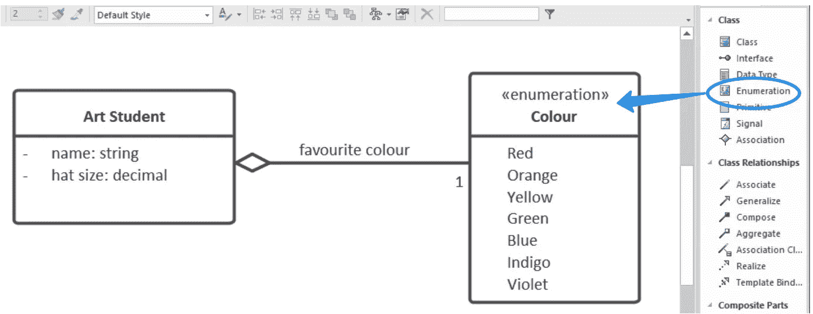

将枚举拖放到您的域模型中，然后将您的域类指向它

一个鲜为人知的 CodeBot 特性是可以定义枚举类型，简称“枚举”。当一个班级有了`<<Enumeration>>`刻板印象，勇敢的机器人会知道这个班级应该被区别对待。

在 Java 代码中，上述示例将被转换为一个枚举:

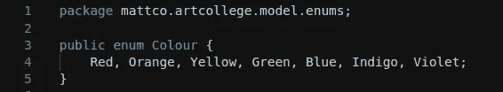

一个由[代码生成的 React.js](https://reactjs.org/) 页面会将枚举显示为一个选择器:

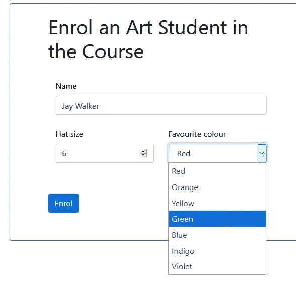

它还被添加到 JSON 模式中，并尽可能用于数据验证——因此，超出枚举范围的值会被 REST API 拒绝:

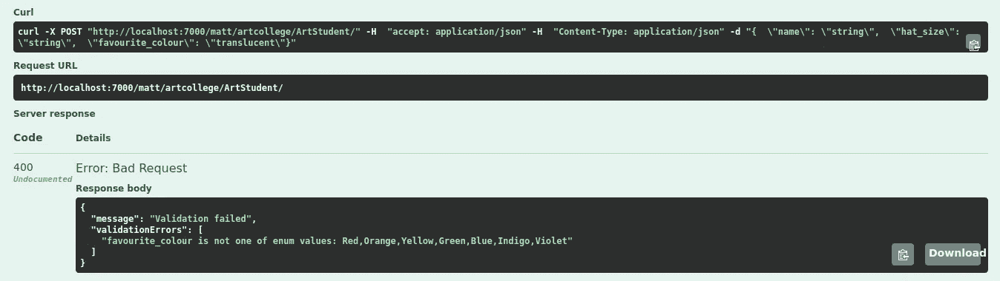

你明白了…枚举提供了特异性和结构，并得到了很好的利用。

不过，有一点需要注意的是……尽量不要用太多的枚举来搅乱你的类图。它们不是类级别的元素，所以它们可能会掩盖类本身。如果枚举可以放在别处(也许是一个子图)，那就更好了。

> 枚举类型提供了惊人的数量…一定要使用它们(节省)

# 额外提示:注意数据类型

向类添加属性时，很容易忘记指定数据类型。例如，使用 [Enterprise Architect](https://sparxsystems.com/) ，默认类型是整数……这可能是您想要的，但是您通常真的想要一个字符串，或者可能是一个布尔类型。

您在领域模型中定义的一切都可能以某种方式影响生成的系统。所以请记住，如果您将属性保留为默认数据类型，那么将会生成默认数据类型。

最好坚持基本或“原始”的数据类型…字符串、整数、布尔、浮点或数字。但是，一定要避免使用定制类型，比如`Account`。相反，创建一个名为`Account`的单独的域类，并用关联箭头链接到它(参见上面的提示 3)。

对于基本类型，可以使用[](例如`String[]`)指定数组。但是，对于域类，请记住使用关系箭头和多样性。

`Date`和`DateTime`也被认可。

> 对于属性，坚持使用基本类型，如字符串、布尔和数字。将更复杂的类型定义为域类

希望以上的使用技巧能帮助你用 CodeBot 取得很大的成绩！

如你所见， [Parallel Agile](http://www.parallelagile.com/) CodeBot 是一个强大的工具，它极大地简化了创建完整软件栈的工作。给定一个团队可能需要几个月才能交付的项目，只要有一点专业知识，您就可以在几分钟内创建相同的系统。

> 别忘了[报名免费试用](https://parallelagile.net/)，带着这个机器人转一圈。