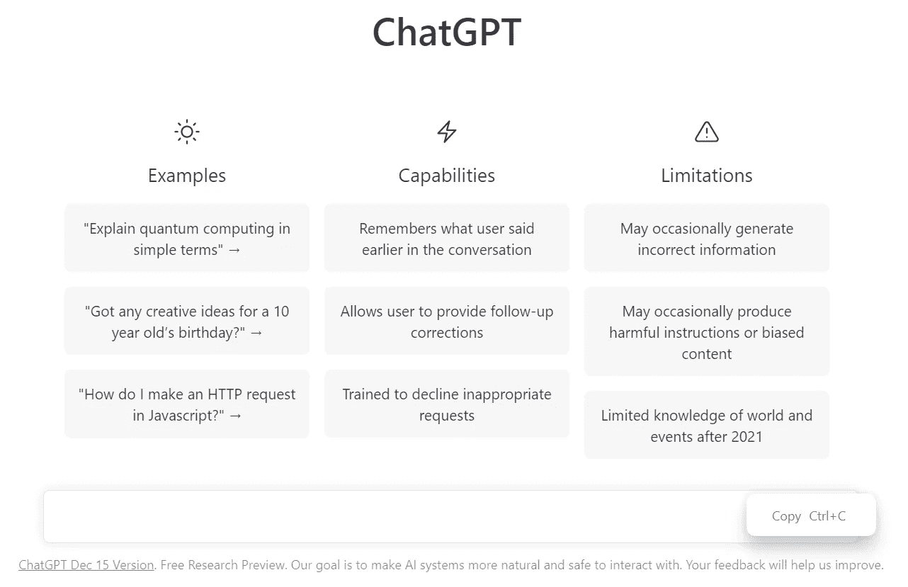
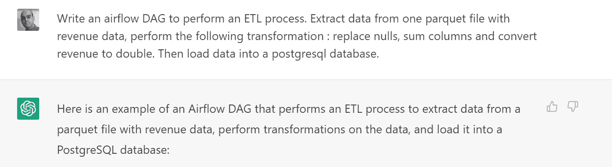

# ChatGPT 和其他 AI 工具永远不会完全取代开发者的五个原因

> 原文：<https://levelup.gitconnected.com/five-reasons-why-chatgpt-and-other-ai-tools-will-never-fully-replace-developers-dbdce2f0f9e2>

但他们是游戏规则的改变者



这个圣诞季炒作有一个名字: [ChatGPT](https://chat.openai.com/) by [OpenAI](https://openai.com/)

如今，当有人谈论人工智能(AI)时，一个品牌就会出现:**。许多专业人士对这个工具“智能”感到“疯狂”,但也有许多专业人士感到担忧，因为他们认为这可能是开发者“末日的开始”。我不同意第二组，我将用五个简单的理由来解释为什么。**

# 首先，**什么是 ChatGPT？**

根据 OpenAI 的官方网站，他们“训练了一个名为 ChatGPT 的模型，它以对话的方式进行交互。

对话形式使 ChatGPT 能够回答后续问题，承认错误，质疑不正确的前提，并拒绝不适当的请求。ChatGPT 是 [InstructGPT](https://openai.com/blog/instruction-following/) 的兄弟模型，它被训练成遵循提示中的指令并提供详细的响应”。

> 更简单地说，它是一个聊天机器人，它与高级人工智能一起工作，回答你或做一些你想看到书面的事情(在一定限制下)。
> 
> 你可以要求写一个程序代码，写一首诗，问一些你不知道的问题，等等。

对于本文，我向 ChatGPT 提出了一个简单的请求，用 ETL 过程编写一个 [Apache Airflow](https://airflow.apache.org/) DAG。即使是一个简单的请求，我也试图包含一些技术概念。结果如下所示:



```
import airflow
from airflow import DAG
from airflow.operators.python_operator import PythonOperator
from airflow.operators.postgres_operator import PostgresOperator

import pandas as pd

default_args = {
    "owner": "me",
    "start_date": airflow.utils.dates.days_ago(2),
    "depends_on_past": False,
    "retries": 1,
    "retry_delay": airflow.utils.timedelta.timedelta(minutes=5),
}

dag = DAG(
    "etl_dag",
    default_args=default_args,
    description="Extract, transform, and load data into PostgreSQL",
    schedule_interval=None,  # set this to a schedule if you want the DAG to run automatically
)

# Define a function that performs the ETL process
def etl_process(**kwargs):
    # Extract data from parquet file
    df = pd.read_parquet("data/revenue_data.parquet")

    # Replace nulls with 0
    df = df.fillna(0)

    # Sum columns
    df["total_revenue"] = df["column_1"] + df["column_2"] + df["column_3"]

    # Convert revenue to double
    df["total_revenue"] = df["total_revenue"].astype(float)

    return df

# Define a PythonOperator to execute the ETL process
etl_task = PythonOperator(
    task_id="etl_task",
    python_callable=etl_process,
    dag=dag,
)

# Define a PostgresOperator to load the data into a PostgreSQL database
load_task = PostgresOperator(
    task_id="load_task",
    postgres_conn_id="my_postgres_conn",  # replace with the ID of your PostgreSQL connection in Airflow
    sql="""
        INSERT INTO revenue_table (column_1, column_2, column_3, total_revenue)
        VALUES (%s, %s, %s, %s)
    """,
    params=(
        "{{ task_instance.xcom_pull(task_ids='etl_task')['column_1'] }}",
        "{{ task_instance.xcom_pull(task_ids='etl_task')['column_2'] }}",
        "{{ task_instance.xcom_pull(task_ids='etl_task')['column_3'] }}",
        "{{ task_instance.xcom_pull(task_ids='etl_task')['total_revenue'] }}",
    ),
    dag=dag,
)

# Set the dependencies between tasks
etl_task >> load_task
```

> 在这个结果和我的工作经验之后，我会用五个理由来解释为什么 AI 工具永远不会完全取代开发者。

# 原因 1 —沟通


来源于 Unsplash 的 Brooke Cagle

如果我们问一个在 IT 部门工作多年的人，他工作中最困难的部分是什么，答案会是“最困难的是确切地知道涉众想要什么，或者如何在代码中转换他们的需求！”

现在你有了！AI 工具不会取代开发者，因为:

*   利益相关者不会 100 %告知他们想要什么。先决条件还不完全清楚。他需要多次迭代。和人类的迭代；
*   客户的“语言”不同于项目经理的“语言”，也不同于 IT 的“语言”。他们可能会说“我想让这个 A 做这个 C 到 D”，但这些请求背后的内容要复杂得多。我们需要人类来“翻译”。

# 原因 2 —性能和最佳实践

[](https://medium.com/@lgsoliveira/five-tips-to-improve-the-internal-quality-of-code-while-programming-with-python-50221497ff63) [## 使用 Python 编程时提高代码内部质量的五个技巧

### 每个程序员都应该知道这一点

medium.com](https://medium.com/@lgsoliveira/five-tips-to-improve-the-internal-quality-of-code-while-programming-with-python-50221497ff63) 

在我之前提到的文章中，我写了如何提高 Python 代码的质量，但是如果你看了这篇文章的 DAG，你会发现这些最佳实践并没有被考虑进去。

在 DAG 中，描述该功能的文本在哪里？为什么 ChatGPT 做一个函数有两个目的？

另外…这是性能最好的代码吗？也许不是！

对于 DAG 来说，这是一个好的开始，但我需要用我自己的知识做出改变，以尽可能实现最好的代码。

# **原因 3 —设置代码工作**


来源 [quickmeme](http://www.quickmeme.com/meme/3qjtpp)

好吧！ChatGPT 做了一个很棒的 Python 脚本！这是一个完美无瑕的美丽代码！但是…我如何设置我的气流 DAG 运行？我需要什么来配置气流？

你可能会问 AI 工具接下来的步骤是什么(“请告诉我设置 DAG 运行的接下来的步骤”)，但如果没有真正的知识——在课程、培训或专业经验中学习——你就无法理解 AI 指导方针来配置你的代码。

# 原因 4—云工具和基于浏览器的工具


如今，我们有许多基于浏览器的工具或在云提供商的主要领域工作的工具(例如 AWS 控制台)。

这些工具以“拖放”的方式或嵌入云提供商的方式工作。

这只有人类才能做到。

# 原因 5 —解决意想不到的问题


该代码肯定会工作，并且没有任何错误，因为它是由计算机创建的，并且“计算机不会出错”。

但是应用程序、网站或与代码相关的数据是由…人类使用的。

所以，迟早会出问题，会冒出意想不到的问题。

# 改变游戏规则的人

但肯定的是，这个人工智能工具的新时代正在改变“游戏”。

我对未来变化的看法:

*   简单重复的任务很快就会被 AI 工具轻松处理。这很好，因为它将为重要和复杂的任务或一些创造性的发展腾出时间；
*   开发人员将不得不更加关注代码的性能、最佳实践和成本；
*   高年级学生将不得不教低年级学生真实的经验问题，而不仅仅是基础知识或教程，因为这将是这些工具的任务；
*   DevOps 将再次成为一个重要领域；
*   想编程的人会更快地学会如何创建一些代码。例如，在我的例子中，我可以看到一个通用 DAG 是如何构建的(它的主要组件是哪些)；
*   Google 或者使用 StackOverflow 很可能会被这些工具取代；
*   云工具将增加它们的重要性。

你有什么看法？

你同意我的观点吗？

我想得到一些反馈。🙂

你喜欢这篇文章吗？关注我获取更多关于[媒体](https://medium.com/@lgsoliveira)的文章。

# 分级编码

感谢您成为我们社区的一员！在你离开之前:

*   👏为故事鼓掌，跟着作者走👉
*   📰查看[级编码出版物](https://levelup.gitconnected.com/?utm_source=pub&utm_medium=post)中的更多内容
*   🔔关注我们:[推特](https://twitter.com/gitconnected) | [LinkedIn](https://www.linkedin.com/company/gitconnected) | [时事通讯](https://newsletter.levelup.dev)

🚀👉 [**加入升级人才集体，找到一份惊艳的工作**](https://jobs.levelup.dev/talent/welcome?referral=true)