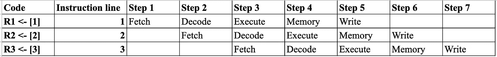

# RISC 流水线的五个阶段

> 原文：<https://levelup.gitconnected.com/five-stages-of-risc-pipeline-aad0c3eb1233>

## 获取、解码、执行、存储、写入


照片由 [Cookie 在](https://unsplash.com/@cookiethepom?utm_source=unsplash&utm_medium=referral&utm_content=creditCopyText) [Unsplash](https://unsplash.com/s/photos/computer?utm_source=unsplash&utm_medium=referral&utm_content=creditCopyText) 上的 Pom 拍摄

在计算机硬件的早期，精简指令集计算机中央处理器(RISC CPUs)被设计为每个周期执行一条指令，总共五个阶段。这些阶段是:获取、解码、执行、存储和写入。所执行的操作的简单性允许每个指令在一个处理器周期内完成。

# 取得

在提取阶段，从存储器中提取指令。

## 译

在解码阶段，我们解码指令并获取源操作数

## 执行

在执行阶段，计算机执行指令指定的操作

## 记忆

如果有任何需要访问的数据，都在内存阶段完成

## 写

如果我们需要将结果存储在目标位置，则在写回阶段完成，

# 代码类型

我们可以编写五种类型的代码。我们可以编写加载类型、存储类型、分支、跳转或 R 类型的代码。每种类型的代码执行 RISC 流水线的不同阶段。

## 负载类型

管道:获取、解码、执行、存储、写入

```
R1 <- [1]
```

上面的代码是一个加载类型。1 的地址正被加载到 R1。加载类型包括 RISC 流水线的所有五个阶段。加载代码需要获取、解码、执行、存储和写入才能完成。

## 商店类型

流水线:获取、解码、执行、内存

```
[A] <- R1
```

上面的代码是一个商店类型。R1 被存储在地址 a 中。存储类型代码只需要获取、解码、执行和内存来执行。我们不需要写。

## 分支类型

流水线:获取、解码、执行

```
BNE R1, R2, Loop
```

上面的代码是一个分支类型。上面的代码检查 R1 是否不等于 R2。如果它们不相等，代码将进入循环。如果它们相等，就不会进入循环。

分支类型代码需要获取、解码和执行才能运行。

## 跳跃

管道:提取、解码

```
JMP Loop
```

上述代码是一个 JMP 代码。跳转不同于分支类型的代码，因为跳转不检查任何条件，而是直接跳转到代码中指定的位置。

跳转类型需要获取和解码才能运行。

## ALU-R 型

流水线:获取、解码、执行、写入

```
R1 <- R2 + R3
```

上面的代码是一个 ALU 或 R 类型。操作数 R2 和 R3 被相加并存储在 R1。这使用了流水线的 4 个阶段，提取、解码、执行和只写。

# 代码示例

假设我们有以下 3 行代码:

```
R1 <- [1]
R2 <- [2]
R3 <- [3]
```

在上面的代码中，我们执行三种负载类型。在第一行，我们将地址 1 存储到 R1，在第二行，我们将地址 2 存储到 R2，最后在第三行，我们将地址 3 存储到 R3。

RISC 流水线看起来像这样:



RISC 管道示例

我们知道加载类型执行 RISC 流水线的所有 5 个阶段，也就是，获取、解码、执行、存储和写入。

上图显示了所有加载类型的示例三行代码将如何执行。在第 1 步中，第一行将执行第一步，即提取。然后在步骤 2 中，当第 1 行处于解码阶段时，第 2 行将开始提取，依此类推。这 3 行代码需要经过 7 个步骤才能完成这 3 行代码的所有 RISC 管道。