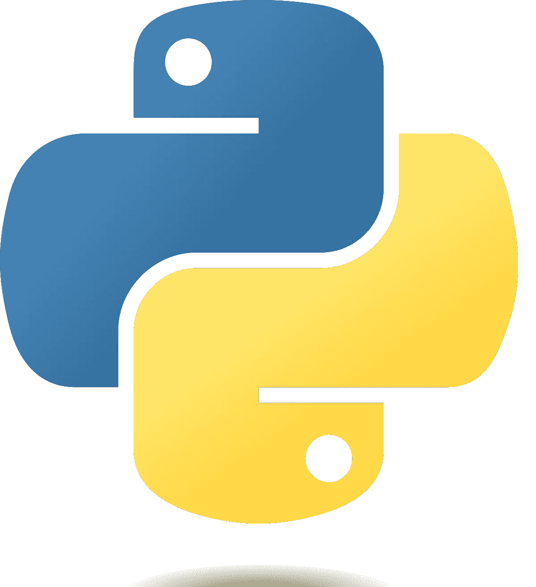
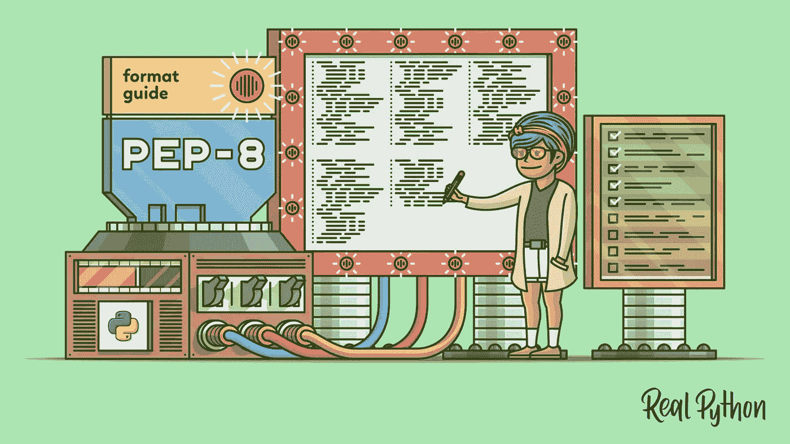
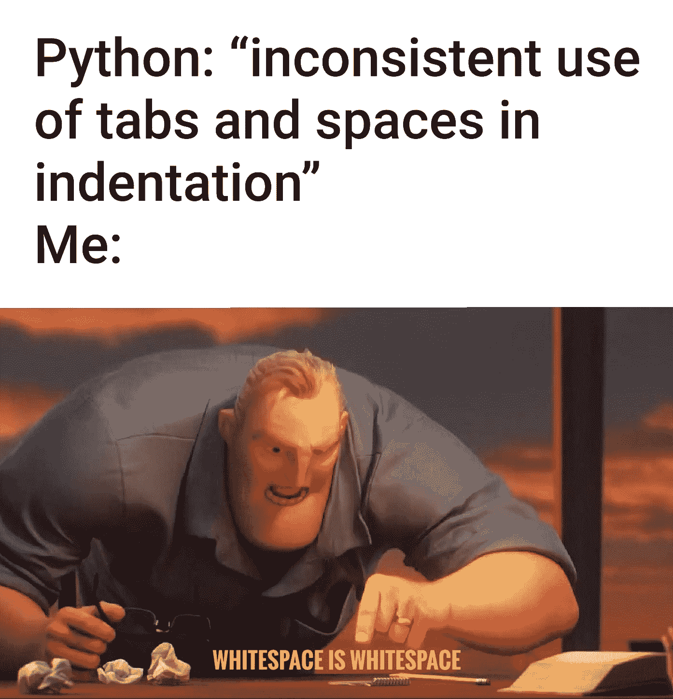
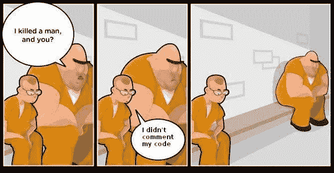
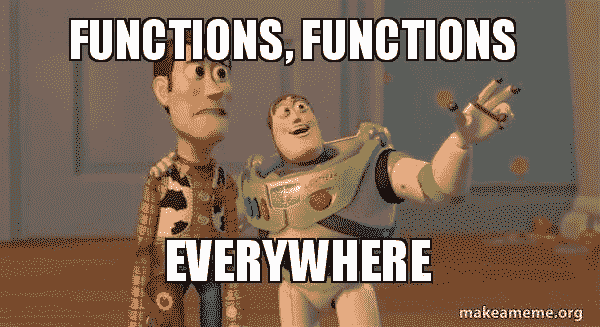

# 使用 Python 编程时提高代码内部质量的五个技巧

> 原文：<https://levelup.gitconnected.com/five-tips-to-improve-the-internal-quality-of-code-while-programming-with-python-50221497ff63>

每个程序员都应该知道这一点

编程语言 Python 的官方标志

作为一名程序员，努力获得高效、可维护、易读的高质量代码非常重要。实现这一点的一个方法是关注代码的内部质量，即代码的组织、结构和可读性。在本文中，我们将讨论五个技巧，它们可以帮助您在使用 Python 编程时提高代码的内部质量。通过遵循这些最佳实践，您可以编写更高效、更易读、更易维护的代码，并且在将来更容易使用和修改。

无论您是初学者还是有经验的 Python 程序员，这些技巧都将帮助您编写更好的代码，并提高您作为程序员的技能。

# 1.编程中代码的内部质量

有时它会被忽略，但编程的内部质量代码非常重要(图片来自 Pixabay 中的 [geralt](https://pixabay.com/users/geralt-9301/) )

代码的内部质量指的是与代码的可维护性和进化相关的代码属性。这包括代码可读性、模块化和可重用性。一般来说，具有良好内部质量的代码易于理解和修改，并且其结构使得在不破坏现有功能的情况下添加新功能或进行更改变得容易。这很重要，因为它允许开发人员快速有效地对代码库进行更改，这对保持软件行业的竞争优势至关重要。

内在质量和外在质量是编程中代码质量的两个不同方面。虽然两者对于编写高质量、高效和可维护的代码都很重要，但它们关注的是代码的不同方面。

外部质量是指您的代码功能和执行其预期任务的好坏。这包括代码的效率、可靠性和稳定性，以及优雅地处理错误和异常的能力。外部质量很重要，因为它决定了你的代码在现实世界中的表现。

# 2.提高代码质量的五个技巧

# 2.1.使用 PEP 8

你想知道如何跟随这个真正的 Python 的[网址写出漂亮的 Python 代码吗](https://realpython.com/python-pep8/)

PEP 8 是一套 Python 代码的编码标准。它提供了关于如何格式化和组织代码的指南，包括缩进、行长度和命名约定。

通过遵循 PEP 8，您可以使您的代码对您和其他开发人员来说更具可读性，更容易理解。

# 2.2.使用描述性的和一致的变量名

关于变量名的模因

高质量代码的关键组成部分之一是使用描述性的和一致的变量名。这不仅使你的代码可读性更好，而且更容易理解你的变量代表什么。选择变量名时，请确保使用准确反映变量用途的描述性名称。此外，在整个代码中使用一致的变量名可以帮助您避免错误，例如在代码的特定部分使用错误的变量名。

例如，如果有一个代表用户名字的变量，可以将其命名为 first_name。

# 2.3.有效地使用空白

关于 Python 中空格的重要性

正确使用空格可以大大提高代码的可读性。在 Python 中，空白用于构建代码，您应该始终如一地使用它来改进代码的组织。

例如，您应该在逗号后始终使用一个空格，并且应该缩进代码来表示程序的结构。

# 2.4.使用注释记录您的代码

描述评论重要性的模因

注释是高质量代码的重要组成部分，它们应该用来解释代码的目的，并提供有关代码如何工作的附加信息。

在 Python 中，可以使用#符号向代码中添加注释，并且应该大量使用注释来提高代码的可读性。

# 2.5.保证功能的模块化

关于功能的模因

Python 函数中保证模块性的方法是使用“单一责任原则”，即一个函数应该只有一个明确定义的目的。这意味着该功能应该做一件事，并把它做好，没有任何不必要或不相关的任务。

当一个功能是模块化的，它更容易理解和修改，因为它被分成更小的、独立的单元。这也有助于减少代码重复和提高代码重用。此外，模块化功能更容易测试和调试，因为每个模块都可以独立测试。

# 摘要

总之，遵循这五个技巧可以帮助您提高 Python 代码的内部质量。通过使用 PEP-8 风格、使用描述性的和一致的变量名、有效地使用空白、添加注释和模块化函数，您可以创建易于阅读、理解和维护的高质量 Python 代码。

你喜欢这篇文章吗？关注我更多关于[介质](https://medium.com/@lgsoliveira)的文章。

# 分级编码

感谢您成为我们社区的一员！在你离开之前:

*   👏为故事鼓掌，跟着作者走👉
*   📰更多内容请查看[升级编码刊物](https://levelup.gitconnected.com/?utm_source=pub&utm_medium=post)
*   🔔关注我们:[Twitter](https://twitter.com/gitconnected)|[LinkedIn](https://www.linkedin.com/company/gitconnected)|[时事通讯](https://newsletter.levelup.dev)

🚀👉 [**加入升级达人集体，找到一份惊艳的工作**](https://jobs.levelup.dev/talent/welcome?referral=true)