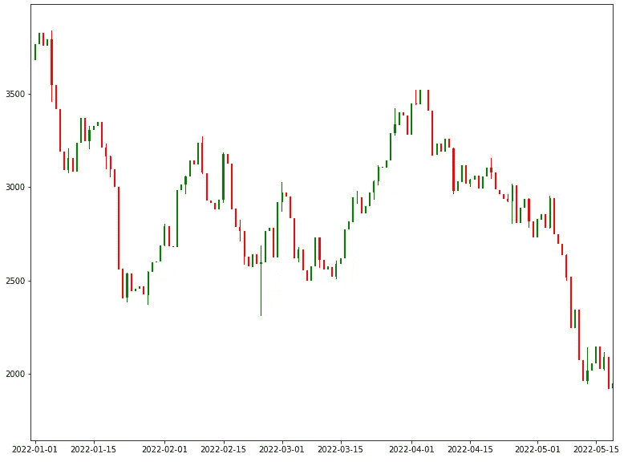
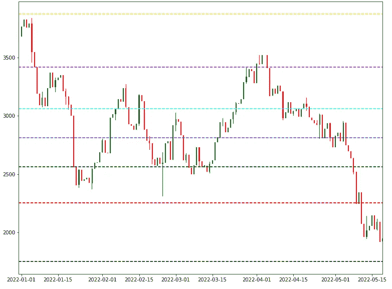
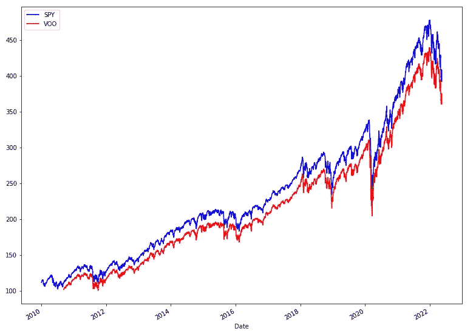
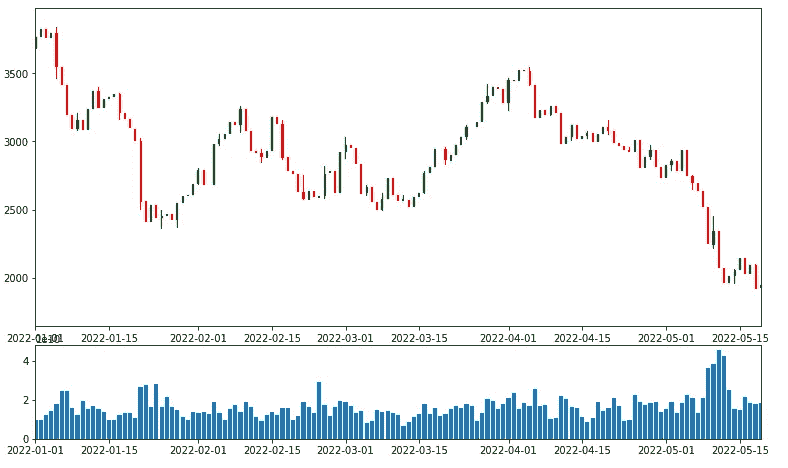
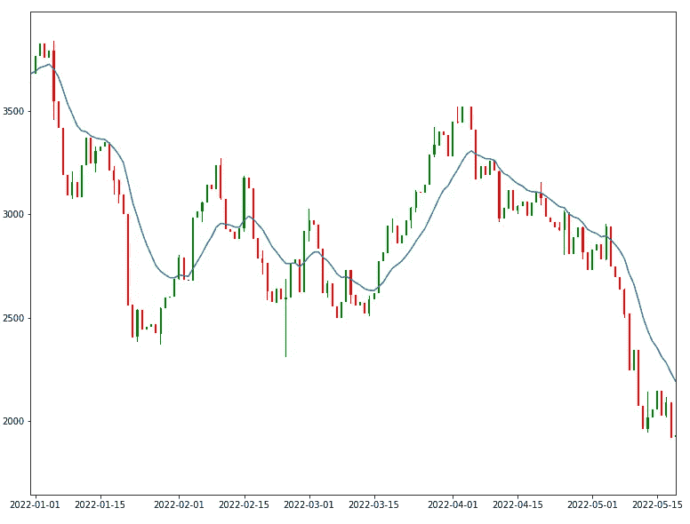

# 金融时间序列图的五个有用的熊猫脚本

> 原文：<https://levelup.gitconnected.com/five-useful-pandas-scripts-for-financial-time-series-plots-99693c4025b2>

## 分享就是关爱，为什么不继续呢？

在我最近的一篇文章中，我公开了一组对金融系列有用的脚本。准备好这些数字只是工作的一半，所以我很高兴今天通过分享另一部分来继续为社区做贡献。这段时间致力于视觉化信息。


由[迪伦·卡勒伊](https://unsplash.com/@dylancalluy?utm_source=unsplash&utm_medium=referral&utm_content=creditCopyText)在 [Unsplash](http://localhost:3000/s/photos/finance?utm_source=unsplash&utm_medium=referral&utm_content=creditCopyText) 上拍摄的照片

# 烛台

**如何使用:**

```
plot_candlestick(df)plt.xlim([datetime.date(2022, 1, 1), datetime.date.today()])
```



烛台图

蜡烛图显示给定时期的开盘价和收盘价以及最高价和最低价。您可以使用这些信息来识别模式并预测未来的价格变动。例如，看涨的蜡烛图表明买家处于控制之中，价格可能会上涨。另一方面，看跌的烛台表明卖家处于主导地位，价格可能会下跌。虽然蜡烛图不能明确告诉你价格走向，但它们可以成为一个有用的分析工具。

# 斐波那契回撤

**如何使用:**

```
plot_candlestick(df)
plot_fibonacci_retracement(df)
```



斐波那契回撤图

斐波纳契回撤图是技术分析工具，用于识别给定证券的潜在支撑位和阻力位。斐波纳契回撤是基于斐波纳契数列的，斐波纳契数列是一系列数字，其中每个后续数字都是前两个数字的总和。最常见的斐波那契回撤水平有 23.6%、38.2%、50%、61.8%和 78.6%。这些水平来自斐波那契数列，表明证券价格可能找到支撑或阻力的区域。技术分析师通常会结合其他技术指标使用斐波纳契回撤图来确认潜在的支撑位和阻力位。

# 基准

**如何使用:**

```
spy = yf.download(f’SPY’, start=’2010–01–01')
voo = yf.download(f’VOO’, start=’2010–01–01')spy.rename(columns = {‘Close’: ‘SPY’}, inplace = True)
voo.rename(columns = {‘Close’: ‘VOO’}, inplace = True)plot_against_benchmark(spy[‘SPY’], voo[‘VOO’])
```



用一个 Y 轴绘制两条彼此相对的直线

虽然这种类型的图非常简单，但由于它的实际用例，我几乎在每个分析中都使用它——将它与一些基本预期进行比较是一个很好的起点。一个很好的例子是策划任何股票与 S&P500 或纳斯达克的对比。

***注意:*** *尝试使用上面的代码和 two_axis = True 参数*

# 卷



体积图

**如何使用:**

```
import datetimeprice_plot = plt.subplot2grid((5,4), (0, 0), rowspan=3, colspan=4)
plot_candlestick(df, ax = price_plot)volume_plt = plt.subplot2grid((5,4), (3,0), rowspan=1, colspan=4, sharex = price_plot)
plot_volume(df, aggregation = ‘daily’, ax = volume_plt)plt.gcf().set_size_inches(13, 10)plt.figure()
```

查看体积图时，需要考虑几个因素。首先，成交量图可以帮助你识别交易活动的急剧增加或减少。这有助于发现潜在趋势。第二，成交量图也能让你对某个特定商品产生兴趣的想法。同样重要的是要记住，交易量只是投资决策时要考虑的一个因素。除了看成交量图，你还会想看看其他因素，如价格走势和新闻情绪。

# 指数移动平均线



指数移动平均图

**如何使用**

```
candle = plot_candlestick(df)
plot_ewm(df, ‘Close’, 14, ax = candle.gca())
```

指数移动平均图可以检查数据趋势，识别异常值，并预测未来值。创建指数移动平均图时，使用适当数量的数据点很重要，这样图才能代表基础数据集。

# 对读者的要求

最近我发表了几篇关于时间序列的成功文章[和](https://medium.com/gitconnected/12-useful-pandas-scripts-for-financial-time-series-2bcaff3646f9)[如何绘制时间序列](https://medium.com/better-programming/create-plots-like-scott-galloway-911d45b689ca)，因此有一个问题:

> 您是否希望获得一项带有分析和呈现时间序列工具的服务？

*这篇文章的全部代码以及更多内容被推送到 GitHub 仓库:*

[](https://github.com/destilabs/timetwist) [## GitHub - destilabs/timetwist:技术分析工具包

### 此时您不能执行该操作。您已使用另一个标签页或窗口登录。您已在另一个选项卡中注销，或者…

github.com](https://github.com/destilabs/timetwist) 

**类似帖子:**

[](/12-useful-pandas-scripts-for-financial-time-series-2bcaff3646f9) [## 金融时间序列的 12 个有用的熊猫脚本

### 使用 Pandas 库发现强大的脚本来帮助您分析和处理金融时间序列数据。

levelup.gitconnected.com](/12-useful-pandas-scripts-for-financial-time-series-2bcaff3646f9) [](https://betterprogramming.pub/create-plots-like-scott-galloway-911d45b689ca) [## 用 MatplotLib、Seaborn 和一些熊猫建造美丽的情节

### 创造像斯科特·盖洛威那样的情节

better 编程. pub](https://betterprogramming.pub/create-plots-like-scott-galloway-911d45b689ca)