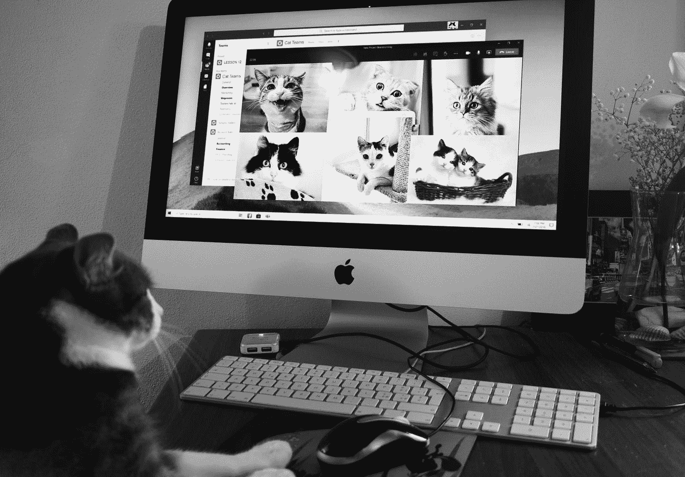
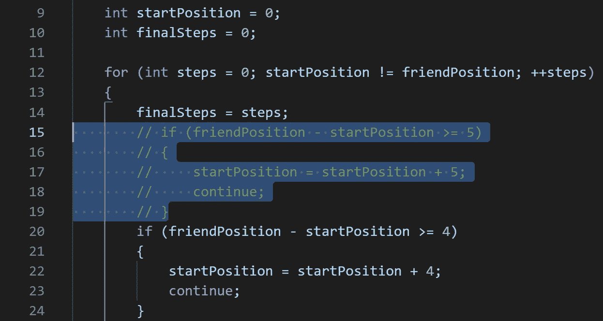
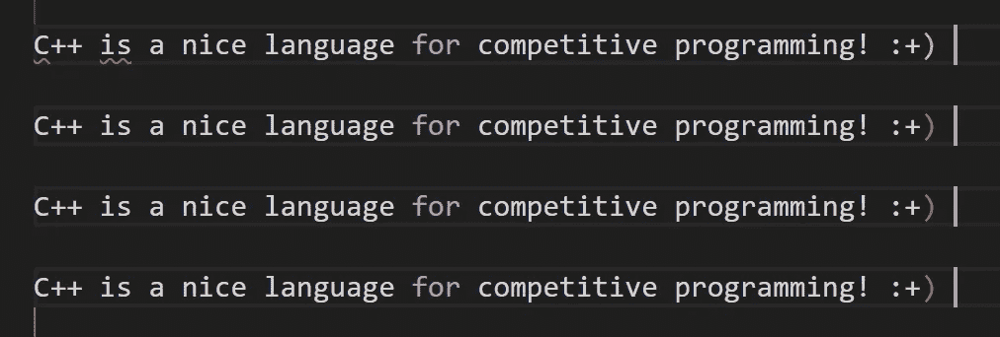

# 五个 Visual Studio 代码快捷方式

> 原文：<https://levelup.gitconnected.com/five-visual-studio-code-shortcuts-8f225758c6e5>

了解这些快捷方式，以便用 Visual Studio 代码更快地编程

克里斯·巴巴利斯在 [Unsplash](https://unsplash.com?utm_source=medium&utm_medium=referral) 上的照片

> 我不怕一次练了 10，000 次踢腿的人，但我害怕一个拿了计算机科学学位却不会做 Ctlr+C 和 Ctrl+V 的人。
> 
> 《李小龙和洛伦佐·帕西尼》

## 评论&取消评论比光速还快

当您突出显示代码块时，您可以按 Ctrl + K，同时按住 Ctrl 并按 C (C 代表注释)来注释代码块。

注释了代码块

如果你想取消对代码块的注释，你也可以这样做…突出显示代码块，然后按 Ctrl + K，同时按住 Ctrl 按 U (U 代表取消注释)，代码块将被取消注释。

请记住，这种快捷方式在 Visual Studio 代码中使用时非常聪明，因为它可以自动检测正在使用的编程语言的正确语法。

## 使用 Ctrl+Alt 可以更快地移动和高亮显示

照片由[内森·杜姆劳](https://unsplash.com/es/@nate_dumlao?utm_source=medium&utm_medium=referral)在 [Unsplash](https://unsplash.com?utm_source=medium&utm_medium=referral) 上拍摄

在行中移动时，如果按住 Ctrl 键，光标将跳过整个单词，而无需重复按箭头键。

如果你使用箭头键移动，按住 Shift 键，你将开始高亮显示，这对快速编辑非常有用。

结合以上两种快捷方式，你将开始少用鼠标，多用键盘。

## 带 Alt 的多光标模式

您可以按住 Alt 键，同时用鼠标四处点击，享受您的光标大军！

一群光标

## 来来回回

您可以按 Alt +左箭头键(后退)或 Alt +右箭头键(前进)组合键。使用这些快捷方式，您可以移动到上一个有用的编辑位置。也许你已经修改了一个方法，现在你正在研究另一个方法，如果你想更快地返回，你可以发送一些 Alt +左箭头键，你会神奇地返回到前一个方法。

> *免责声明:如果你有一个带侧按钮的鼠标，你可以使用它们，Visual Studio 代码会自动将这些快捷键映射到侧按钮中。*

罗伯特·托雷斯在 [Unsplash](https://unsplash.com?utm_source=medium&utm_medium=referral) 上拍摄的照片

## Visual Studio 代码中的切换选项卡

照片由[拉斯沃德](https://unsplash.com/@rssemfam?utm_source=medium&utm_medium=referral)在 [Unsplash](https://unsplash.com?utm_source=medium&utm_medium=referral) 上拍摄

您可以使用 Ctrl + Tab 在 Visual Studio 代码中打开的选项卡之间移动。

不要再用鼠标在不同的标签上点击，用 Ctrl + Tab 可以更快地返回到前一个标签，或者在所有打开的标签之间进行检查。

## 结论

我希望这 5 个快捷键能提高你的 Visual Studio“代码效率”，重点不是学习一个特定的快捷键，而是习惯于在不同的上下文中使用它们，以便更快地改进你的工作流程。

恭喜您，现在您可以以极快的速度编写和编辑代码了！
🎉🎉🎉
老规矩，感谢阅读！

由 [Max LaRochelle](https://unsplash.com/@maxlarochelle?utm_source=medium&utm_medium=referral) 在 [Unsplash](https://unsplash.com?utm_source=medium&utm_medium=referral) 上拍摄

# 分级编码

感谢您成为我们社区的一员！在你离开之前:

*   👏为故事鼓掌，跟着作者走👉
*   📰查看[升级编码出版物](https://levelup.gitconnected.com/?utm_source=pub&utm_medium=post)中的更多内容
*   🔔关注我们:[Twitter](https://twitter.com/gitconnected)|[LinkedIn](https://www.linkedin.com/company/gitconnected)|[时事通讯](https://newsletter.levelup.dev)

🚀👉 [**加入人才集体，找到一份令人惊喜的工作**](https://jobs.levelup.dev/talent/welcome?referral=true)