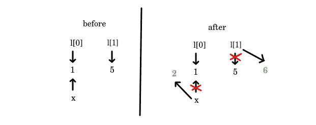
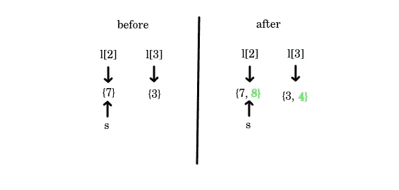
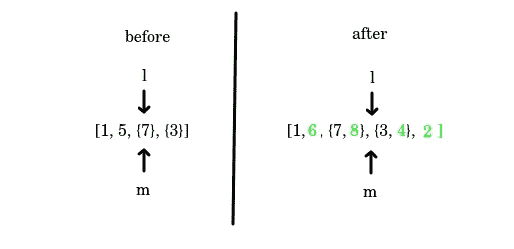
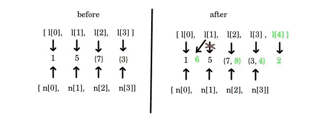
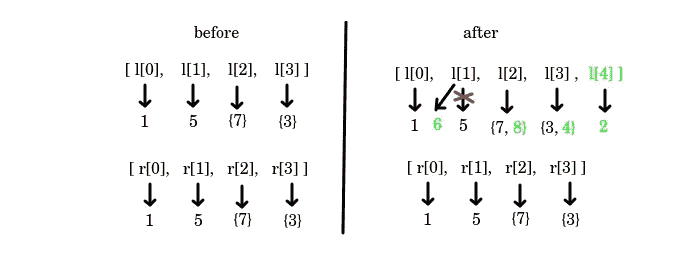

# 用 Python 复制列表的五种方法

> 原文：<https://levelup.gitconnected.com/five-ways-to-copy-a-list-in-python-f6f179d9785b>

## 你能看出区别吗？


图片来自 [Pixabay](https://pixabay.com/pl/?utm_source=link-attribution&utm_medium=referral&utm_campaign=image&utm_content=2763553) 的 [Susanne Jutzeler，suju-foto](https://pixabay.com/pl/users/suju-165106/?utm_source=link-attribution&utm_medium=referral&utm_campaign=image&utm_content=2763553)

你可能会想，“复制一个列表这样的基本事情肯定不会太复杂”。也许我可以用几个微妙的细节让你吃惊。

# 你怎么能复制一个列表呢？

谈到复制列表的不同方法，Python 提供了相当多的方法:

Python 中复制列表的五种不同方法

这些方法有什么不同？让我们用下面的例子来探究一下:

你能绝对自信的说打印`l`、`m`、`n`、`o`、`p`、`r`的结果会是什么？

如果是的话，干得好，你已经掌握了用 Python 复制列表的艺术。如果没有，没什么可担心的:你将在接下来的几分钟内掌握这门艺术。

# 原始列表

最开始的时候，原来的列表是这样的:`[1, 5, {7}, {3}]`。让我们看看发生了什么变化:

```
>> l
[1, 6, {7, 8}, {3, 4}, 2]
```

## Int 元素

通过`x += 1`操作修改第一个元素的尝试失败，而通过`l[1] += 1`修改第二个元素按预期工作。为什么？

首先，让我们注意到这两个值都是 int—**不可变的**变量。这意味着试图改变它们不会修改原来的对象，而只是创建新的对象。(如果你想了解更多关于可变和不可变变量的知识，请查看我之前的[文章](/can-you-solve-these-3-seemingly-easy-python-problems-2c793967cd2c)。)

借助下图，可以很容易地解释所发生的情况:



当定义列表的第一个元素为`x`时，我们让`l[0]`指向内存中与`x`引用的对象相同的对象(左图)。`x += 1`操作不会改变那个对象，它告诉变量`x`指向一个新的对象。同时`l[0]`保持不变(右图)。

至于`l[1]`，原本指向一个 int 对象，值为`5`(左图)。`l[1] += 1`操作使其指向一个新的 int 变量，值为`6`(右图)。

## 设置元素

与 int 元素不同，set 元素都被修改了。集合和整型之间的区别在于集合是可变的:它们可以在适当的位置被改变。向集合中添加一个新元素不会在内存中创建一个新的对象，它只是修改了原来的对象。

让我们来分析下图:



当定义`l[2] = s`时，我们让它指向内存中与`s`指向的对象相同的对象(左图)。`s.add(8)`操作修改了该对象，因此在我们的列表`l`(右图)中可以看到变化。改变`l[3]`也有类似的效果。

# 方法 1

如果您遵循前面的部分，打印由
`m = l`定义的列表的结果应该不会令人惊讶:

```
>> m
[1, 6, {7, 8}, {3, 4}, 2]
```

你可以看到两个列表是相同的。此外，检查
`id(l) == id(m)`将导致`True`，这意味着变量`l`和`m`都指向内存中的同一个对象。这正是我们之前在`l[2]`和`s`中观察到的:改变一个可变对象(例如集合或列表)将通过指向它的所有变量可见。



在这种情况下**我们并没有真正复制列表**，我们只是创建了一个不同的变量指向它。

# 方法 2–4

你可以看到接下来的三种方法`n = l[:]`、`o = list(l)`和
`p = copy.copy(l)`导致了相同的结果:

```
>> n
[1, 5, {7, 8}, {3, 4}]>> o
[1, 5, {7, 8}, {3, 4}]>> p
[1, 5, {7, 8}, {3, 4}]
```

所有的列表`n`、`o`和`p`都是列表`l`的所谓**浅拷贝**:它们是新对象，但是填充了在原始列表`l`中找到的子对象的引用。因此，通过`l.append(2)`改变列表本身不会改变副本，但是修改已经存在于`l`中的**可变**元素会改变副本。这里有一张图，可以帮助你更好地理解它:



# 方法 5

最后一个方法`r = copy.deepcopy(l)`产生一个副本，该副本与所有更改之前的原始列表`l`相同:

```
>> r
[1, 5, {7}, {3}]
```

在这种情况下，复制过程遍历整个对象树，并为每个遇到的对象创建一个完全独立的**副本。无论你对原始列表`l`中的对象做什么，都不会影响它的深层副本`r`。**



# 结论

*   赋值`m = l`并没有创建一个副本，它只是给了我们的列表另一个名字。`l`的所有修改将在`m`中可见，并且它们指的是同一个对象。
*   下面这些复制列表的方法是等价的:`n = l[:]`、`o = list(l)`和`p = copy.copy(l)`。改变原始列表`l`的**可变**元素也会影响这些浅层副本。(你可以在这里找到更多关于可变和不可变变量的信息
*   唯一真正独立的副本是`r = copy.deepcopy(l)`。改变原始列表`l`中的元素(可变的或不可变的)不会影响这个副本。