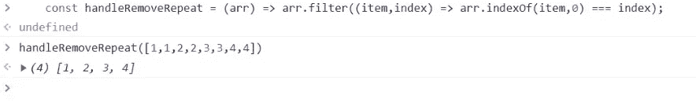

# 消除阵列重复的五种方法

> 原文：<https://levelup.gitconnected.com/five-ways-to-de-duplicate-arrays-944dbff681dd>

## 消除阵列重复的五种方法


您可能想知道，在互联网上有这么多重复数据消除方法的情况下，本文的意义何在。
别急，本文只是简单、好玩、古老、实用的重复数据删除方法的节选，除了重复数据删除的实现，我还会和大家分享其他细节和扩展。
你可能不明白为什么只有五个。
当然，我还能举出更多的例子，但这有什么意义呢？工作中不需要那么多，认识一两个就行。即使是面试，能说出五个就足够了。所以，我们完全没有必要去记忆更多去强调的方法。

## 方法 1:设置

这种方法是我在日常开发中最喜欢使用的方法，因为，他的用法是所有重复数据删除中最简单的。我是一个懒惰的人。
新`Set` 是 ES6 中引入的新类型。他和数组的区别在于，集合类型中的数据不能有重复值。当然，数组集合的一些方法是不能被调用的。
用法:把数组转换成集合数据，然后再转换回来，完成去重，其实很简单。

```
 const arr = [1,1,2,2,3,3,4,4,5,5];
    const setData = Array.from(new Set(arr));
    console.log(setData);
```


但是`Set`反引用有一个缺点，它不能反引用引用类型的数据。例如，对象数组。

```
 const objArr = [{ age: 12 }, { age: 15 }, { age: 12 }];
    const setObjData = Array.from(new Set(objArr));
    console.log(setObjData);
```


所以如果你的数组充满了值类型数据(比如全字符串或者全数字)，那么使用 Set 进行去重一定是首选，会为你减少很多麻烦。

## 方法 2:最古老的方法，双重循环重复数据消除

在早期，在 Set、map 和 filter 出现之前，double for 循环几乎是唯一的重复数据删除方法。

```
 //Double-loop de-duplication
    const handleRemoveRepeat = (arr) => {
        for (let i = 0, len = arr.length; i < len; i++) {
            for (let j = i + 1; j < len; j++) {
                if (arr[i] === arr[j]) {
                    arr.splice(j, 1);
                    j--;
                    len--;
                }
            }
        }
        return arr;
    };

    const arr = [1, 1, 2, 2, 3, 3, 4, 4, 5, 5];
    console.log(handleRemoveRepeat(arr));
```


这里有个有趣的点，也许你不太明白为什么我在我的 for 循环的初始表达式里声明了两件事:`let i = 0`；`len = arr.length`；


三个圈起来的表达式是 for 循环的三个表达式，分别是:初始表达式、判断表达式、自递增表达式。初始表达式在 for 循环开始时执行一次，不会再次执行，但判断表达式和自递增表达式会在每次循环时执行。

## 方法 3:重复数据消除的索引

indexOf 方法确实比上面的 double for 循环简单。但这并不像重复数据删除的 Set 方法那么简单。

```
 const handleRemoveRepeat = (arr) => {
        let repeatArr = [];
        for (let i = 0, len = arr.length; i < len; i++)
            if (repeatArr.indexOf(arr[i]) === -1) repeatArr.push(arr[i])
        return repeatArr;
    }
    const arr = [1, 1, 2, 2, 3, 3, 4, 4, 5, 5];
    console.log(handleRemoveRepeat(arr));
```


同样，这种方法有一个细节问题，您可能已经注意到上面的 if 和 for 没有括号；有；默认情况下，for 和 if 都对下面的语句负责。不需要的时候就不需要多加一个{}。你可能认为这是不可读的，但这正是有趣的地方。这是一个工具方法，一个注定隐藏在 utils 中的方法，与业务逻辑无关，也不需要可读性。

## 方法 4:包括重复数据消除

使用 includes 的去加重方法与 indexOf 并不十分相似，但基本上完全相同。唯一改变的是判断方法。

确定包含的方法要简单得多。遍历数组，检查当前数组是否包含带有新数组的数组项，如果不包含，则追加元素。

```
 const handleRemoveRepeat = (arr) => {
        let repeatArr = [];
        for (let i = 0, len = arr.length; i < len; i++)
            if (!repeatArr.includes(arr[i])) repeatArr.push(arr[i])
        return repeatArr;
    }
    const arr = [1, 1, 2, 2, 3, 3, 4, 4, 5, 5];
    console.log(handleRemoveRepeat(arr));
```


## 5.过滤器重复数据删除

最有趣的重复数据消除方法，使用过滤式重复数据消除。

使用带 indexOf 的过滤器进行重复数据消除的过程非常简单有趣。

```
 const handleRemoveRepeat = (arr) => arr.filter((item, index) => arr.indexOf(item, 0) === index);
```

对，没了，就一行。

