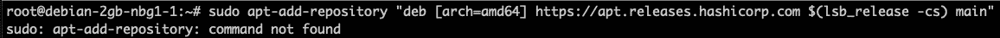
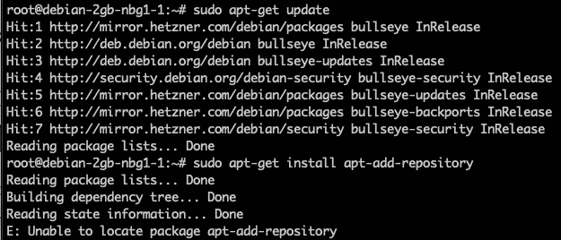

# 修复 Ubuntu 和 Debian 上的“add-apt-repository 命令未找到”错误

> 原文：<https://levelup.gitconnected.com/fixing-add-apt-repository-command-not-found-error-on-ubuntu-and-debian-996ef776bbb7>

在这个简短的指南中，我将为你提供一个快速修复 Debian 和 Ubuntu 系统上的`add-apt-repository command not found`错误的方法。


Debian 徽标—[https://www.debian.org/](https://www.debian.org/)

## 这个错误是什么时候发生的？

正如您从错误消息中所猜测的，当您试图在您的 Debian 或 Ubuntu 系统上使用`apt-add-repository`命令并且还没有安装这个包时，就会发生这个错误。

可惜，至少在 Debian 上，没有预装。

因此，如果您尝试像下面的命令那样添加一个存储库，您将得到一个系统找不到该命令的错误消息:

```
# Trying to add a HashiCorp repository to the system
sudo apt-add-repository "deb [arch=amd64] https://apt.releases.hashicorp.com $(lsb_release -cs) main"# Output
sudo: apt-add-repository: command not found
```



## 尝试通过常规方式安装

如果你尝试通常的方法，你将通过`apt-get install`安装它。让我们来测试一下:

```
sudo apt-get update
sudo apt-get install apt-add-repository
```

正如您在下图中所看到的，包`apt-add-repository`无法定位，因此无法通过`apt-get install`命令进行安装。



但是不用担心，即使通常的方法行不通，也有一个简单的解决方法。

## 安装软件包“软件-属性-通用”

即使`apt-add-repository`不是专用包；您可以将其作为`software-properties-common`包的一部分进行安装。

```
sudo apt-get install -y software-properties-common
```

安装完`software-properties-common`包后，通过 CLI 使用`sudo apt-add-repository`命令将不会出现任何问题。

那么为什么这能解决问题呢？

因为`add-apt-repository`是作为`software-properties-common`包的一部分安装的二进制文件之一。

我们可以通过使用`dpkg -L`命令并通过`grep`搜索相关的二进制文件来验证这一点。在下面的代码片段中，您可以看到完整的命令及其输出。您可以看到有两个可用的二进制文件。其中一个就是我们需要的`add-apt-repository`那个。

```
dpkg -L software-properties-common | grep 'bin/'## Command Output
/usr/bin/add-apt-repository
/usr/bin/apt-add-repository
```

# 摘要

我希望这份简明指南能帮助你解决系统上的`add-apt-repository command not found`问题，并节省你一些时间来寻找合适的解决方案。

## 你想联系吗？

如果你想联系我，请在 LinkedIn 上给我打电话。

另外，请随意查看我的书籍推荐📚。

[](https://mr-pascal.medium.com/my-book-recommendations-4b9f73bf961b) [## 我的书籍推荐

### 在接下来的章节中，你可以找到我对所有日常生活话题的书籍推荐，它们对我帮助很大。

mr-pascal.medium.com](https://mr-pascal.medium.com/my-book-recommendations-4b9f73bf961b) [](https://mr-pascal.medium.com/membership) [## 通过我的推荐链接加入 Medium—Pascal Zwikirsch

### 作为一个媒体会员，你的会员费的一部分会给你阅读的作家，你可以完全接触到每一个故事…

mr-pascal.medium.com](https://mr-pascal.medium.com/membership)