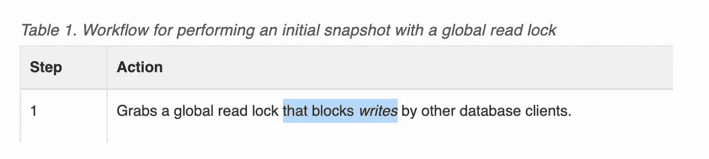
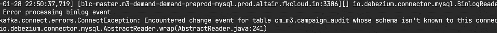

# 当 Debezium 连接器在生产中出现故障时进行修复。

> 原文：<https://levelup.gitconnected.com/fixing-debezium-connectors-when-they-break-on-production-49fb52d6ac4e>


Debezium 是一项了不起的技术。在遵循了[基本指南](https://debezium.io/documentation/reference/install.html)之后，你可以很容易地启动一个 Debezium 连接器，你瞧，**你有事件了！**

然而，当最初的快乐路径配置周围的环境发生变化时，问题就开始出现了，这就破坏了您的连接器和下游消费者。

这里我们就来看以下几个问题。

*   数据库 binlog 翻转，我们不同步。
*   整个数据库主机随着它的 binlog 一起改变，
*   你因为某些原因输掉了比赛。
*   您希望在现有的连接器中捕获一个新的巨大的表
*   您引入了突然的模式更改，但它们并不同步。

当然，创建一个新的连接器也是可行的，但是我们的想法是**对连接器配置**发布一个最小侵入性的更新，以便让它起死回生。在脚本、度量注册表等中，可以通过连接器的名称来监控连接器。当刀可以完成工作时，你可能不想用剑。

在这篇文章中，我试图揭穿一些。我们还将看到 Debezium 与内部 Kafka Connect 主题的交互。

和往常一样，请参考官方的 Debezium 文档了解更多信息。

# 问题一:滚过的圆木

如果连接器任务死了足够长的时间，以至于 Debezium 在内部 Kafka Connect 的[*offset . storage . topic*](https://docs.confluent.io/home/connect/userguide.html#kconnect-internal-topics)中存储的偏移量(binlog 位置)不再存在，那么连接器**无法**恢复。

您可以尝试使用不同的名称重新创建连接器，重新启动任务，更改服务器 id，但是如果偏移消失，将无法恢复。

## [**搞定:**](#)

*   您需要告诉连接器重新创建快照。
*   使用 ***snapshot.mode=initial。***
*   如果您知道您的连接器关闭了多长时间，您可以在繁重的表上发出***snapshot . select . overrides***，这样您就不会对所有行进行快照。*只有当你的表有时间戳列时才这样做(见问题四)*
*   开始跟踪*offset . storage . topic***作为一个 Kafka 控制台消费者来查看动作。**
*   **发布连接器更新。**

**跟踪 T1、T2 和 T3 的连接器将恢复所有 T2 和 T3，仅覆盖 T1 的一小部分**

*   **在 *offset.storage.topic* 中，您将看到连接器试图获取初始快照，然后提交定期更新。**

**自从 131 年< last offset stored in database = 143\. All is restored now.**

# **Problem II: Database Host changes**

**If your database is migrated to a different host, you’d need to update the connector. However, the binlog file will naturally change.**

**As such, any existing connector, which was reading from the old bin-log will suddenly not find the file on the new server. It will **惨死**后，我们就失去了补偿的踪迹。**

**连接器已失效，因为二进制日志已不在服务器上**

## **[**搞定:**](#)**

*   **按照错误消息所说的去做。通过指向新主机来更新连接器配置。同样设置一个新的*服务器 id* 。**
*   **设置***snapshot . mode = when _ need***。确保复制用户存在于新主机上，并且具有必要的权限。**
*   **将创建一个新的快照。使用**snapshot . select . overrides**避免重新处理大量事件。**
*   **跟踪*状态.存储.主题*。连接器应该从*未分配*移动到*运行*。**

**我们的连接器现在已经进入运行状态。**

*   **如果您跟踪 *offsets.storage.topic* ，您会看到 binlog 被切换到这个连接器的新主机。**

**注意到主机文件的变化了吗？事件应该在快照后开始流式传输。**

# **问题三:丢失的事件**

**这与其说是 Debezium 的问题，不如说是应用程序的问题。尽管 Debezium 经过了实战测试，很少错过事件，但事件有时会因为一些原因而被跳过*(应用程序中的代码错误，Debezium 本身的边缘情况)。***

**根据关键程度的不同，丢失的事件可能是灾难性的和不可接受的。但是，如果您的消费者是幂等的，我们可以解决这个问题。**

****

**Debezium 连接器的理想状态。度量是必须的。**

## **[**搞定**](#)**

*   **如果您丢失了事件，请检查偏移是否也已在媒体夹日志中翻转。在这种情况下，您通常需要知道您开始丢失事件的时间，否则您可能会拍摄更大的粒度更小的快照。**

**检查最旧的二进制日志的偏移量。**

*   **如果**不**，那么，恭喜你，我们处于一个良好的状态，因为我们可以重放事件。我们需要暂停相关的 Debezium 连接器，重置它的偏移量并重新启动它。如果**是**，那么我们又回到问题 1。我们解决了这个问题。**
*   **停止连接器。请注意它的配置，以便我们再次创建完全相同的连接器。**
*   **手动重置 Kafka 偏移。只有当你知道自己在做什么的时候，才这样做。 Below 命令为给定键写一个 **NULL** 消息，该消息在逻辑上被转换为删除给定连接器的存储偏移。**

**我们告诉我们的连接器回到之前的状态**

*   **就是这样。**补偿已被重置**。为了避免完整快照的风险，用一个*快照重新创建连接器，用一个刚好在丢失事件之前的时间覆盖*。**
*   **一旦连接器被重新创建，观察 *offsets.storage.topic* 中 Debezium 写入的新偏移量。**
*   **包括丢失事件在内的所有事件都将被重放。你的消费者现在应该重新加工它们。**

# **问题四:覆盖表上没有索引**

**我们一直在谈论使用 *snapshot.override，*来拍摄快照，但是为什么呢？**

**如果没有，则[默认行为](https://debezium.io/documentation/reference/connectors/mysql.html#mysql-property-snapshot-mode)是**选择*** 。对于巨大的表来说，这可能代价太高，这时您希望用一个 **where** 子句来限制初始快照中的行数。最有可能的是，在时间戳列上。**

**但是，注意 Debezium 在处理较大的表时如何执行初始快照是很重要的。它获得一个**读锁**并且**阻止写操作。****

****

**非优化查询会在更大的数据集上停滞**

***锁是无法避免的。*毕竟 Debezium 必须保证一致的状态。但是这对写作意味着什么呢？**

> **这意味着您的 API、计划写入作业将在快照持续期间失败。这也是不可接受的。**

## **[修复](#)**

*   **因此，最重要的是拍摄时间要短，或者在一天中有利的时间拍摄(负荷较小)**
*   **如果 override 中的 where 子句没有索引，实际上更糟，因为这会导致完全扫描。**确保在快照覆盖列上创建索引**。[分析查询](/advanced-profiling-and-tracing-mysql-queries-c0c95dc7db24)并确保它足够快。**

**如果由于失误，初始快照从一个巨大的表(> 1M 行)开始，并停止写入，请快速执行以下操作。**

*   **删除连接器。**
*   **删除连接器不会终止正在运行的数据库查询。**秒杀查询。****

```
mysql $ show processlist → 
mysql $ kill <connection-doing-snapshotting> →
```

# **问题 V:遇到了模式未知的变更事件**

**这是一个非常不幸的错误。当*内部元模型*和*数据库模式历史*不匹配时，就会发生这种情况。很可能一个 DDL 没有进入数据库历史主题，现在**任何新事件都将失败。****

****

**出现故障的连接器**

**当 Debezium 试图重新启动任务时，它使用一个名为*连接器的键*从 *connect.offsets.topics* 中读取最新的偏移量。**

**然后，它试图将后来(不是最近)事件的模式与其内部模型(没有更新)进行比较。**

**这取决于*“不一致.模式.处理.模式”*属性(默认行为是失败，其他行为是跳过、警告)**

## **[*修复*](#)**

*   **在检查[相关的 Debezium 源代码](https://github.com/debezium/debezium/blob/237b4ac0f1773e7cfd103bfc216afc44bdbe2635/debezium-connector-mysql/src/main/java/io/debezium/connector/mysql/BinlogReader.java#L863)时，很明显这是一个死胡同。一个简单的修复方法是用不同的名称重新创建连接器，因为偏移分区消息是由连接器名称作为键的。这会拍一张新的快照。**
*   **然而，重命名连接器并不总是可行的。在这种情况下，可以直接**指定一个逻辑删除消息**，它基本上告诉 Debezium 到目前为止还没有记录偏移，需要执行快照**

**我们告诉 Debezium 我们没有任何补偿。连接器必须处于停止状态。**

*   **现在可以用相同的名称重新创建连接器。**

> **您可能会问，
> 为什么 DDL 没有出现在 database.schema.history 主题中。毕竟 Debezium 是流媒体的所有事件，对不对？**

**这是一个合理的问题。要回答这个问题，请想一想当历史主题的保留时间被设置为固定的天数或字节数时会发生什么，其中任何一个超过？**

**Debezium 需要在一个主题下维护所有历史。
**图式事件无法翻转。****

**这篇文章到此为止。我希望这能帮助读者在他们的产品配置中解决 Debezium 的问题。**