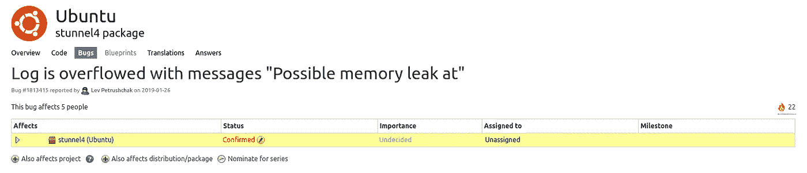

# 修复 Ubuntu 18.04 的漏洞

> 原文：<https://levelup.gitconnected.com/fixing-ubuntu-18-04s-stunnel-c1f0c29f1b27>

## 针对已知内存泄漏的快速修复


您有运行在 Ubuntu 18.04 上的生产工作负载吗？你是将缓存切换到 [Redis](https://redis.io/) 还是更具体地配置一个像 Magento 这样没有内置 tls 支持 Redis 的应用程序(据我所知)来使用[AWS elastic cache](https://aws.amazon.com/elasticache/redis/)？如果你是，你会遇到和我一样的问题，在这个 Ubuntu 版本中最新的 [stunnel](https://www.stunnel.org/) 有一个[已知的内存泄漏](https://bugs.launchpad.net/ubuntu/+source/stunnel4/+bug/1813415)。

## 那是什么意思？

对于那些不熟悉这个术语的人来说，[内存泄漏](https://en.wikipedia.org/wiki/Memory_leak)本质上要做的是，它不会从过去的活动中释放不需要的 RAM，同时为新的活动分配更多的 RAM，直到你的容器或 VM 不再需要使用为止；导致您的工作负载在某个时候变得完全无响应。

## 艰难地学习

很久以前，在一个阳光明媚的周六，我正在愉快地开发一个客户端的 web 应用程序，该应用程序正在切换到 Redis 进行缓存。我设置了 stunnel，类似于 AWS 文档中关于如何用 stunnel 连接到 Redis 的 Elasticache 的概述，还有一些我自己的调整。(**旁注:** *options = NO_SSLv2* 不是一个有效的配置，将导致 stunnel 无法正常启动)在几分钟内，我就为应用程序正确设置了 stunnel，使其能够通过我指定的 localhost 端口连接到 Redis。一切都很好，对吗？嗯，没那么快！

大约一两天后，一位同事联系我，告诉我运行 web 应用程序的 docker 主机关闭了。所以我对控制台进行了截图，它显示了一个充满内存不足错误的屏幕。所以我检查了日志，发现这些错误信息反复出现:

```
stunnel: LOG4[3610]: Possible memory leak at ../crypto/asn1/asn1_lib.c:295: 318560 allocations
stunnel: LOG4[3610]: Possible memory leak at ../crypto/asn1/tasn_new.c:122: 285606 allocations
stunnel: LOG4[3610]: Possible memory leak at ../crypto/asn1/asn1_lib.c:327: 208706 allocations
stunnel: LOG4[3610]: Possible memory leak at ../crypto/stack/stack.c:209: 80595 allocations
stunnel: LOG4[3610]: Possible memory leak at ../crypto/bn/bn_lib.c:280: 59487 allocations
stunnel: LOG4[3610]: Possible memory leak at ../crypto/stack/stack.c:180: 58620 allocations
stunnel: LOG4[3610]: Possible memory leak at ../crypto/threads_pthread.c:29: 47845 allocations
stunnel: LOG4[3610]: Possible memory leak at ../crypto/asn1/tasn_new.c:302: 43943 allocations
stunnel: LOG4[3610]: Possible memory leak at ../crypto/asn1/tasn_new.c:97: 32765 allocations
```

我不仅耗尽了内存，stunnel 本身也告诉我可能存在内存泄漏。所以我开始了一次搜索，并发现了这个已知的错误。



[https://bugs . launch pad . net/Ubuntu/+source/stunnel 4/+bug/1813415](https://bugs.launchpad.net/ubuntu/+source/stunnel4/+bug/1813415)

不幸的是，这个 bug 似乎不会引起维护者的注意。该漏洞于 2019 年初首次提交并得到确认，现在是 2021 年，但仍然没有新的更新。这意味着如果升级到 20.04 不是一个选项，我们必须自己想办法解决这个问题。

## 怎么修

令人欣慰的是，后来的上游版本摆脱了这个 bug，能够从源代码编译不需要大量的依赖搜索。我已经安装了 build-essential 和 libssl-dev，所以我不能确认如果没有安装它们，编译是否会失败。然而，尽管如此，我所做的只是从 stunnel 站点下载最新的[(5.58](https://www.stunnel.org/downloads/stunnel-5.58.tar.gz))，从源代码编译它，然后用新编译的二进制文件替换现有的二进制文件。命令的顺序如下:

```
$ sudo service stunnel4 stop
$ wget [https://www.stunnel.org/downloads/stunnel-5.58.tar.gz](https://www.stunnel.org/downloads/stunnel-5.58.tar.gz)
$ tar -xzvf stunnel-5.58.tar.gz
$ cd stunnel-5.58
$ ./configure
$ make
$ sudo make install
$ cd /usr/bin
$ sudo mv stunnel /root/backup/
$ sudo mv stunnel4 /root/backup/
$ sudo ln -s /usr/local/bin/stunnel .
$ sudo ln -s /usr/local/bin/stunnel ./stunnel4
$ sudo service stunnel4 start
```

就是这样！在那之后，stunnel 运行得很好，没有内存泄漏，也没有由于内存不足而导致的无响应工作负载。