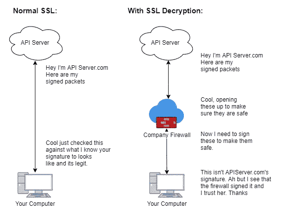

# 修复 Python 中的 SSL 验证错误

> 原文：<https://levelup.gitconnected.com/fixing-your-ssl-verify-errors-in-python-71c2201db4b2>


来源:XCart.com

我不认为我可以恰当地用语言来表达我有多不喜欢 SSL。不是因为我认为它不好，而是因为要花这么多时间才能搞清楚到底是怎么回事。我是说这个错误到底是什么意思？！

我已经忍受了很多个月的实际错误…

# 为什么您会遇到 SSL 问题

据我所知，人们对 SSL 有问题有两个主要原因。首先，你正在处理一个有自我签名证书的网站。自签名证书实际上是您为自己创建的证书。这里简单的类比就是签署一份文件并将其发送给某人。备选方案正在获取受信任的证书颁发机构来验证您的证书。这就像去公证处签署一份文件。现在你有了一个可以证明你的签名确实来自你的外部团体。

人们遇到 SSL 问题的第二个原因是他们为一家公司工作，该公司从事所谓的 SSL 解密。这是他们解密流量的地方，就好像他们是最终用户来验证流量的安全性，然后用他们自己的证书重新加密流量并转发给你。就像这样:



来源:这是我画的，不要评价

# 如何修复您的 SSL 错误:

如果你的问题是你的公司使用 SSL 解密，而你使用的是 windows，那么你将会有一段艰难的时间。以下是解决方法:

```
python -m pip install python-certifi-win32
```

Gottem，除了在请求中使用 verify=True 之外，这就是您需要做的所有事情。python-certify-win32 库使用 Windows 证书存储来检查证书的有效性。

对于 Linux 机器，您需要设置一个环境变量，以便请求可以在哪里找到 cert 包。这通常是这样的:

```
export REQUESTS_CA_BUNDLE=/etc/ssl/certs/ca-certificates.crt
```

python 的新版本使用 Certifi 包。有了这个，你就可以在需要的地方安装证书了([大喊到 stackoverflow](https://stackoverflow.com/questions/42982143/python-requests-how-to-use-system-ca-certificates-debian-ubuntu) )。这是通过运行以下命令来完成的:

```
Python 3.8.5 (default, Jul 28 2020, 12:59:40) 
>>> import certifi
>>> certifi.where()
'/etc/ssl/certs/ca-certificates.crt'
```

如果你试图用自签名证书攻击服务器，你首先需要获得他们的证书。再次感谢[精彩叠溢](https://superuser.com/questions/97201/how-to-save-a-remote-server-ssl-certificate-locally-as-a-file)为我们指明了道路:

```
openssl s_client -showcerts -connect server.edu:443 </dev/null 2>/dev/null|openssl x509 -outform PEM >mycertfile.pem
```

这会将文件输出为 mycertfile.pem。然后我们可以将它添加到可信证书中。就是这样，不要再开玩笑了。现在去享受作为日志清洁工和安全实现者的荣耀吧。


来源:[KnowYourMeme.com](https://knowyourmeme.com/memes/hackerman)