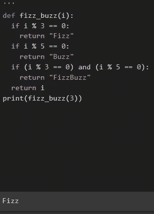
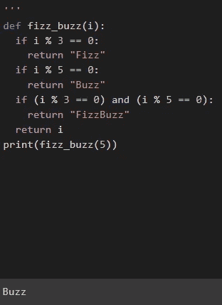
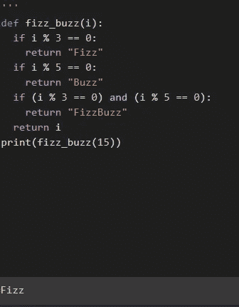
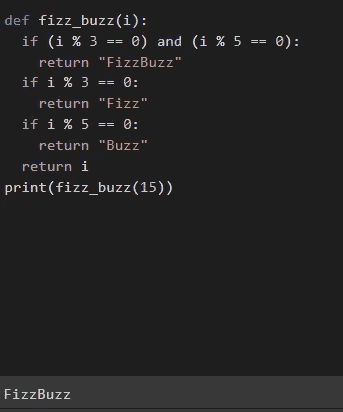
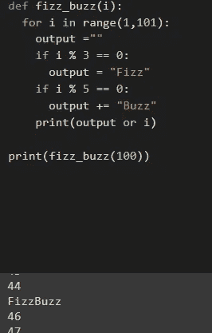

# Fizz Buzz 面试问题

> 原文：<https://levelup.gitconnected.com/fizz-buzz-interview-question-5cd4bc7f8001>

如果我是一家世界级餐厅的主厨，我会用“鸡肉测试”作为招聘厨师的试金石。

*我会让他们给我做鸡肉！你可能会问为什么是鸡肉？*

*如果一个厨师不能烹饪鸡肉并使其美味可口，那么他们可能还没有准备好烹饪世界级的菜肴*


来源:维多利亚她经由[Unsplash.com](https://unsplash.com/photos/UC0HZdUitWY)

同样的道理也适用于软件工程师，如果他们不能编写简单的儿童游戏 Fizz Buzz，那么他们可能还没有准备好生产世界级的软件！

那么什么是 Fizz Buzz 呢？

Fizz Buzz 是一种儿童游戏，用来增强他们的数学技能。由两个人玩，他们轮流数到 1，2，3，4，5，6，…但是每当有 3 的倍数时，他们就说嘶嘶作响。每当有 5 的倍数时，他们就说“嗡嗡”,而像 15 这样能被 3 和 5 整除的数字，他们就说“嘶嘶嗡嗡”。另一个例外是那些不是 3 或 5 的倍数的数字，然后孩子们会叫这个数字。

让我们写一个程序来做这件事，我们将使用 Python:

```
def fizzbuzz(i):
    if i % 3 == 0:
        return "Fizz"
    if i % 5 == 0:
        return "Buzz"
    if (i % 3 == 0) and (i % 5 == 0):
        return "FizzBuzz" return i
print(fizzbuzz())
```

告诉我们的 Python 解释器检查我们的变量 I 是否是 3 的倍数，如果是，那么输出 Fizz。

如果该陈述为假，则继续检查 I 是否是 5 的倍数，如果是，则返回 Buzz。

如果该语句也为假，则继续检查 I 是否是 3 和 5 倍数，以及它是否返回给我们 FizzBuzz。

如果这些都不是真的，返回给我们 I，它很可能是一个数字。我在 Google colab 上运行了这个，看看我得到的输出。



上面的截图显示 I 为 3，5，15。3 和 5 的前两个输出是正确的，但 15 个输出中的最后一个嘶嘶作响，我们期待嘶嘶的嗡嗡声。

这是决策语句的一个常见问题，只有当一个条件为假时，它才会转移到下一个条件。但是 15 适用于语句 1 和 2，所以我们不太聪明的朋友 Python 解释器选择了第一个选项，因此我们得到 Fizz 作为输入。

我们也可以像我们的 Python 解释器朋友一样偷懒，直接切换语句；



那是排序，它确实是一个工作模型，它能被即兴创作以使它打印 1 到 100 吗？

```
def fizz_buzz(i):
    for i in range(1,101):
       output = ""
       if i % 3 == 0:
           output = "Fizz"
       if i % 5 == 0:
           output += "Buzz"
       print(output or i)
print(fizz_buzz(100))
```

上面的代码告诉我们的 Python 解释器运行数字 1 到 100。每当有 3 的倍数时，将 Fizz 添加到空字符串输出中。

然后移动到 5 的倍数，给琴弦加上嗡嗡声，不需要检查 3 和 5 的倍数，因为它会自动检查。米还在谷歌实验室上做了这个实验:



非常欢迎你加入我的代码，我已经附上了！

# 额外资源

[](https://colab.research.google.com/drive/1mHquOQBeVphxpOFObB2_pz6g33NKp_pQ?usp=sharing) [## 谷歌联合实验室

### 编辑描述

colab.research.google.com](https://colab.research.google.com/drive/1mHquOQBeVphxpOFObB2_pz6g33NKp_pQ?usp=sharing)