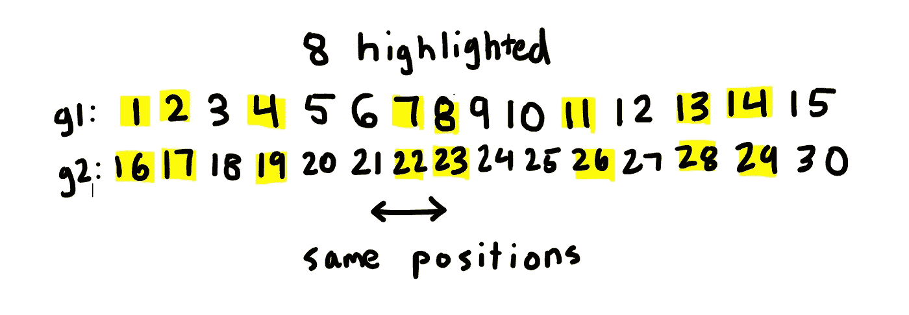

# 嘶嘶作响

> 原文：<https://levelup.gitconnected.com/fizzbuzz-bc2a2bfd1069>

## 把一个看似微不足道的问题变成一个挑战性的问题。


照片由 [Maranda Vandergriff](https://unsplash.com/@mkvandergriff?utm_source=medium&utm_medium=referral) 在 [Unsplash](https://unsplash.com?utm_source=medium&utm_medium=referral) 上拍摄

FizzBuzz 的概念非常简单**。**

写一个程序，打印从 1 到 100 的每一个数字，但是:

*   如果你遇到一个能被 3 整除的数字，打印 **Fizz** 。
*   如果遇到能被 5 整除的数，打印 **Buzz** 。
*   如果遇到能被 3 和 5 整除的数，打印 **FizzBuzz** 。
*   如果你遇到一个既不能被 3 也不能被 5 整除的数字，打印出数字。

# 现在让我们稍微调整一下。

给定一个整数 **N** ，打印第 **N** 个不是 Fizz、Buzz 或 FizzBuzz 的数字。

## 示例:

```
**Given:**
8**Output:**
14**Explanation:** If we were to write out the first 20 numbers and mark off ones which wouldn't be valid, we'd get this.[**1**, **2**, 3, **4**, 5, 6, **7**, **8**, 9, 10, **11**, 12, **13**, **14**, 15, **16**, **17**, 18, **19**, 20]The eighth element which is bolded is 14.
```

现在这也不是很难，我们可以模拟到 **N** 的列表。

# 最终 boss！

如果 **N** 涨到 10 万会怎么样？

模拟它会太长，保存所有 100，000 个元素的列表会非常不道德。

那么我们应该如何解决这个问题呢？

答案不在于实现，而在于数学。

由于 3 和 5 的 LCM 是 15，你可以发现，对于每 15 个元素，只有 8 个元素不能被 3 或 5 整除。



只突出了 8 个元素！|图片作者。

您还会注意到，同一位置的元素相差 15°。

这意味着对于 15 个元素的组，N 在前 8 个元素之间的距离是(15 *组号)。

让我们把这些列出来。

```
***# Lists the first 8.******# 14 is in the zeroth position since if were trying to find the******# eigth number, 8 % 8 = 0.***first8 = [14, 1, 2, 4, 7, 8, 11, 13]
```

我们将通过对 N 和 8 的商求地板来找到组号。

```
***# Finds the group.***ans = (N - 1) // 8
```

乘以 15 得到从 **N** 到前 8 个中的一个的距离。

```
***# Distance away N is from the first 8.***ans *= 15
```

最后加入前 8 的对应元素！

```
***# Adds the corresponding element.***ans += first8[N % 8]
```

让我们运行一些测试案例。

```
**# Input**
6**# Output**
11**# Input**
150**# Output** 281**# Input** 99876**# Output**
187267
```

## 时间复杂度

时间复杂度是 O(1 ),因为它计算的是常数个表达式。

# 结论

谢谢！

我希望你喜欢读这篇文章，并且你学到了新的东西！如果你有任何问题，建议，或一般的反馈，请随时在评论中提出来！

编程快乐！