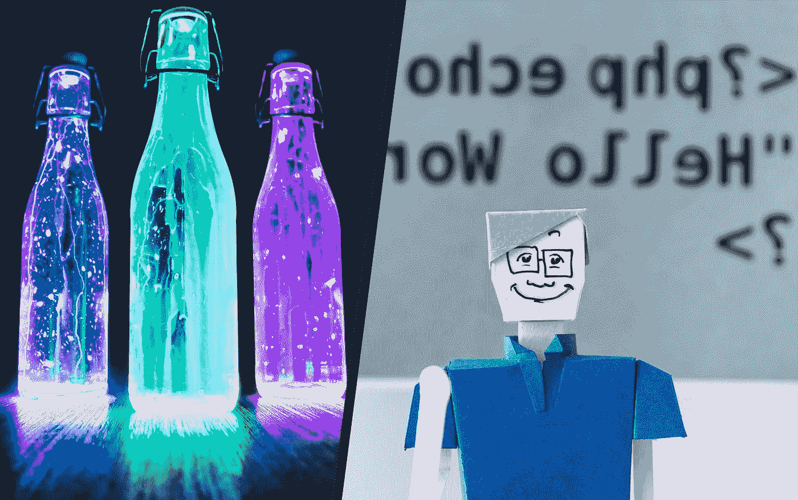

# FizzBuzz:能量饮料还是编码测试？

> 原文：<https://levelup.gitconnected.com/fizzbuzz-energy-drink-or-coding-test-568b297ae0b0>



打开你的汽笛！不要走开！打开一瓶汽水！用力关上它。感受燃烧吧！忘记翅膀——Fizzbuzz 让你嗡嗡作响！乘着你的嗡嗡声飞来飞去吧！

如果你现在不渴，那你怎么了？

另一方面，FizzBuzz 可能是经典的开发人员测试之一，广泛用于筛选掉估计 90%的编程职位候选人，他们无法从湿纸袋中编程出来。你知道那些使用 ***栈锤*** 编程方法的类型(查找栈溢出的解决方案，然后敲打代码，直到出现半功能)。

# 那到底是哪一个？

让我们来看看这里的每一款产品。从表面上看，它们大相径庭。一个是一个薄铝罐，包裹在一种合成液体周围，这种液体让人想起山羊尿，含有各种非有机根提取物和大量黄色染料#45 的各种物质的混合物，让你的浴室访问引发盖革计数器。另一个是作为一个集体文字游戏开始的，教孩子们关于除法的知识，教导孩子们不要犹豫或给出错误的答案，以免被踢出游戏，永远被社会排斥。这两者都会导致长期的健康问题和对“*男人*”的健康恐惧。所以它们可能比第一眼看到的更相似。为了确定哪一个是正确的，我们需要更深入地挖掘。

# 产品说明

> 编码员和深海潜水员都喜欢。享受起泡的*可乐*口味的 fizz buzz——这种饮料可以让兴奋变成兴奋！与奶酪球或不新鲜的夹馅面包一起享用(不包括玉米卷)。无论你是想成为潮人，慢爵士爱好者，还是喜欢编织无政府主义者的毛衣，别忘了骑上 Fizzy *！*
> 
> *FizzBuzz 能量饮料&核废料清理有限责任公司
> *饮料只有在迪斯科球前才会冒泡。饮料不含碳酸或可乐，但可用于替代电池酸液*

# —或者—

> 写一个程序打印从 1 到 100 的数字。但是对于三的倍数打印“嘶嘶”而不是数字，对于五的倍数打印“嗡嗡”。对于同时是 3 和 5 的倍数的数字，打印“FizzBuzz”。
> 
> *Imran Ghory from:*[*使用 FizzBuzz 查找 Grok 编码的开发者*](https://imranontech.com/2007/01/24/using-fizzbuzz-to-find-developers-who-grok-coding/)

# 产品成分

```
***FizzBuzz Cola Fizzy Drink Contains The Following:
- caffeine
- fresh Slurm
- B34-Ginseng (our unique blend of herbs and vitamins)
- leftover Booty Sweat energy drink
- caffeine
- Di-hydrogen monoxide
- olive juice from extra dry martinis
- extract from the leftover bags used to make green tea
- guariaunana***
***- juice from one bottle of Ol' Janx Spirit
- caffeine***
```

# —或者—

```
***FizzBuzz Coding Test Contains The Following:
- A dash of for loops
- A pinch of division modulus
- If-Else statements to taste
- mix and layer
- Add extra Fizz if it is a third layer
- Add extra Buzz if it is a fifth layer
- don't forget a semicolon topper!******For extra fun add in a dash of recursion!***
```

# 产品警告

```
Do not consume this product if you are taking any prescription, non-prescription, legal, or illegal drug and/or have any medical condition. Do not use this product if you are pregnant or nursing, have every been pregnant, or ever want to be pregnant in the future. This product is intended for use by healthy individuals only. The user of this product assumes all liability if this product is used in a manner not consistent with label guidelines (in super-duper small print). This product contains caffeine and should not be used with any other caffeine containing products. One serving of FizzBuzz provides 1,956 mg of caffeine, which is more than twenty cups of coffee. Too much caffeine may cause nervousness, irritability, sleeplessness, and, occasionally, rapid heartbeat. Not recommended for use by children under 18 years of age. Not recommended for use by adults over the age of 18.
```

# —或者—

```
Do not attempt if you are a StackHammer, Code Monkey, Script Kiddie, or have ever written a VBA macro. Serious programmers only. Do not attempt if you have not watched Firefly at least twice. Do not code if you have ever created, fixed, squashed, stepped on, or eaten a bug. Optimizations are mandatory. One attempt to solve must be made using VIM. Only solutions refactored to use tabs instead of spaces will be accepted. People wearing 'No Place like 127.0.0.1' shirts are prohibited from attempt this test. Otherwise, go 01000110 01101001 01111010 01111010 01000010 01110101 01111010 01111010 yourself.
```

# 最后

可恶！结果并不确定。所以去打开一个冷的写点代码吧。Fizzbuzz 喝，FizzBuzz 编码。警告——这两种情况都可能让你深夜睡不着觉，而且都可能让你急着想尿尿。不要忘记所有额外的口味:无糖，二叉查找树，桃子花生酱，拓扑排序！

作者注意:关于这个著名的编码面试问题，有大量的资源，包括描述和分析，以及 2014 年的大规模解决方案汇编，如下: [Fizz Buzz Test](https://wiki.c2.com/?FizzBuzzTest) 。杰夫·阿特伍德也写了一篇关于《T2》的文章。虽然这个问题作为面试问题的受欢迎程度可能不如从前，但这是一个很好的一般性话题，万一它出现了，你应该了解一些，这也有助于像 [HackerRank](https://www.hackerrank.com/challenges/fizzbuzz/problem) 这样的网站的良好实践。感谢阅读！


坦尼娅·桑托斯在 [Unsplash](https://unsplash.com/?utm_source=unsplash&utm_medium=referral&utm_content=creditCopyText) 上的照片

*原载于 2020 年 1 月 4 日 kevinwanke.com**。Kevin 的博客专注于给新工程师和工程经理的建议。*