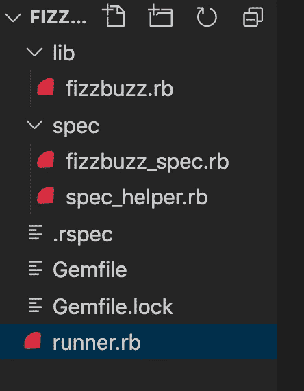

# Ruby 中的 FizzBuzz 遵循 TDD

> 原文：<https://levelup.gitconnected.com/fizzbuzz-in-ruby-following-tdd-184cf2a6b521>

在最近的一次最后阶段的面试中，在我的技术测试即将结束时，有人问我是否知道 FizzBuzz，是否可以实现一些代码来编写一个成功的 FizzBuzz 脚本！对我带回家的评估表明我可以编写测试，但没有显示出我的思维、逻辑以及对如何编写测试的理解。现在，我的测试时间不多了，所以他们更想看看我会如何处理这个特殊的练习。

FizzBuzz 的概念是:

1.  给你一个数字(n)。该号码将是您的号码范围内的最后一个号码。从 1 点开始。所以你的范围是 1..名词（noun 的缩写）
2.  如果一个数能被 3 整除，它将返回“Fizz”。
3.  如果一个数能被 5 整除，它将返回“Buzz”。
4.  如果一个数能被 3 和 5 整除，它将返回“FizzBuzz”。
5.  如果它不能被任何数整除，那么它将返回这个数。

所以如果你给出的数字是 5。它会返回— 1，2，“嘶嘶”，4“嗡嗡”。

虽然我没有时间完全实现测试和代码，但我认为这是一个练习编写干净测试的很好的练习。

那么，我们开始吧。

我已经开始了用必要的文件夹和文件为此建立一个基本的 Ruby 项目的步骤。

您的项目应该是这样的。

所以现在我们有了所有必要的文件夹和文件。让我们处理下一点，TDD。

关于 TDD 要记住的主要事情是红色、绿色、重构。

为某些功能编写一个测试，使其失败。它失败是因为我们没有编写通过测试的代码。您编写代码使其通过，然后进行重构，在不检查功能的情况下寻找任何代码味道。干代码。

我们的第一次测试！

我喜欢写下我需要做的事情，因为在 Ruby 中，测试几乎是这样写的，所以它可以像英语句子一样被阅读。

1.  我需要一个接受用户输入的数字的类。

因此，我们需要编写一个测试来检查我们的实例是用一个参数(数字)实例化的。

在我们的 fizzbuzz_spec.rb 中放入下面的代码:

使用 rspec 运行套件。(因为这是一个小目录，我们可以只运行 rspec。有很多方法可以运行一个特定的测试套件文件或者单个测试，但是不要担心这些。)

太好了！失败的测试。正是我们想看到的。让我们添加代码来完成这个过程。

这是我们测试通过所要实现的所有代码。它需要一个数字(n，默认值为 1)，所以测试将总是用一个数字运行。

完美，我们的第一次测试。让我们继续讨论更多的方法论。

您也可以将它添加到我们的初始化描述中。它主要检查 FizzBuzz 的新实例是用 1 个参数还是 0 个参数创建的。它应该在没有参数的情况下工作，因为我们输入了一个默认值。

所以，让我们继续我们的主要方法。我们想写一个方法:

1.  如果一个数能被 3 整除，它将返回“Fizz”。
2.  如果一个数能被 5 整除，它将返回“Buzz”。
3.  如果一个数能被 3 和 5 整除，它将返回“FizzBuzz”。
4.  如果它不能被任何数整除，那么它返回这个数。

因此，我们想编写一个测试，它接受实例给出的数字，并通过调用。我在上面。然后我们想把它放入一个从 1 开始的范围，所以 1..然后，我们可以循环遍历该范围，检查每个数字，并将其与上面的语句进行比较。

这里有很多，所以让我们在测试中分解一下。

我们不需要检查 n.to_i，因为我们知道 1..我将创建一个范围，如果不是，我们的测试将显示出来。我们不需要过度测试。

所以记住，我们希望得到失败的测试，让它们工作，然后重构。下一部分就是一个很好的例子。

这有很多代码。它在每个上下文中创建了一个新实例，然后调用我将在这个新实例上创建的方法。然后，在每次测试结束时，我检查返回的内容是否等于数组。如你所见，对于可被 3 和 5 整除的数组，这是一个长数组。

自然，这一切都失败了。所以，写代码，这是我写的。

完美，一切都过去了。这正是我想要的。它输出一个数组，在那里我会有另一个文件来运行我想显示给用户的代码。所以数组很好。

但是看看这个。在测试中看起来有很多代码，在这个方法中有一些事情正在进行。也许，我可以整理测试套件，并重构我的方法中的一些代码，使它更整洁、更易于使用。

所以，这就是我们要做的。

让这个方法的一部分在另一个方法中检查每个数字不是很好吗？这样，我就可以在将来使用该方法来检查任何其他号码！我将创建一个方法，它以一个数字作为参数，输出我的 fizz/buzz/fizzbuzz。

所以在这里，这是测试一个方法，它接受一个没有编号的新实例。然后我给它传递一个参数为 3 的方法。这样，我可以编写一个测试，简单地检查特定数字的输出，而不是创建一个包含一系列数字的全部预期输出的数组。

这听起来可能有点令人困惑。但是我们想要的是一个简单的方法，它接受一个数字，并对照我们上一个方法中的 fizzbuzz 方法进行检查。

这是我们的方法。漂亮整洁。

这个方法需要一个数字。因此，让我们创建一个方法，简单地获取我们的输入数字，将它放入一个范围，并每次用我们的新方法遍历它。

太神奇了。如果我们想测试它，我们可以简单地测试这个方法的输出，然后写一个数组。但是我们已经知道 fizzbuzz_output 方法正确地测试了每个数字，所以我就不做了。

好，现在为我们的 runner.rb 文件添加以下内容:

然后，当你放置 ruby runner.rb 15 时，你应该得到:

以及我们的 rspec 测试套件。

我的 FizzBuzz 旅行结束了。请随意指出你要改变的任何东西，我对此相对较新，如果你有进一步的建议，我会很高兴。