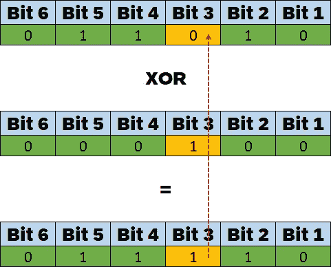

# 标记枚举:如何在一个字段中表示特征组合

> 原文：<https://levelup.gitconnected.com/flagged-enumerations-how-to-represent-features-combinations-into-one-field-f32e46a0885>

## 回归基础

## 将[读、写、修改……]等功能及其组合表示到单个字段中。


**标记枚举:如何在一个字段中表示特征组合**，照片由 [Ben White](https://unsplash.com/@benwhitephotography?utm_source=unsplash&utm_medium=referral&utm_content=creditCopyText) 在 [Unsplash](https://unsplash.com/?utm_source=unsplash&utm_medium=referral&utm_content=creditCopyText) 拍摄，修改由 [Ahmed Tarek](https://medium.com/@eng_ahmed.tarek)

有时，在构建软件系统和设计一组模块时，您会发现这些模块中的每个模块都能够或者不能够支持预定义特性列表中的某些特性。最后，应该有一些字段或属性将每个模块映射到其支持的特性。

例如，假设我们正在开发一款游戏，其中游戏中的每个角色都将——或不会——能够:
━行走
━奔跑
━说话
━尖叫
━战斗
━…

一个角色可能只支持**行走**、**奔跑**和**说话**的特征。另一个角色可能只支持**行走**、**尖叫**和**战斗**的特性。诸如此类，…

现在，假设您希望在`Character`类上只有一个字段或属性来表示这些特性，这样在任何时候使用这个属性的值，您都可以知道某个`Character`实例支持的所有单一特性。

你会怎么做？有人可能会说:

> 使用**标记枚举**，这很容易。

是的，这是正确的，但是，你知道已经在**标记枚举**中使用的概念吗？

这就是这篇文章的内容。

[](https://medium.com/subscribe/@eng_ahmed.tarek) [## 🔥订阅艾哈迈德的时事通讯🔥

### 订阅艾哈迈德的时事通讯📰直接获得最佳实践、教程、提示、技巧和许多其他很酷的东西…

medium.com](https://medium.com/subscribe/@eng_ahmed.tarek) 

**议程**，照片由[埃斯特·扬森斯](https://unsplash.com/@esteejanssens?utm_source=unsplash&utm_medium=referral&utm_content=creditCopyText)在 [Unsplash](https://unsplash.com/?utm_source=unsplash&utm_medium=referral&utm_content=creditCopyText) 上拍摄

# 议程

几乎所有的面向对象编程(OOP)语言都支持标记枚举。它们用于我们在上面的**问题定义**部分描述的情况。

然而，如果你仔细观察，你会发现**标记枚举**只是基于**二进制表**和**位操作**的一个重要概念的实现。

这就是为什么在这篇文章中，我们将探索二进制表和位运算的一些基础知识。

这是我们的日程安排:

1.  二元表。
2.  位运算:
    ↓与位运算子
    ↓或位运算子
    ↓异或位运算子
    ↓非位运算子
3.  用比特表示特征。
4.  已标记的枚举。

如果你认为你已经对这些话题中的一个或多个有经验，请随意跳到下一个。你可以通过上面议程中的标题来搜索这篇文章。


**二进制表**，图像由 [geralt](https://pixabay.com/users/geralt-9301/) 放到 [Pixabay](https://pixabay.com) 上，由 [Ahmed Tarek](https://medium.com/@eng_ahmed.tarek) 调整

# 二元表

为了简单起见，让我们说**二进制**是一种将数字表示成一系列符号的方式，其中每个符号可以用“0”或“1”来表示。这些符号被命名为**位**。换句话说，每一个十进制的**数字都可以表示成一系列按一定顺序书写的“0”和“1”。**

因此，如果我们假设我们想要仅使用一位来格式化十进制数，并且知道该位可以是“0”或“1”。

那么我们应该知道我们只有这些可能性:
│0
│1

在这种情况下，我们可以说我们只能表示**两个十进制数，分别是 **0** 和 **1** 。**

但是，如果我告诉你，我们现在将添加另一个位，这样总位数是 2，而不是 1。

那么我们应该知道我们只有这些可能:
▎Bit 1 = 0，Bit 2 = 0
▎Bit 1 = 1，Bit 2 = 0
▎Bit 1 = 0，Bit 2 = 1
▎Bit 1 = 1，Bit 2 = 1

在这种情况下，我们可以说我们只能表示**四个**十进制数，分别是 **0、1、2、**和 **3** 。

实际上，让我们在这里停一会儿，试着理解实际发生了什么。

**这里我们能注意到的:**

1.  我们知道每一位可能是两个值中的一个；“0”或“1”。
2.  这适用于所有位，包括我们将要添加的新位。
3.  这意味着，如果我们想知道使用两位得到的组合数量，我们应该将{第一位可能值的数量}和{第二位可能值的数量}相乘。
4.  因此，**两个**位的组合总数应该是
    = 2×2
    = 4
5.  按照同样的概念，如果我们添加第三位，则三个位的**的组合总数应该是
    = 2×2×2
    = 8**
6.  然后推广这一思想，我们可以说，n 位的组合总数应该是 2 的
    次方的 **n
    =** 2 ^ **n**
7.  这里最后要注意的是，当我们说我们表示 8 个十进制数时，零也包括在内。
8.  所以对于**三个**位，我们可以表示十进制数 0，1，2，3，4，5，6，7。

说了这么多，我们来看看如何把这个放到著名的**二进制表**格式中。


让我们从 **1 位**二进制表开始:


**1 位二进制表**，图像由 [Ahmed Tarek](https://medium.com/@eng_ahmed.tarek)

这里的主要规则是，我们从“0”开始，而不是“1”。

现在，当添加第二位以获得一个 **2 位**二进制表时，我们将其添加如下:


**2 位二进制表**，图像由[艾哈迈德·塔里克](https://medium.com/@eng_ahmed.tarek)生成

如我们所见，要添加一个新位，我们需要执行以下操作:

1.  复制前面的二进制表。
2.  通过复制已经存在的行并粘贴到底部来扩展这些行(如红色箭头所示)。
3.  将新的位列添加到左边的**中**。
4.  用“0”填充与上一个表格中的行相对应的所有单元格(以绿色突出显示)。
5.  用“1”填充其余的新列单元格。

现在，你有了一个 **2 位的**二进制表。

同样，当添加第三位以获得一个 **3 位**二进制表时，我们将其添加如下:


**3 位二进制表**，图像由[艾哈迈德·塔里克](https://medium.com/@eng_ahmed.tarek)生成

如我们所见，要添加一个新位，我们需要执行以下操作:

1.  复制前面的二进制表。
2.  通过复制已经存在的行并粘贴到底部来扩展这些行(如红色箭头所示)。
3.  将新的钻头列添加到**左侧**。
4.  用“0”填充与上一个表格中的行相对应的所有单元格(以绿色突出显示)。
5.  用“1”填充其余的新列单元格。

现在，你有了一个 **3 位**二进制表。


现在你可能会问每一位序列和十进制数之间的关系。有关系吗？

答案是肯定的，有关系。

让我们以 **3 位**二进制表为例。


**3 位二进制表**，图像由[艾哈迈德·塔里克](https://medium.com/@eng_ahmed.tarek)

为了计算对应于每个比特序列的十进制数，我们计算每个比特乘以(2 的零阶幂)的和。不清楚，对吧？

看看这张图片，你就会明白了:


**计算位序列 1 的十进制数**，图像由[艾哈迈德·塔里克](https://medium.com/@eng_ahmed.tarek)

或者更简单，像这样:


**计算位序列 2** 的十进制数，图像由 [Ahmed Tarek](https://medium.com/@eng_ahmed.tarek)

现在你知道它是如何工作的了。


这还不是全部。我们现在知道如何将二进制数转换成相应的十进制数。但是，如何将十进制数转换成相应的二进制数呢？

有一个简单的方法可以做到。让我展示给你看。

假设您想将十进制数字“7”转换为二进制形式。


**将 7 转换成二进制**，图像由[艾哈迈德·塔里克](https://medium.com/@eng_ahmed.tarek)

我们是这样做的:

1.  从 7 开始。
2.  除以 2。
3.  我们得到 3 和 1 的余数。
4.  用 3 除以 2。
5.  我们得到 1 和 1 的余数。
6.  用 1 除以 2。
7.  我们得到 0 和 1 的余数。
8.  用 0 除以 2。
9.  我们得到 0 和 0 的余数。
10.  这是我们停下来的地方。
11.  答案是 0111。


**7 成二进制**，图像由[艾哈迈德·塔里克](https://medium.com/@eng_ahmed.tarek)

再比如。假设您想将十进制数字“35”转换为二进制形式。


**将 35 转换成二进制**，图像由[艾哈迈德·塔里克](https://medium.com/@eng_ahmed.tarek)生成

按照同样的过程，我们将得到这样的结果:


**35 成二进制**，图像由[艾哈迈德·塔里克](https://medium.com/@eng_ahmed.tarek)


现在你可能有点困惑，不确定这种转换方式是从哪里来的。让我证明给你看。

如前所述，要将二进制数(BitN，…Bit2，Bit1)转换为十进制数(X)，我们需要执行以下操作:

X = (2 ^ 0) *比特 1 + (2 ^ 1) *比特 2+……(2 ^(n-1))*比特 N
X =比特 1 + (2 ^ 1) *比特 2+……(2 ^(n-1))*比特 N
X = 2 *(比特 1/2 +比特 2+……(2 ^(n-2))*比特 n
x/2 =比特 1/2 +比特 2+……(2 ^(n-2))*比特 n
t34

现在，当我们将 7 除以 2 时，这是实际发生的情况:
7 = 1 + 2 * (3)
7 / 2 = (1 / 2) + 3

遵循同样的规则，十进制数 X 除以 2 应该意味着:
**X / 2 =余数/ 2 +结果**

现在，比较这两个**粗体**等式，我们可以看到:

1.  **2 上第一个除法的余数**应该映射到**位 1** 。
2.  **2 上第一次除法的结果**应映射到剩余位的**。**
3.  因此，对 2 的第一次除法的结果重复相同的操作，应该得到位 2，以此类推，…

我希望现在清楚了。


**按位运算**，图像由 [Pixabay](https://pixabay.com) 上的 [PublicDomainPictures](https://pixabay.com/users/publicdomainpictures-14/) 调整，由 [Ahmed Tarek](https://medium.com/@eng_ahmed.tarek) 调整

# 位运算

这些是可以在**位**的级别上应用的一些操作。

根据 [**维基百科**](https://en.wikipedia.org/wiki/Bitwise_operation) :

> 在[计算机编程](https://en.wikipedia.org/wiki/Computer_programming)中，一个**位操作**在其单个[位](https://en.wikipedia.org/wiki/Bit)的层次上操作一个[位串](https://en.wikipedia.org/wiki/Bit_string)、一个[位数组](https://en.wikipedia.org/wiki/Bit_array)或一个[二进制数](https://en.wikipedia.org/wiki/Binary_numeral_system)(被认为是一个位串)。这是一个快速而简单的动作，是高级算术运算的基础，并由[处理器](https://en.wikipedia.org/wiki/Central_processing_unit)直接支持。大多数按位运算都以双操作数指令的形式出现，其结果替换其中一个输入操作数。
> 
> 在简单的低成本处理器上，通常，按位运算比除法快得多，比乘法快几倍，有时比加法快得多。虽然现代处理器通常执行加法和乘法的速度与按位运算一样快，因为它们的指令流水线[更长](https://en.wikipedia.org/wiki/Instruction_pipeline)和其他[架构](https://en.wikipedia.org/wiki/Computer_architecture)设计选择，但按位运算通常使用更少的功率，因为减少了资源的使用。

在接下来的章节中，我们将解释一些**标记的枚举**所依赖的位操作符。

**这些位运算符是**:

*   **和**按位运算符。
*   **或**按位运算符。
*   **异或**按位运算符。
*   **非**按位运算符。


**与按位运算符**，图像由[艾哈迈德·塔里克](https://medium.com/@eng_ahmed.tarek)

# AND 位运算符

只有当两位都为“1”时，才为真(“1”)。否则，它将返回 False(“0”)。


**与按位运算符真值表**，图像由[艾哈迈德·塔里克](https://medium.com/@eng_ahmed.tarek)


如果你有一个输入位，无论何时你用“0”对它进行**和**，你肯定结果会是“0”。同样，如果您用“1”对其进行**和**操作，结果是“1”，那么您现在可以确定输入是“1”。**当您需要检查位序列中的某个位是否为“1”时，这很有用**。

例如，给定序列 **011010** 作为输入，您想知道第**个第四**位(从右边起)是否为“1”。

你可以这样做:


**使用 AND 位运算符检查位是否为“1”**，图像由 [Ahmed Tarek](https://medium.com/@eng_ahmed.tarek) 生成

用屏蔽序列 **001000** 对该输入序列进行**和**运算，其中所有位均为“0”，只有**的第四个**位(从右起)为“1”。如果结果与掩码序列相同，则第四位为“1”。否则为“0”。

使用相同的示例并遵循相同的方法，假设我们想要检查第三位**是否为“1”。**


**使用 AND 位运算符检查位是否为“1”**，图像由 [Ahmed Tarek](https://medium.com/@eng_ahmed.tarek) 生成

看，结果和面具不一样。


同样，如果你有一个输入位，无论何时你用“0”对它进行**和**，你肯定结果会是“0”。同样，如果您用“1”对其进行**和**，结果是“1”，那么您现在可以确定输入是“1”。**当您需要将位序列中的某个位设置为“0”时，这很有用**。

例如，给定序列 **011010** 作为输入，您想要将第四个**位(从右起)设置为“0”而不影响其他位。**

你可以这样做:


**使用 AND 位运算符将位设置为“0”**，图像由 [Ahmed Tarek](https://medium.com/@eng_ahmed.tarek)

用屏蔽序列 **110111** 对该输入序列进行**和**运算，其中所有位均为“1”，只有第四个**位(从右起)为“0”。这样做，除了第四个**位**现在被设置为“0”之外，您最终得到相同的输入序列。**

即使该位已经设置为“0”，这样做也不会影响输入，如下所示:


**使用 AND 位运算符将位设置为“0”**，图像由 [Ahmed Tarek](https://medium.com/@eng_ahmed.tarek) 生成

如您所见，结果与输入完全相同。


**或按位运算符**，图像由[艾哈迈德·塔里克](https://medium.com/@eng_ahmed.tarek)

# 或位运算符

总是为真(“1”)，除非两位都是“0”。这就是为什么它可以用来检查


**或按位运算符真值表**，图像由[艾哈迈德·塔里克](https://medium.com/@eng_ahmed.tarek)

如果您有一个输入位，无论何时您用“0”对其进行**或**，您肯定结果会与输入相同。同样，如果你用“1”对它进行**或**操作，你可以确定无论输入是什么，结果都是“1”。**当您需要将某个位设置为“1”而不改变其他位**时，这很有用。

例如，给定序列 **011010** 作为输入，您想要将**的第三个**位(从右边起)设置为“1”而不改变其他位。

你可以这样做:


**使用 OR 按位运算符将位设置为“1”**，图像由 [Ahmed Tarek](https://medium.com/@eng_ahmed.tarek) 生成

用屏蔽序列 **001000** 对该输入序列进行**或**操作，其中所有位均为“0”，只有第三个**位(从右起)为“1”。这样做，除了第三个**位**现在被设置为“1”之外，您最终得到了完全相同的输入序列。**

即使该位已经设置为“1”，这样做也不会影响输入，如下所示:


**使用 OR 位运算符将位设置为“1”**，图像由 [Ahmed Tarek](https://medium.com/@eng_ahmed.tarek)

如您所见，结果与输入完全相同。


**异或按位运算符**，图像由[艾哈迈德·塔里克](https://medium.com/@eng_ahmed.tarek)

# XOR 按位运算符

当两位不同时为真(“1”)。否则，它将返回 False(“0”)。


**异或按位运算符真值表**，图片由[艾哈迈德·塔里克](https://medium.com/@eng_ahmed.tarek)

如果你有一个输入位，无论何时你用“1”对它进行异或运算，你肯定会得到与输入相反的结果。**当您需要切换(如果已经未置位则置位，如果已经置位则不置位)某个位而不改变其他位**时，这很有用。

例如，给定序列 **011010** 作为输入，您想要切换第四个**位(从右边起)而不改变其他位。**

你可以这样做:


**使用异或按位运算符来切换位**，图像由[艾哈迈德·塔里克](https://medium.com/@eng_ahmed.tarek)生成

用屏蔽序列 **001000** 对该输入序列进行**或**操作，其中所有位均为“0”，只有第三个**位**位(从右起)为“1”。这样做，除了第四个位**现在被设置为“0”而不是“1”之外，您最终得到了完全相同的输入序列。**

按照同样的方法，如果你想切换第三个**位**位(从右边开始)而不改变其他位。

你可以这样做:



**使用异或按位运算符来切换位**，图像由[艾哈迈德·塔里克](https://medium.com/@eng_ahmed.tarek)生成

使用屏蔽序列 **000100** 对该输入序列进行**或**操作，其中所有位均为“0”，只有第三个**位**位(从右侧开始)为“1”。这样做，除了第三个**位(从右边开始)现在被设置为“1”而不是“0”之外，您最终得到了完全相同的输入序列。**


**非按位运算符**，图像由[艾哈迈德·塔里克](https://medium.com/@eng_ahmed.tarek)

# 非按位运算符

反转该位，以便如果它是“0 ”,结果将是“1 ”,反之亦然。


**非按位运算符真值表**，图像由[艾哈迈德·塔里克](https://medium.com/@eng_ahmed.tarek)


**现在怎么办？**，照片由 [Tim Mossholder](https://unsplash.com/@timmossholder?utm_source=unsplash&utm_medium=referral&utm_content=creditCopyText) 在 [Unsplash](https://unsplash.com/?utm_source=unsplash&utm_medium=referral&utm_content=creditCopyText) 上拍摄，由 [Ahmed Tarek](https://medium.com/@eng_ahmed.tarek) 调整

# 现在怎么办？

现在，你应该能够理解**二进制表**和**位运算**，但是你仍然可能会问:

> 这对在单个字段中表示要素或理解标记枚举有什么帮助？

我将在接下来的部分回答您的问题，但我希望您记住以下重要注意事项:

1.  我们可以使用带掩码的**和**位运算符(主要是除了我们感兴趣的位之外的所有“0”)来检查某个位是否为“1”。
2.  我们可以使用带掩码的**和**位运算符(主要是除了我们感兴趣的位之外的所有“1”)将某个位设置为“0”。
3.  我们可以使用带掩码的**或**位运算符(主要是除了我们感兴趣的位之外的所有“0”)将某个位设置为“1”，而不影响其他位。
4.  我们可以使用带掩码的 **XOR** 位运算符(除了我们感兴趣的位之外，主要都是“0 ”)来切换(如果已经置位则置位，如果已经置位则复位)某个位，而不影响其他位。

话虽如此，让我们跳到下一部分。


**用比特表示特征**，图像由 [Ahmed Tarek](https://medium.com/@eng_ahmed.tarek) 生成

# 用比特表示特征

如果你已经阅读了本文的前几节，你会注意到我们已经证明了**和**和**或**位操作符对于检查和设置位是有用的。

**作为快速总结**:

1.  我们可以使用带掩码的**和**位运算符(主要是除了我们感兴趣的位之外都是“0”)来检查某个位是否为“1”。
2.  我们可以使用带掩码的**和**位运算符(主要是除了我们感兴趣的位之外的所有“1”)将某个位设置为“0”。
3.  我们可以使用带掩码的**或**位运算符(主要是除了我们感兴趣的位之外的所有“0 ”)将某个位设置为“1 ”,而不影响其他位。
4.  我们可以使用带掩码的 **XOR** 位运算符(除了我们感兴趣的位之外，主要是全“0 ”)来切换(如果已经置位则置位，如果已经置位则不置位)某个位，而不影响其他位。

现在，让我们回到我们最初的问题。我们希望能够在单个字段中表示某些特性的可用性或不可用性。


假设我们有一个对象，该对象可以支持以下功能的任意组合:

1.  功能 1
2.  功能 2
3.  功能 3

换句话说，对象可能只支持**特征 1** ，或者**特征 1** 和**特征 2** ，或者**特征 1** 和**特征 3** ，或者……你明白了。

这让你想起了什么吗？会不会是这样:


**假设特征为比特**，图像由 [Ahmed Tarek](https://medium.com/@eng_ahmed.tarek)

如您所见，我们以**二进制表**的形式生成了所有可能的特征组合。当我们在单元格中输入“0”时，这意味着该功能不可用。另一方面，当我们在单元格中输入“1”时，这意味着该功能可用。

这带来了一个巨大的好处，因为现在我们可以用相应的十进制数来表示功能可用性的任意组合，换句话说，**整数类型的单个字段**。


**问题**，照片由 [Afif Kusuma](https://unsplash.com/@javaistan?utm_source=unsplash&utm_medium=referral&utm_content=creditCopyText) 在 [Unsplash](https://unsplash.com/?utm_source=unsplash&utm_medium=referral&utm_content=creditCopyText) 上拍摄

现在你可能会问:

> 当我有了这个整型字段的某个值，我怎么知道有哪些特性可用？

答案很简单，就是使用**和**位运算符。还记得我们说过，它可以用来检查某个位是否为“1”吗？我们现在唯一需要的是选择正确的掩模序列。但是，如何得到这个面具呢？

我们之前说过，**除了我们感兴趣的那位进入**之外，掩码应该都是“0”。

因此，在我们的例子中应用相同的概念，如果我们正在检查**特征 1** ，那么掩码应该是对应于 **001** 的十进制/整数，其等于 **1** 。所以，如果 **{integer value}和{1}** 的结果等于 **1** ，那么**特征 1** 可用，否则不存在。

同样，如果我们正在检查**特征 2** ，那么掩码应该是对应于 **010** 的十进制/整数，它等于 **2** 。所以，如果**{整数值}和{2}** 的结果等于 **2** ，那么**特征 2** 可用，否则不存在。

此外，如果我们正在检查**特征 3** ，那么掩码应该是对应于 **100** 的十进制/整数，它等于 **4** 。所以，如果 **{integer value}和{4}** 的结果等于 **4** ，那么**特征 3** 可用，否则不存在。

太好了，现在我们知道如何检查某个特性是否可用了。

就这些吗？肯定没有。


现在你可能会问:

> 例如，如果我想**将**对象的可用特征设置为**特征 1** 和**特征 3** ，我该怎么做呢？

答案很简单，就是使用**或**位运算符。你还记得我们说过它可以用来设置某个位为“1”吗？我们现在唯一需要的是选择正确的掩模序列。但是，如何得到这个面具呢？

我们之前说过，**除了我们感兴趣的位进入**之外，掩码应该都是“0”。

因此，在我们的例子中应用相同的概念，如果我们想要将**特征 1** 的可用性设置为**真**而不影响其他特征，那么掩码应该是对应于 **001** 的十进制/整数，其等于 **1** 。所以，我们需要做的就是**{整数值}或者{1}** 。

同理，如果我们想在不影响其他特性的情况下，将**特性 2** 的可用性设置为**真**，那么掩码应该是 **010** 对应的十进制/整数，等于 **2** 。所以，我们需要做的就是**{整数值}或者{2}** 。

此外，如果我们想在不影响其他功能的情况下将**功能 3** 的可用性设置为**真**，那么掩码应该是对应于 **100** 的十进制/整数，它等于 **4** 。所以，我们需要做的就是**{整数值}或者{4}** 。


现在你可能会问:

> 例如，如果我想通过移除**特征 1** 和**特征 3** 来**取消设置**对象的可用特征，我该如何操作？

答案很简单，就是使用**和**位运算符。你还记得我们说过它可以用来设置某个位为“0”吗？我们现在唯一需要的是选择正确的掩模序列。但是，如何得到这个面具呢？

如前所述，**除了我们感兴趣的位进入**之外，掩码应该全为“1”。

因此，在我们的例子中应用相同的概念，如果我们想要将**特征 1** 的可用性设置为**假**而不影响其他特征，那么掩码应该是对应于 **110** 的十进制/整数，其等于 **6** 。所以，我们需要做的就是 **{integer value}和{6}** 。

同理，如果我们想在不影响其他特性的情况下，将**特性 2** 的可用性设置为**假**，那么掩码应该是 **101** 对应的十进制/整数，等于 **5** 。所以，我们需要做的就是 **{integer value}和{5}** 。

此外，如果我们想将**特征 3** 的可用性设置为**假**而不影响其他特征，那么掩码应该是对应于 **011** 的十进制/整数，它等于 **3** 。所以，我们需要做的就是**{整数值}和{3}** 。


现在你可能会问:

> 如果我想**切换**我的对象的功能可用性，我该怎么做？

答案很简单，就是使用 **XOR** 位运算符。你还记得我们说过它可以用来切换某个位吗？我们现在唯一需要的是选择正确的掩模序列。但是，如何得到这个面具呢？

我们之前说过，**除了我们感兴趣的那位进入**之外，掩码应该都是“0”。

因此，在我们的例子中应用相同的概念，如果我们想要在不影响其他特性的情况下切换特性 1 的可用性，那么掩码应该是对应于等于 T4 1 的 T2 001 T3 的十进制/整数。所以，我们需要做的就是 **{integer value} XOR {1}** 。

同样，如果我们想在不影响其他功能的情况下切换**功能 2** 的可用性，那么掩码应该是对应于 **010** 的十进制/整数，它等于 **2** 。所以，我们需要做的就是**{整数值}异或{2}** 。

此外，如果我们想在不影响其他功能的情况下切换**功能 3** 的可用性，那么掩码应该是对应于 **100** 的十进制/整数，它等于 **4** 。所以，我们需要做的就是**{整数值}异或{4}** 。


现在，在回答了你所有的问题后，你有没有注意到我们在上述所有操作中使用的面具有什么问题？

让我帮你想象一下:


**使用的面具**，图片由[艾哈迈德·塔里克](https://medium.com/@eng_ahmed.tarek)拍摄

现在还明显吗？

让我告诉你，我们使用的掩码实际上是对应于十进制/整数值 1、2 和 4 的行。

你可能会说:

> 当我们使用**和**操作符来取消设置特征时，我们使用了不同的遮罩。

是的，但实际上这些蒙版可以通过对图像中高亮显示的蒙版使用**而不是**位运算符来获得。

这意味着，我们可以将这 3 个掩码保存在整数变量中，然后我们可以使用它们来执行所有的**检查**、**设置**和**取消设置**操作。每当我们需要获取其他三个遮罩时，我们只需将**而不是**应用于这些已保存的遮罩。

如果您需要了解更多，请继续阅读本文的下一部分。


**标记计数**，图片由[艾哈迈德·塔里克](https://medium.com/@eng_ahmed.tarek)拍摄

# 标记的枚举

正如我们之前所说，几乎所有的面向对象编程(OOP)语言都支持**标记枚举**。

**标记枚举**实际上使用了我们在本文前面部分解释过的相同概念来处理我们可能需要的所有操作，以在单个字段中表示某些特性的可用性或不可用性。

例如，这就是如何在**中定义一个有标志的枚举。NET C#**

如您所见，它是一个用`Flags`属性修饰的`enum`。这个`enum`中的每个条目都代表一个掩码，这就是为什么枚举条目以 **2** 的幂的格式赋值。

现在，使用此枚举，您可以执行以下操作:

**这里我们要注意的:**

1.  我们使用了**和(& )** 操作符来检查某个特性是否被设置。
2.  我们使用了**和(& )** 操作符和 **NOT (~)** 操作符来取消设置某个特性。
3.  我们使用了**或(|)** 操作符来设置某个特性。
4.  我们使用 **XOR (^)** 操作符来切换(如果已经置位则置位，如果已经置位则不置位)某个特性。

运行它，我们会得到这样的结果:

```
Feature1, Feature3
True
True
False
Feature1
Feature1, Feature2
Feature1
Feature1, Feature2
```

这里值得一提的是，如果将来添加了新功能，您可以通过在`Features`枚举条目的底部添加新功能来轻松扩展您的解决方案。

通过这种方式，您可以确保已经持久化的(可能在数据库或类似的地方)值仍然有效，并且不受添加的特性的影响。


**摘要**，照片由[格雷瓜尔·贝尔托](https://unsplash.com/@sirtook?utm_source=unsplash&utm_medium=referral&utm_content=creditCopyText)在 [Unsplash](https://unsplash.com/?utm_source=unsplash&utm_medium=referral&utm_content=creditCopyText) 上拍摄，由[艾哈迈德·塔里克](https://medium.com/@eng_ahmed.tarek)调整

# 摘要

在本文中，我们解释了以下主题:

*   二元表。
*   位运算(与、或、异或和非)。
*   用比特表示特征。
*   已标记的枚举。

我们还解释说:

1.  我们可以使用带掩码的**和**位运算符(主要是除了我们感兴趣的位之外都是“0”)来检查某个位是否为“1”。
2.  我们可以使用带掩码的**和**位运算符(主要是除了我们感兴趣的位之外的所有“1”)将某个位设置为“0”。
3.  我们可以使用带掩码的**或**位运算符(主要是除了我们感兴趣的位之外的所有“0”)将某个位设置为“1”，而不影响其他位。
4.  我们可以使用带掩码的 **XOR** 位运算符(主要是除了我们感兴趣的位之外的所有“0 ”)来切换(如果已经置位则置位，如果已经置位则复位)某个位，而不影响其他位。

现在，你应该有足够的知识开始在你的面向对象编程(OOP)语言中使用**标记枚举**。

就这样，希望你觉得读这个故事和我写它一样有趣。


# 希望这些内容对你有用。如果您想支持:

如果您还不是**中型**会员，您可以使用 [**我的推荐链接**](https://medium.com/@eng_ahmed.tarek/membership) ，这样我就可以从**中型**中获得您的一部分费用，您无需支付任何额外费用。订阅
[**我的简讯**](https://medium.com/subscribe/@eng_ahmed.tarek) 将最佳实践、教程、提示、技巧和许多其他很酷的东西直接发送到您的收件箱。


# 其他资源

这些是你可能会发现有用的其他资源。

[](/what-is-caching-in-software-systems-cfa71c385bfc) [## 什么是软件系统中的缓存

### 软件系统中缓存的定义和最佳实践。

levelup.gitconnected.com](/what-is-caching-in-software-systems-cfa71c385bfc) [](/chain-of-responsibility-design-pattern-in-net-c-666bb4dc2816) [## 中的责任链设计模式。NET C#

### 学习中的责任链设计模式。带有增强功能的. NET C#。

levelup.gitconnected.com](/chain-of-responsibility-design-pattern-in-net-c-666bb4dc2816) [](/top-net-developers-contributors-to-follow-a2237f97d5c8) [## 顶端。NET 开发人员和贡献者跟进

### 排行榜。NET 开发人员和贡献者联系，学习和获得新的技能。

levelup.gitconnected.com](/top-net-developers-contributors-to-follow-a2237f97d5c8) 