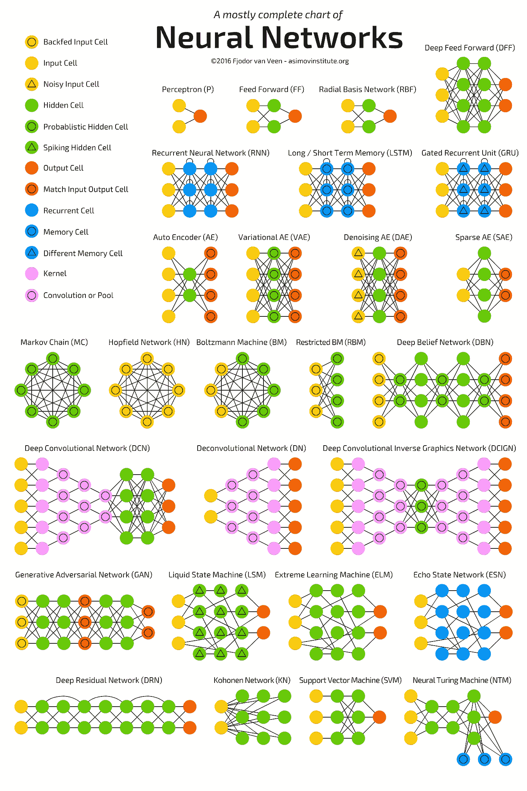
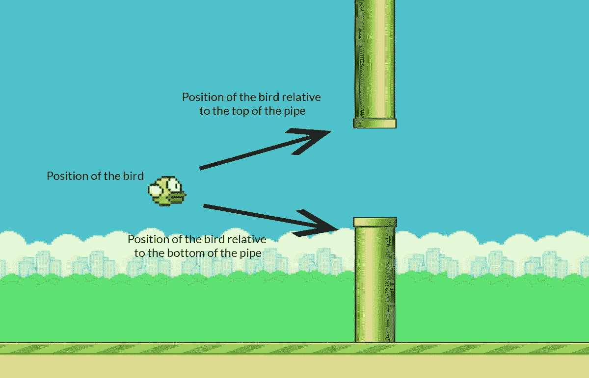
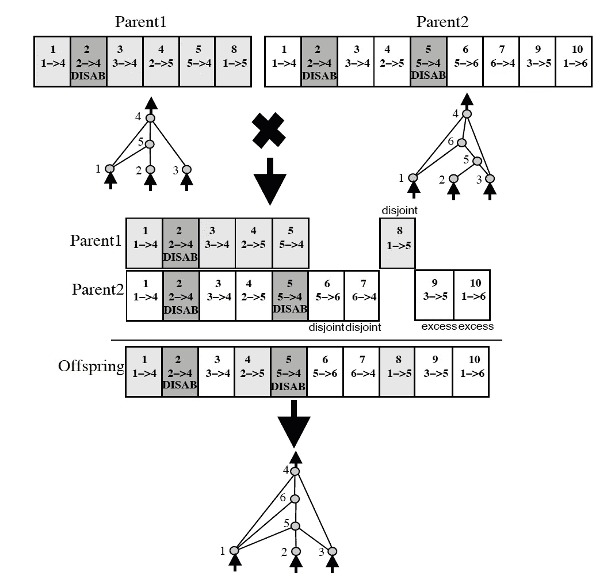

# 拍打鸟 AI

> 原文：<https://levelup.gitconnected.com/flappy-bird-ai-516e06d01c2>

如果让我选择我童年玩过的最难的电子游戏，我可能会说 Flappy Bird。老实说，我小时候没怎么玩过电子游戏，但我从来没玩过 Flappy Bird。我不是那种把手机扔到房间另一边的人，因为我不能超过 30，但这仍然是一个艰难的游戏，我花了几个小时玩，但仍然不能超过 15。

于是，在了解了 AI 和强化学习之后，我决定做一个可以给我玩 Flappy Bird 的程序。在这篇文章中，我将分解代码是如何工作的，以及我如何使用 NEAT 算法来教我的计算机如何玩这个星球上最难的游戏之一。

## 术语解释

首先，NEAT 算法代表扩充拓扑的神经进化，它是一种创建人工神经网络的进化算法。

为了将这个单词分解成更小的比特，进化表明这是一种遗传算法。这意味着它受到查尔斯·达尔文进化论的启发，算法反映了自然选择的过程。换句话说，成功者会活下去，弱者会死去。

“神经进化”这个词表明神经网络正在进化，就像它在人脑中一样。生活中有回报的行为会留下来继续，而没有回报的行为会被丢弃。

由于你的神经网络越大，就越难训练，神经网络实际上从没有隐藏层开始，在第一次迭代中只有一个输入和输出层。在此之后，网络将会发展并产生新的节点或连接。然而，它不能影响输入和输出节点的数量，这些都是固定的。这使我们进入下一个工作，增加。随着对神经网络进行更多的迭代和改进，它会增加和改进。

最后，最后一个词是拓扑。拓扑只是一个描述神经网络中神经元连接的花哨术语。神经网络的不同形式和形状会影响输出。下面列出了神经网络可能采用的形式。

## 它是如何工作的

现在，整洁算法实际上是如何工作的？因为这个算法是基于自然选择和进化的，我们需要一组有自己的神经网络的 flappy 鸟，因此它们有自己独特的权重和偏好。幸运的是，我们不需要计算这些数字，算法会帮我们完成。

然而，我们确实需要弄清楚我们希望算法的输入和输出是什么。在玩 Flappy Bird 的时候，我们可以用眼睛来确定下一个管道有多远，并决定我们是否应该让小鸟跳起来。然而，不幸的是，计算机看不见，所以我们需要用数字的方式给它这个信息。

因此，该算法有 3 个输入节点。第一个是鸟的位置，第二个和第三个是鸟相对于上管和相对于下管的位置。根据这些信息，计算机将决定它是否应该跳跃，以提高它的健康分数。

适应度分数表明算法有多好。因此，在 Flappy bird 的这个场景中，我们希望这只鸟尽可能远地旅行而不死亡。因此，我们每行进一帧，我们的健康得分就会增加 1。

接下来是 NEAT 算法完成大部分繁重工作的地方。在用随机权重和偏差创建算法的第一次迭代之后，游戏被玩多次。然后，从那里开始，具有最佳适应值的鸟将存活下来，并通过基因改造变得更好。

与人类类似，神经网络具有使其独特的遗传代码和属性。比如你可能有黑色的头发和棕色的眼睛，而你的朋友有金色的头发和蓝色的眼睛，那么代码就有它的朋友没有的属性。此外，神经网络会像人类一样进化并生育子女。所以，在程序的每次运行之后，神经网络会找到另一个神经网络进行组合，并生成一个新的神经网络‘孩子’。

这个子元素将拥有父元素所拥有的元素。例如你可能是如何采用你父母的头发颜色，神经网络采用来自其父母的某些连接和节点。如果我们看看下面的例子，我们可以看到孩子的网络是如何拥有来自父母双方的元素的。

尽管这幅图相当准确，但它并没有准确地描述属性总是如何被继承的。从图中，我们可以看到在最后有一些元素是 1 没有而父元素 2 没有的，反之亦然。

正因为如此，父母中的一方拥有而另一方没有的大多数时间属性将根据他们的适应度得分而被传递。比方说，在第一次迭代之后，父代 1 具有更高的适应性分数。这将意味着当他们试图有一个“子”时，所有相同的属性将被传递，但是父 1 有而父 2 没有的不相交块也将被传递。这也意味着来自父 2 的所有不相交的块和多余的块将被丢弃。

本质上，NEAT 算法将利用神经网络的相似性，并将它们传递给它们的孩子。然后，对于没有出现在两个网络中的属性，神经网络将从具有最高适应度得分的网络中获取属性。

当创建现有神经网络的新迭代时，可以对神经网络进行 2 种可能的改变。

1.  添加一个连接突变。神经网络将连接两个先前未连接的节点。
2.  添加一个节点。这将拆分一个现有的连接，并在该连接所在的位置之间添加一个节点。

这两种变化都允许神经网络提高其适应度分数并实现其目标。幸运的是，这些决定是由 NEAT 算法做出的，用户无需编写任何程序。

## 通过物种形成进行保护

NEAT 突出的一个主要方面是它通过物种形成进行保护的特性。每次迭代后，神经网络被分成几个家族。因此，那些具有非常相似结构的被分组在一起。比如苹果配苹果，橘子配橘子。

从那里，每组中最好的神经网络被选择并迭代。这有助于对更差的神经网络进行创新和改进。不是将所有的神经网络相互比较，可能会删除一个有很大潜力的神经网络，而是将神经网络与其他具有相同结构的神经网络进行比较。

这使得更差的神经网络需要改进，并可能击败在第一次迭代中运气好的神经网络的权重和偏差。从这里，每一个神经网络被修改，一批新的 Flappy 从每一类最好的 Flappy 鸟中产生。

## 最小化维度

NEAT 算法优于其他进化算法的另一个原因是，它能够探索许多不同的拓扑结构，而不会影响速度和工作量。

与 NEAT 不同，大多数神经进化算法从随机拓扑开始。从随机拓扑开始是必要的，因为在多次迭代成功的拓扑之后，很难随机创建新的拓扑。然而，随机拓扑阵列可能不是最有用的方法。

由于这些拓扑在开始时从未经历过游戏和/或活动的任何迭代，因此无法知道该拓扑是否真的必要或有用。因此，该算法可能会浪费大量的时间和精力来试图将一个正方形放入一个圆孔中。

相比之下，NEAT 从没有隐藏层的统一网络群体开始。这允许神经网络的结构在一次又一次的迭代中逐渐增长和改进。此外，因为拓扑受到物种形成的保护，所以可以保证结构只会在必要时成长。这样，NEAT 通过最少数量的权重维度进行搜索，大大减少了找到解决方案所需的代数。

总而言之，NEAT 算法对于强化学习来说是一个绝对高效且有能力的算法。该算法有许多好处，因此它可以快速迭代，并有效地为 Flappy Bird 游戏找到正确的神经网络。

## 关键要点

*   NEAT 代表扩充拓扑的神经进化
*   它的工作方式是从神经网络的输入层和输出层开始，然后根据需要进行构建
*   在每次迭代之后，神经网络从获得最高适应度分数的神经网络中获取元素，对自身进行遗传修改
*   具有低适合度分数的神经网络被丢弃
*   NEAT 是特殊的，因为它包含的属性使它比其他神经进化算法更有效。这些属性包括通过物种形成和最小化维度来保护创新。

这是对 NEAT 算法的更多介绍，要了解更多关于 NEAT 的内容，你可以在这里阅读研究论文[！](http://nn.cs.utexas.edu/downloads/papers/stanley.cec02.pdf)