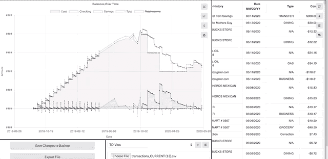

# flask:Python 中后端开发的灵活微框架

> 原文：<https://levelup.gitconnected.com/flask-a-flexible-micro-framework-for-backend-dev-in-python-9cfaf1114095>

## 打造紧凑型大功率服务器


图片由[古伊列梅·斯特卡内拉](https://unsplash.com/@guilhermestecanella)在 [Unsplash](https://unsplash.com/) 上拍摄

如果你还没有读过我以前的文章，让我以一个简短的个人声明作为这篇文章的序言:我是一个数据迷，当然也是一个图形爱好者——我的朋友和同事会衷心地证明这一点。

由于我的兴趣，我经常发现自己在项目中使用数据表。Excel 表格、CSV 文件、SQL 表格……你明白了。例如，在过去的两到三年里，我在一张我高度保密的个人财务表上对每一笔交易进行了跟踪和分类。

在你认为我完全疯了之前，这比听起来容易。大部分工作只是从我的卡提供商那里下载交易数据，并将其放入一个正在进行的表中。非常简单。然而，几周前，我的朋友给了我一个好主意，让我建立一个应用程序来进一步自动化我的追踪。当时我正在寻找我的下一个项目，所以这听起来像是一个很好的机会来建立一些我个人可以利用的东西。

现在，当我想到数据表操作时，我会想到 Python。特别是 Pandas 和 Numpy 库，它们是当今最强大的数据分析和表格操作工具包。这个项目会给我一个极好的机会去探索两者的能力。

问题是这样的:我想用 React 构建我的 GUI(主要是出于熟悉)，当时我唯一有经验的后端框架是 Ruby on Rails 框架。强迫 Rails 后端与 Python 脚本接口，虽然可能是一个有趣的项目，但会非常复杂，而且对我试图做的事情来说完全没有必要。因此，我决定使用一个用 Python 编写的后端框架来充分利用一个更适合我所想的工作的工具包。

# 我的解决方案:Flask Python 框架


烧瓶标志和座右铭

Flask 是用 Python 语言进行 web 开发的微型框架。微框架的具体含义是，在项目开发的开始阶段，它几乎没有可用的特性和样板代码。这并不是说 Flask 框架没有可用的特性库和插件库，但是默认情况下，Flask 会倾向于*而不是*包含一个特性，除非你作为开发人员另有说明。

这与 Rails 或 Django(后者是另一个非常流行的 Python web 框架)等框架有很大的不同，在这些框架中，为您创建项目提供了大量的特性和便利。例如，这两个框架都提供了一个数据库抽象层，允许开发人员通过对象模型轻松地读写数据库(例如，Rails 通过活动模型，Django 通过其对象关系映射器)。

微框架的缺点显然是在启动时缺乏这些特性。更广泛的框架中的许多(如果不是全部)特性都存在于 Flask 库中，但是它们必须被显式包含。然而，最大的好处是，如果你不打算使用这些特性，那么制作一个 Flask 应用程序会容易得多，而且不需要删除大量不必要的文件和依赖项。微框架应用程序的代码膨胀要少得多，并且总是可以根据需要使用额外的工具进行扩展。

出于我的目的，我的后端只需要是一个 API，用于读写数据文件，并返回格式化的 JSON 对象。事实上，我甚至不需要数据库。在我的例子中，Flask micro 框架更容易实现，并为我提供了根据需要包含更多 Python 模块的灵活性。

## 设置它:

设置 flask 服务器非常简单。首先，您需要将 flask 模块安装到您选择的 python 环境管理器中。

在您激活的环境中，创建一个新文件(命名为 app.py 是 Flask 期望的缺省值),并在其中键入以下内容:

就是这样！在六行代码中，我们已经为一个正在运行的 Flask 服务器编写了足够的代码。就这么简单。此时在命令行中键入“flask run”将启动一个服务器，在根域中有一条路由返回字符串“Hello，World！”。Flask 解释路由请求，并运行为该特定路由编写的函数。该函数的返回值是作为对 URL 请求的响应返回的内容，但是我们将在后面更详细地探讨请求响应。

这个六行服务器主要展示了 Flask 作为一个微框架的强大功能；我们可以用极少量的代码生产一个运行中的服务器，并根据需要添加。然而，这个服务器远远没有用，它需要更多的功能来运行我们所需要的功能，所以让我们概述一下 Flask 的一些内置功能，看看我们可以构建什么。

# 按指定路线发送

Flask 提供了一个完整的接口来控制路由，包括标准路由、动态 URL 和 URL 参数。

## 标准路由:

可以使用 route decorator 手动包含路由，将 URL 指向控制器函数以获得唯一的响应值。例如，手动写出多条路线可能如下所示。

另外，请注意，可以使用可选的方法参数明确告知路由它们接受什么类型的请求。这样，可以完全控制和定制路由响应，以满足应用程序的需要。

## 参数:

还可以包括动态 URL 参数。当接收到一个请求时，Flask 能够解析一个 URL 并提取可以用来控制请求响应的参数。例如，可以向/users/*username_here*发出请求，该请求可以根据提供的 URL slug 定位用户的数据。

上面的代码将把 URL 中提供的任何用户名传递给 get_data 函数，为不同的用户返回适当的值。

## 参数:

与参数类似，Flask 可以读取为附加规范传递的 URL 参数。它从请求对象获取参数值，这是 Flask 框架的一个可选特性。请确保您还从“flask”模块和“Flask”构造函数一起导入了“request”。

例如，上面的代码可以向数据库查询给定用户在 URL 参数中传递的日期范围内的帖子。

有了这些特性，Flask 为框架内置的 URL 响应提供了充分的灵活性，并且所有这些特性仍然完全可以从单个文件中管理。

# 跨产地资源共享(CORS)

默认情况下，Flask 遵循 CORS 约定，这意味着在没有额外设置的情况下，正在运行的 Flask 服务器将只响应来自运行该服务器的同一个域的请求。这对于用来提供 HTML 视图的 Flask 服务器来说很好，但是对于构建 API(就像我需要做的)来说，这是有问题的，因为我们的 API 的目的是与运行在其他域上的应用程序接口。

Flask 提供了一整套定制 CORS 设置的工具，并且(和 Flask 的方式一样)默认不包括它！我们可以简单地将“flask_cors”模块安装到我们的 python 环境中，并通过将“从 flask_cors 导入 cors”添加到导入中，将其导入到我们的 app.py 中。

有几种方法可以自定义我们的 CORS 设置，我将列出一些从最少到最多的限制:

## 接受所有域请求:

接受来自任何和所有域的请求可能是最容易实现的。您只需将存储了初始化 Flask 实例的 app 变量传递到导入的 CORS 构造函数中。见下文。

## 对给定模式的多条路线应用 CORS 限制:

这可能会有点复杂，但比方说，你希望所有的域都能够访问你的后端，但只能通过某个/api/ route，你已经建立了公开可用。CORS 构造函数包含一系列可选参数，包括“origins”，一个所有可接受的起源域的列表；和“方法”，外部域可以请求的已接受方法的列表；和一些标题选项。

然而，这些可选参数中最灵活的是“resources”参数，您可以将一个 regex URLs 字典作为键传递给它，CORS 选项作为它们各自的值。这意味着，如果一个 URL 从外部域传入，它将检查“resources”键中 regex 匹配的键。如果找到匹配项，则该键的选项用于限制和/或允许来自匹配域的请求。换句话说，您可以在单个“requests”可选参数中紧凑地组织和定制来自任何可能的 URL 的访问，您希望从这些 URL 接收请求。我已经尽力在下面的代码片段中列出了一些例子:

更多详情，请查阅[烧瓶文件](https://flask-cors.readthedocs.io/en/latest/)。

## 特定路线的 CORS 限制:

最后一个是最具体的，并且在许多情况下比 resources 键更容易实现。您可以使用“@cross_origin”装饰器将自定义 CORS 规范应用到一条路线。

例如，上面的代码只允许从接受的用户域获取用户，只允许从接受的图片域获取图片。这是我主要使用的方法，因为我发现它更容易实现。

上面列出的特性结合在一起，为您的 API 或服务提供了来自主机域之外的源的可访问性的完全定制。既然我们已经讨论了路由和可访问性，那么让我们来讨论如何格式化返回给请求源的值。

# 返回值

Flask 可以返回各种数据类型作为返回值，对于开发人员来说，它实际上是相当不错的，因为它可以直观地将某些 Python 数据类型转换成您所期望的响应。下面，我列出了一些最标准的返回类型以及它们是如何实现的。

## HTML/模板:

如果路由函数的返回值是一个字符串，Flask 将自动构造一个格式正确的返回对象，并将传递的字符串作为响应的主体。从技术上来说，这意味着如果你返回静态 HTML，你可以把你的 HTML 存储在一个“视图”文件夹中的一系列文本文件中，并在需要时提供给用户。虽然这对于 HTML 注入来说是 100%安全的，但它绝对不是动态的，在当今大多数情况下也绝对不是最佳实践。对于动态 HTML 模板，我们实际上可以依赖 Flask 默认包含的少数几个库中的一个:Jinja2 模板引擎。

如果您以前使用过 rails，这个引擎的功能与 Rails 提供的动态视图文件非常相似。变量可以传递给模板文件，代码可以在模板中执行，允许根据请求动态生成 HTML。例如，给定以下路线:

和下面的 greeting.html 文件:

将返回以下两种 HTML 布局之一:

Jinja2 库还清除了变量输入，以防止有害的 HTML 注入发生。因此，模板既减少了您编写的代码量，提供了更多的灵活性，又为您的站点提供了安全性。更多详情，请随时查阅 [Jinja2 文档](https://jinja.palletsprojects.com/en/2.11.x/)。

## JSON 对象:

对于 API 生成(这是我的财务应用程序所需要的)，JSON 对象通常是最常见的返回数据格式。Python 确实包含用于 JSON 化字典的库，但事实证明 Flask 也知道这一点。Flask 在这方面对我们很好，因为如果您从 route 函数返回 dict，它会将字典识别并格式化为 JSON 对象。

上述代码将尝试通过数据处理程序类添加一个新条目。如果成功，它返回一个状态为“成功”的 dict 和请求体。如果不成功，它将返回“失败”状态。在这两种情况下，Flask 都会自动将 dicts 转换成 JSON。

根据我的经验，返回列表对象会在发送端和接收端产生类似的成功行为。因此，如果您需要转发的只是一个条目列表，那么可以像处理字典一样返回列表，但是可能会有意想不到的副作用。

## 文件:

最后，Flask 能够将文件发送到前端进行下载或跨服务器数据传输。这也可以通过从“flask”模块导入“send_file”方法来完成。

总的来说，这些文件类型构成了你对任何 URL 请求的大部分响应，并且一如既往，可以参考 [Flask Docs](https://flask.palletsprojects.com/en/1.1.x/) 以获得进一步的参考。最后，我想通过概述将定制模块导入到您的服务器环境中是多么简单，来提一下 Flask 作为服务器框架的定制的便利性。

# 定制代码和 Python 的强大功能

虽然这可能不是 Flask 的一个特别的特性，但我认为值得一提的是，将自己的代码、组织和文件结构包含到任何 Flask 项目中是多么容易。请记住，到目前为止，本文介绍的所有内容都可以在一个文件中完成，并且可以紧凑地启动。但都还是 python 代码。

就像我们可以导入‘flask’和‘flask _ CORS’模块一样，我们可以导入我们想要的任何其他 python 模块。熊猫，Numpy，Xlrd，我们自己的定制模块——世界是我们的！回到我们的起源，对 Flask 的探索是作为一种为金融跟踪应用程序开发 Python 后端的手段开始的。在这篇文章的最后，我想概述一下 Flask 与我的应用程序执行所需任务所需的所有其他 Python 库的接口是多么简单。

到目前为止，我们在 Flask 中查看的所有内容都可以(而且通常应该)在一个 app.py 或 routes.py 文件中完成。所以我们现在的文件树看起来像这样:

```
app.py
```

更像是一个树桩而不是一棵树，但是这个文件本身就能够处理我们的服务器运行所需的所有路由控制。至于应用程序的功能，我将可执行代码分成三个独立的文件:

1.  **loaders.py —** 导入的“Pandas”——负责将数据文件加载到 Pandas 数据帧中，并将数据帧保存到数据文件中
2.  **data_handlers.py —** 导入“熊猫”和“Numpy”——从 loaders.py 接收数据帧，并处理所有遍历、计算和表操作
3.  **json_parsers.py** —导入的“json”——从 data_handlers 接收处理过的数据，并将响应格式化为适当的 JSON 格式。将 JSON 返回到 app.py

这些可执行模块允许我分离我的应用程序的职责，所有这些都被组织到一个名为“控制器”的文件夹中。(我在 Rails 时代养成的习惯……)

我还将我所有的数据文件保存在一个“资源”文件夹中，并为不同的文件格式设置了子文件夹。这是加载器模块用来读写数据的内容。

最后，我有一些应用程序范围内的常量，我把它们保存在一个顶级的“常量”模块中。这让我可以在一个地方组织我所有的集合和属性，这些集合和属性可以被我的其他模块导入。最后，我的文件树看起来像这样:

```
app.py
constants.py
/controllers
    json_parsers.py
    data_handlers.py
    loaders.py
/resources
    data.p
    /xl_files
    /csv_files
    /pickle_files
    /exports
```

这突出了使用像 Flask 这样的微框架的主要好处和动机之一。项目结束时，存储库中的文件和文件夹只是项目使用的文件和文件夹。这是 Rails 中所没有的，Rails 为您预先生成了许多文件结构。

感谢 Flask，如此紧凑和受控的后端能够处理支持像我这样的财政狂热分子的全功能前端财务跟踪应用程序所需的所有数据处理！



我的 [Budget.py](http://griffinpoole.com/project_overview/Budget.web) 应用程序的快照，用后端 Flask 编写

我希望你喜欢我关于 Flask 作为 Python 的紧凑后端开发工具的文章。下面，我收集了 Flask 文档、Jinja2 资源、我的后端的 github repo 的链接，以及我的 Budget.py 项目的一个高亮页面，供那些想了解更多信息的人参考。

如果我成功说服你们中的任何人在下一个数据密集型项目中使用 Flask 作为后端，那么我绝对认为这是一个胜利。感谢阅读！

[](https://flask.palletsprojects.com/en/1.1.x/) [## 欢迎使用 Flask — Flask 文档(1.1.x)

### 欢迎阅读 Flask 的文档。开始安装，然后了解快速入门概述。有…

flask.palletsprojects.com](https://flask.palletsprojects.com/en/1.1.x/) [](https://jinja.palletsprojects.com/en/2.11.x/) [## 金贾-金贾文档(2.11.x)

### Jinja 是一种现代的、设计者友好的 Python 模板语言，模仿 Django 的模板。它很快…

jinja.palletsprojects.com](https://jinja.palletsprojects.com/en/2.11.x/) [](https://github.com/griftheorange/budget_web_py_backend) [## gritheorange/budget _ web _ py _ back end

### 使用 pandas/flask 后端和临时 React 前端的预算应用程序的初始化框架。Python 类和…

github.com](https://github.com/griftheorange/budget_web_py_backend) [](http://griffinpoole.com/project_overview/Budget.web) [## Budget.web 项目概述

### 一个用于个人财务跟踪的 React/Flask 应用程序

griffinpoole.com](http://griffinpoole.com/project_overview/Budget.web)