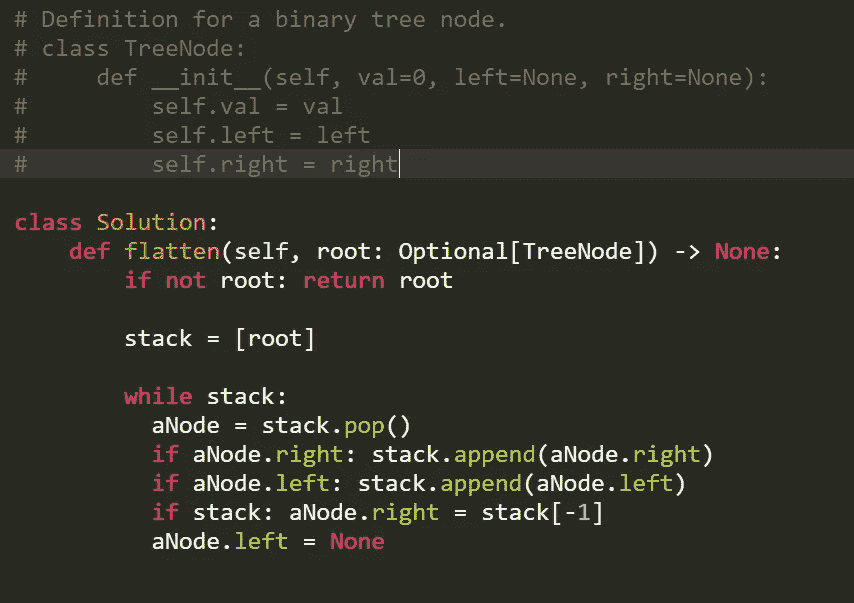
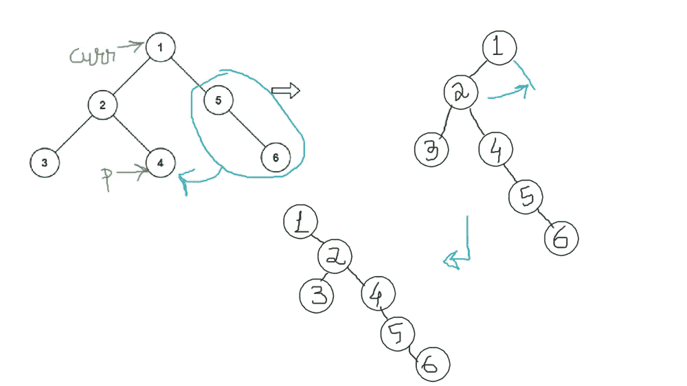

# 将二叉树扁平化为链表

> 原文：<https://levelup.gitconnected.com/flatten-binary-tree-to-linked-list-ae1969564df4>

给定一棵二叉树的`root`，将该树展平成一个“链表”:

*   “链表”应该使用相同的`TreeNode`类，其中`right`子指针指向列表中的下一个节点，而`left`子指针总是`null`。
*   “链表”的顺序应该与二叉树的 [**前序遍历**](https://en.wikipedia.org/wiki/Tree_traversal#Pre-order,_NLR) 相同。

**例 1:**


```
**Input:** root = [1,2,5,3,4,null,6]
**Output:** [1,null,2,null,3,null,4,null,5,null,6]
```

**例二:**

```
**Input:** root = []
**Output:** []
```

**例 3:**

```
**Input:** root = [0]
**Output:** [0]
```

**约束:**

*   树中的节点数在范围`[0, 2000]`内。
*   `-100 <= Node.val <= 100`

# 解决方案 1 带堆栈的 DFS:



时间和空间复杂度= O(N)

> **跟进:**你能原地把树放平吗(有`O(1)`额外空间)？

在 O(1)中解决这个问题的前景在开始时可能看起来很棘手，但是您需要知道的是前序遍历是如何工作的。这个解决方案的关键直觉是在我们进行的过程中保持“预定”顺序。

所以我们在沿着树往下走的时候维护一个指针`curr`。如果`curr`有一个左边的子节点，我们想在保持顺序的情况下将它移到右边。这将是两个步骤的过程。
创建另一个指针`p`在左子树中找到最右边的点。然后我们将`curr.right`的内容转移到`p.right`中。如果你注意的话，我们现在拥有的树(图中的阶段 2)仍然给出完全相同的前序遍历。所以现在我们只要把它移到`curr`的右边。

向右移动`curr`并重复。



```
class Solution:
    def flatten(self, root: TreeNode) -> None:
        curr = root

        while curr:
            if curr.left != None:
                p = curr.left
                while p.right != None:
                    p = p.right

                p.right = curr.right

                curr.right = curr.left
                curr.left = None

            curr = curr.right
```

**👏想支持我成为一名中等会员吗？点击[这里](https://machinelearningabc.medium.com/membership)。**