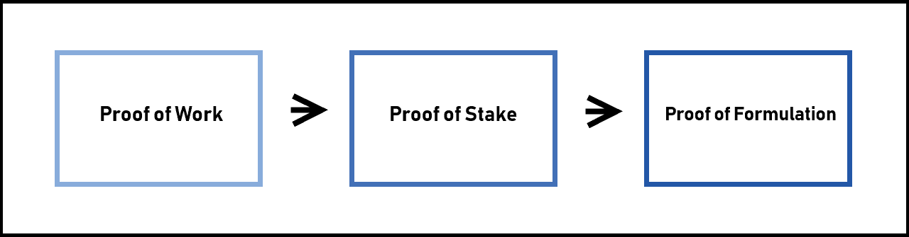
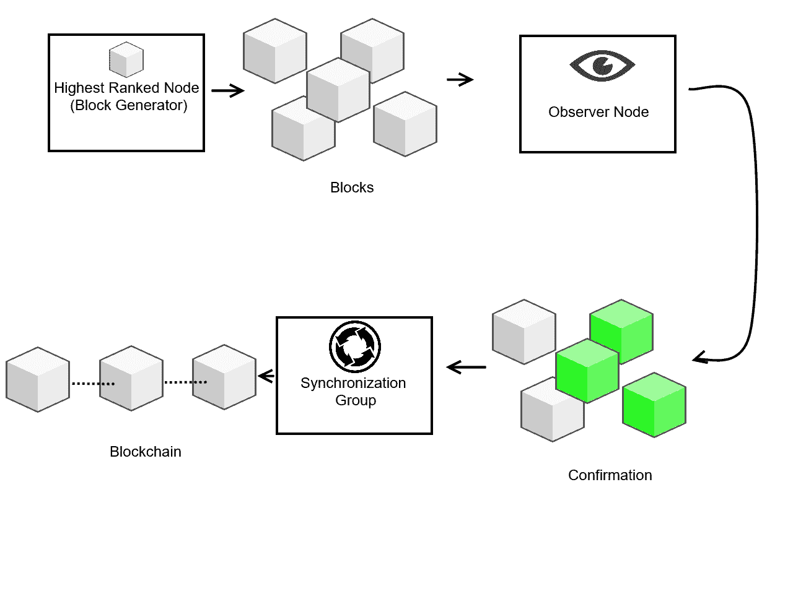

# FLETA——DApps 的区块链生态系统

> 原文：<https://levelup.gitconnected.com/fleta-blockchain-ecosystem-for-dapps-bd698fb4235b>

FLETA 是一个使用区块链技术的平台，为 DApp 开发者提供所有必要的技术和支持，以在 FLETA 生态系统中构建他们的项目。FLETA 希望充当 DApps 的服务平台，以提高交易速度并最小化开发成本。

# 一个新的共识模型

大多数加密货币利用两种主要的共识模型，PoW(工作证明)和 PoS(利益证明)。PoW 之所以受欢迎，只是因为它是第一个模型，是比特币的创造者发明的。电力并不节能，大多数现代项目都避免使用它。创建 PoS 是为了解决 PoW 模型面临的一些问题，然而，PoS 模型也不是完美的。

FLETA 开发了一个全新的共识模型，称为 PoF(公式证明)，旨在防止不必要的分叉，并创建一个更快的块生成和传播。PoF 由以下部分组成:

**-制定者组**:所有生成块并维护它们的节点，以及所有参与块生成的挖掘节点组)

**-同步组**:在配方师之间更快地传播最新的块。

**-观察者节点:**执行确认。

PoF 使用等级系统，最高等级的节点被赋予块生成器的角色，第二到第十等级被赋予同步组的角色。

块生成器，最高等级的节点，将生成块，对它们进行签名并发送到下一个观察节点，该观察节点将继续进行确认。然后，同步组通过在公式器之间更快地传播最新的块来发挥作用。观察节点将确认 5 个块中的至少 3 个，并且下一个同步组将确认整个事务记录和来自观察节点的签名，然后它将新的块添加到区块链，并且将结果发送到所有其他连接的节点。

生成块的第一个节点被排除在该组之外，并且排名第 11 的节点将成为排名 1。等级顺序由块高度决定。

如果用户想成为配方组的一员，他需要持有一定数量的代币，这些代币将会得到 FLETA 和 DApp 开发者的奖励。开发者实际上可以为他们的配方师设置他们自己的补偿系统，因此不同的令牌可以有非常不同的奖励。

# 一种新的防卡叉系统

通过添加观察者节点，FLETA 能够阻止攻击者试图创建 fork 块，这将允许他们创建双重支付。制定者一次只能创建和签署一个块，如果制定者试图创建两个或更多的块来分叉区块链，他将被实时验证该过程的观察者节点阻止。当 5 个节点中的 3 个需要签名时，检测到分叉，因此当两个或更多相同高度的块通过观察点节点时，该节点将检测到签名中的冲突，并停止分叉。

使用其他安全措施以防观察节点受到危害，使用“应急协议”来停止该链。类似地，如果配方设计师群体受到损害，则使用“Ban 协议”代替。

# 多链和可扩展性

对于 DApp 来说，可伸缩性无疑是最重要的特性之一。已经发明了许多系统来处理可扩展性问题，FLETA 使用了一个系统，其中每个 DApp 子链都运行自己的链，它独立于主链，可以无限扩展。这些独立链中的每一个都有自己的公式和观察节点。

DApp 开发者可以用他们自己的令牌支付执行费用，并且可以直接操作，但是，他们也可以选择委托 FLETA 为他们操作。主链不需要为了使子链工作而工作，因为每个子链都由它们自己的公式制定者和种子和观察者节点组成，它们在具有公共 IP 的可访问服务器外部工作。

# 新的分片模型

加密货币使用分片将大型数据库分割成较小的部分。这提高了性能和速度。通常，每个节点都必须计算和处理每一个操作和事务。例如，ETH 的速度为 20 Tx/s，Litecoin 的速度约为 56 Tx/s。然而，它们甚至无法接近 VISA 的 24，000 Tx/s 速度。显然，如果加密货币想要成为货币，它们需要更快的交易速度。

FLETA 让每个碎片独立运作，有自己的链条。碎片之间互不影响，这意味着处理速度大大提高。本质上，每个碎片几乎就像一个区块链，允许同时处理多个并行事务。

# 来源

[https://www.fleta.io/](https://www.fleta.io/)
https://medium.com/@fletachain