# flex——下一个项目或工作面试中你必须知道的 CSS

> 原文：<https://levelup.gitconnected.com/flex-a-css-you-must-know-for-next-projects-or-job-interviews-dc2e4998c140>

本文的目的是让你直观快速地理解 flex 并在你的项目或面试中使用它！让我们开始吧…

# 第 1/2 部分。父容器的属性(flex 容器)

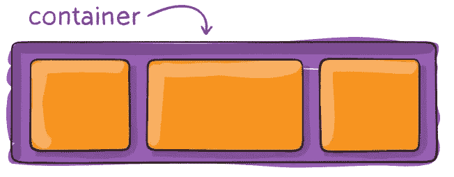

```
.container {   
  display: flex | inline-flex;flex-direction: row | row-reverse | column | column-reverse; flex-wrap: nowrap | wrap | wrap-reverse; justify-content: flex-start | flex-end | center | space-between | space-around | space-evenly | start | end | left | right; align-items: stretch | flex-start | flex-end | center | baseline | first baseline | last baseline | start | end | self-start | self-end; align-content: flex-start | flex-end | center | space-between | space-around | space-evenly | stretch | start | end | baseline | first baseline | last baseline; gap: 10px;
  gap: 10px 20px; /* row-gap column gap */
  row-gap: 10px;
  column-gap: 20px;
}
```

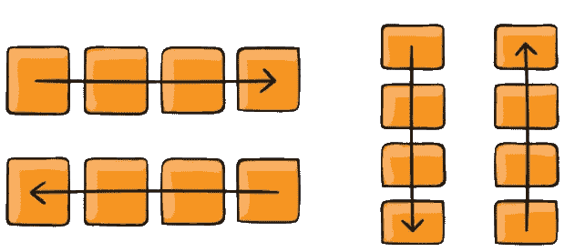

弯曲方向

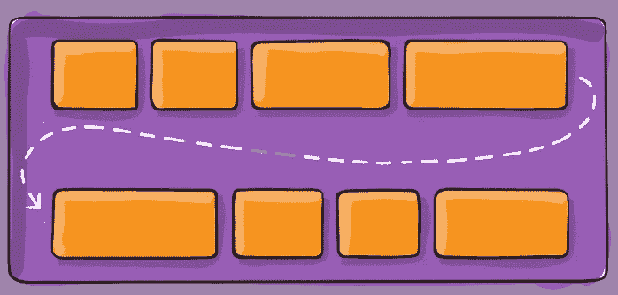

柔性包装

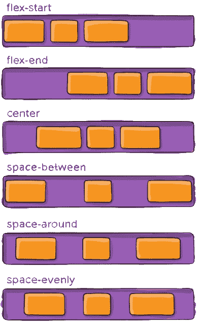

调整内容

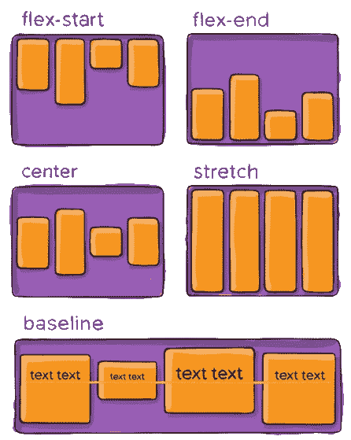

对齐-项目

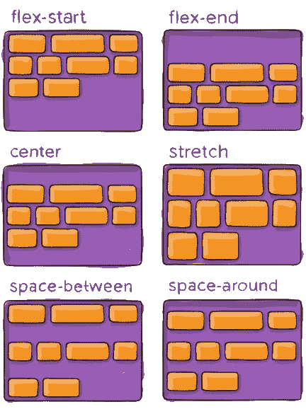

对齐内容

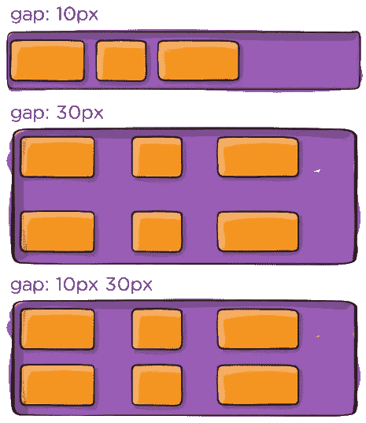

间隙、行间隙、列间隙

# 第二部分。子对象的属性(弹性项目)

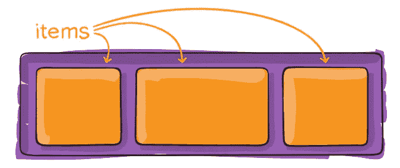

```
.item {   
  order: 5; */* default is 0 */* flex-grow: 4; */* default 0 */* align-self: auto | flex-start | flex-end | center | baseline | stretch;
}
```

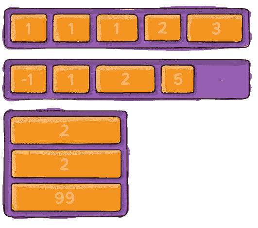

命令

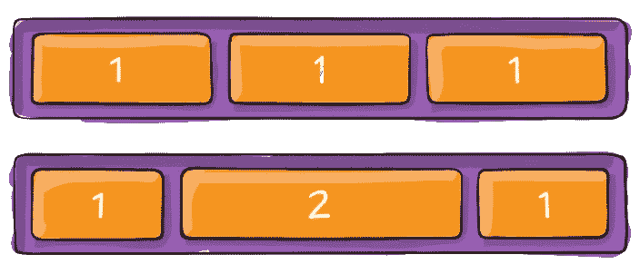

灵活增长

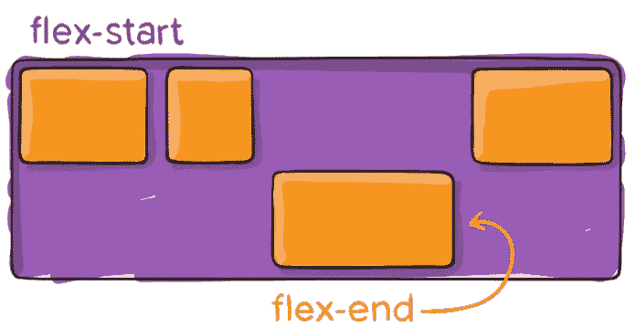

自我对齐

更多详细深入的 CSSing 请参考 [MDN](https://developer.mozilla.org/en-US/docs/Web/CSS) ，真正力量的源泉！

**呼吁行动**

如果你觉得这个指南有帮助，请鼓掌并跟我来。通过[这个链接](https://medium.com/@caopengau/membership)加入 medium，你可以在 medium 上看到我和所有其他优秀作家的优质文章。