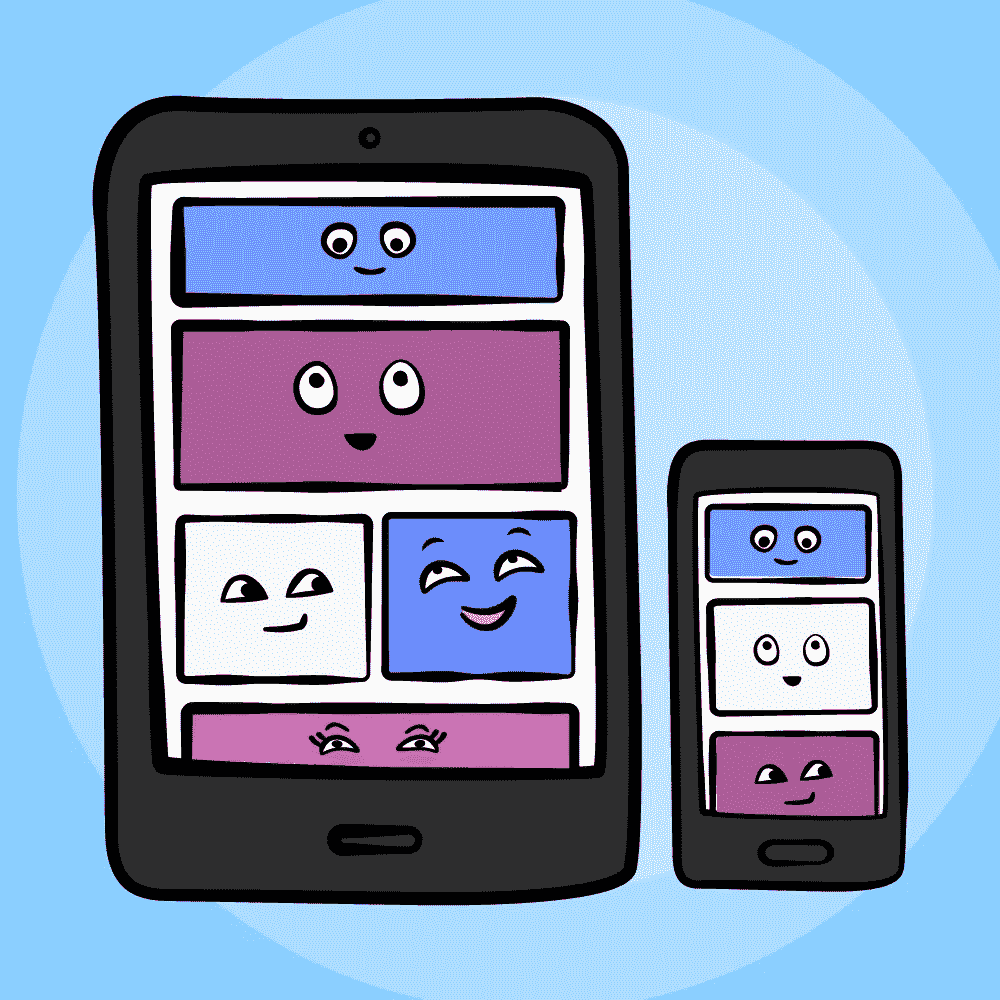
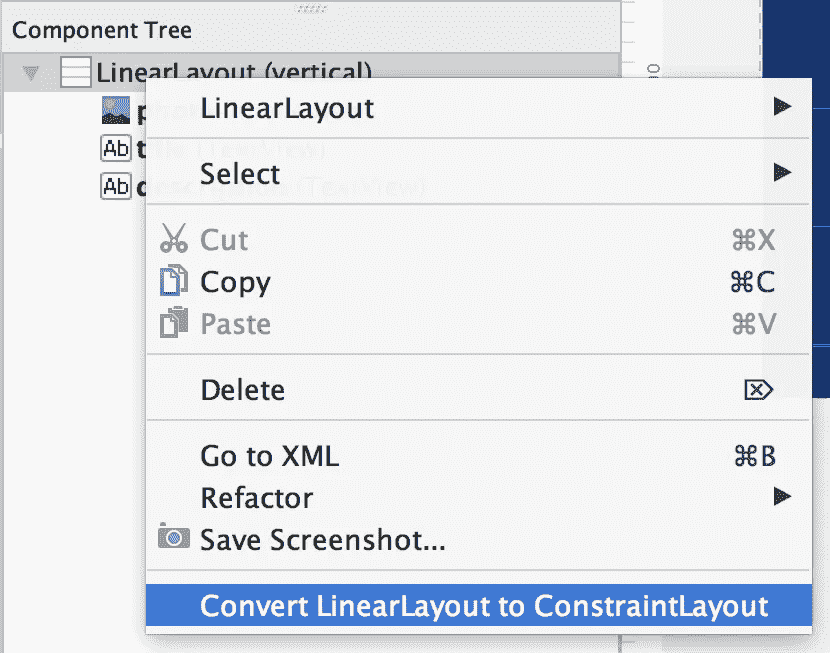
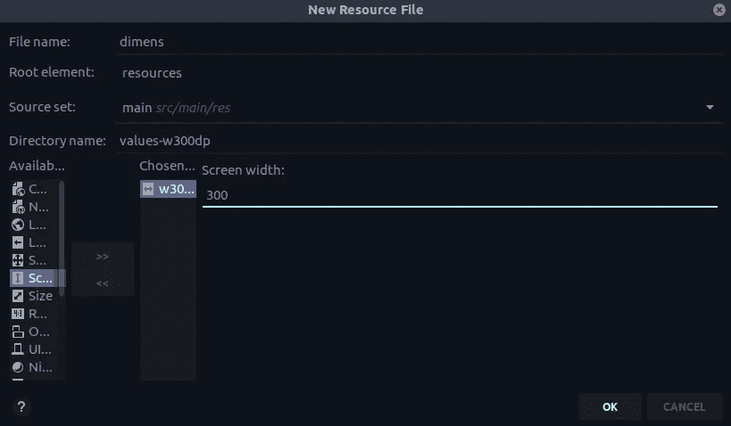
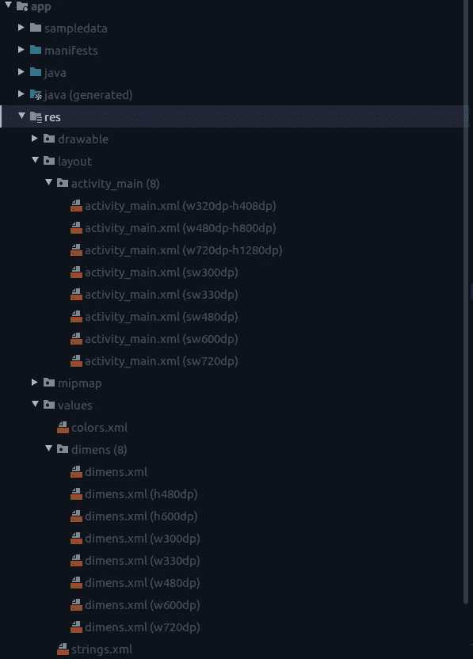
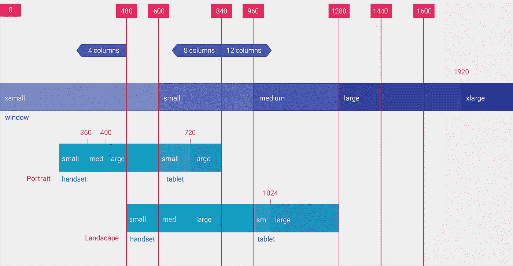

# 灵活且响应迅速的用户界面

> 原文：<https://levelup.gitconnected.com/flexible-and-responsive-ui-b17a895b2d52>

手机现在有各种尺寸，这就是为什么提供一个灵活的、反应灵敏的用户界面是如此重要。我们需要设计我们的应用程序的用户界面完全灵活，以便它可以在所有设备上正确显示。本文将向您展示如何使用 Android 中可用的工具支持不同的屏幕尺寸(对于 Android wear、电视等其他设备，我们必须采取更多步骤)。

你还可以在我的 GitHub 中看到 Responsive UI 代码实现。

 [## GolnazTorabi/责任 UI

### 解散 GitHub 是超过 5000 万开发者的家园，他们一起工作来托管和审查代码，管理项目，以及…

github.com](https://github.com/GolnazTorabi/ResponsiveUI) 

创建响应式 UI 的最佳方式是使用 [ConstraintLayout](https://developer.android.com/reference/androidx/constraintlayout/widget/ConstraintLayout) 作为我们的基本布局文件，因为在 ConstraintLayout 中，我们可以根据布局中与其他视图的空间关系来指定每个视图的位置和大小。我们可以将 LinearLayout 转换为 Constraint，或者使用 layout_weight 选项使 UI 更加灵活(但是在嵌套的 LinearLayout 中，这会降低我们的 UI 性能)。

转换为 ConstraintLayout

**所以我们有办法负责任地定义我们的布局。**

**1。尺寸**

*   对于大多数视图组件的宽度和高度，只使用 **match_parent** 或 **wrap_content** ，而不使用硬编码的布局尺寸(如设置图像宽度 60dp，如果只需要对 UI 组件使用 **dp** )。
*   仅使用 **sp** 作为文本大小，并在**dimenses**文件中定义。
*   将尺寸保存在 **dimens.xml** 文件中(不在代码上)。
*   为每种类型的设备尺寸提供尺寸**值**文件夹。

那么 dp(dip)、sp、px 的**区别是什么呢？基于 [Android 开发者文档](https://developer.android.com/guide/topics/resources/more-resources.html#Dimension):**

**dp**

与密度无关的像素—基于屏幕物理密度的抽象单位。这些单位是相对于 160 dpi(每英寸点数)屏幕而言的，在该屏幕上，1dp 大约等于 1px。当在更高密度的屏幕上运行时，用于绘制 1dp 的像素数会按适合屏幕 dpi 的因子放大。同样，在密度较低的屏幕上，用于 1dp 的像素数也会相应减少。dp 与像素的比值会随着屏幕密度的变化而变化，但不一定成正比。使用 dp 单位(而不是 px 单位)是一种简单的解决方案，可以根据不同的屏幕密度适当调整布局中的视图尺寸。换句话说，它为不同设备上的 UI 元素的真实大小提供了一致性。

**sp**

与比例无关的像素—这类似于 dp 单位，但它也根据用户的字体大小偏好进行缩放。建议您在指定字体大小时使用此单位，这样可以根据屏幕密度和用户偏好进行调整。

**px**

像素—对应于屏幕上的实际像素。不推荐使用这种测量单位，因为实际表示可能因设备而异；每个设备每英寸的像素数可能不同，并且屏幕上可用的总像素数可能更多或更少。

**如何创建多个活动或维度不同的文件:**

1.  创建一个新的资源目录:res > New > Android 资源目录

2.选择资源类型作为布局

3.在目录名中添加软件 <n>dp，例如 layout-sw300dp，并点击 **OK**</n>

**对于尺寸**:

1.  右键单击 dimens 文件:新建>值资源文件
2.  添加名称并选择屏幕宽度或高度，然后像这样设置大小:

结果是这样的:

**值**不同屏幕尺寸的文件夹尺寸。根据 [Android 开发者文档](https://developer.android.com/training/multiscreen/screensizes)。

*   320dp:典型的手机屏幕(240x320 ldpi，320x480 mdpi，480x800 hdpi 等)。
*   480dp:手机大屏~ 5”(480 x800 mdpi)。
*   600dp:一款 7 英寸的平板电脑(600x1024 mdpi)。
*   720 DP:10 英寸平板电脑(720x1280 mdpi、800x1280 mdpi 等)。

对于每个布局尺寸，我们定义了一个布局文件夹，如 **layout-w600dp** (用于 7”平板电脑或任何 600dp 宽度的屏幕)，或 **layout-h600dp** (用于高度)。因为我们不想根据设备的最小宽度或高度来改变布局，所以我们根据当前可用的宽度或高度来改变布局。对于定位，我们可以为您的资源目录名(**RES/layout-land/main _ activity . XML**)定义 **port** 或 l **a** nd 限定符。

当我们设计多种屏幕尺寸时，我们希望确保我们不会不必要地在活动中重复我们的 UI 行为。所以我们应该使用[片段](https://developer.android.com/guide/components/fragments)将我们的 UI 逻辑提取到单独的组件中。例如，当设备是平板电脑时，我们在屏幕左侧显示菜单，但在常规尺寸的手机中，我们不想显示该菜单。

使用这些限定符指定的尺寸是**，而不是实际的屏幕尺寸**。更确切地说，这些尺寸是针对活动窗口可用的**DP 单位的宽度或高度。**

首先，我们将下面的代码添加到清单文件中。

如果您想在用户报告 UI 有问题时方便地获取用户手机的大小，下面的方法适合这种情况。

或者，如果设备有导航栏，则计算其高度:

有时，我们检查**键盘是否正在运行**，然后**增加**或**减少**填充或边距。因此，我们必须在它运行时使用一个监听器，将这些更改应用到布局中，当它关闭时，返回到以前的 UI。

首先，将这些代码添加到 kotlin 文件中

然后创建一个监听器类

在 OnResume 方法中，我们必须像下面这样使用它:

**2。图标和图像**

*   **第一种方式**是针对不同的屏幕分辨率，在几个可绘制的文件夹中提供不同的图像和图标。对于图像，请**不要使用固定值和添加填充。**

drawable-ldpi//240 x320
drawable-mdpi//320 x480
drawable-hdpi//480 x800
drawable-xhdpi//720 x 1280
drawable-xxhdpi//1080 x 1920
drawable-xxxhdpi//1440 x 2560

*   第二种方法是使用九补丁位图，我们可以将它用于不同的屏幕尺寸。为了创建 9 补丁文件，我们右击 PNG 文件并选择**创建 9 补丁文件** **文件**。然后键入文件名，然后*.9.png 文件将被创建，我们可以打开该文件并更改文件的大小等。(更多信息，参见[创建可调整大小的位图(9 补丁文件))](https://developer.android.com/studio/write/draw9patch)。
*   **第三种方式**(我认为是最好的方式)是对图像使用 vector，因为它兼容不同的大小(建议使用 srcCompat 设置 image，而不是 src，因为对于 SVGs，在以前的 android 版本中使用 src 时会出现问题)

# 结论

正如本文所提到的，在多种设备上为我们的应用程序提供一个响应迅速的 UI 是非常重要的。如需更多帮助，您可以查看 [materialIO](https://material.io/design/layout/responsive-layout-grid.html#columns-gutters-and-margins) 。感谢您阅读我的文章。