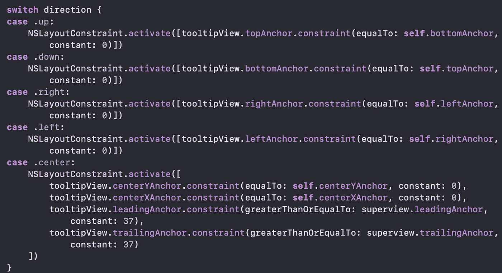

# iOS 中灵活的工具提示

> 原文：<https://levelup.gitconnected.com/flexible-tooltips-in-ios-1ffa5d7d2f36>

你有没有遇到过这样的情况，一旦你的用户界面完成，实现，所有的动画都工作了，像素完美，漂亮地对齐并调整到所有的屏幕尺寸，就像设计的一样。你对自己的作品感到非常自豪，终于可以一边喝着咖啡，一边向所有的大学炫耀自己的作品了。这时，你的设计师走过来告诉你:“还有一件事！”。

还有一件事实际上是一个工具提示教程，有一些规则:

*   背景将变暗为黑色
*   该项目必须保持突出显示，这意味着它不应该变暗
*   工具提示必须与项目对齐，不管它出现在屏幕上的什么位置

那是你放下咖啡的时候(因为你不想烫伤自己😅)并对自己说:“哦不！！现在怎么办！？?"

在这篇文章中，我们将讨论几个可能的解决方案，还有一个是我们在我的团队中提出的，最终解决了任何视图结构或屏幕大小的问题😀。

正如你在上面的图片中所看到的，添加的工具提示突出显示了我们添加的项目，使其余的内容变暗。

你开始思考可能的解决方案:

1.  **忽略你的设计者，只添加没有暗背景的工具提示:**😂😂😂谁从来没有，对不对？
2.  **在屏幕上方放置一张带有提示的图片:**如果我们有单一尺寸的屏幕，这可能行得通(哦，那是只有一部 iPhone 和一部 iPad 的好时光😂)，但考虑到我们有一系列不同的屏幕尺寸，单独处理它们并不实际。

3.**屏蔽你想要突出显示的视图，将模糊的视图放在整个屏幕的顶部，并剪切出被屏蔽的框架:**这可能行得通，但对我来说似乎太复杂了。下一个？！！😅

4.最后，我想说的解决方案:**将视图快照高亮显示，在屏幕顶部添加变暗的视图，将快照置于其上，并呈现工具提示。**牛逼！我们有赢家了！！！**🎉🎉🎉**

# **快照解决方案**

好了，让我们回顾一下:

1.  快照视图以高亮显示
2.  在所有东西的顶部添加一个透明的黑色视图，使其变暗
3.  将带有快照的图像视图放在暗视图的顶部
4.  显示组件的工具提示

这时你可能会告诉自己:“当然，这是有道理的！！!"。所以剩下的就是让我们检查如何让它发生！😀

# 实施

好了，首先，我们将获取想要突出显示的视图的快照，仅此而已。以下是如何做到这一点:

然后，您需要从您想要的视图中获取图像，只需使用 **myView.snapshot** 。奇迹发生了！😎

厉害！也就是说，现在我们所要做的，就是将视图放在它所在的位置，无论我们使用什么样的布局结构。你说怎么做？还以为你不会问呢！😁

这里我们有两个函数，用于**将视图的快照添加到父视图**中，以及**移除它**。 **addSnapshot** 将为您完成所有工作，这意味着它将获取特定视图的快照，并将其添加到我们调用它的视图中。示例:

考虑这个屏幕，我们想要快照**按钮**并将其放置在**主视图**中。我们可以简单地调用:**parent view . add snapshot(of:button)。**🧙‍♂️又变魔术了😀。而要移除，只需:**parent view . remove snapshot s()**。

但是，你可能会想，在上面的例子中，布局结构看起来一点也不复杂，在正确的位置添加快照不会很难。这就是它有趣的地方，因为我们使用了 **globalPoint** 转换，视图将总是被准确地放置在它看起来应该在的地方，不管它在哪里，甚至在单元格内的视图中也是如此😎。

太好了，我们有快照了，下一步呢？使主视图变暗，并将快照放在其上。让我们看看如何:

像快照一样，我们这里有两个函数，用来**添加暗视图**和**移除暗视图**。添加将约束它到视图的全尺寸和淡入，这只不过是动画阿尔法到 1。如果你好奇的话，以下是代码:😀

话虽如此，我们现在想要的是添加暗视图，然后在其上添加快照，方法如下:

1.  ***parentView*** ？。addDarkView ()
2.  ***高亮查看*** ？。**添加快照**(in:***parent view***)

这就是你应该得到的结果:

厉害！现在，我们所要做的就是在所有东西的顶部添加工具提示视图，我们就可以开始了！我们开始吧！

## 工具提示视图

这里的目标是构建一个工具提示，它可以面向下或向上(或者应用程序要求的任何其他方向)。我们将使它简单，只有文本和一个按钮，用于移动到下一个或关闭工具提示。

为了更直观，我将在 XIB 文件中构建它，并从代码中调用它。指示器基本上是指向工具提示可能指向的每个方向的箭头。

这是它在 Swift 中的样子:

这里没有什么太花哨的东西，只是添加了组件引用，添加了超时功能和一个当它从屏幕上消失时被调用的回调函数。对于我们来说，使用约束使之灵活的重要事情是使**translatesautoresizigmaskintoconstraints = false。这将确保视图可以放置在任何地方，并遵守我们稍后将添加的约束。**

我们可以在枚举中定义工具提示的可能方向:

一旦创建了视图，我们就可以从 UIView 扩展中添加一个简单的初始化器来显示带有我们想要的项目的工具提示:

然后我们需要根据选择的方向来约束视图和指示器:

添加视图不超出屏幕边框的约束:

然后，我们可以最终显示工具提示并设置超时(以防用户不点击关闭):

结果是:

完成后，您的代码中就有了一个完全工作的灵活的工具提示引擎。告诉你的设计师把他们能想到的所有工具提示都带来，因为我们已经准备好了！！😎🚀

GitHub 中提供了完整的代码，它包含一个工具提示管理器，我将在另一篇文章中讨论。我希望你喜欢它，并且它对你有帮助！编码快乐！😁

[https://github.com/eharrison/MagicTooltips](https://github.com/eharrison/MagicTooltips)