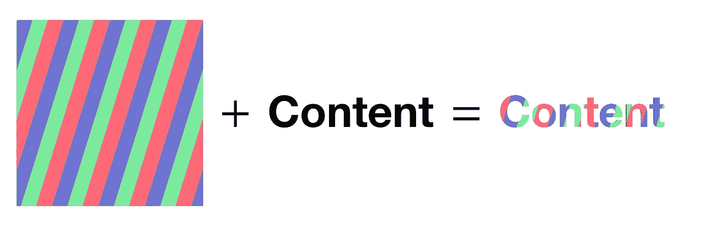

# SwiftUI 中的流动文本动画

> 原文：<https://levelup.gitconnected.com/flowtextmodifier-in-swiftui-using-a-custom-viewmodifier-887e48f0aece>

## 让-马克·布里安内

快速浏览一下我们今天要创建的内容。在本教程结束时，您将能够使用自定义的`ViewModifier`为 SwiftUI 应用程序中的任何文本添加这种“流动”效果。下面是一个例子。

```
Text("FlowTextModifier")
    .modifier(FlowTextModifier(background: Image("TestImage")))
```

就这么简单！

在开始之前，请考虑使用[这个链接](https://trailingclosure.com/signup/)订阅，如果你没有在[TrailingClosure.com](https://trailingclosure.com/)上阅读这篇文章，请随时来看看我们。


看看我们今天将创造什么

## 入门指南

对于本教程，我们将只创建一个文件，所以请随意在当前项目或本教程的新项目中进行测试。

首先，创建一个名为`FlowTextModifier`的新类，并确保它继承自`ViewModifier`类。还要确保实现`body`函数，并像现在一样返回`content`。

> 关于`ViewModifier`类的更多信息，请点击查看苹果开发者文档[。它实际上是接受原始视图或内容，使用修饰符对其进行修改，然后返回修改后的内容。](https://developer.apple.com/documentation/swiftui/viewmodifier)

这是我们目前应该有的:

```
public struct FlowTextModifier: ViewModifier {

    public func body(content: Content) -> some View {
        content
    }

}
```

我们的`ViewModifier`的工作方式是，我们将为它提供一个背景`Image`，它将在`content`的顶部从左向右移动。这将给它流动的动画。然后，为了确保我们保留传入的`content`的可见性，我们将屏蔽这个图像。



“内容”上方的背景图像被遮罩。

在我们屏蔽一个`Image`之前，我们需要创建一个。因此，为`FlowTextModifier`创建一个`init`函数，并让它接收一个`Image`作为参数。

```
var image:Image

init(background: Image) {
    self.image = background
}
```

## 修改`content`

我们将添加这个现在蒙版(在这个例子中非常丰富多彩)的图像作为叠加。让我们开始吧。

```
public func body(content: Content) -> some View {
    content
        .overlay(
            // Masked Content Here
        )
}
```

然后我们将添加一个`GeometryReader`作为覆盖图中的根`View`。这将有助于我们稍后计算覆盖的移动...

```
public func body(content: Content) -> some View {
    content
        .overlay(
            GeometryReader { geo in
                // Masked Content Here
            }
        )
}
```

然后包括我们之前定义的`image`。我们做这个`resizable()`是为了随着`content`的传入而成长。此外，我们已经用传入的`content`屏蔽了图像。

```
public func body(content: Content) -> some View {
    content
        .overlay(
            GeometryReader { geo in
                // Masked Content Here
                self.image()
                    .resizable()
                    .mask(content)
            }
        )
}
```

## 运行这段代码会给我们…


## 如果你想在你的模拟器上试一试，就使用这个代码和图片吧！

该图像只是我为了测试的目的用草图做出来的。请随意使用您喜欢的任何图像:)

```
import SwiftUI

struct FlowTextTest: View {
    var body: some View {
        Text("FlowTextModifier")
        .font(Font.system(size: 45, weight: .bold, design: .rounded))
        .modifier(FlowTextModifier(background: Image("FlowTextTestBackground")))
    }
}
```


## 制作文本动画

接下来，我们将开始制作背景动画。我们要做的是创建一个计时器，每秒触发一次，改变图像的`offset`。

## 修改图像偏移

为了跟踪偏移量，我们需要创建一个`@State`变量来跟踪它。在定义了`image`变量的地方，继续为`offset`添加一个变量。

```
public struct FlowTextModifier: ViewModifier {

    var image:Image
    @State var offset:CGPoint = .zero

    // Rest of the class...

}
```

然后更新我们的图像来使用这个新的偏移…

```
public func body(content: Content) -> some View {
    content
        .overlay(
            GeometryReader { geo in
                // Masked Content Here
                self.image()
                    .resizable()
                    .offset(x: self.offset.x, y: self.offset.y)
                    .mask(content)
            }
        )
}
```

## 创建计时器

现在在类的顶部添加计时器。这将每秒发布更新，然后我们将使用它来改变我们的`image`的偏移量。

```
public struct FlowTextModifier: ViewModifier {

    var image:Image
    @State var offset:CGPoint = .zero
    let timer = Timer.publish(every: 1, on: .main, in: .common).autoconnect()

    // Rest of the class...

}
```

现在通过编辑你的图像代码来接收你身体内部的更新。

```
public func body(content: Content) -> some View {
    content
        .overlay(
            GeometryReader { geo in
                // Masked Content Here
                self.image()
                    .resizable()
                    .offset(x: self.offset.x, y: self.offset.y)
                    .mask(content)
                    .onReceive(self.timer) { _ in
                        // Update offset here
                    }
            }
        )
}
```

## 计算偏移

为了更容易计算偏移量，我们将创建一个函数，每次触发`Timer`时都会调用这个函数。我的看起来像这样。

```
func getNextOffset(size: CGSize, offset: CGPoint) -> CGPoint {
    var nextOffset = offset

    if nextOffset.x + (size.width / 10.0) > size.width {
        nextOffset.x = 0
    } else {
        nextOffset.x += size.width / 10.0
    }
    return nextOffset
}
```

它通过`GeometryReader`接收`content`的大小以及当前偏移量。然后，它将下一个偏移量推进视图宽度的 1/10。您可以根据自己的喜好进行修改:)

> 如果你的读者想修改你的动画的速度，方向等，这里是一个好地方。在测试时，我创建了自己的`FlowAnimationType` enum 来玩其他动画。这个代码可以很容易地扩展，以支持垂直移动，以及任何其他类型的路径，你希望你的图像采取。

## 使用`getNextOffset`功能

```
public func body(content: Content) -> some View {
    content
        .overlay(
            GeometryReader { geo in
                // Masked Content Here
                self.image()
                    .resizable()
                    .offset(x: self.offset.x, y: self.offset.y)
                    .mask(content)
                    .onReceive(self.timer) { _ in
                        // Update offset here
                        let newOffset = self.getNextOffset(size: geo.size, offset: self.offset)

                        if newOffset == .zero {
                            self.offset = newOffset
                            withAnimation(.linear(duration: 1)) {
                                self.offset = self.getNextOffset(size: geo.size, offset: newOffset)
                            }
                        } else {
                            withAnimation(.linear(duration: 1)) {
                                self.offset = newOffset
                            }
                        }
                    }
            }
        )
}
```

让我们很快过一遍。在第一部分，我使用我们的`getNextOffset`函数获取新的偏移量。然后我们决定下一个偏移是否在`zero`。我们这样做是为了让我们可以选择是否动画化这个变化。如果你能想象当图像移动并到达内容的末尾时，它将需要快速回到开头来重放。我们不想将这种变化制作成动画，因为这样看起来就像动画在反过来播放。因此，我们在第一个`if`案例中将偏移量设置为`.zero`，然后获取下一个偏移量来继续动画。`else`的情况是简单的所有其他时候，当图像正在移动，将动画正常。

## 测试我们目前所拥有的…

继续运行您的项目，查看我们的流动文本…


啊哦…

看起来我们就要成功了，但是有些事情不太对劲。我们的图像是动态的，但是，当它离开视图时，它会显示下面的文本。这是一个简单的修复方法。

## 添加一份`Image`

用一个`ZStack`把你的图像包起来，然后在我们的原始图像上面放一个图像的副本。然后，我们将添加一个遮罩，并使其大小可调，就像第一个一样，只是我们不会使用完全相同的偏移量。我们将使它按照我们内容的宽度跟踪原始图像。代码见下文。

```
public func body(content: Content) -> some View {
    content
        .overlay(
            GeometryReader { geo in
                ZStack(alignment: .center) {
                    self.image
                        .resizable()
                        .offset(x: self.offset.x - geo.size.width, y: self.offset.y)
                        .mask(content)
                    self.image
                        .resizable()
                        .offset(x: self.offset.x, y: self.offset.y)
                        .mask(content)
                        .onReceive(self.timer) { _ in
                            // Update Offset here
                            let newOffset = self.getNextOffset(size: geo.size, offset: self.offset)

                            if newOffset == .zero {
                                self.offset = newOffset
                                withAnimation(.linear(duration: 1)) {
                                    self.offset = self.getNextOffset(size: geo.size, offset: newOffset)
                                }
                            } else {
                                withAnimation(.linear(duration: 1)) {
                                    self.offset = newOffset
                                }
                            }
                        }
                }
            }
        )
}
```

## 有用！

现在你可以随意摆弄它，尝试不同的背景、文本或视图！

## 支持未来的帖子

如果你喜欢这篇文章，请考虑使用[这个链接](https://trailingclosure.com/signup/)订阅我的网站，如果你没有在[TrailingClosure.com](https://trailingclosure.com/)上阅读这篇文章，请随时来看看我们！