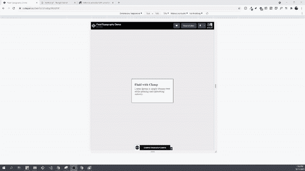

# 使用 Clamp 属性的流体排版

> 原文：<https://levelup.gitconnected.com/fluid-typography-using-the-clamp-property-1fe4dd243f46>


# 介绍

流畅排版的想法已经存在很长时间了。它是根据屏幕大小放大或缩小字体大小。过去，我们使用媒体查询来为每个不同的设备设置断点和调整字体大小。虽然这种方法仍然有效，但是它非常耗时并且难以维护。现在，随着新的 [**clamp**](https://developer.mozilla.org/en-US/docs/Web/CSS/clamp()) 属性的发布，我们只需一行 CSS 就可以实现相同的结果，而无需设置复杂的媒体查询。

# 钳制属性

*箝位*在以下语法中接受三个参数:

```
**font-size: clamp(min value, prefer value, max value);**
```

最小值:最小字体大小

首选值:首选字体大小。通常以相对单位设置。(即 rem、em、vw 等)

最大值:最大字体大小

随着屏幕大小的变化，浏览器将尝试应用首选的字体大小值，但如果首选值超过了最小/最大阈值，浏览器将改为应用最小/最大字体大小。



使用箝位调整大小

[**继续阅读**](https://simpleweblearning.com/fluid-typography-using-the-clamp-property#clamp-property)