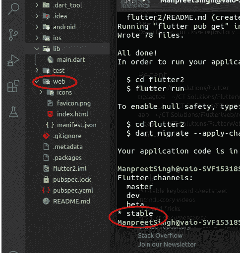

# 颤振 2:超越移动应用程序开发

> 原文：<https://levelup.gitconnected.com/flutter-2-going-beyond-mobile-app-development-9b688718b1b>

Flutter 已经存在了一段时间了。随着 Flutter 1.0 于 2018 年 12 月 4 日发布，它在过去几年中得到了发展和改进。随着来自社区的支持不断增加，今天有超过 15000 个包可用于 flutter 和 dart。自从 flutter 发布以来，在收到主要版本更新之前，它已经进行了大约 10 次更新。

*2021 年 3 月 3 日，谷歌发布了 Flutter 2。*

## **扑 2 有什么新内容？**

随着一些新特性的加入，一些特性已经被转移到 stable。

## **网**

正如预期的那样，Flutter 的 web 支持现在可以在稳定频道上获得。这意味着开发人员可以重用相同的代码(几乎不做任何修改)来创建健壮的生产级 web 应用程序。

***所以现在你可以在你的 flutter 项目中看到名为 web 的文件夹，与 android 和 IOS 放在一起。*** Web 除了安装 Chrome 浏览器，不需要任何额外的设置。

*查看 android 和 IOS 旁边的 flutter 项目中名为 web 的文件夹*

向现有项目添加 web 支持也很容易，只需在项目目录中执行“flutter create”即可。

(Flutter 目前支持热重启，不支持 web 热重装)

向现有项目添加 web 支持

向现有项目添加 web 支持

对于那些已经在 beta 频道上使用 web 的人来说， ***有一些隐藏的改进，例如添加了一个新的基于 CanvasKit 的渲染器*** (除了 HTML 渲染器)。

HTML 渲染器针对大小和广泛的兼容性进行了优化，并使用 HTML 元素、CSS、Canvas 元素和 SVG 元素的组合。CanvasKit 渲染器使用 WebAssembly 和 WebGL 将 Skia paint 命令渲染到浏览器画布上。

***CanvasKit 具有更快的性能和更高的小部件密度，但会增加大约 2MB 的下载大小。*** (默认情况下，应用程序在移动浏览器上运行 HTML 渲染器，在桌面浏览器上运行 CanvasKit)。

这里有一个例子，探险者的潜力坎瓦斯基特[https://flutterplasma.dev/](https://flutterplasma.dev/)

## **桌面**

Flutter 的桌面支持现在可以在一个稳定的频道上以早期发布的标志获得。这是一个测试版，但 google 有足够的信心将其放在稳定频道上(实际的稳定版本将在今年晚些时候发布)。

桌面支持现在将使开发人员能够使用相同的代码库为桌面生成本机代码。它目前支持 Windows、macOS 和 Linux。

***对于使用 Linux 发行版的，有加成；Canonical 已经与 Flutter 合作，将 Flutter SDK 作为 Snap store*** 上的一个快照，这使得建立开发环境变得非常容易，尤其是对于那些刚接触 Flutter 和/或 Linux 的人来说。

*Flutter SDK 在 Snap store 上以快照形式出售*

Canonical 还宣布，flutter 将成为他们未来任何桌面和移动应用程序开发的默认选择。

## **嵌入式系统**

丰田已经采用了一种新的方法来使用 flutter 构建下一代车辆信息娱乐系统。虽然他们的最终产品还没有准备好，但我们可以期待在不久的将来。

现在，嵌入式系统或车载信息娱乐系统是许多开发人员不熟悉甚至不感兴趣的东西。但丰田选择 flutter 恰恰显示了 Flutter 的潜力。

使用单一代码库，开发人员现在可以为 Android、IOS、Windows、Linux macOS 和 Web 开发本地应用程序。

感觉 Flutter 将成为所有程序员都需要的新瑞士刀。*这里有一个使用相同代码库*[*https://flutter.gskinner.com*](https://flutter.gskinner.com)构建的适用于不同平台的 flutter 应用程序示例

## **Dart 中的声音零安全**

另一个从测试版转移到稳定频道的特性是声音零安全。健全的空安全通过分离可空类型和不可空类型使类型系统更加健壮。 ***这反过来确保在开发过程中捕捉到空错误，并防止空错误崩溃。***

简而言之，空安全确保默认情况下没有数据类型可以为空(即具有空值)。这意味着任何在变量初始化之前访问变量的操作都会被编译器认为是非法的。

因此， ***一个未初始化的变量现在会在编译时被检测到并被处理*** ，否则就会导致运行时异常。

因为开发人员总是可以确保变量不能有空值，所以可以避免空值检查。这减少了代码行和执行过程中的操作数量。

但是其他语言也提供了空安全。dart 的 null 安全有什么特别之处？

***Dart 的空安全是健全的。它只是意味着当 dart 确定一个变量不可空时，该变量总是不可空的。许多编程语言都有不健全的空值安全性，它们需要运行时检查空值。***

这里有一个例子，显示了健全的零安全和不健全的零安全之间的区别。

用 Java 和 dart 编写了相同的代码。(Java 没有健全的空安全)

## Java 语言（一种计算机语言，尤用于创建网站）

NullPointerException

正如我们在输出中看到的，java 编译代码没有任何错误，在运行时，抛出了著名的“ **NullPointerException** ”。

## 镖

编译时引发了错误

在 dart 的例子中，错误是在编译时抛出的，这允许开发人员在开发时自己纠正代码。这确保了生产代码的安全执行。

但是如果我们需要一个变量为空呢？既然如此，我们可以简单地把‘T2’？数据类型后的'让编译器知道变量可以为 null。

放'**？数据类型后的**让编译器知道变量可以为空。

pub.dev 包存储库中的许多包已经升级，但安全性为空。

## **颤振修复**

巨大的更新带来了巨大的挑战，尤其是当我们想到旧代码的时候。旧代码必须更新以包含新的变化/特征，这可能是一项单调乏味的任务。但是 flutter 已经用 Flutter Fix 为我们解决了这个问题。

***Flutter Fix 识别不推荐使用的成员，并为用户提供自动将代码迁移到新版本的选项。***

这里有一个颤振修复用例的例子

用例

用例

## **谷歌手机广告 SDK for Flutter**

Google mobile ads SDK for flutter 现已推出公测版。这个插件提供内嵌横幅和原生广告以及现有的覆盖格式。 ***这个插件统一了对 Ad manager 和 Admob 的支持。***

*广告经理和 Admob。*

## **颤振开发工具**

在 flutter 中最有用的调试工具之一是 DevTools，但是在 flutter 2 中，它现在被重命名为 **Flutter DevTools** 。但这不仅仅是更名。

它的新功能之一是能够识别比显示分辨率更高的图像。这可以使用“抖动”检查器中的“启用反转超大图像”来完成。

一些其他增加的功能是平均 fps 信息，在 Flutter Inspector 的布局浏览器中显示固定布局的能力，等等。

示例:这里显示的图像在分辨率上明显大于显示器，因此启用“反转超大图像”会使图像上下颠倒。

在 Flutter Inspector 的布局浏览器中显示固定布局的功能

反转超大图像

## **新部件**

flutter 2 中引入了两个新的小部件，名为 **AutocompleteCore** 和 **ScaffoldMessenger** 。

*AutoCompleteCore* 顾名思义，在 flutter 应用程序中提供自动完成功能。

自动完成核心

*ScaffoldMessenger* 可以处理几个与 SnackBar 相关的问题。它可以创建 Snackbar 来响应 AppBar 操作，并使 Snackbar 在脚手架转换之间保持不变。它还可以在异步操作后显示 Snackbar，即使用户已经导航到具有不同框架的页面。

**其他公告**

*   微软正在与 flutter 合作，为 flutter 带来对可折叠设备的支持。
*   谷歌最大的应用之一，全球月活跃用户超过 1.5 亿，即 Google Pay，现在正在被改写。这将代码行从 170 万减少到了 110 万。
*   更新的 firebase 插件现在可以安全使用了

## **如何升级 Flutter？**

升级到最新版本的 Flutter 只需在 cmd 或终端上运行“flutter upgrade”即可。

颤动升级

Flutter 正在快速发展，看起来它将会存在很长一段时间。所以对于那些喜欢保持简单快速而又不牺牲功能的人来说，flutter 是一个很好的选择，试一试吧。😊

通过[***insta gram***](https://www.instagram.com/ctsolutions.sh/)*[***Twitter***](https://twitter.com/catalyst_sh)*[***LinkedIn***](https://www.linkedin.com/company/13707239/admin/)联系我们**

**或者给我们发电子邮件✉️到 **admin@catalyst.sh.****

**查看我们的其他博客 [*这里*](https://medium.com/@alka.jha_87549) 。**

** [## 2021 年该不该学 Flutter？

### 如果你一直在问自己这个问题，那么让我告诉你，你是在正确的地方，短…

ct-solutions.medium.com](https://ct-solutions.medium.com/should-i-learn-flutter-in-2021-e5e5d9d0046d)  [## 无头 CMS——集成 Gatsby 和 WordPress

### headless CMS 是一个后端内容管理系统，允许内容创作，将内容作为…

medium.com](https://medium.com/swlh/headless-cms-integrating-gatsby-with-wordpress-f68b0b8f163)**