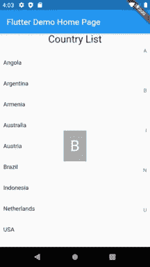
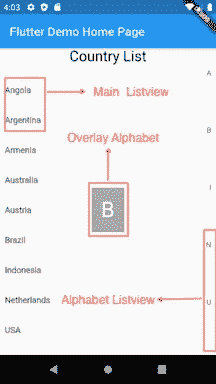

# 颤动字母索引列表视图

> 原文：<https://levelup.gitconnected.com/flutter-alphabetical-indexed-listview-84fcf570b9e1>


照片由 [Sid Balachandran](https://unsplash.com/@itookthose?utm_source=medium&utm_medium=referral) 在 [Unsplash](https://unsplash.com?utm_source=medium&utm_medium=referral) 上拍摄

我又带来了另一篇关于 Flutter 的文章。

在这篇文章中，我将告诉你如何在 Flutter 中创建一个字母索引列表视图。那么，什么是字母索引列表视图呢？

如果你是智能手机用户，你至少见过下面这个屏幕一次。通常它是一个应用程序注册流程中的一个屏幕，让你选择你的国家代码。



所以我想，这是一个非常有趣的小部件，可以用 Flutter 来探索。所以我决定制作一个这个屏幕的例子。开始了。

像往常一样，如果您喜欢直接查看代码，可以在我的 GitHub 资源库中找到。

[](https://github.com/blackmenthor/flutter-alphabetical-indexed-view-example) [## black mentor/flutter-字母索引视图-示例

### 一个新的 Flutter 应用程序实现了字母索引列表视图。这个项目是一个扑的起点…

github.com](https://github.com/blackmenthor/flutter-alphabetical-indexed-view-example) 

首先，我希望您了解这个小部件的组件。基本上，这个小部件只有三个组件，即:



*   主列表视图

这个组件将用于向用户显示我们的主要项目，我们可以定义我们将如何在这个小部件的参数之一绘制每个项目。这一点将在下面详细解释。

*   字母表列表视图

该组件将用于向用户显示列表中所有项目的第一个索引。我们为什么需要这个？通常这个小部件旨在帮助用户更容易地找到他们想要的项目。

例如，如果我想在所有项目中找到`Indonesia`，我不必从所有项目的最顶端滚动到前面有 I 字符的项目，然后我会找到我想要的国家。我可以从字母表中点击`I`，然后在那里找到印度尼西亚。

*   重叠字母指示器

这个组件将被用来显示用户正在选择的字母索引，就在他们点击它之后。为什么？主要是因为审美的目的，但我认为它也可以帮助用户确定他们之前点击了哪个字母。

其次，我们需要定义这个小部件所需的参数。我们将这个小部件称为`IndexedListView`，我们将把它称为`StatefulWidget`。为什么不是一个`StatelessWidget`？因为我们需要根据小部件的状态进行一些计算，不过我们稍后再讨论。

对于参数，我们在这个小部件中有三个参数，它们是:

*   列表项目

该参数将保存将在`ListView`内绘制的项目列表。例如，对于上面的国家代码选择器屏幕示例，它将是一个`CountryCode`项目。

*   IndexedWidgetBuilder 项目生成器

这个参数的类型是从 Flutter 最初的`ListView`实现中导入的。它基本上是一个函数，接收一个`BuildContext`和一个`Int index`，并将返回为列表中的每一项绘制的所需部件。

*   双项目高度

此参数将定义每个项目的小部件的高度。我们为什么需要这个？因为我们需要计算当每个字母索引被点击时，我们要去的位置。如果我们有了每一项的精确高度，计算我们将要去的精确滚动位置就容易多了。

最后，我们将直接讨论实现。

在`build`函数中，我们将创建一个堆栈，在其中我们将放置列表小部件(`_itemsList`)和覆盖字母表小部件(`_currentCharIndex`)。所以，它会看起来像这样。

```
[@override](http://twitter.com/override)
Widget build(BuildContext context) {
  return Stack(
    children: <Widget>[
      _itemsList(context),
      _currentCharIndex(context)
    ],
  );
}
```

接下来，对于`currentCharIndex`，我们将需要一个状态对象来存储我们将要显示的当前字母表。姑且称之为`currentChar`。如果当前字符是一个空字符串，我们什么也不显示，如果不是，我们就覆盖它。所以，它看起来像这样:

```
String currentChar = "";// index to show when alphabet is selected
Widget _currentCharIndex(BuildContext context) {
  return currentChar.isEmpty
      ? Container()
      : Align(
    alignment: Alignment.center,
    child: Container(
      color: Colors.black.withAlpha(80),
      padding: EdgeInsets.all(16.0),
      child: Text(
        currentChar,
        style: TextStyle(
            color: Colors.white,
            fontSize: 36.0
        ),
      ),
    ),
  );
}
```

接下来，对于`itemsList`，我们将有两个小部件并排放置。一个将是主列表视图，另一个将是字母列表视图。我们在状态中还需要一个`ScrollController`对象，将两个 listview 绑定在一起并触发滚动。另外，不要忘记处理`ScrollController`。

对于主 Listview，代码将是直接的，因为我们不会在那里做任何计算，但对于字母表 Listview，我将在上面的其他部分解释更多。因此，代码将如下所示:

```
ScrollController _scrollController;[@override](http://twitter.com/override)
void initState() {
  _scrollController = ScrollController();
  super.initState();
}[@override](http://twitter.com/override)
void dispose() {
  _scrollController.dispose();
  super.dispose();
}// main items list view
Widget _itemsList(BuildContext context) {
  return Padding(
    padding: const EdgeInsets.only(top: 7.0),
    child: Row(
      mainAxisAlignment: MainAxisAlignment.start,
      crossAxisAlignment: CrossAxisAlignment.start,
      children: <Widget>[
        Expanded(
          child: ListView.builder( // Main Listview
              controller: _scrollController,
              itemCount: widget.items.length,
              // manually set item height for scrolling calculation
              itemExtent: widget.itemHeight,
              itemBuilder: widget.itemBuilder
          ),
        ),
        _alphabeticalIndex(context, widget.items) // Alphabet Listview
      ],
    ),
  );
}
```

现在，最有趣的部分，字母列表视图。

我先展示代码，然后再解释。

```
List<String> getAlphabetsFromStringList(List<String> originalList) {
  List<String> alphabets = [];for (String item in originalList)
    if (!alphabets.contains(item[0]))
      alphabets.add(item[0]);alphabets.sort((a,b) => a.compareTo(b));return alphabets;
}// side alphabetical index to select
Widget _alphabeticalIndex(BuildContext context, List items) {
  List<String> alphabets = getAlphabetsFromStringList(items.map((item) => item.toString()).toList());Map<String, int> alphabetIndex = _getAlphabetIndex(items);return LayoutBuilder(
    builder: (context, constraint) {
      if (constraint.maxHeight < 350.0) return Container(); // alphabet list does not fit, might as well hide it
      return Container(
        width: 34.0,
        key: alphabetContainerKey,
        child: GestureDetector(
          onVerticalDragUpdate: (DragUpdateDetails dragUpdateDetails)
            => _onVerticalDragUpdate(dragUpdateDetails, alphabets, alphabetIndex),
          onVerticalDragStart: (DragStartDetails dragStartDetails)
            => _onVerticalDragStart(dragStartDetails, alphabets, alphabetIndex),
          onVerticalDragEnd: _onVerticalDragEnd,
          child: Column(
            mainAxisAlignment: MainAxisAlignment.end,
            crossAxisAlignment: CrossAxisAlignment.end,
            children: []..addAll(
                List.generate(
                    alphabets.length,
                        (index) => _getAlphabetItem(alphabets[index])
                )
            ),
          ),
        ),
      );
    },
  );
}
```

那么上面的代码中发生了什么呢？

首先，我们需要用户可以访问的可用字母表的列表。我为此使用了一个单独的函数，称为`getAlphabetsFromStringList`。我认为这很简单，所以我不会解释太多。

接下来，我们需要每个字母表的第一个项目的索引。那是什么意思？例如，如果我有一个项目列表[Aa，Ab，Ac，Ba，Bb，Bc，Ca，Cb，Cc]，那么我将需要索引`Aa`，`Ba`和`Ca`，它们将是[0，3 和 6]。

我将为此编写另一个函数，姑且称之为`_getAlphabetIndex`。基本上，这个函数所做的就是遍历所有的条目，如果没有一个条目包含字母字符，就将该字符的索引添加到一个映射中。它看起来会像这样:

```
// function to calculate alphabet dy index positions (e.g. {'A':0, 'B':8, ...})
Map<String, int> _getAlphabetIndex(List items) {
  Map<String, int> alphabetIndex = {};
  for( var i = 0 ; i < items.length; i++ ) {
    final firstChar = items[i].toString()[0];if (!alphabetIndex.containsKey(firstChar)) {
      alphabetIndex[firstChar] = i;
    }
  }
  return alphabetIndex;
}
```

接下来，我将把字母表 listview 包装在一个`LayoutBuilder`中，这样我就可以得到这个小部件的`Constraints`。我们为什么需要这个？因为我发现，如果我们把这个字母表视图放在一个高度很小的小部件中，我们就不能把所有的字母表都放进去。

因此，我们将检查这个部件的最大高度是否小于 350，我们将隐藏字母表，因为它不适合。

如果合适，我们将创建一个 34 宽度的`Container`(这个是可变的，取决于你的需要)并为它分配一个全局键。为什么我们需要一个全局密钥？

我们需要 GlobalKey，这样我们就可以计算出用户点击了哪个字母项，并根据计算结果滚动到相应的项。我们称这个全局键为`alphabetContainerKey`。

接下来，我们将创建一个实现了所有三个`onVerticalDrag`可选参数的`GestureDetector`(我将在下面对此进行解释)。最后，实际的字母表部件将放在一个`Column`中，每个项目有一个简单的`Text`部件(不要忘记将每个项目放在一个`Expanded`中，这样每个项目的高度将是均匀的)。

最后，我们进入了文章最有趣的部分。我们将把字母表列表视图上的点击绑定到主列表视图。

我们要写上面刚写的`GestureDetector`的`onVerticalDragStart`、`onVerticalDragUpdate`和`onVerticalDragEnd`。

因为当用户触摸一个字母表时，我们将滚动主 Listview，如果用户拖动到另一个字母表，我们将继续滚动。因此，`onVerticalDragStart`和`onVerticalDragUpdate`将做完全相同的事情。那就是:

```
// scroll to proper items with alphabets when drag started
void _onVerticalDragStart(DragStartDetails details, List<String> alphabets, Map<String, int> alphabetDyPositions) {
  final index = _getAlphabetIndexFromDy(details.localPosition.dy, alphabets);final alphabet = alphabets[index];_scrollToItems(alphabet, alphabetDyPositions);
}
```

简而言之，我们要做的是获取用户正在触摸的字母表的索引，找到确切的字母表字符，并将主 Listview 滚动到以该字母表作为第一个字符的项目开始的确切位置。但是`_getAlphabetIndexFromDy`和`_scrollToItems`函数是做什么的呢？

对于`_getAlphabetIndexFromDy`，它将基本上计算整个字母表列表视图的高度，然后用它除以我们提供的字母表长度(记住，我们通过使用`Expanded`为每个项目设置完全相同的高度)，我们将使用由`onVerticalDrag`函数提供的 Dy 来计算被触摸的字母表的索引。所以，它看起来像这样:

```
// function to get current clicked alphabet by the user
int _getAlphabetIndexFromDy(double dy, List<String> alphabets) {
  final alphabetContainer = alphabetContainerKey.currentContext.findRenderObject() as RenderBox;
  final alphabetContainerHeight = alphabetContainer.size.height;final oneItemHeight = alphabetContainerHeight / alphabets.length;final index = (dy / oneItemHeight).floor();
  return index;
}
```

现在我们得到了被点击的字母表的索引，我们需要做的就是将主 Listview 滚动到以那个字符开始的条目。我们将在`_scrollToItems`函数中实现。

这个函数基本上是将我们将要滚动到的索引乘以我们在小部件中提供的参数`itemHeight`。不要忘记将`currentChar`对象更新为一个新的对象，这样覆盖图就会显示出来。

另外，不要忘了我们必须考虑到如果滚动范围大于`maxScrollExtent`，我们将把这个数字减少到`ScrollController.position.maxScrollExtent`。我发现，当我们提供给小部件的项目列表少于 5 个项目时，会发生这种情况，因此整个主 Listview 没有满足当前设备高度。

```
// scroll to items with the first char
void _scrollToItems(String char, Map<String, int> alphabetDyPositions) {
  final indexToGo = alphabetDyPositions[char];
  // calculate by multiplying the index with each item height
  double dyToGo = indexToGo * widget.itemHeight;// if scroll is bigger than max scroll extent (e.g. overflows), then make it to max instead
  if (dyToGo >= _scrollController.position.maxScrollExtent) {
    dyToGo = _scrollController.position.maxScrollExtent;
  }setState(() {
    currentChar = char;
  });_scrollController.jumpTo(dyToGo);
}
```

最后，对于`_onVerticalDragEnd`,我们将再次异步重置`currentChar`为空字符串，否则覆盖图将永久显示。我们将在 500 毫秒后重置`currentChar`。

```
void _onVerticalDragEnd(DragEndDetails details) {
  // clear the current selected char when drag ends.
  Future.delayed(
      Duration(milliseconds: 500),
          () {
        setState(() {
          currentChar = "";
        });
      }
  );
}
```

瞧，一切都完成了！

现在你可以从你的应用程序中的任何地方调用一个`IndexedListView`小部件，行为将被包装在其中。

下面是如何使用该小部件的示例:

```
IndexedListView(
    itemHeight: 50.0,
    items: ["Aa","Ab", "Ac", "Ba", "Bb", "Bc", "Ca", "Cb", "Cc"],
    itemBuilder: (context, index) => Text(items[index]),
)
```

所以，这就是了，你已经学会了创建你自己的`IndexedListView`的所有步骤。

我知道我的实现远非完美，这就是为什么如果你对我的实现有任何意见、建议或问题，欢迎在下面评论。

感谢您的阅读，

祝你今天开心！玩的开心！