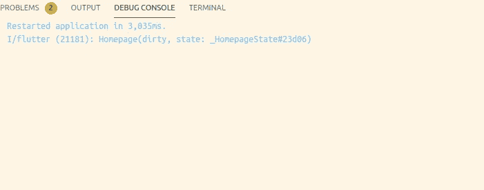
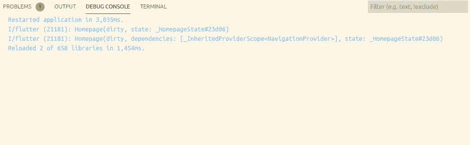
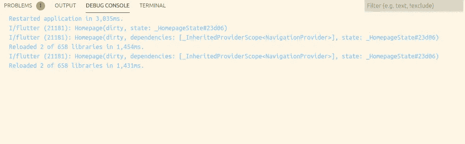

# 颤振和热装弹。

> 原文：<https://levelup.gitconnected.com/flutter-and-hot-reload-17b219362260>

## 我一直在为一个简单的特征挠头。


一个月前开始学 flutter。在我取得良好进展的同时，我有机会和一个朋友合作一个项目，这个项目使用 [provider](https://pub.dev/packages/provider) 包管理状态。我很兴奋，因为我终于有机会参与一个真正的 flutter 项目，并使用 provider 学习状态管理。我从简单的东西开始:导航提供商。我想使用 provider 模式处理应用程序内部的导航。

一切都很好，直到我好奇的头脑开始怀疑性能。在这一点上，考虑性能是不合理的。但我必须找到答案。因此，我浏览了[这篇](https://flutter.dev/docs/development/data-and-backend/state-mgmt/simple)文章，并阅读了使用 provider 时的最佳实践，以保持令人满意的性能(顺便说一下，这里的性能是指防止不必要的小部件构建。).

让我快速向你们展示我当时做了什么，以及它给我带来了什么问题。

这是我最初写的代码。只是一些标准的供应商的东西。

我在 *_HomepageState* 类的构建方法中添加了一个新的 print 语句，就在第 8 行的上面，

```
print("Home Page build called");
```

如果你熟悉*提供者*，你可能知道代码有什么问题。如果没有，第 8 行应该是这样的:

```
final navigation = Provider.of<NavigationProvider>(context,***listen:false***);
```

这可以防止每次导航到不同的页面时都运行 build 方法。因此，我很快做了上面提到的更改，并希望控制台只记录一个名为“的*”主页构建。热装弹完成了任务。print 语句执行一次。我迅速切换到不同的页面，希望不要找到更多的“主页构建调用”日志。* **但是** *，*令我惊讶的是，每次我切换页面的时候，日志都不断出现，这意味着每次都在调用构建方法。我没想到会这样。我已经阅读了 flutter 文档并做了必要的工作，但不知何故，它似乎不起作用。我关闭了我的编辑器，过了一会儿又回来，再次开始调试会话。Flutter 更新了应用程序，这次只有一个日志，即使我不停地切换页面。思考了一会儿后，我确信热重装一定没有能够拾取我所做的更改。

可以肯定的是，我撤销了之前所做的更改，从第 *8* 行删除了 *listen:false* 并保存，Flutter 立即将更改推送到应用程序中。但是这一次，更改似乎被热重载选中了，我可以看到打印语句在导航时被执行。

对我来说，这种行为很奇怪。

> 颤振热重装似乎是选择性的一些变化。

> 一旦我开始监听更改，我就不能用热重载删除监听器。

在花了一个小时左右的时间进行修改并注意到热重载行为，然后又花了一个小时在线搜索解释后，我最终决定跳到提供者包的源代码中，希望它能回答一些问题。

# 弄清楚

我走进了*里面。发布缓存*目录。(我是在 flutter 安装目录里找到的。详情请点击[这里](https://dart.dev/tools/pub/cmd/pub-get#the-system-package-cache)。

这是我找到 Provider.dart 文件的路径

```
flutter/.pub-cache/hosted/pub.dartlang.org/provider-4.3.2+1/lib/src
```

这是一段相关的代码，是理解当时情况的关键。

```
static T of<T>(BuildContext context, {bool listen = true}) {

    assert(context != null);
    assert(
      context.owner.debugBuilding ||
          listen == false ||
          debugIsInInheritedProviderUpdate,

        ); final inheritedElement = _inheritedElementOf<T>(context); if (listen) {
       context.dependOnInheritedElement(inheritedElement);
     } return inheritedElement.value;
 }
```

请注意，第一个参数是所讨论的上下文，第二个参数 listen 默认为 true。因此，默认情况下，<navigation provider>(context)的 *Provider .会监听更改，并使用提供的上下文重新构建小部件。*

当 *listen* 为 ***true*** 时，小部件监听 *InheritedElement* 的变化，当 ***false*** 时，简单地返回该值。

为了证明这种行为，我只是在代码中添加了这一行。

```
print(context);
```

这是当 *listen* 设置为 false 时的输出。



当监听设置为假时

当我把*监听*改成真热重装的时候，



当 listen 设置为 true 时(注意如何添加依赖项)

请注意依赖项是如何添加到列表中的。每当我们导航到不同的页面时，都会调用 Homepage 小部件的 build 方法。热重装完成了它应该做的。

然后我又把*监听*改为假，结果是这样的，



请注意依赖列表是如何保持不变的

这就是为什么我在热重装时没有看到任何变化。

如果您仔细查看我在上面粘贴的提供者包的代码片段，您会发现一旦我们开始监听这里的变化，

```
if (listen) {
       context.dependOnInheritedElement(inheritedElement);
     }
```

然后将 *listen* 设置为 false 并热重新加载，依赖关系列表不会改变。

代码的 else 部分不关心您是否已经在监听更改，它只是返回 inheritedElement.value。因此，当 flutter 执行热重装时，

> 我们仍在倾听变化。

你可以猜测为什么“热重启”不会有这个问题。

# 结论

颤振热重装工程，因为它应该和有时热重启是需要看到一些变化的影响。

感谢您的阅读。