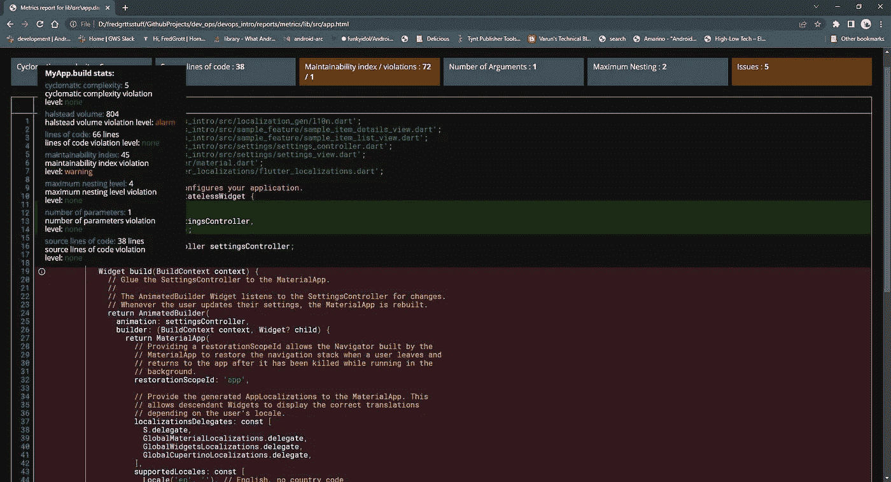
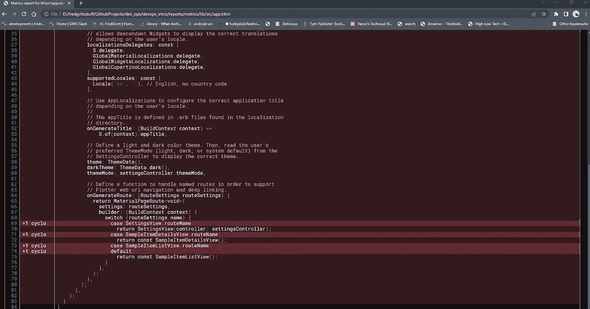
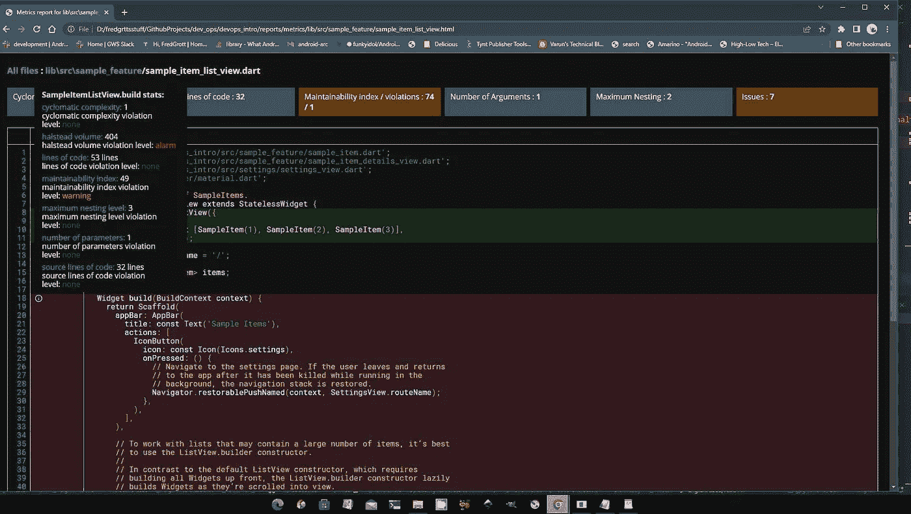

# 颤振应用程序架构，测量架构选择

> 原文：<https://levelup.gitconnected.com/flutter-app-architecture-measuring-architecture-choices-a3681bb906f5>

**Flutter 应用架构的真正开始是一个 flutter DevOPS 设置，它允许您测量您的应用架构选择对 Flutter 应用代码库的影响。但是，我们有一点小小的变化，Dart 是一种混合了命令式 OOP 和声明式 FP 的计算机语言。那么，我们如何在我们的 Flutter 应用程序代码中测量 OOP 和 FP 的代码度量呢？**

在本文中，我将向您展示如何度量和收集 Dart 代码指标，以及所有度量统计数据的含义。

# **我们如何度量 OOP 和 FP 代码度量**

我们如何在 Dart 中测量 OOP 和 FP 代码指标，以便我们有一些措施来衡量我们的代码架构选择和我们更广泛的应用程序架构选择是否正确？我们可以通过使用 Dart 代码指标包来完成这项任务:

 [## dart_code_metrics | Dart 包

### 注意:您可以在网站上找到完整的文档配置|规则|度量|反模式 Dart 代码…

公共开发](https://pub.dev/packages/dart_code_metrics) 

现在，让我展示分析选项文件中的一些示例设置，并解释为什么使用它们:

具体来说，我指的是指标集团:

先说第一个，圈复杂度。Dart Code Metrics 的作者认为它有一个功能，即 FP measure。这是不正确的，因为它是 OOP 和 FP 的度量，因为它是原始的 McCabe 圈复杂度:

 [## 圈复杂度-维基百科

### 圈复杂度是一种软件度量，用于表示程序的复杂度。这是一个定量的衡量标准…

en.wikipedia.org](https://en.wikipedia.org/wiki/Cyclomatic_complexity) 

通常，它是代码的路径流，公式如下:

**M=E-N+2P**

在哪里

**E =图的边数**

**N =图的节点数**

**P =连接组件的数量**

这并不是衡量 OOP 和 FP 架构选择的唯一标准。由于 Halstead Volumes 还测量 OOP 和 FP 的架构代码复杂性:

https://en.wikipedia.org/wiki/Halstead_complexity_measures

一般来说，它读起来像一个理想气体方程，因为我们取运算符的数目、操作数的数目和体积为:

**体积= N(程序长度)x 日志操作员数量**

小心，代码行不是源代码行！这是一个 FP 测量，因为 dart 代码度量包测量的是函数中的代码行，而不是源代码。

OP 和 FP 的可维护性指数通过以下公式衡量:

MI =最大值(0，(171 5.2 *对数(Hal vol)-0.23 *对数(CYCLO)-16.2 *对数(SLOC)) * 100 / 171)

HALVOL 是霍尔斯特德体积，CYCLO 是圈复杂度，SLOC 是源代码行。

现在，所有这些可能还没有意义。让我给你看一个骨架模板应用程序的例子。

# **通过 Dart 代码指标的骨架模板应用**

首先，下面是应用程序 dart 代码文件:

这里是 dart 代码指标报告的屏幕截图:

现在，您会注意到我们有一个 halstead 卷违规，如果我们向下滚动，我们会看到:

请注意，大小写切换混乱是抛出 Halstead 违例的原因。一般来说，大多数情况下，case 和 switch 语句会抛出代码度量违规，因为与更具声明性的 if-and-operator 语句相比，它们会使代码路径变得混乱。这意味着我们应该改用 if-operator 语句来代替多个 case-and-switch 语句，这样会使它更易于维护。

让我们看看示例项目列表视图文件中的另一个违规:

然后我们看到了报告屏幕:

你猜怎么着？是的，我需要把我的 ListView builder 和 ListTile 的东西分开，因为我得到了一个嵌套警告，因为我把嵌套设置为 4。

# **结论**

这就是如何使用一些基本设置来设置 dart 代码指标，以及如何使用 Dart 代码指标报告来更改代码架构。您可以在 dev ops GitHub repo 的 devops intro 文件夹中找到包含 dart 代码指标报告的示例设置:

 [## GitHub - fredgrott/dev_ops:颤振应用项目的开发操作

### 只是为 Flutter 应用程序设计人员和开发人员记录我的基本核心开发操作设置。起初它有基本的核心…

github.com](https://github.com/fredgrott/dev_ops) 

# 关于我

前失控多动症患者创办了一家工作室。用主题搜索引擎免费增值和付费用户界面套件的商业模式来启动我的创业公司，这是创意公司 Tim 开创的。

即将推出的付费模板可在以下网址找到:

https://app.gumroad.com/fredgrott
T3

来自恩瓦托
[https://themeforest.net/user/fredgrott](https://themeforest.net/user/fredgrott)的森林和峡谷

[https://codecanyon.net/user/fredgrott](https://codecanyon.net/user/fredgrott)

你可以通过我的社交平台帖子找到我的媒体文章好友链接:

LinkedIN
[https://www . LinkedIN . com/in/fredgrottstartupfluttermobileappdesigner/](https://www.linkedin.com/in/fredgrottstartupfluttermobileappdesigner/)

推特
[https://twitter.com/fredgrott](https://twitter.com/fredgrott)

邢