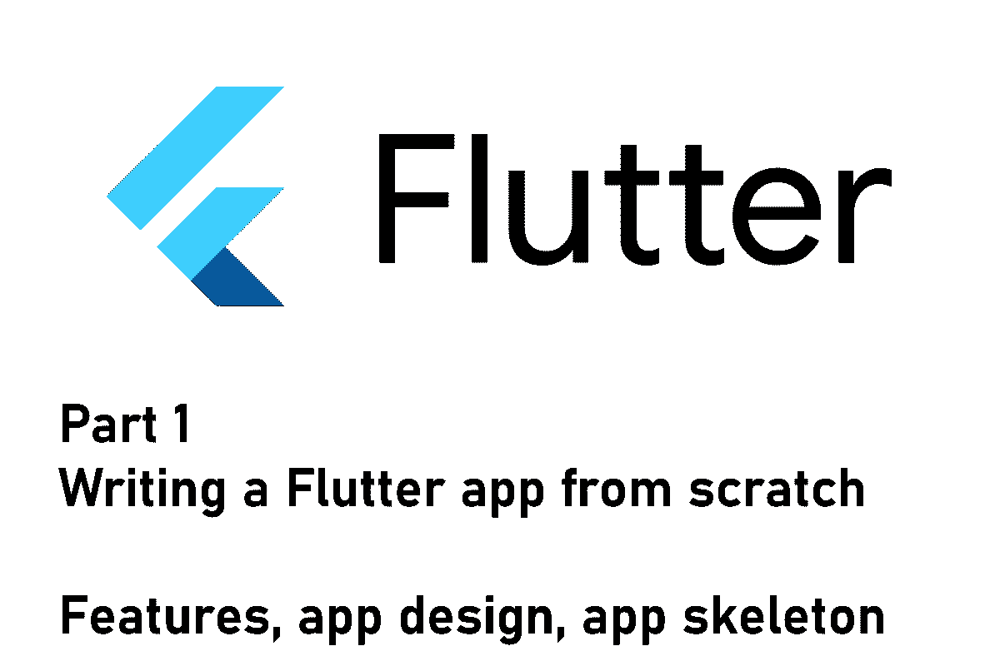
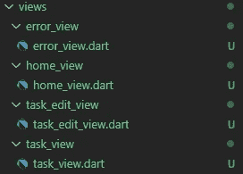
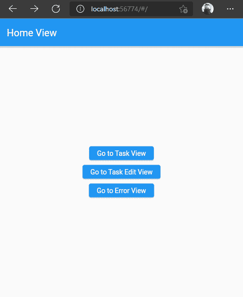

# Flutter app 从零开始第 1 部分—规划的功能、应用设计、应用框架

> 原文：<https://levelup.gitconnected.com/flutter-app-from-scratch-part-1-planned-features-app-design-app-skeleton-c87f2c21f47a>

## 从基础开始

## 如何从头开始构建 Flutter 应用程序系列的第 1 部分。本文涵盖了计划的应用程序特性、环境设置和第一个应用程序框架。



这是记录新的 Flutter 应用程序开发过程的系列文章的第一篇。我将在下面描述计划的特性、环境设置和开发过程。整个代码将在 GitHub 上发布，您可以贡献您的想法。本文还实现了第一个应用程序框架。

> 💡你更喜欢电子书而不是多媒体文章吗？现在就从我的 [Gumroad 商店](https://xeladu.gumroad.com/)免费获取[电子书](https://xeladu.gumroad.com/l/scratch)！

## 应用程序功能

目前计划的应用程序将作为一个带有提醒功能的重复任务的数字笔记本。用户可以创建任务，跟踪进度，并设置通知规则以防忘记。
例子:用户 x 发现他一天中喝得太少了。因此，他在应用程序中创建了一个任务，提醒他每天早上 10 点喝一杯水。

创建、编辑、删除周期性任务

将任务标记为已完成或已跳过

跟踪任务进度(活动时间、已完成数量、已跳过数量)
为每个任务设置提醒

早上收到当天所有任务的通知
晚上收到当天所有未完成任务的通知
【本地数据存储】

## 应用架构

目标:安卓✅，iOS ❌，网络❌，桌面❌

主要目标是 Android，其他目标可以添加额外的努力或开箱即用的工作。将使用最新的稳定颤振版本(从今天起 [2.10)。](https://docs.flutter.dev/development/tools/sdk/releases)

该应用程序将包含 3 个视图:
☆仪表板，包含所有已创建任务的信息
☆每个任务的详细视图
☆编辑视图，用于创建和更新任务

数据将存储在带有 [hive](https://pub.dev/packages/hive) 包的本地数据库中。对于状态管理，我们将使用 [riverpod](https://pub.dev/packages/riverpod) 包。对于提醒和通知，将使用包[flutter _ local _ notifications](https://pub.dev/packages/flutter_local_notifications)。

## 发展环境

源代码可以在 [GitHub](https://github.com/xeladu/flutter_app_example) 上获得。应用程序本身不会发布到任何应用程序商店。目前没有计划 CI/CD 渠道。读者需要自己检查代码，并编译一个工作的应用程序。

## 应用程序框架

现在，让我们开始编写应用程序框架。除了一个空的 Flutter 项目的常见内容之外，它将包含空的视图和导航逻辑。

可以使用命令创建新项目

```
flutter create myProject
```

首先，我们创建空视图并设置导航。现在，一个视图是一个`StatelessWidget`，包含一个带有`AppBar`的`Scaffold`和一个或多个用于导航到其他视图的`ElevatedButton`。



我们应用的第一次浏览

HomeView 有三个按钮用于导航到其他页面，当前代码如下所示:

为了在页面之间导航，我们必须设置路由。有几种方法可以实现这一点，但是我更喜欢为`MaterialApp`小部件的`onGenerateRoute`参数提供一个生成器的方法。

我们现在的路由器是这样的(见下图)。它解析传递的 URL，并尝试将其与我们的任何视图进行匹配。如果这不起作用，将使用错误视图。

使用这种路由方法，可以在 web 应用程序中输入 URL，它们可以由路由器处理。

当前应用程序状态如下所示



测试应用程序中视图之间的导航

如果您想了解关于路由的更多细节，请查看下面的文章

[](https://medium.com/flutter/learning-flutters-new-navigation-and-routing-system-7c9068155ade) [## 学习 Flutter 的新导航和路由系统

### 本文解释了 Flutter 的新导航器和路由器 API 是如何工作的。如果你遵循 Flutter 的开放设计文档，你…

medium.com](https://medium.com/flutter/learning-flutters-new-navigation-and-routing-system-7c9068155ade) 

## 结论

在本文中，我们讨论了计划中的应用程序功能、开发环境，并创建了一个具有空视图和简单导航逻辑的应用程序框架。
下一步，我们将定义模型类，并将数据库集成到我们的项目中。视图也将得到增强，以正确显示存储的数据。

源代码可在 [GitHub](https://github.com/xeladu/flutter_app_example/tree/app-1) 上获得。随着项目的进展，您可能会在存储库中看到不同的代码。

你的下一站是系列的第二部分，玩得开心🎉

[](/flutter-app-from-scratch-part-2-define-models-and-set-up-database-78a67666527a) [## Flutter app 从头开始第 2 部分—定义模型和建立数据库

### 如何从头开始构建 Flutter 应用程序系列的第 2 部分。这篇文章是关于模型定义和…

levelup.gitconnected.com](/flutter-app-from-scratch-part-2-define-models-and-set-up-database-78a67666527a) 

如果你喜欢这篇文章，我会很高兴得到掌声👏(你知道可以拍几次吗？😎)另外，如果你还没有跟上我，我也很感激。

🌲 [linktr.ee](https://linktr.ee/xeladu) |☕ [咖啡](https://www.buymeacoffee.com/xeladu) |🎁[捐赠](https://www.paypal.com/donate/?hosted_button_id=JPWK39GGPAAFQ) |💻GitHub |🔔[订阅](https://xeladu.medium.com/subscribe)

顺便说一句:如果你还没有 Medium 会员，我推荐你使用[│我的推荐链接◀](https://medium.com/@xeladu/membership) ，因为它会让你访问 Medium 上的所有内容，并以一小部分费用支持我，而不会为你带来任何额外费用。谢谢大家！✨

## 相关故事

[](https://xeladu.medium.com/how-to-install-packages-in-your-flutter-app-e7f7e62711ee) [## 如何在你的 Flutter 应用中安装包

### 这篇短文展示了如何将包添加到一个 Flutter 应用程序中，这样你就可以使用现有的代码并加速…

xeladu.medium.com](https://xeladu.medium.com/how-to-install-packages-in-your-flutter-app-e7f7e62711ee) [](https://xeladu.medium.com/create-a-new-flutter-project-in-three-different-ways-a5ace80195b9) [## 用三种不同的方式创建一个新的颤振项目

### 这篇短文展示了如何创建一个新的 Flutter 项目，这样您就可以开始开发您的应用程序了。

xeladu.medium.com](https://xeladu.medium.com/create-a-new-flutter-project-in-three-different-ways-a5ace80195b9) [](https://xeladu.medium.com/flutter-unit-test-basics-a8c6815f7712) [## 颤振单元测试基础

### 我们涵盖了一个基本的例子，单元测试在一个颤振项目中会是什么样子。包括解释的代码示例。

xeladu.medium.com](https://xeladu.medium.com/flutter-unit-test-basics-a8c6815f7712)