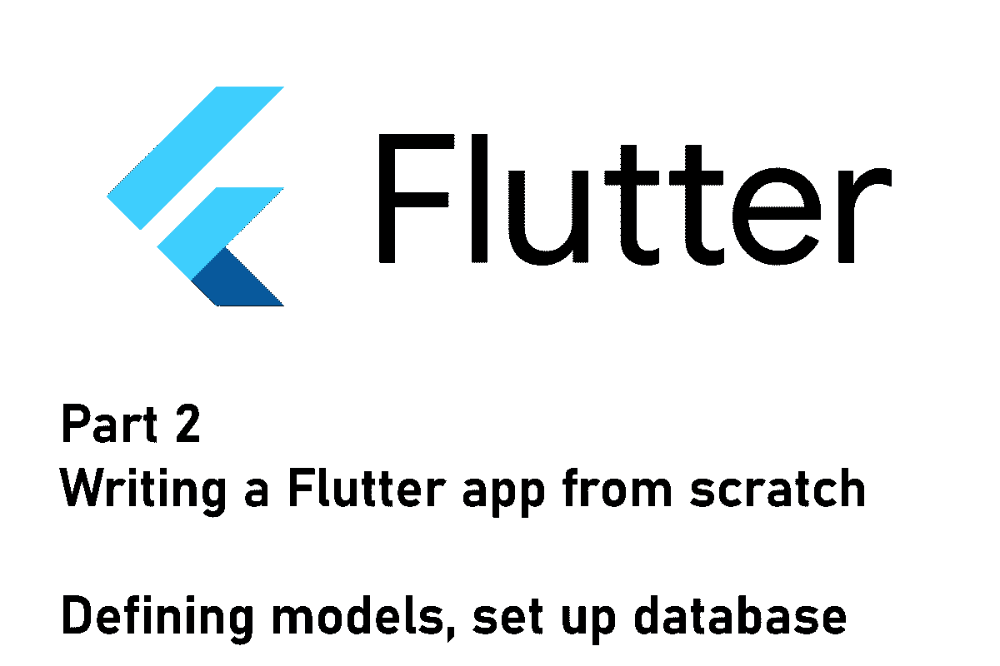
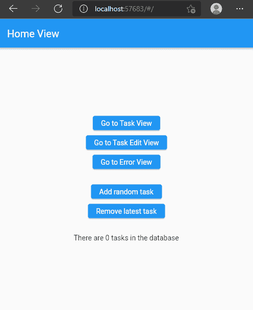

# Flutter app 从头开始第 2 部分—模型定义和数据库设置

> 原文：<https://levelup.gitconnected.com/flutter-app-from-scratch-part-2-define-models-and-set-up-database-78a67666527a>

## 一切都与数据有关

## 如何从头开始构建 Flutter 应用程序系列的第 2 部分。这篇文章是关于存储的模型定义和底层数据库。

这是记录新的 Flutter 应用程序开发过程的系列文章的第二篇。在上一期中，我描述了计划的特性、环境设置，以及下面的开发过程。本文还实现了第一个应用程序框架。
在本文中，我们将重点定义满足应用需求的模型。对于存储，我们将建立一个数据库，并为我们的应用程序添加读/写功能。

> 💡你更喜欢电子书而不是多媒体文章吗？现在就从我的 [Gumroad 商店](https://xeladu.gumroad.com/)免费获取[电子书](https://xeladu.gumroad.com/l/scratch)！

## 本文中使用的包

配置单元数据库

## 模型类

我通过将所有需要的信息放入一个 JSON 文件来创建模型类。它应该允许实现我们在本系列第 1 部分中讨论的每一个应用程序特性。以下是带有示例值的 JSON 类:

为了从 JSON 文件创建 dart 类文件，我们可以使用在线工具 [quicktype](https://app.quicktype.io/) 。它帮助我们将 JSON 输入转换成几种语言的代码文件。dart 转换器有点过时，所以需要一些手工操作。对于数据类，使用[等价的](https://pub.dev/packages/equatable)包也是有意义的。它允许我们很容易地比较一个类型的两个实例是否相等。让我们快速浏览一下模型类。

`Task`类包含标题、描述、创建日期、`TaskReminderConfiguration`和一列`TaskReminder`对象的属性。每个模型类都有从`Map<String, dynamic>`对象转换到`Map<String, dynamic>`对象的方法。equatable 使用`props`属性来比较实例。

一个`TaskReminderConfiguration`包含关于一个`Task`的具体配置的信息。有一个属性`initialDate`告诉我们`Task`的第一次执行日期。`recurringInterval`(秒，86400 等于一天)控制提醒的创建，但与`SkipConfiguration`有关。要完全启用或禁用提醒，请使用`enabled`属性。

一个`SkipConfiguration`用于排除没有发送任务提醒的日子。例如，如果你不想在周末早上做 20 个俯卧撑，因为你喜欢睡长觉，那么你可以用这个类来配置。默认情况下，不会跳过任何日期。

该类表示已经收到或至少计划发送的任务的所有提醒。用户对提醒的反应由`TaskReminderActionState`枚举指示。

这些是我们将用来表示用户输入的数据的模型类。现在，是时候关注数据库设置了。

## 数据库设置

正如已经提到的，我们将使用 [hive](https://pub.dev/packages/hive) 包作为我们的数据库。为了安装这个包，我们运行命令`flutter pub add hive`和`flutter pub add hive_flutter`。如果您不熟悉安装第三方软件包，请查看我关于该主题的另一篇文章。

 [## 如何在你的 Flutter 应用中安装包

### 这篇短文展示了如何将包添加到一个 Flutter 应用程序中，这样你就可以使用现有的代码并加速…

xeladu.medium.com](https://xeladu.medium.com/how-to-install-packages-in-your-flutter-app-e7f7e62711ee) 

然后，我们转向我们的 main 方法，并修改它以在应用程序启动时初始化数据库。

这就是设置👍。

## 读取和写入数据

Hive 基本上就像一个 Dart map，持久地存储键值对。一个盒子就是一张地图，你可以创建任意多的盒子。对于这个例子，我们只需要一个存储所有`Task`对象的盒子。

接下来，我们创建一个类`DatabaseService`来包装 hive 包。这个类是唯一调用 hive 方法的地方。通过这样做，我们可以在单元测试中模拟数据库。如果你想了解更多关于嘲讽的知识，可以看看下面这篇文章。

 [## 如何在你的 Flutter 应用中模拟依赖关系进行测试

### 这里有一个关于如何用 mocksito 包创建 mock，设置它们，并在你的测试中使用它们的教程…

levelup.gitconnected.com](/how-to-mock-dependencies-in-your-flutter-app-for-testing-54c49251740a) 

该类有 3 个方法来添加、删除和检索任务。首先，每个方法打开一个盒子，对数据执行操作，最后关闭盒子。为了简单起见，我们将对象存储为编码的 JSON 字符串。也有可能将我们的任务对象存储为真实对象，而不是字符串，但是我们将跳过这一增强，直到以后。

如果你想了解更多关于 Hive 的知识，可以查看下面的 Youtube 教程。

## 测试更改

我在`HomeView`页面中添加了新的按钮来添加和删除任务。数据库中当前的任务量也会显示出来。您可以启动应用程序并添加一些任务。当您在关闭应用程序后重新打开它(或在 web 上重新加载页面)时，任务仍将可用。

在 Flutter web 应用程序中测试 hive 数据库

## 结论

在本文中，我们设置了数据库，为我们的应用程序添加了读写功能，并定义了一个模型类作为我们的主要数据结构。
下一步，我们将增强 UI 以及 UI 背后的逻辑，以创建、更新和删除任务。

源代码可以在 [GitHub](https://github.com/xeladu/flutter_app_example/tree/app-2) 上获得。随着项目的进展，您可能会在存储库中看到不同的代码。

你的下一站是系列的第三部分，玩得开心🎉

 [## Flutter 应用程序第 3 部分——构建用户界面和管理状态

### 如何从头开始构建 Flutter 应用程序系列的第 3 部分。本文详细介绍了如何将 UI 与…

levelup.gitconnected.com](/flutter-app-from-scratch-part-3-building-the-user-interface-and-managing-state-dd2bb7dffbec) 

如果你喜欢这篇文章，我会很高兴得到掌声👏(你知道可以拍几次吗？😎)另外，如果你还没有跟上我，我也很感激。

🌲|☕ [咖啡](https://www.buymeacoffee.com/xeladu)🎁[捐赠](https://www.paypal.com/donate/?hosted_button_id=JPWK39GGPAAFQ) |💻 [GitHub](https://github.com/xeladu) 🔔[订阅](https://xeladu.medium.com/subscribe)

顺便说一句:如果你还没有 Medium 会员，我推荐你使用[│我的推荐链接◀](https://medium.com/@xeladu/membership) ，因为它会让你访问 Medium 上的所有内容，并以一小部分费用支持我，而不会为你带来任何额外的费用。谢谢大家！✨

## 本系列的前几篇文章

 [## Flutter app 从零开始第 1 部分—规划的功能、应用设计、应用框架

### 本文涵盖了计划中的应用程序特性、环境设置以及一个新的 Flutter 应用程序的第一个应用程序框架。

levelup.gitconnected.com](/flutter-app-from-scratch-part-1-planned-features-app-design-app-skeleton-c87f2c21f47a)