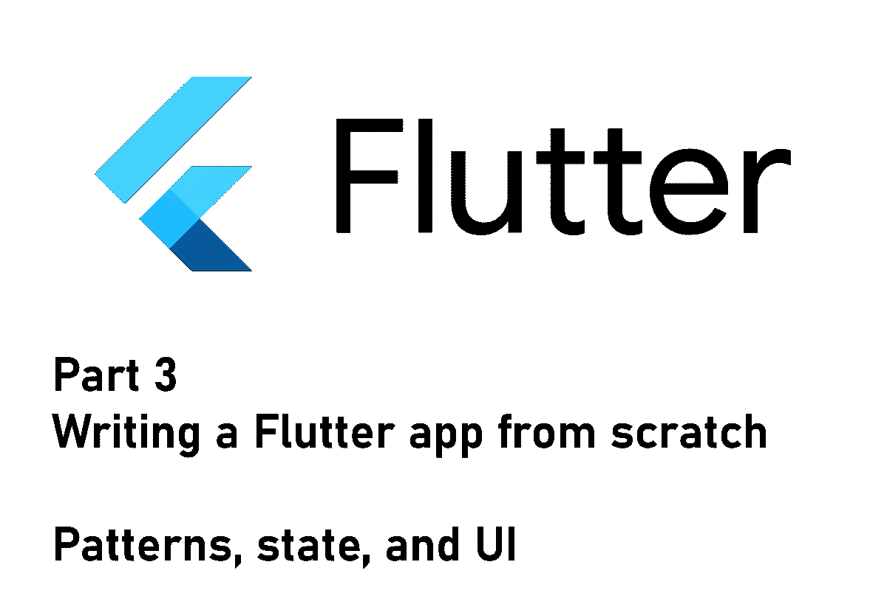
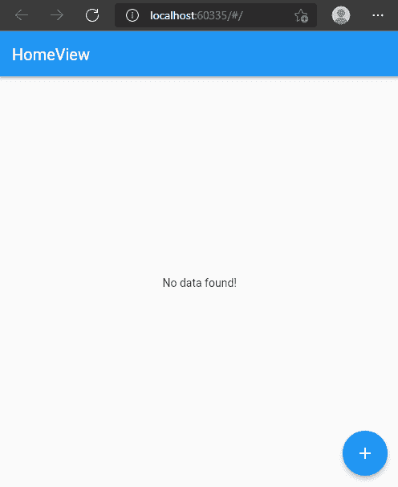

# Flutter 应用程序第 3 部分——构建用户界面和管理状态

> 原文：<https://levelup.gitconnected.com/flutter-app-from-scratch-part-3-building-the-user-interface-and-managing-state-dd2bb7dffbec>

## 我们的应用增长缓慢但稳定

## 如何从头开始构建 Flutter 应用程序系列的第 3 部分。本文涵盖了关于将 UI 与底层数据链接起来的细节。



这是记录新的 Flutter 应用程序开发过程的系列文章的第三篇。在上一集中，我们重点定义了满足应用程序需求的模型。对于存储，我们建立了一个数据库，并为我们的应用程序添加了读/写功能。在本文中，我们将把简单的后端与用户界面联系起来。我们还将改进应用程序，以便用户可以在应用程序中执行这些操作。

> 💡你更喜欢电子书而不是多媒体文章吗？现在就从我的 [Gumroad 商店](https://xeladu.gumroad.com/)免费获取[电子书](https://xeladu.gumroad.com/l/scratch)！

> **免责声明**
> 本文描述了实现目标的多种方法之一。当然，还有很多其他可能更适合、更容易或不那么令人困惑的方法。我认为保持开放的心态和尝试新事物是很重要的。只有这样，一个人才会知道什么对他或她最有效。👍

## 本文中使用的包

[Riverpod](https://pub.dev/packages/flutter_riverpod) 状态管理
[获取](https://pub.dev/packages/get)依赖注入

## 依赖注入

第一个增强是依赖注入。有几种方法可以实现这一点，有些方法比其他方法更适合(这主要取决于你问谁)。由于这个应用程序将相当简单，我们的主要重点是使应用程序可测试。因此，我们必须提供一种模拟依赖关系的方法，这样我们就不需要执行整个应用程序来验证一小部分代码。

[](/how-to-mock-dependencies-in-your-flutter-app-for-testing-54c49251740a) [## 如何在你的 Flutter 应用中模拟依赖关系进行测试

### 这里有一个关于如何用 mocksito 包创建 mock，设置它们，并在你的测试中使用它们的教程…

levelup.gitconnected.com](/how-to-mock-dependencies-in-your-flutter-app-for-testing-54c49251740a) 

最基本的方法是从一个中心源访问所有的依赖项。包 [get](https://pub.dev/packages/get) 提供了这个功能。请参见下面的设置:

我们的 app 包含一个`NavigationService`和一个`DatabaseService`，使用频率很高。我们用`putAsync()`方法注册它们，并且可以在任何我们想要的地方用`Get.find<Type>()`访问它们。您将在接下来的章节中看到这种模式。我们尽可能早地初始化依赖关系，例如在应用程序启动之前在`main()`方法中初始化。

在单元测试中，我们会通过运行一个定制的设置方法来用模拟替换真实的类，这就是我们现在想要的。

## 没有构建上下文的导航

现在，我们有使用`Navigator`对象及其`pushNamed`方法的简单导航。问题是我们总是需要提供`BuildContext`来导航。如果我们在视野之内，那没问题。但是，如果我们想从我们无法访问`BuildContext`的代码的其他部分导航呢？
这是我们新的导航服务类别:

它与我们在`main.dart`的应用程序中注册的全球导航键配合使用。

现在，我们可以通过调用

```
Get.find<NavigationService>().navigateTo("page", arguments: "any"); 
```

## 状态管理

如果你没有听说过或尝试过，这里有链接到 [riverpod](https://riverpod.dev/docs/getting_started) 文档。我们将在这个应用程序中使用它进行状态管理。Riverpod 定义了不同种类的[提供者](https://riverpod.dev/docs/concepts/providers)，我们可以使用它们来检索和更改数据。用户界面可以监听提供者并在发生变化时重新构建。所有的提供者都是不可变的，可以全局定义，但是将它们组织到单独的文件中是很重要的，尤其是当它们的数量增加时。这是一个令人耳目一新的新方法，但一开始可能有点难以理解。

## 获取初始数据

我们从从数据库获取一切的提供者开始。

提供者使用`DatabaseService`从数据库中获取所有的`Task`对象。与用户界面的集成可能是这样的:

我们用`ConsumerWidget`或`ConsumerStatefulWidget`来代替`StatelessWidget`或`StatefulWidget`。`build`方法现在有了一个额外的参数`WidgetRef`，我们可以用它来访问我们的提供者。一个`FutureProvider`公开了处理不同状态的简便方法，允许我们为用户显示匹配的小部件。在这种情况下，首先显示一个`CircularProgressIndicator`,然后显示一个`ListView`,每个数据对象有一个`Card`小部件，或者在失败时显示一条简单的错误消息。单击项目会导航到详细信息页面。

riverpod 中所有可用提供商的概述可以在这里找到[。](https://riverpod.dev/docs/concepts/providers#different-types-of-providers)

## 获取特定对象

要编辑现有数据，我们需要获得一个单独的`Task`条目。借助 riverpod 及其提供商，我们可以做到以下几点:

这个提供者使用了`family`构造函数，在这里我们可以传递额外的参数，在这个例子中，它是一个`Task`对象的标识符。我们还可以利用我们的另一个提供者(通过`ref`参数)返回所有的`Task`对象，这样我们只需要过滤它们以得到正确的元素。让我们来看看风景:

再次，看看提供者处理不同状态的漂亮的`when()`方法。我是你的超级粉丝😊如果我们的`singleTaskProvider`只是`Provider`类的一个实例，这些方法就不可用。必须是`FutureProvider`。视图本身主要包含文本。您可以点击`FloatingActionButton`导航至编辑页面。

## 修改数据

编辑页面包含用于数据操作的基本文本字段小部件和开关。有一个按钮可以触发保存操作。看起来是这样的:

一个新的`Task`对象被创建(我们不能编辑它，它是不可变的)并存储在数据库中。方法处理现有数据的修改或新数据的创建。保存后，应用程序导航回最后一页。正如你可能在上面的片段`home_view.dart`或`task_view.dart`中看到的，有一个呼叫`ref.refresh(taskListProvider)`。这样，我们可以触发用户界面的刷新来显示新数据。这是当前状态:



在应用程序中添加和编辑数据

## 结论

在本文中，我们将简单的后端与用户界面联系起来。我们还改进了应用程序，以便用户可以在应用程序中执行这些操作。下一步，我们将实现实际提醒的逻辑，并将它们集成到我们的应用程序中。

源代码可以在 [GitHub](https://github.com/xeladu/flutter_app_example/releases/tag/app-3) 上找到。随着项目的进展，您可能会在存储库中看到不同的代码。

你的下一站是系列的第四部分，玩得开心🎉

[](/flutter-app-from-scratch-part-4-implementing-logic-and-styling-the-user-interface-c08d2304b399) [## Flutter 应用程序第 4 部分——实现逻辑和设计用户界面

### 如何从头开始构建 Flutter 应用程序系列的第 4 部分。本文涵盖了通知的实现…

levelup.gitconnected.com](/flutter-app-from-scratch-part-4-implementing-logic-and-styling-the-user-interface-c08d2304b399) 

如果你喜欢这篇文章，我会很高兴得到掌声👏(你知道可以拍几次吗？😎)另外，如果你还没有跟上我，我也很感激。

🌲|☕咖啡🎁[捐赠](https://www.paypal.com/donate/?hosted_button_id=JPWK39GGPAAFQ) |💻GitHub |🔔[订阅](https://xeladu.medium.com/subscribe)

顺便说一句:如果你还没有 Medium 会员，我推荐你使用[│我的推荐链接◀](https://medium.com/@xeladu/membership) ，因为它会让你访问 Medium 上的所有内容，并以一小部分费用支持我，而不会为你带来任何额外费用。谢谢大家！✨

## 本系列的前几篇文章

[](/flutter-app-from-scratch-part-2-define-models-and-set-up-database-78a67666527a) [## Flutter app 从头开始第 2 部分—定义模型和建立数据库

### 如何从头开始构建 Flutter 应用程序系列的第 2 部分。这篇文章是关于模型定义和…

levelup.gitconnected.com](/flutter-app-from-scratch-part-2-define-models-and-set-up-database-78a67666527a) [](/flutter-app-from-scratch-part-1-planned-features-app-design-app-skeleton-c87f2c21f47a) [## Flutter app 从零开始第 1 部分—规划的功能、应用设计、应用框架

### 本文涵盖了计划中的应用程序特性、环境设置以及一个新的 Flutter 应用程序的第一个应用程序框架。

levelup.gitconnected.com](/flutter-app-from-scratch-part-1-planned-features-app-design-app-skeleton-c87f2c21f47a)